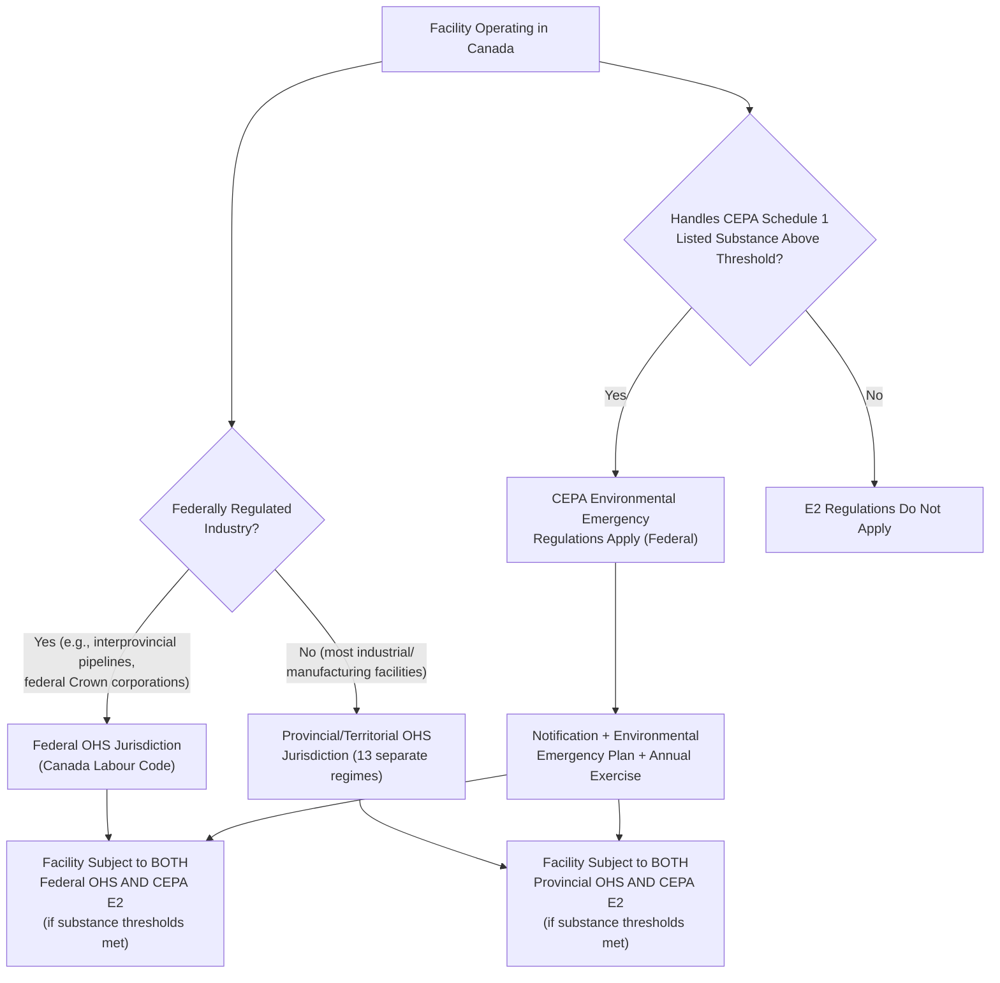

## Canadian and Provincial Process Safety Requirements

### The Absence of a Unified National Process Safety Regulation

Unlike the United States (which has EPA RMP and OSHA PSM as unified federal regulatory frameworks) or the EU (which has the harmonized Seveso III Directive), Canada does not have a single, unified national process safety management regulation directly comparable to OSHA PSM. Instead, Canadian process safety obligations arise from an overlapping combination of federal environmental legislation, federal transportation/pipeline-specific regulation, and thirteen separate provincial and territorial occupational health and safety (OHS) regimes, each with its own legislative structure.

**Key Points**

- [Inference] This fragmented structure means that a facility's actual process safety compliance obligations in Canada depend heavily on both its physical location (which province or territory) and the nature of its hazardous substances (which determines federal environmental emergency planning applicability), rather than a single national standard applying uniformly as OSHA PSM does across all US states
- Federal jurisdiction in Canada over workplace safety is constitutionally limited primarily to federally regulated industries (interprovincial transportation, banking, telecommunications, and federal Crown corporations); most industrial and manufacturing facilities, including the majority of chemical processing operations, fall under provincial OHS jurisdiction instead

### Federal Layer: The Canadian Environmental Protection Act (CEPA) and Environmental Emergency Regulations

The primary federal-level instrument most functionally comparable to EPA RMP is Canada's Environmental Emergency Regulations (informally "E2 Regulations"), made under Part 8 (sections 199-201) of the Canadian Environmental Protection Act, 1999 (CEPA 1999).

**Key Points**

- The current version of these regulations, effected under section 200(1) of CEPA and in force since August 24, 2019, replaced prior Environmental Emergency Regulations and were drafted with the stated intention of improving industry's capacity to deal with environmental emergencies
- CEPA 1999 defines an environmental emergency as an uncontrolled, unplanned, or accidental release of a substance (listed in regulations made under Part 8) into the environment, or the reasonable likelihood of such a release, that may affect the environment or human health — with an estimated 20,000 environmental emergencies occurring annually in Canada across all reporting categories
- The regulations apply to any person who owns or has charge, management, or control of a listed substance meeting or exceeding concentrations set out in Schedule 1 of the regulations, covering both pure substances and substances contained in a mixture
- Schedule 1 of the E2 Regulations includes 249 substances that pose an acute hazard to the environment or human health should an accidental release occur, spanning six hazard categories: aquatically toxic, combustible, explosion hazard, pool fire hazard, inhalation hazard, and oxidizer that may explode

**Regulatory Timeline for the 2019 E2 Regulations**

| Milestone | Requirement |
| --- | --- |
| November 22, 2019 | Submit notification of information about substances present at the facility |
| February 24, 2020 | Prepare an environmental emergency plan and submit notice of it |
| August 24, 2020 | Put the plan into effect |
| August 24, 2020 (or before) | Carry out the first yearly simulation/exercise |

**Key Points**

- Facilities that have reported substances exceeding the levels set out in section 4(1) of the regulations must prepare an emergency plan; existing emergency plans developed for other purposes can potentially be reused to satisfy the E2 Regulations' requirements if they meet the prescribed content
- Certain substances and quantities may be subject to exclusions found in paragraphs 2(2) and 3(2) of the E2 Regulations, which can partially or completely exclude a facility from regulatory requirements
- CEPA's environmental emergency framework establishes a liability regime making the person who owns or controls the substance liable for restoring damaged environment and for costs and expenses incurred in responding to an environmental emergency — a distinct legal mechanism from the US approach, which relies more heavily on separate Superfund/CERCLA liability provisions

### CEPA E2 Plan Content: Process Safety Management Alignment

Notably, Environment and Climate Change Canada's own implementation guidance for E2 plans explicitly recommends alignment with broader process safety management principles, going beyond a narrow environmental-release-only focus:

**Key Points**

- Guidance identifies preventive maintenance checks and programs, maintaining effective operating procedures and facility documentation, operator competence assurance, processes to ensure changes in design/service/staff are effectively managed, incident investigation and analysis to minimize recurrence, and assessment of compliance to standards as recommended components
- The guidance states that a complete framework of process safety management elements is recommended, even though some elements may be less applicable than others depending on the nature and degree of potential hazards involved, and that each element should be considered before assuming it is not applicable
- [Inference] This guidance language closely parallels CCPS RBPS and OSHA PSM element categories (maintenance/mechanical integrity, operating procedures, competency, management of change, incident investigation, compliance auditing) even though CEPA's E2 Regulations do not formally adopt either framework by name, suggesting Canadian federal guidance implicitly expects facilities to draw on established US/international process safety management architecture when designing their E2 plans

### Provincial Layer: Occupational Health and Safety Regimes

Because most industrial facilities fall under provincial rather than federal jurisdiction for workplace safety, each Canadian province and territory maintains its own OHS legislative structure, generally organized (using Alberta as a representative example) into three tiers:

| Tier | Alberta Example | Function |
| --- | --- | --- |
| Act | Occupational Health and Safety Act | Overarching legislative framework; defines duties of employers, workers, supervisors, contractors, owners, prime contractors |
| Regulation | Occupational Health and Safety Regulation | Intermediate-level requirements supplementing the Act |
| Code | Occupational Health and Safety Code | Detailed technical requirements for health and safety across specific hazard/industry areas (organized across 41 parts in Alberta's case) |

**Key Points**

- Alberta's OHS Act sets out responsibilities for all work site parties including employers, supervisors, workers, contractors, owners, prime contractors, suppliers, service providers, self-employed persons, and temporary staffing agencies, and sets out reporting and investigation requirements, offences, penalties, and available remedies
- Alberta's employer general duty provision requires that every employer shall ensure, as far as it is reasonably practicable, the health, safety and welfare of workers engaged in the work of that employer as well as others present at the work site, and that workers are adequately trained in matters necessary to perform their work safely — a general-duty framing structurally similar to the general duty clause found in many international OHS frameworks
- The Alberta OHS Code's hazard assessment provisions (Part 2: Hazard Assessment, Elimination and Control) require hazard assessment, worker participation, and hazard elimination and control, establishing a baseline risk-management obligation applicable across industries, though this is a general OHS requirement rather than a process-industry-specific PHA/HIRA mandate comparable to OSHA PSM's process hazard analysis element
- [Inference] Because provincial OHS codes are generally structured as broad, cross-industry safety codes rather than chemical-process-specific regulations, high-hazard chemical and petrochemical facilities operating in Canada typically supplement provincial OHS compliance with voluntary adoption of CCPS RBPS or comparable international process safety management frameworks to address process-specific hazards that general OHS codes do not explicitly cover in the same depth as OSHA PSM

### Canadian Process Safety Regulatory Architecture

### Comparative Regulatory Architecture Diagram (svg_diagram)

<svg xmlns="http://www.w3.org/2000/svg" viewBox="0 0 900 480">
<text x="450" y="30" font-size="19" font-weight="bold" text-anchor="middle" fill="#1a1a1a">Canadian Process Safety Regulatory Layers (svg_diagram)</text>
<rect x="60" y="70" width="780" height="70" rx="8" fill="#dbeafe" stroke="#1e40af" stroke-width="2" />
<text x="450" y="100" font-size="14" font-weight="bold" text-anchor="middle" fill="#1e3a8a">Federal: CEPA 1999 Part 8 — Environmental Emergency (E2) Regulations</text>
<text x="450" y="120" font-size="11" text-anchor="middle" fill="#1e3a8a">Applies nationally IF Schedule 1 substance thresholds met (substance-triggered, not industry-triggered)</text>
<rect x="60" y="170" width="780" height="70" rx="8" fill="#fef3c7" stroke="#b45309" stroke-width="2" />
<text x="450" y="200" font-size="14" font-weight="bold" text-anchor="middle" fill="#78350f">Federal: Canada Labour Code OHS Provisions</text>
<text x="450" y="220" font-size="11" text-anchor="middle" fill="#78350f">Applies ONLY to federally regulated industries (interprovincial transport, banking, telecom, Crown corps)</text>
<rect x="60" y="270" width="780" height="150" rx="8" fill="#dcfce7" stroke="#15803d" stroke-width="2" />
<text x="450" y="300" font-size="14" font-weight="bold" text-anchor="middle" fill="#14532b">Provincial/Territorial OHS Legislation (13 Separate Regimes)</text>
<text x="450" y="322" font-size="11" text-anchor="middle" fill="#14532b">Applies to most industrial/manufacturing facilities — jurisdiction determined by facility location</text>
<rect x="90" y="340" width="130" height="55" rx="4" fill="#a7f3d0" stroke="#15803d" />
<text x="155" y="362" font-size="10" text-anchor="middle" fill="#14532b">Alberta</text>
<text x="155" y="378" font-size="8.5" text-anchor="middle" fill="#14532b">Act/Reg/Code</text>
<rect x="240" y="340" width="130" height="55" rx="4" fill="#a7f3d0" stroke="#15803d" />
<text x="305" y="362" font-size="10" text-anchor="middle" fill="#14532b">Ontario</text>
<text x="305" y="378" font-size="8.5" text-anchor="middle" fill="#14532b">OHSA + Regs</text>
<rect x="390" y="340" width="130" height="55" rx="4" fill="#a7f3d0" stroke="#15803d" />
<text x="455" y="362" font-size="10" text-anchor="middle" fill="#14532b">British Columbia</text>
<text x="455" y="378" font-size="8.5" text-anchor="middle" fill="#14532b">WCA + OHSR</text>
<rect x="540" y="340" width="130" height="55" rx="4" fill="#a7f3d0" stroke="#15803d" />
<text x="605" y="362" font-size="10" text-anchor="middle" fill="#14532b">Quebec</text>
<text x="605" y="378" font-size="8.5" text-anchor="middle" fill="#14532b">LSST + Regs</text>
<rect x="690" y="340" width="130" height="55" rx="4" fill="#a7f3d0" stroke="#15803d" />
<text x="755" y="362" font-size="10" text-anchor="middle" fill="#14532b">Other Provinces</text>
<text x="755" y="378" font-size="8.5" text-anchor="middle" fill="#14532b">Own regimes</text>

<text x="450" y="450" font-size="12" text-anchor="middle" fill="`#374151`" font-style="italic">A single facility may be subject to layers 1 AND 3 (or 1 AND 2) simultaneously</text>

</svg>

### Comparative Note: Canada Versus US and EU Frameworks

| Feature | Canada | United States | European Union |
| --- | --- | --- | --- |
| National unified process safety regulation | None (fragmented federal/provincial) | EPA RMP + OSHA PSM (both federal) | Seveso III (Directive, nationally transposed) |
| Trigger mechanism | Substance-threshold (CEPA E2) + general OHS duty (provincial) | Substance-threshold (RMP) + covered process definition (PSM) | Substance-threshold with two-tier structure (Seveso III) |
| Coverage of general industrial safety vs. process-specific hazards | Provincial OHS codes are general-industry; CEPA E2 is environmental-release-specific | OSHA PSM is process-industry-specific; EPA RMP is environmental-release-specific | Seveso III combines both process safety and environmental/public safety objectives in one instrument |
| Voluntary framework adoption | CCPS RBPS commonly adopted voluntarily to fill process-specific gaps | CCPS RBPS commonly layered atop mandatory OSHA PSM/EPA RMP baseline | CCPS RBPS sometimes used to structure the SMS required within Seveso III Safety Reports |

**Key Points**

- [Inference] The absence of a Canadian federal analogue to OSHA PSM specifically (as opposed to CEPA's environmental-release focus) means that Canadian high-hazard process facilities have comparatively more discretion in how they structure process-specific hazard analysis and management-of-change programs, relative to US facilities where OSHA PSM prescribes specific mandatory elements; this makes voluntary adoption of frameworks like CCPS RBPS proportionally more significant in the Canadian context as a source of structured process safety practice
- A multinational operator with facilities in Canada, the US, and the EU is likely to find that Canadian compliance requires assembling a facility-specific patchwork (provincial OHS Act/Regulation/Code plus CEPA E2 Regulations if substance thresholds are met) rather than mapping against a single unified process safety standard, in contrast to the more centralized compliance architecture found in either the US or EU systems

### Related Topics

- CEPA Schedule 1 Substance List and Environmental Emergency Regulations Technical Guidelines
- Alberta OHS Code Part 2: Hazard Assessment, Elimination and Control Requirements
- Canada Labour Code Federal OHS Provisions for Federally Regulated Industries
- Provincial Variation in OHS Requirements: Ontario, British Columbia, and Quebec Compared
- Canadian Centre for Occupational Health and Safety (CCOHS) as a Cross-Jurisdictional Information Resource
- Voluntary CCPS RBPS Adoption as a Gap-Filling Mechanism in Canadian Process Industries
- Canadian Pipeline-Specific Federal Safety Regulation Under the Canada Energy Regulator