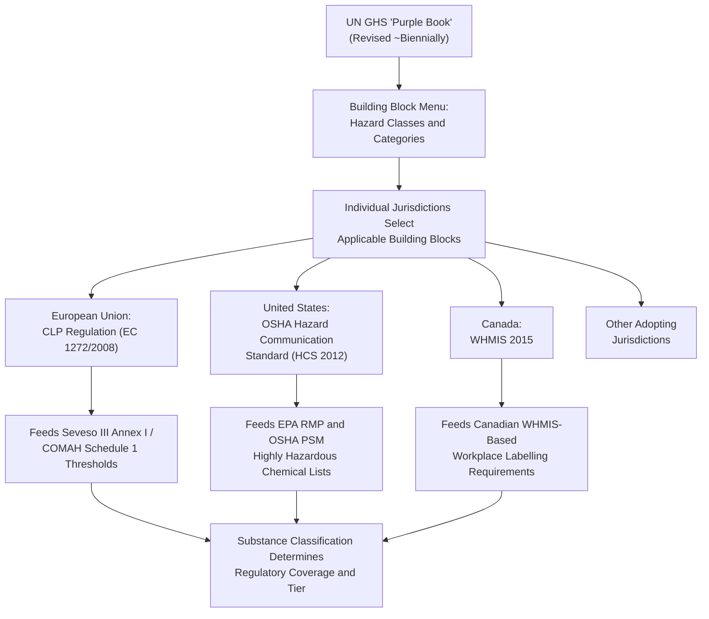

## Globally Harmonized System of Classification and Labelling


### Origin and Purpose

The Globally Harmonized System of Classification and Labelling of Chemicals (GHS) is a voluntary international framework developed under the auspices of the United Nations, first adopted in 2003, designed to standardize how chemical hazards are classified and communicated across countries. Prior to GHS, individual countries and regions had developed independent, often inconsistent classification and labelling systems, meaning the same chemical could be classified and labelled differently depending on the jurisdiction in which it was sold or transported — creating both safety risks (misunderstood hazard information) and trade friction (duplicated testing and classification work for multinational manufacturers).

**Key Points**

- GHS is formally published and maintained by the United Nations Economic Commission for Europe (UNECE) as the "Purple Book," which is periodically revised (approximately biennially) to incorporate new hazard classes, refine classification criteria, and respond to implementation experience across adopting jurisdictions
- GHS itself is not directly legally binding; it functions as a template that individual countries and regional bodies adopt and implement through their own domestic legislation, meaning the specific legal requirements a facility must follow depend on which GHS revision a given jurisdiction has adopted and how that jurisdiction has modified or supplemented the base GHS criteria
- [Inference] Because different jurisdictions adopt different GHS revisions at different times and sometimes incorporate jurisdiction-specific modifications ("building blocks" they choose not to adopt, or additional requirements layered on top), multinational chemical manufacturers and process safety professionals must track the specific GHS implementation status in each jurisdiction where their products are manufactured, used, or sold rather than assuming a single global standard applies uniformly

### The "Building Block" Approach

GHS is structured using what the UN calls a "building block" approach: it establishes a common set of hazard classes and classification criteria, but individual countries can choose which hazard classes to adopt and can select from a menu of options for classification categories within each hazard class, rather than being required to adopt the entire system uniformly.

**Key Points**

- This flexibility was a deliberate design choice intended to accommodate existing national regulatory infrastructure and facilitate broader international adoption, at the cost of introducing exactly the kind of jurisdictional variation GHS was partly intended to eliminate
- [Inference] The building-block structure means that "GHS-compliant" labelling in one jurisdiction is not automatically guaranteed to satisfy GHS-based requirements in a different jurisdiction, since the specific categories and cut-off criteria a jurisdiction has adopted from the available building blocks can differ

### Hazard Classification Structure

GHS organizes chemical hazards into three overarching hazard groups, each subdivided into specific hazard classes:

| Hazard Group | Representative Hazard Classes |
| --- | --- |
| Physical Hazards | Explosives, Flammable Gases, Flammable Aerosols, Oxidizing Gases, Gases Under Pressure, Flammable Liquids, Flammable Solids, Self-Reactive Substances, Pyrophoric Liquids/Solids, Self-Heating Substances, Substances Which Emit Flammable Gases in Contact with Water, Oxidizing Liquids/Solids, Organic Peroxides, Corrosive to Metals, Desensitized Explosives |
| Health Hazards | Acute Toxicity, Skin Corrosion/Irritation, Serious Eye Damage/Irritation, Respiratory or Skin Sensitization, Germ Cell Mutagenicity, Carcinogenicity, Reproductive Toxicity, Specific Target Organ Toxicity (Single and Repeated Exposure), Aspiration Hazard |
| Environmental Hazards | Hazardous to the Aquatic Environment (Acute and Chronic), Hazardous to the Ozone Layer |

**Key Points**

- Within most hazard classes, substances are further subdivided into numbered categories (e.g., Category 1, 2, 3) reflecting increasing or decreasing severity depending on the hazard class, with Category 1 generally representing the most severe hazard level in most classes
- These hazard class and category designations are the same classification vocabulary referenced by Seveso III's Annex I threshold tables, meaning GHS classification directly determines whether and at what tier a substance triggers Seveso III/COMAH coverage — illustrating a direct structural link between GHS and the process safety regulatory frameworks that depend on it for substance classification

### Hazard Communication Elements

GHS specifies standardized elements for communicating hazard information on labels and in Safety Data Sheets (SDS), intended to be recognizable regardless of language or literacy level where possible.

**Key Points**

- **Pictograms**: Nine standardized pictograms (red diamond-bordered symbols) representing specific hazard categories — including the exploding bomb (explosives), flame (flammables), flame over circle (oxidizers), gas cylinder (gases under pressure), corrosion (corrosive substances), skull and crossbones (acute toxicity), exclamation mark (irritant/lower-severity health hazards), health hazard (carcinogen/respiratory sensitizer/reproductive toxicant, among others), and environment (aquatic hazard)
- **Signal words**: Two standardized signal words — "Danger" for more severe hazard categories and "Warning" for less severe categories — used to indicate relative severity at a glance
- **Hazard statements**: Standardized phrases assigned to each hazard class and category (e.g., "Causes severe skin burns and eye damage," "Highly flammable liquid and vapour") describing the nature and, where relevant, degree of the hazard
- **Precautionary statements**: Standardized phrases describing recommended measures to minimize or prevent adverse effects from exposure, or from improper storage or handling
- **Safety Data Sheet (SDS)**: A standardized 16-section document providing detailed information on a substance or mixture's properties, hazards, handling, storage, and emergency response measures, intended for use by employers, workers, and emergency responders rather than for point-of-use label communication alone

### GHS Label Elements Diagram (svg_diagram)

<svg xmlns="http://www.w3.org/2000/svg" viewBox="0 0 850 480">
<text x="425" y="30" font-size="19" font-weight="bold" text-anchor="middle" fill="#1a1a1a">GHS Label Required Elements (svg_diagram)</text>
<rect x="150" y="60" width="550" height="380" rx="10" fill="#ffffff" stroke="#374151" stroke-width="2.5" />

<text x="425" y="95" font-size="15" font-weight="bold" text-anchor="middle" fill="`#1a1a1a`">Product Identifier: [Chemical Name]</text>

<g>
<polygon points="220,140 250,110 280,140 250,170" fill="#ffffff" stroke="#b91c1c" stroke-width="3" />
<text x="250" y="145" font-size="20" text-anchor="middle">🔥</text>



```
<polygon points="330,140 360,110 390,140 360,170" fill="#ffffff" stroke="#b91c1c" stroke-width="3" />
<text x="360" y="145" font-size="20" text-anchor="middle">☠</text>

<polygon points="440,140 470,110 500,140 470,170" fill="#ffffff" stroke="#b91c1c" stroke-width="3" />
<text x="470" y="145" font-size="18" text-anchor="middle">⚠</text>

<polygon points="550,140 580,110 610,140 580,170" fill="#ffffff" stroke="#b91c1c" stroke-width="3" />
<text x="580" y="145" font-size="16" text-anchor="middle">🧪</text>
```

</g>
<text x="425" y="195" font-size="10" text-anchor="middle" fill="#6b7280" font-style="italic">(Pictograms: red diamond border, illustrative)</text>
<rect x="200" y="215" width="450" height="35" rx="4" fill="#fef2f2" stroke="#b91c1c" stroke-width="2" />
<text x="425" y="238" font-size="16" font-weight="bold" text-anchor="middle" fill="#7f1d1d">SIGNAL WORD: DANGER</text>
<rect x="200" y="260" width="450" height="55" rx="4" fill="#f9fafb" stroke="#6b7280" />
<text x="425" y="280" font-size="11" text-anchor="middle" fill="#374151" font-weight="bold">Hazard Statement:</text>
<text x="425" y="298" font-size="10.5" text-anchor="middle" fill="#374151">"Highly flammable liquid and vapour. Causes serious eye irritation."</text>
<rect x="200" y="325" width="450" height="70" rx="4" fill="#f9fafb" stroke="#6b7280" />
<text x="425" y="345" font-size="11" text-anchor="middle" fill="#374151" font-weight="bold">Precautionary Statements:</text>
<text x="425" y="363" font-size="10" text-anchor="middle" fill="#374151">"Keep away from heat, sparks, open flames.</text>
<text x="425" y="378" font-size="10" text-anchor="middle" fill="#374151">Wear protective gloves/eye protection."</text>

<text x="425" y="420" font-size="11" text-anchor="middle" fill="`#374151`">Supplier Identification: [Name, Address, Telephone]</text>

</svg>

### GHS Adoption Flow Into National Regulation



### Comparative Adoption by Major Jurisdiction

| Jurisdiction | Implementing Instrument | Notes |
| --- | --- | --- |
| European Union | CLP Regulation (EC No. 1272/2008) | Directly applicable EU Regulation (not a Directive); feeds Seveso III/COMAH substance classification |
| United States | OSHA Hazard Communication Standard (HCS), aligned to GHS in the 2012 update | Governs workplace labelling and SDS requirements; distinct from, but informationally related to, EPA RMP/OSHA PSM substance-specific threshold lists |
| Canada | Workplace Hazardous Materials Information System (WHMIS 2015) | Canada's GHS-aligned implementation, replacing the prior WHMIS 1988 system |
| United Kingdom | CLP Regulation (retained in UK law post-Brexit, "UK CLP") | Substantively mirrors EU CLP following UK domestication of the regulation |

**Key Points**

- [Inference] Because the US OSHA HCS, EU CLP, and Canadian WHMIS are all independently-maintained national/regional implementations of the same underlying UN GHS framework, subtle divergences in which GHS revision each has adopted, and which building blocks each has selected, mean that a single global SDS or label cannot always be assumed valid across all three jurisdictions without jurisdiction-specific verification
- The relationship between GHS-based classification and process safety regulatory thresholds (Seveso III/COMAH, and indirectly the substance lists underlying EPA RMP/OSHA PSM) means that any revision to GHS classification criteria — or a jurisdiction's adoption of a newer GHS revision — can propagate into changes in which facilities are covered by major-accident-hazard regulation, independent of any actual change in a facility's physical operations, mirroring the substance-reclassification effect described earlier in the transition from COMAH99 to COMAH15

### Example: Cross-Jurisdictional Classification Consequence

**Example**

A chemical manufacturer produces a solvent classified under GHS as "Flammable Liquid, Category 2" in the EU under CLP. If the same chemical, evaluated under the US OSHA HCS's specific adopted GHS building blocks, receives a different category placement due to differing cut-off criteria the US has adopted for that hazard class, the manufacturer must produce jurisdiction-specific SDS and label variants for EU versus US markets, despite both being GHS-based systems in principle. This divergence can also mean the substance triggers Seveso III/COMAH coverage in the EU at a different threshold than any analogous US regulatory list would apply, illustrating why GHS harmonization is best understood as harmonization of classification *methodology and communication format*, not a guarantee of identical classification *outcomes* across all adopting jurisdictions.

### Related Topics

- UN GHS "Purple Book" Revision History and Biennial Update Cycle
- EU CLP Regulation (EC 1272/2008) Detailed Hazard Category Cut-Off Criteria
- OSHA Hazard Communication Standard (HCS 2012) and GHS Alignment
- Canadian WHMIS 2015 Implementation and Divergence from WHMIS 1988
- Safety Data Sheet (SDS) 16-Section Structure and Content Requirements
- Seveso III Annex I and COMAH Schedule 1 Threshold Dependency on GHS Classification
- Pictogram Recognition and Multilingual Hazard Communication Design