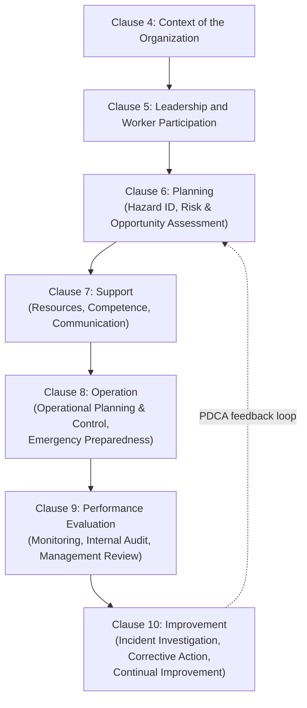
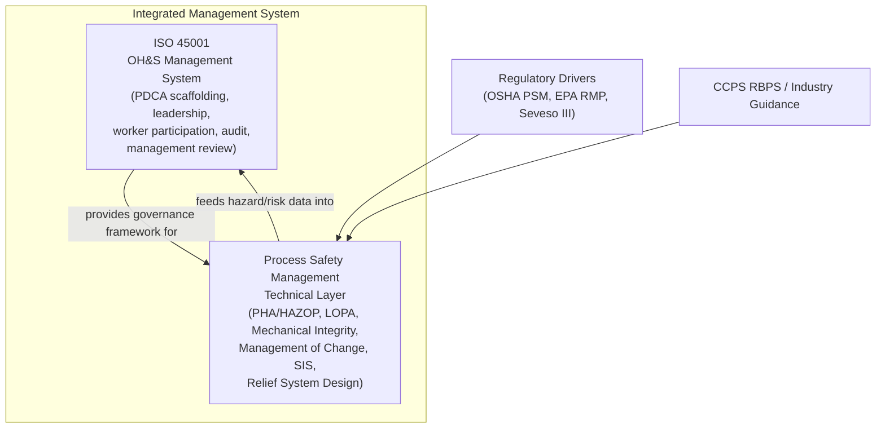

## ISO 45001 and Its Relationship to Process Safety Management

### Overview of ISO 45001

ISO 45001:2018, *Occupational health and safety management systems — Requirements with guidance for use*, is the international standard for occupational health and safety (OH&S) management systems, published by the International Organization for Standardization (ISO) in March 2018. It replaced OHSAS 18001, with a formal migration period ending March 2021, after which OHSAS 18001 certifications ceased to be valid.

ISO 45001 follows the **Annex SL high-level structure (HLS)** common to modern ISO management system standards (shared with ISO 9001 for quality and ISO 14001 for environmental management), which enables integration into a single, unified management system.

**Key characteristics:**

- Applies the **Plan-Do-Check-Act (PDCA)** cycle.
- Uses risk-based thinking applied to OH&S, requiring organizations to identify hazards, assess OH&S risks and opportunities, and determine controls.
- Requires **worker participation and consultation** as a core requirement, not just top-down management control.
- Certifiable by accredited third-party bodies, similar to ISO 9001 and ISO 14001.

### Scope: What ISO 45001 Covers

ISO 45001 is explicitly an **occupational health and safety** management system standard. Its scope centers on:

- Prevention of work-related injury and ill health.
- Provision of safe and healthy workplaces.
- Systematic hazard identification and risk assessment for worker exposure.
- Legal and other compliance obligations related to worker health and safety.
- Management commitment, leadership, and worker participation structures.

### Key Points

- ISO 45001 is a **generic, all-industry occupational health and safety management system standard** — it is not sector-specific and does not contain prescriptive technical requirements for major-accident hazard control (e.g., no specific requirements for relief system design, process hazard analysis methodology, or safety instrumented systems).
- Process Safety Management (PSM), by contrast — whether under OSHA 29 CFR 1910.119, EPA RMP, Seveso III, or CCPS Risk-Based Process Safety — is a **hazardous-process-specific discipline** addressing the prevention of major accidents from loss of containment of hazardous chemicals and energy.
- ISO 45001 provides the **management system scaffolding** (PDCA, leadership commitment, risk assessment methodology, document control, audit, management review, continual improvement) into which process safety program elements can be integrated, but it does not itself specify the technical content of a PSM program.
- Organizations operating major-hazard facilities typically use ISO 45001 to manage overall OH&S governance while layering PSM-specific frameworks (e.g., CCPS RBPS, OSHA PSM's 14 elements, or Seveso III safety management system requirements) on top of or alongside it.

### Structural Comparison

| Aspect | ISO 45001 | Process Safety Management (e.g., OSHA PSM / CCPS RBPS) |
| --- | --- | --- |
| Primary hazard focus | Worker injury and ill health (all causes) | Loss of containment of hazardous materials/energy |
| Applicability | Any organization, any sector | Primarily chemical, oil & gas, and other major-hazard process industries |
| Structure | Annex SL high-level structure (PDCA-based) | Element-based (14 PSM elements; 20 RBPS elements across 4 pillars) |
| Certification | Third-party certifiable (ISO accreditation bodies) | Generally not certifiable in the ISO sense; compliance verified via regulatory audit/inspection |
| Risk assessment scope | General OH&S hazard/risk identification | Process Hazard Analysis (PHA), HAZOP, LOPA, quantitative risk assessment (QRA) |
| Worker participation requirement | Explicit, mandatory clause (Clause 5.4) | Addressed variously (e.g., OSHA PSM Employee Participation element) |
| Legal status | Voluntary international standard | Often legally mandated (OSHA, EPA, Seveso) |

### ISO 45001 Clause Structure (Annex SL / HLS)

### Where ISO 45001 and PSM Intersect

**1. Clause 6.1.2 — Hazard Identification and Assessment of Risks**

ISO 45001 requires proactive and reactive hazard identification covering "how work is organized," "routine and non-routine activities," and "past relevant incidents." For a major-hazard facility, this clause can and should incorporate process hazard identification (e.g., referencing HAZOP/PHA outputs) as part of the broader hazard register, even though ISO 45001 itself does not mandate a specific PHA methodology.

**2. Clause 8.2 — Emergency Preparedness and Response**

This clause requires organizations to establish, implement, and maintain processes for emergency situations, including testing planned response capability periodically. This directly overlaps with PSM's emergency planning and response element and RMP's emergency response program requirements.

**3. Clause 5.4 — Consultation and Participation of Workers**

Worker participation in hazard identification and incident investigation under ISO 45001 aligns with (but does not replace) the PSM Employee Participation element (1910.119(c)), which specifically requires employee involvement in PHAs and PSM development.

**4. Clause 10.2 — Incident, Nonconformity, and Corrective Action**

ISO 45001's incident investigation requirements are generic to all OH&S incidents. PSM-specific incident investigation (1910.119(m)) requires investigation of incidents that resulted in, or could reasonably have resulted in, a catastrophic release — a materially different trigger threshold and root-cause methodology (e.g., requiring techniques capable of identifying underlying management system failures, not just immediate causes).

### Integration Model

### Practical Example

**Scenario:** A specialty chemical manufacturer is ISO 45001-certified across its global operations and also operates a facility subject to OSHA PSM (29 CFR 1910.119) due to on-site ammonia refrigeration above the threshold quantity.

- Under **ISO 45001 Clause 6.1.2**, the facility maintains a general hazard register covering slips/falls, forklift traffic, confined space entry, and other conventional OH&S hazards, reviewed per the PDCA cycle.
- Under **OSHA PSM**, the same facility separately maintains a **Process Hazard Analysis (PHA)** specifically for the ammonia refrigeration system, revalidated at least every 5 years per 1910.119(e), addressing scenarios such as ammonia release from a failed compressor seal.
- The facility's **integrated management system** cross-references the PHA findings into the ISO 45001 hazard register (satisfying Clause 6.1.2's requirement to consider "how work is organized" and past incidents), while the technical rigor, methodology, and regulatory compliance obligations of the PHA itself remain governed by the PSM standard, not by ISO 45001.
- Emergency response drills required under **ISO 45001 Clause 8.2** are scheduled to include ammonia release scenarios identified by the PHA, satisfying both the ISO requirement for periodic testing and the PSM/RMP emergency response program expectations.

This illustrates the general pattern: **ISO 45001 supplies the management system architecture; PSM supplies the domain-specific technical hazard analysis and control requirements for major-accident hazards.**

### Limitations of Relying on ISO 45001 Alone for Process Safety

- ISO 45001 does not require **quantitative risk assessment (QRA)** or **Layers of Protection Analysis (LOPA)** for major-accident scenarios.
- ISO 45001 does not mandate **Safety Instrumented Systems (SIS)** design or **Safety Integrity Level (SIL)** verification per IEC 61511.
- ISO 45001 does not specify **Mechanical Integrity** inspection intervals or methodologies for pressure vessels, piping, or relief devices.
- ISO 45001 does not include a **Management of Change (MOC)** requirement with the technical specificity PSM requires (e.g., reviewing the impact of a process modification on relief system sizing).
- Certification to ISO 45001 does **not** constitute compliance with OSHA PSM, EPA RMP, or Seveso III; these remain separate legal and regulatory obligations. [Inference: this follows directly from the differing legal bases and scope of each framework, though organizations should confirm specific regulatory equivalency claims with their jurisdiction's regulator.]

### Relationship to Other Standards in an Integrated Framework

| Standard/Framework | Role |
| --- | --- |
| ISO 45001 | OH&S management system scaffolding (PDCA, leadership, worker participation) |
| ISO 14001 | Environmental management system (can integrate with ISO 45001 via shared HLS) |
| OSHA PSM (1910.119) | U.S. regulatory requirement for 14 specific process safety elements at covered facilities |
| EPA RMP (40 CFR 68) | U.S. regulatory requirement focused on offsite consequence analysis and emergency response for covered processes |
| CCPS RBPS | Industry consensus framework of 20 elements across 4 pillars (Commit to Process Safety, Understand Hazards & Risk, Manage Risk, Learn from Experience) |
| Seveso III Directive | EU regulatory framework requiring a Safety Management System (SMS) for major-hazard establishments |
| IEC 61511 | Functional safety standard for Safety Instrumented Systems in the process industry sector |

### Common Misconceptions

- **"We're ISO 45001 certified, so we're compliant with process safety regulations."** ISO 45001 certification addresses general OH&S management system maturity; it does not satisfy PSM/RMP/Seveso regulatory requirements, which have distinct legal triggers (e.g., threshold quantities of specific chemicals) and technical content.
- **"ISO 45001 and PSM are competing frameworks."** They are complementary and operate at different levels: ISO 45001 at the management system governance level, PSM at the technical/process hazard level.
- **"ISO 45001 replaced OHSAS 18001, so it now covers major-accident hazards."** The transition from OHSAS 18001 to ISO 45001 improved management system rigor (e.g., stronger leadership and context-of-organization requirements) but did not expand the standard's scope into major-accident/process safety technical territory.

### Next Steps

- CCPS Risk-Based Process Safety (RBPS) Framework — 20 Elements
- Seveso III Directive and EU Major Accident Hazard Regulation
- IEC 61511 and Safety Instrumented Systems (SIS) / SIL Verification
- Integrating Management Systems: ISO 45001, ISO 14001, and ISO 9001 (Annex SL)
- OSHA PSM's 14 Elements — Detailed Breakdown
- EPA Risk Management Program (RMP) Requirements
- Process Hazard Analysis (PHA) Methodologies (HAZOP, What-If, FMEA, LOPA)
- Management of Change (MOC) in Process Safety
- Worker Participation Requirements Across OH&S and PSM Frameworks