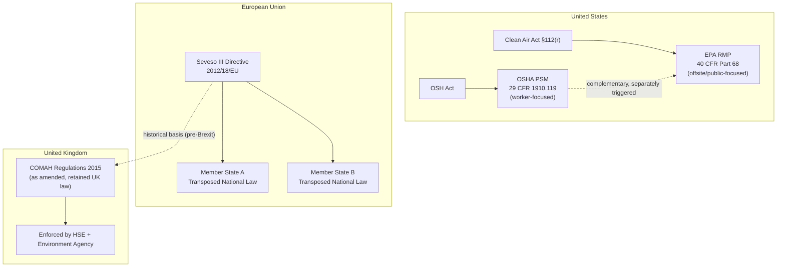
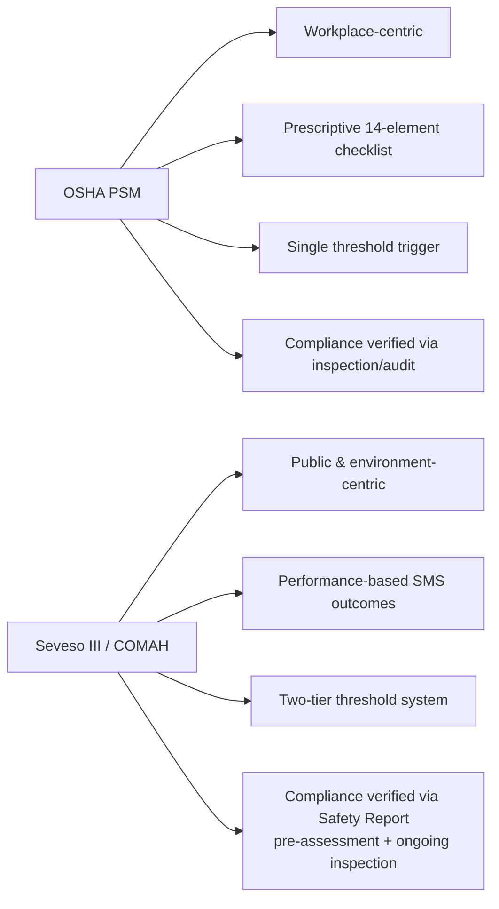

## Comparing OSHA, Seveso III, and COMAH Approaches

### Overview

Three major regulatory frameworks govern process safety for hazardous facilities in different jurisdictions: **OSHA's Process Safety Management (PSM) standard** (United States, 29 CFR 1910.119), the **Seveso III Directive** (European Union, 2012/18/EU), and the **Control of Major Accident Hazards (COMAH) Regulations** (United Kingdom, currently the COMAH Regulations 2015, as amended post-Brexit). COMAH is, in fact, the UK's domestic implementing legislation for the Seveso Directive framework, retained and adapted after the UK's departure from the EU — so COMAH and Seveso III share a common regulatory lineage while OSHA PSM developed independently along a different legal and philosophical track.

### Key Points

- **OSHA PSM** is a **workplace safety standard** rooted in U.S. occupational safety law (the OSH Act), enforced by the Occupational Safety and Health Administration, and its primary protected population is **employees**.
- **Seveso III** and **COMAH** are **major-hazard/land-use and public-safety frameworks**, concerned primarily with preventing and mitigating harm to the **public, environment, and property** in addition to workers, and are tied to broader civil protection and land-use planning regimes.
- OSHA PSM applies a **fixed threshold-quantity list** of specific chemicals (Appendix A) plus flammable liquids/gases above 10,000 lbs, triggering a **uniform set of 14 program elements** regardless of the magnitude of risk beyond the threshold.
- Seveso III and COMAH apply a **two-tier system** (lower-tier and upper-tier establishments) based on quantities of dangerous substances, with **proportionally more stringent requirements** at the upper tier, including mandatory off-site emergency plans and public information obligations.
- Seveso III/COMAH require a formal, documented **Major Accident Prevention Policy (MAPP)** and, for upper-tier sites, a **Safety Report** demonstrating adequate hazard control — a more explicitly risk-assessment-driven, documented submission to the regulator than OSHA PSM requires.

### Comparative Table

| Dimension | OSHA PSM (29 CFR 1910.119) | Seveso III Directive (2012/18/EU) | COMAH Regulations 2015 (UK) |
| --- | --- | --- | --- |
| Jurisdiction | United States (federal) | European Union member states | United Kingdom |
| Legal basis | Occupational Safety and Health Act | EU Directive (transposed into national law by each member state) | UK statutory instrument (originally transposing Seveso, retained post-Brexit) |
| Primary protected interest | Employees at the facility | Public, environment, and workers | Public, environment, and workers |
| Triggering mechanism | Threshold quantities of listed highly hazardous chemicals (Appendix A) or 10,000 lbs of flammable liquids/gases | Threshold quantities of dangerous substances (Annex I), two-tier (lower/upper) | Threshold quantities of dangerous substances (Schedule 1), two-tier (lower/upper) |
| Tiering | Single tier — PSM applies fully once threshold is met | Two-tier: lower-tier and upper-tier obligations | Two-tier: lower-tier and upper-tier obligations |
| Core hazard analysis requirement | Process Hazard Analysis (PHA), revalidated every 5 years | Major Accident Prevention Policy (MAPP); Safety Report (upper-tier) | Major Accident Prevention Policy (MAPP); Safety Report (upper-tier) |
| Enforcing authority | Occupational Safety and Health Administration (OSHA) | National competent authorities designated by each member state | Health and Safety Executive (HSE) and Environment Agency (jointly, as "Competent Authority") |
| Off-site emergency planning | Not directly mandated by PSM itself (addressed separately under EPA RMP and local emergency planning) | Mandatory external emergency plan (upper-tier), involving local authorities | Mandatory external emergency plan (upper-tier), prepared by local authority in coordination with operator |
| Public information/consultation | Not a core PSM requirement | Mandatory public information provisions (Article 14) for upper-tier sites | Mandatory public information duties; public register of sites |
| Land-use planning integration | Not integrated into PSM | Explicit land-use planning requirements (Article 13) — appropriate distances between hazardous sites and residential/public areas | Explicit land-use planning controls via HSE consultation zones around COMAH sites |
| Domino effect consideration | Not explicitly required | Explicitly required (Article 9) — identification of establishments where domino effects could increase major accident risk | Explicitly required — domino effect identification and information sharing between neighboring sites |
| Number of program elements | 14 explicit elements | Not element-based; performance/risk-based Safety Management System (SMS) requirements | Not element-based; performance/risk-based SMS requirements, closely mirroring Seveso III |

### Regulatory Architecture Comparison

### The 14 OSHA PSM Elements (Reference)

For comparison context, OSHA PSM's structure is defined by 14 explicit elements:

1. Employee Participation
2. Process Safety Information
3. Process Hazard Analysis
4. Operating Procedures
5. Training
6. Contractors
7. Pre-Startup Safety Review
8. Mechanical Integrity
9. Hot Work Permit
10. Management of Change
11. Incident Investigation
12. Emergency Planning and Response
13. Compliance Audits
14. Trade Secrets

Seveso III and COMAH do not use this element-based structure; instead, they require a **Safety Management System (SMS)** addressing broadly equivalent content (organization/personnel, identification and evaluation of major hazards, operational control, management of change, emergency planning, monitoring performance, audit and review) but framed as **performance-based outcomes** the operator must demonstrate, typically documented in the **Safety Report**.

### Safety Report vs. Process Hazard Analysis: A Key Structural Difference

**OSHA PSM's PHA** is an internal technical study (using HAZOP, What-If, Checklist, FMEA, or Fault Tree methodologies) that must be documented and available for OSHA inspection, but it is not routinely submitted to the regulator as a pre-approval condition for operating.

**Seveso III/COMAH's Safety Report** (required for upper-tier establishments) is a comprehensive document **submitted to and assessed by the competent authority** before or shortly after the site begins operating at upper-tier status. It must demonstrate:

- A Major Accident Prevention Policy (MAPP) and Safety Management System.
- Identification and analysis of major accident hazards and the measures taken to prevent them.
- Adequacy of the design, construction, operation, and maintenance of installations.
- Emergency response arrangements.
- Sufficient information to enable land-use planning decisions.

This makes the European/UK approach more **prescriptively regulator-facing and pre-emptive** (the regulator actively assesses the Safety Report and can require modifications before operation continues), whereas OSHA's approach is more **compliance-audit-based** (OSHA inspects and enforces after the fact, based on maintained records, though it can issue citations and abatement orders).

### Two-Tier Thresholds: Seveso III / COMAH Example

Seveso III (and COMAH, which mirrors it with UK-specific administrative arrangements) sets substance-specific threshold quantities in two columns:

$$\text{Lower-tier threshold} < \text{Quantity present} < \text{Upper-tier threshold} \Rightarrow \text{Lower-tier obligations apply}$$

$$\text{Quantity present} \geq \text{Upper-tier threshold} \Rightarrow \text{Upper-tier obligations apply (including Safety Report)}$$

For example, under Seveso III Annex I, ammonia has a lower-tier threshold of 50 tonnes and an upper-tier threshold of 200 tonnes [Unverified: specific threshold figures should be confirmed against the current consolidated Annex I text, as thresholds are periodically reviewed and amended]. A facility storing quantities between these values must comply with lower-tier obligations (MAPP, basic SMS); a facility at or above the upper threshold must additionally produce a full Safety Report and external emergency plan.

OSHA PSM, by contrast, does not have a lower/upper tier — ammonia above 10,000 lbs (a single threshold, listed in Appendix A) triggers the full 14-element PSM program with no intermediate tier.

### Practical Example: Same Facility, Three Jurisdictions

**Scenario:** A facility stores 150 tonnes of chlorine for water treatment processing.

- **Under OSHA PSM (if in the U.S.):** Chlorine is listed in Appendix A with a threshold quantity of 1,500 lbs (~0.68 tonnes). At 150 tonnes, the facility is far above threshold and must implement the full 14-element PSM program. There is no additional "upper tier" — the obligations are the same as for a facility just barely over threshold, though EPA RMP (a related but separate regulation) would also apply and require offsite consequence analysis.
- **Under Seveso III (if in an EU member state):** Chlorine's Seveso thresholds are lower-tier 10 tonnes and upper-tier 25 tonnes [Unverified: confirm against current Annex I]. At 150 tonnes, the facility is well into upper-tier territory, requiring a full Safety Report, external emergency plan involving local authorities, public information disclosure, and land-use planning consultation zones around the site.
- **Under COMAH (if in the UK):** The same upper-tier obligations as Seveso III apply, administered by HSE and the Environment Agency jointly, with the added requirement of HSE consultation on any nearby development proposals within the site's designated consultation distance.

This example illustrates that **the same physical hazard can trigger meaningfully different regulatory obligations depending on jurisdiction**, particularly regarding public/community-facing requirements (external emergency planning, land-use planning, public disclosure), which are far more developed under Seveso III/COMAH than under OSHA PSM alone.

### Philosophical and Structural Differences Summarized

### Convergence and Common Ground

Despite structural differences, all three frameworks share core underlying principles traceable to the same historical drivers (Flixborough 1974, Seveso 1976, Bhopal 1984, Piper Alpha 1988):

- Requirement for systematic hazard identification and risk assessment.
- Requirement for documented safe operating procedures.
- Requirement for management of change control.
- Requirement for incident investigation and lessons-learned processes.
- Requirement for emergency response planning.
- Requirement for periodic review/revalidation of hazard analyses.
- Recognition that management system failures, not just equipment failures, are root causes of major accidents.

CCPS's Risk-Based Process Safety (RBPS) framework is often used by multinational operators as a **harmonizing overlay**, since its 20 elements across 4 pillars are designed to be compatible with and often exceed the baseline requirements of OSHA PSM, Seveso III, and COMAH simultaneously, simplifying global corporate process safety governance.

### Common Misconceptions

- **"COMAH is just the UK version of OSHA PSM."** COMAH is structurally and philosophically closer to Seveso III (public/environment-focused, two-tier, Safety Report-based) than to OSHA PSM (worker-focused, single-tier, checklist-based).
- **"If a company complies with OSHA PSM, it automatically satisfies Seveso III/COMAH requirements for its EU/UK operations."** These are separate legal regimes with different triggering thresholds, documentation requirements, and regulatory relationships; compliance with one does not equate to compliance with the other, though the underlying technical work (PHA, MOC, mechanical integrity) is often substantially reusable.
- **"Seveso III is only about factory safety."** A defining feature of Seveso III/COMAH is their integration with land-use planning and public emergency preparedness, extending well beyond factory-gate occupational concerns.

### Next Steps

- EPA Risk Management Program (RMP) and Its Relationship to OSHA PSM
- CCPS Risk-Based Process Safety (RBPS) as a Harmonizing Framework
- Safety Report Preparation Under Seveso III / COMAH
- Land-Use Planning and Consultation Zones Around Major Hazard Sites
- Domino Effect Analysis in Major Accident Prevention
- History and Regulatory Impact of Flixborough (1974) and Seveso (1976)
- HSE's Role as COMAH Competent Authority
- Comparing Global PSM-Equivalent Frameworks (e.g., Australia's WHS Major Hazard Facility Regulations)