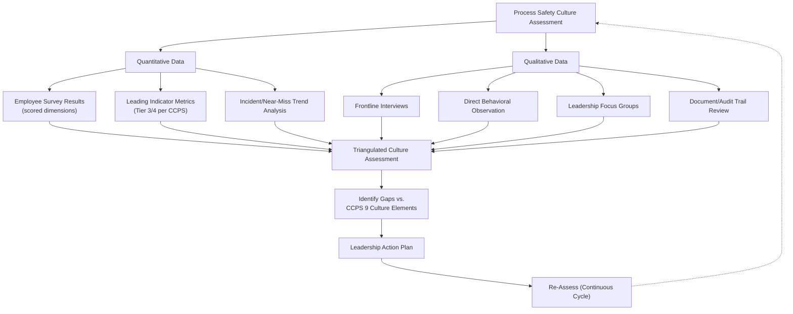
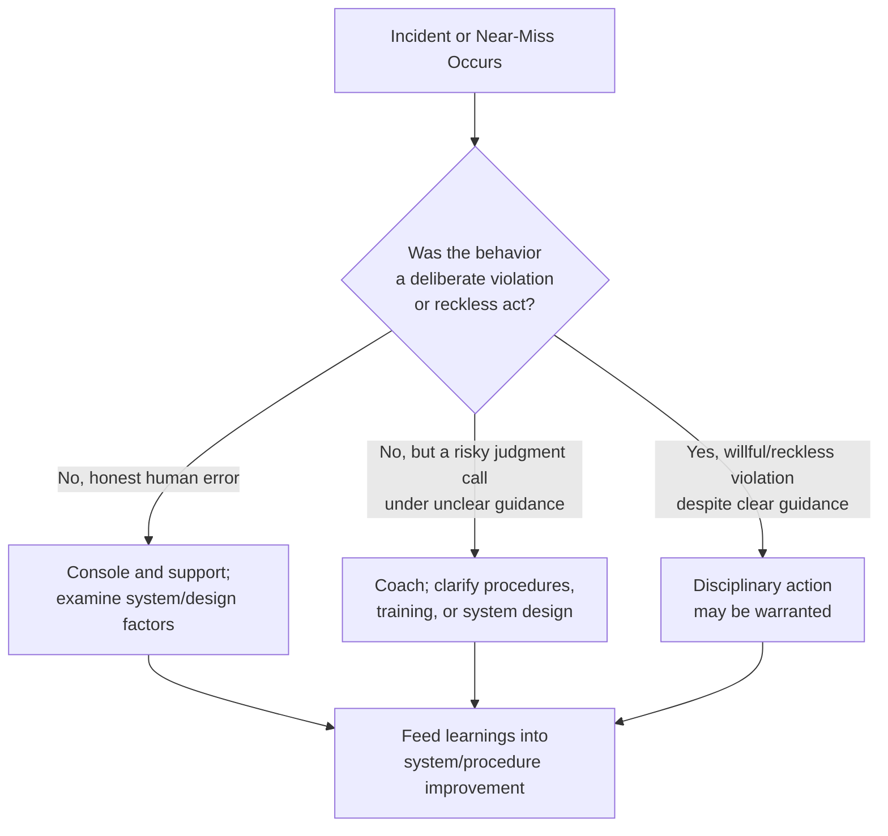

## Defining and Assessing Process Safety Culture

### Definition

**Process safety culture** is the combination of group values, attitudes, norms, beliefs, practices, policies, and behaviors within an organization that collectively determine how effectively that organization identifies, understands, and controls major hazard risks. It is distinct from a general "safety culture" in that it specifically concerns the organization's disposition toward preventing low-frequency, high-consequence loss-of-containment events, rather than day-to-day personal injury prevention.

CCPS defines process safety culture as **"the combination of group values and behaviors that determine the manner in which process safety is managed."** A widely cited operational description, drawn from the UK HSE, characterizes safety culture as **"the product of individual and group values, attitudes, perceptions, competencies, and patterns of behavior that determine the commitment to, and the style and proficiency of, an organization's health and safety management."**

### Key Points

- Culture is **inferred from behavior**, not directly observed. It manifests in what people do when no one is watching, what gets rewarded versus punished, what gets reported versus hidden, and what tradeoffs are made under production pressure.
- Culture operates at multiple levels: **individual beliefs and habits**, **group/team norms**, and **organizational systems and structures** (policies, incentive structures, resource allocation).
- Process safety culture is a **leading indicator domain** — deficiencies in culture (e.g., normalization of deviance, complacency, poor reporting) tend to precede major accidents by months or years, making culture assessment a critical proactive tool rather than a retrospective one.
- Multiple major accident investigations (Piper Alpha, Texas City, Deepwater Horizon, Bhopal) identified cultural deficiencies — not just technical or equipment failures — as root or contributing causes.
- Culture cannot be mandated by policy alone; it requires sustained, visible leadership commitment, consistent reinforcement, and alignment between stated values and actual organizational behavior (particularly under schedule and cost pressure).

### CCPS's Core Elements of Process Safety Culture

CCPS's *Guidelines for Risk Based Process Safety* identifies **process safety culture** as the first pillar of Risk-Based Process Safety (RBPS), and further breaks it down into essential features across the broader RBPS framework. Widely referenced dimensions of a strong process safety culture include:

1. **Establish process safety as a core value.**
2. **Provide strong leadership.**
3. **Establish a "Just Culture."**
4. **Maintain a sense of vulnerability** (avoiding complacency, believing "it can happen here").
5. **Empower individuals to successfully fulfill their process safety responsibilities.**
6. **Defer to expertise** (technical authority overrides hierarchical authority on safety-critical decisions).
7. **Ensure open and effective communication.**
8. **Establish and enforce high standards of performance.**
9. **Provide continuous monitoring and learning (organizational learning).**

### The Concept of "Chronic Unease" / Sense of Vulnerability

A recurring theme across process safety culture literature is **chronic unease** (sometimes called "constructive paranoia" or maintaining a "sense of vulnerability") — the deliberate organizational habit of assuming that a major accident could happen at this facility, today, rather than believing past success guarantees future safety. This concept is closely related to High Reliability Organization (HRO) theory, which studies organizations (nuclear plants, aircraft carriers, air traffic control) that operate high-hazard technology with a remarkably low accident rate through:

- **Preoccupation with failure** — treating near misses and small anomalies as evidence of systemic weakness rather than isolated events.
- **Reluctance to simplify interpretations** — resisting the urge to explain away anomalies with convenient, oversimplified explanations.
- **Sensitivity to operations** — maintaining situational awareness of the real-time state of operations, especially at the frontline.
- **Commitment to resilience** — building capacity to detect, contain, and recover from errors before they escalate.
- **Deference to expertise** — decision-making authority migrates to the person with the most relevant expertise during a developing situation, regardless of rank.

### Normalization of Deviance

A critical cultural failure pattern, first articulated by sociologist Diane Vaughan in her analysis of the Space Shuttle Challenger disaster, is **normalization of deviance**: the gradual process by which an organization repeatedly accepts a lower standard of performance or a known deviation from a safe operating envelope because "nothing bad happened last time," until the deviation becomes an unquestioned norm. This is a well-documented contributing factor in numerous process safety incidents where a bypassed safeguard, an overridden alarm, or a skipped procedural step becomes routine practice over time.

$$P(\text{incident} \mid \text{deviation tolerated}) > 0 \text{, even when repeated exposure has not yet produced harm}$$

The absence of a negative outcome after tolerating a deviation is not evidence of safety — it is often evidence of a probabilistic near-miss that has not yet manifested.

### Diagram: Culture as the Foundation of Process Safety Performance

<svg xmlns="http://www.w3.org/2000/svg" viewBox="0 0 700 420" font-family="Arial, sans-serif">
<title>Process Safety Culture as Foundational Layer (svg_diagram)</title>
<rect x="0" y="0" width="700" height="420" fill="#fbfbfb" />

<polygon points="60,380 640,380 560,300 140,300" fill="#0b3d63" />
<text x="350" y="345" text-anchor="middle" fill="white" font-size="15" font-weight="bold">Process Safety Culture (svg_diagram)</text>
<text x="350" y="365" text-anchor="middle" fill="white" font-size="11">Values, norms, chronic unease, just culture</text>
<polygon points="140,300 560,300 480,220 220,220" fill="#1c5d8c" />
<text x="350" y="255" text-anchor="middle" fill="white" font-size="14" font-weight="bold">Management Systems</text>
<text x="350" y="272" text-anchor="middle" fill="white" font-size="11">PHA, MOC, Mechanical Integrity, Training</text>
<polygon points="220,220 480,220 400,140 300,140" fill="#3a86c8" />
<text x="350" y="175" text-anchor="middle" fill="white" font-size="13" font-weight="bold">Engineering Controls</text>
<text x="350" y="192" text-anchor="middle" fill="white" font-size="10">Relief systems, SIS, containment</text>
<polygon points="300,140 400,140 370,70 330,70" fill="#7ec1f0" />
<text x="350" y="105" text-anchor="middle" fill="#0b3d63" font-size="12" font-weight="bold">Incident-Free Ops</text>

<text x="350" y="40" text-anchor="middle" font-size="13" fill="#333" font-style="italic">Weak culture undermines every layer above it</text>

</svg>

### Assessing Process Safety Culture: Methods

Because culture is intangible, assessment relies on **triangulating multiple data sources** rather than a single instrument:

**1. Surveys/Questionnaires**

Standardized or customized instruments (e.g., the CCPS Process Safety Culture Survey, or academically validated tools such as the Nuclear Safety Culture instruments adapted for process industries) that ask employees at all levels to rate statements about leadership commitment, reporting comfort, resource adequacy, and perceived priority of production versus safety.

**2. Behavioral Observation**

Direct observation of work practices — are permits-to-work followed rigorously, are safety-critical procedures followed as written, is PPE compliance consistent, do supervisors visibly reinforce safe behavior or tacitly permit shortcuts under schedule pressure?

**3. Leading Indicator Metrics (CCPS Tier 3/Tier 4)**

- Percentage of PHA action items closed on time.
- Percentage of safety-critical maintenance completed on schedule (backlog trends).
- Near-miss/hazard reporting rate and quality of follow-up.
- Percentage of employees completing required PSM training on time.
- Frequency of safety-critical alarm overrides or bypasses.
- Management of Change (MOC) completion rates and quality of technical review.

**4. Incident Investigation Trend Analysis**

Reviewing root causes across multiple incidents/near-misses for recurring management system or cultural themes (e.g., repeated findings of "production pressure overrode procedure," or "employee did not feel empowered to stop the job").

**5. Interviews and Focus Groups**

Structured conversations with frontline workers, supervisors, and leadership to surface perceptions that surveys may not capture, particularly around psychological safety (comfort raising concerns) and trust in the "Just Culture" system.

**6. Document and Record Review**

Auditing whether PHA recommendations are tracked to closure, whether MOC records show genuine technical rigor versus rubber-stamping, and whether audit findings from previous years were meaningfully addressed.

### Example Process Safety Culture Assessment Framework

### Practical Example

**Scenario:** A refinery's process safety culture assessment reveals the following combination of findings:

- Survey data shows 85% of frontline operators agree "safety is a stated priority," but only 40% agree "I would feel comfortable stopping a job for a safety concern without fear of production-related consequences."
- Near-miss reporting rate has declined 30% year-over-year, while the number of safety-critical alarm overrides logged in the control system has increased.
- Interviews reveal that supervisors are informally evaluated on unit throughput, with no comparable visible recognition for near-miss reporting or stopping work for safety concerns.
- MOC review finds that several "temporary" process modifications (originally justified for a one-week trial) have remained in place, unreviewed, for over a year.

**Interpretation:** The gap between stated values (85% agree safety is a priority) and demonstrated psychological safety (40% comfort stopping work) is a classic **culture-behavior misalignment** — indicating that despite leadership rhetoric, the incentive structure implicitly rewards production over process safety. The rising alarm override trend combined with declining near-miss reporting is consistent with early-stage **normalization of deviance**. The unreviewed "temporary" MOCs indicate a **management of change discipline gap** that is itself a cultural symptom (tolerance of informal, undocumented risk acceptance). A credible action plan would need to address the underlying incentive misalignment (e.g., explicitly recognizing and rewarding stop-work interventions and near-miss reporting), not merely reissue a safety policy memo. [Inference: this interpretation follows standard CCPS culture-assessment reasoning patterns; the specific corrective actions required would depend on further root-cause investigation at the facility.]

### Leadership's Role in Shaping Culture

Process safety culture cannot be delegated solely to a safety department — CCPS and virtually all major investigation reports (e.g., the Baker Panel report following Texas City) emphasize that **senior leadership sets the ceiling on process safety culture** through:

- Visible, consistent commitment demonstrated in resource allocation decisions (staffing, capital for mechanical integrity, training budgets).
- Personal engagement (e.g., leaders participating in PHA reviews, incident investigations, and safety walks, not just receiving summary reports).
- Consistency between what is said in policy and what is rewarded/tolerated in practice, especially during schedule or cost pressure.
- Willingness to halt or delay operations when process safety-critical issues are identified, even at significant financial cost.
- Establishing and protecting a **"Just Culture"** — a system that distinguishes between honest error/at-risk behavior (which should be addressed through coaching, system redesign, and learning) and reckless/willful violation (which may warrant disciplinary action), so that workers are not deterred from reporting mistakes or near misses out of fear of punishment.

### Just Culture Decision Framework (Simplified)

### Common Misconceptions

- **"Culture is too soft/subjective to measure."** While culture is not directly observable, it can be systematically assessed through validated survey instruments, leading indicator metrics, and structured behavioral observation — CCPS and academic research have developed mature methodologies for this purpose.
- **"A strong safety culture means zero incidents."** A strong culture significantly reduces risk but does not eliminate it; it also improves the organization's capacity to detect, report, and learn from near misses and incidents when they do occur, which is itself a marker of cultural strength (high reporting rates can indicate strong trust, not necessarily worsening performance).
- **"Culture change happens through training and posters."** Sustained culture change requires structural alignment — incentive systems, resource allocation, and leadership behavior — not just communication campaigns; training alone rarely shifts deeply embedded norms.
- **"Our occupational safety culture survey covers process safety too."** Because process safety culture concerns catastrophic, low-frequency risk rather than everyday personal injury, general OH&S culture surveys often fail to probe process-safety-specific dimensions (chronic unease, deference to technical expertise, MOC discipline) and should be supplemented with process-safety-specific instruments.

### Next Steps

- CCPS Risk-Based Process Safety (RBPS) — Full 20-Element Framework
- High Reliability Organization (HRO) Theory and Its Application to Process Industries
- Just Culture Models and Disciplinary Decision Frameworks
- Normalization of Deviance: Case Studies (Challenger, Texas City, Deepwater Horizon)
- Leading vs. Lagging Indicators in Process Safety Performance
- Leadership Behaviors That Reinforce (or Undermine) Process Safety Culture
- Designing and Administering a Process Safety Culture Survey
- Management of Change (MOC) Discipline as a Culture Indicator
- Psychological Safety and Its Role in Hazard Reporting