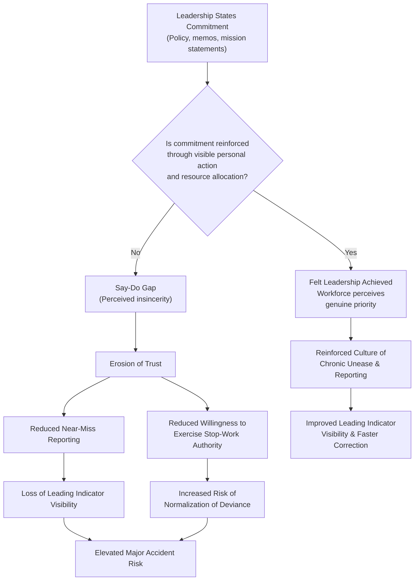
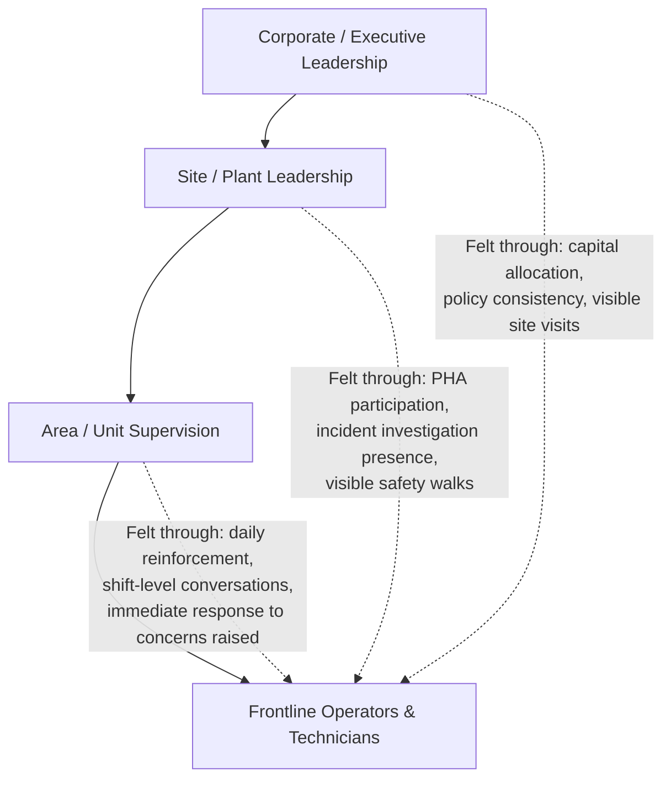

## Leadership Commitment and Felt Leadership

### Definition

**Leadership commitment** in process safety refers to the demonstrated, sustained prioritization of process safety by an organization's leaders through resource allocation, decision-making, and personal behavior. **Felt leadership** is a more specific concept describing leadership commitment that is *directly perceived and experienced* by the workforce — leadership that is visible, personal, and tangible at the frontline, rather than communicated only through policy documents, memos, or delegated safety staff.

The term "felt leadership" was popularized in the safety literature (notably by DuPont and subsequently adopted broadly across CCPS guidance) to distinguish between leadership commitment that exists *on paper* versus leadership commitment that employees actually *feel* in their day-to-day work experience. A CEO's signed process safety policy statement, however well-written, does not constitute felt leadership unless frontline workers can point to specific instances where they personally observed or interacted with that commitment.

### Key Points

- Felt leadership requires **presence, not just position** — it is generated through direct, personal engagement by leaders at all levels (not only the C-suite) with the actual work of process safety: PHA reviews, safety walks, incident investigations, and shift-level conversations.
- CCPS identifies "Provide Strong Leadership" as one of the core elements of Process Safety Culture, emphasizing that senior management must be personally and visibly engaged, not merely supportive in principle.
- Felt leadership is undermined by **incongruence** — any gap between what leaders say and what leaders reward, tolerate, or personally do, especially under schedule or cost pressure.
- Leadership commitment must be demonstrated consistently across the **entire management hierarchy**, not just at the top; a plant manager's felt leadership matters as much to frontline perception as a corporate executive's.
- The Baker Panel Report (following the 2005 BP Texas City explosion) explicitly found that corporate leadership's stated commitment to safety was not matched by resource allocation and oversight, and identified this leadership gap as a systemic root cause.

### Distinguishing "Stated" vs. "Felt" Leadership Commitment

| Dimension | Stated Commitment | Felt Leadership |
| --- | --- | --- |
| Medium | Policy documents, mission statements, annual reports | Direct interaction, personal presence, visible decisions |
| Frequency | Often static (published once, referenced occasionally) | Continuous (demonstrated repeatedly through ongoing behavior) |
| Perceived by | Rarely reaches frontline awareness in a memorable way | Directly experienced by frontline workers and supervisors |
| Verification | Difficult to verify against actual practice | Verifiable through employee interviews and behavioral observation |
| Example | "Process Safety is our #1 priority" (poster/memo) | Plant manager personally attending and asking probing questions during a PHA revalidation |
| Risk if absent | Employees perceive safety rhetoric as insincere ("say-do gap") | N/A — its presence is itself the mitigation |

### Behavioral Markers of Felt Leadership

CCPS and related industry guidance identify concrete, observable leadership behaviors associated with felt leadership:

1. **Personal participation in process hazard reviews** — leaders attending PHA/HAZOP sessions, not just receiving summary reports.
2. **Visible presence during incident investigations** — senior leaders personally engaging with investigation teams, especially following significant near misses.
3. **Asking probing process safety questions** during routine business reviews, not only safety-specific meetings (e.g., asking about mechanical integrity backlog status during a production performance review).
4. **Stopping or delaying operations** when process safety-critical issues are identified, even at production or financial cost, and publicizing that decision internally as a demonstration of priority.
5. **Allocating capital and staffing** to process safety-critical needs (mechanical integrity programs, safety-critical equipment replacement) even when competing against other capital priorities.
6. **Personally recognizing** employees who report near misses or exercise stop-work authority, reinforcing that such actions are valued rather than penalized.
7. **Consistency under pressure** — maintaining safety-related decisions and priorities during schedule crunches, cost-cutting periods, or high-production-demand periods, when the temptation to deprioritize process safety is greatest.

### Diagram: The Leadership Commitment Gap

### The "Say-Do Gap" and Its Consequences

The **say-do gap** — the discrepancy between an organization's stated safety priorities and its actual, observed practices — is one of the most consistently cited cultural failure patterns in major accident investigations. When leadership commitment is stated but not felt:

- Frontline workers develop skepticism toward safety communications, treating them as performative rather than substantive.
- Near-miss and hazard reporting rates decline, as workers perceive limited value or even risk in reporting (fear that production pressure will override any resulting corrective action, or that reporting reflects poorly on them).
- Supervisors, receiving mixed signals, tend to default to the metric that is *actually* measured and rewarded (typically production/throughput) rather than the one that is merely stated as a priority.
- Over time, this produces the conditions for **normalization of deviance**, where unaddressed known risks become accepted as routine.

$$\text{Perceived Sincerity} \propto \frac{\text{Frequency and consistency of felt leadership behaviors}}{\text{Frequency of contradictory decisions under pressure}}$$

[Inference: This relationship is presented as a conceptual illustration of the say-do gap dynamic, not a formally validated quantitative model; the underlying qualitative relationship — that consistency drives perceived sincerity — is well supported in the organizational culture and safety literature.]

### Practical Example

**Scenario A — Stated but not felt:**

A refinery's annual report states "Process safety is our highest value." During a Q3 schedule crunch to meet a customer commitment, a scheduled turnaround for mechanical integrity inspection on a critical relief system is deferred by corporate direction without documented risk assessment or MOC review, despite objections raised by the site process safety engineer. Employees observe this decision. Regardless of subsequent internal communications reaffirming the stated priority, frontline perception of leadership's actual commitment is damaged, and the deferral itself represents an undocumented risk acceptance — a technical process safety management gap compounding the cultural one.

**Scenario B — Felt leadership demonstrated:**

At a comparable facility, the plant manager personally attends the PHA revalidation session for the same relief system, asks specific questions about the basis for existing safeguards, and when a scheduling conflict arises between a customer delivery date and the mechanical integrity inspection, the plant manager elevates the conflict to corporate leadership rather than unilaterally deferring the inspection. Corporate leadership approves a short customer delivery delay, explains the rationale in a facility-wide communication citing the specific inspection finding that justified it, and the process safety engineer who raised the original concern is specifically and publicly acknowledged. Employees experience direct, tangible evidence that stated priorities translate into real decisions, even at commercial cost — this is felt leadership.

The contrast between these scenarios illustrates that the *content* of leadership commitment (valuing process safety) can be identical between two organizations while the *felt* experience of that commitment — and its resulting effect on culture — differs dramatically based on how leaders act under pressure.

### Leadership Commitment Across Organizational Levels

Felt leadership is not solely a senior-executive responsibility; it must be demonstrated at every level of the management hierarchy for its effects to reach the frontline:

A common finding in culture assessments is that felt leadership can be strong at one level of the hierarchy (e.g., visible corporate commitment) while weak at another (e.g., a first-line supervisor who tacitly discourages stop-work interventions due to production pressure) — meaning the overall employee experience of leadership commitment is often set by the *weakest link* in this chain, particularly the direct supervisor closest to daily operations.

### Assessing Felt Leadership

Because felt leadership is a perception-based construct, assessment approaches mirror broader process safety culture assessment methods (see *Defining and Assessing Process Safety Culture*), with specific focus on:

- **Employee surveys** asking directly whether workers have personally witnessed leadership prioritizing process safety over production, and whether they can cite specific examples.
- **Frequency tracking** of leadership participation in PHA reviews, incident investigations, and safety-critical decision points (a quantifiable leading indicator).
- **Interviews probing specificity** — asking employees to describe concrete instances of leadership action, rather than accepting generic agreement with survey statements, since specificity distinguishes genuine felt leadership from socially desirable survey responses.
- **Resource allocation audits** — comparing budgeted versus actual spending on process-safety-critical items (mechanical integrity, safety-critical training, staffing) as an objective proxy for whether stated priorities are backed by action.

### Common Misconceptions

- **"Leadership commitment means the CEO cares about safety."** Felt leadership requires action and presence perceptible to the workforce; sincere belief at the executive level that never translates into visible behavior does not produce felt leadership.
- **"A safety moment at the start of every meeting demonstrates felt leadership."** While useful, ritualized safety moments can become perfunctory if not accompanied by substantive engagement (asking real questions, following up on raised concerns); ritual without follow-through can itself contribute to a say-do gap if concerns raised are not visibly addressed.
- **"Felt leadership is primarily a corporate/executive responsibility."** Frontline workers' day-to-day experience of leadership commitment is often shaped most directly by immediate supervisors, making felt leadership a responsibility distributed across the entire management chain.
- **"A strong safety record proves felt leadership is working."** As with the broader distinction between process and occupational safety, a low personal injury rate does not confirm that leadership commitment to *process* safety specifically is being felt at the frontline; the two must be assessed with process-safety-specific instruments.

### Next Steps

- Defining and Assessing Process Safety Culture
- Just Culture Models and Disciplinary Decision Frameworks
- CCPS Risk-Based Process Safety (RBPS) Leadership Element
- The Baker Panel Report and Its Findings on Corporate Leadership Failures
- Stop-Work Authority: Design and Reinforcement in Practice
- Resource Allocation as a Leading Indicator of Process Safety Priority
- Building Chronic Unease Across Organizational Hierarchies
- Incident Investigation: Leadership's Role and Presence