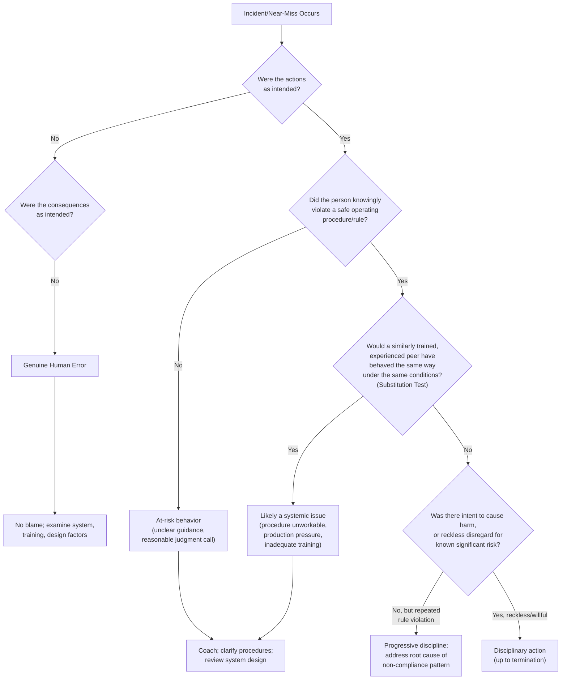
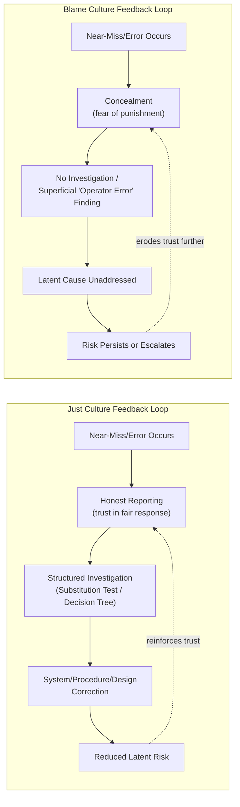

## Just Culture Versus Blame Culture

### Definitions

**Just Culture** is an organizational approach to accountability that distinguishes between honest human error, at-risk behavior, and reckless or willful violations, applying appropriately different responses to each (coaching and system redesign for the former two, disciplinary action reserved for the latter). The concept was developed extensively in high-reliability industries (aviation, healthcare, nuclear power) and has been adopted into process safety practice through CCPS guidance, which identifies "Establish a Just Culture" as one of the core elements of process safety culture.

**Blame Culture** is the contrasting organizational pattern in which individuals who are involved in, or who report, incidents and near misses are held personally and disciplinarily responsible regardless of the underlying cause, with limited or no distinction between honest error, system failure, and willful misconduct. Blame culture treats the identification of a person to hold accountable as functionally equivalent to identifying and correcting the underlying cause.

### Key Points

- Just Culture is **not** the same as a "no-blame" or "blame-free" culture. It explicitly retains accountability for reckless or willful violations — it is a *differentiated* accountability system, not an absence of accountability.
- Blame culture's central failure is that it **suppresses reporting**: when workers know that involvement in an incident (even one caused by system design flaws) will result in punishment, they will conceal errors, near misses, and hazardous conditions rather than report them.
- Just Culture requires a **structured decision-making framework** (not ad hoc managerial judgment) to consistently classify behavior into categories warranting different responses, most commonly using models such as the **Substitution Test** or **James Reason's Culpability Decision Tree**.
- Because process safety relies heavily on near-miss reporting and honest incident investigation as **leading indicators**, a blame culture directly undermines an organization's ability to detect and correct latent risk before it escalates into a major accident.
- Just Culture is widely regarded as a **prerequisite** for effective process safety culture (see *Defining and Assessing Process Safety Culture*) — without it, other culture-building efforts (leadership commitment, chronic unease, open communication) are unlikely to succeed, because workers will not trust the system enough to surface the information those efforts depend on.

### Comparative Table

| Dimension | Just Culture | Blame Culture |
| --- | --- | --- |
| Response to honest human error | Coaching, system/design review, no punitive action | Disciplinary action regardless of cause |
| Response to at-risk behavior (risky judgment call) | Coaching, examine incentive structures, clarify procedures | Often punished same as willful violation |
| Response to reckless/willful violation | Disciplinary action, up to termination | Disciplinary action (same as above categories) |
| Effect on near-miss reporting | Encourages reporting; workers trust the system | Suppresses reporting; workers conceal issues |
| Root cause investigation quality | Deep, systemic (management systems, design, training) | Shallow, individual-focused ("operator error") |
| Organizational learning capacity | High — systemic issues surfaced and corrected | Low — same latent conditions persist, recur |
| Psychological safety | High | Low |
| Typical outcome after repeated incidents | Convergent risk reduction over time | Recurring similar incidents (latent causes unaddressed) |

### The Culpability Decision Tree (James Reason Model)

A foundational tool for operationalizing Just Culture is James Reason's culpability decision tree, which guides investigators through a structured sequence of questions to classify behavior fairly and consistently, rather than relying on subjective managerial discretion (a common driver of blame culture, where outcome severity — not behavior — determines punishment).

### The Substitution Test

A simpler, widely used heuristic for applying Just Culture principles is the **Substitution Test**, first articulated in aviation safety practice: *"Would another individual, coming from the same professional group and possessing comparable qualifications and experience, behave in the same way in similar circumstances?"* If the answer is yes, the issue is more likely systemic (procedure design, training adequacy, workload, or production pressure) than an individual failing, and a punitive response would be both unfair and ineffective at preventing recurrence, since the same systemic conditions would produce the same outcome with a different individual in the same role.

### Why Blame Culture Undermines Process Safety Specifically

Process safety depends disproportionately on **voluntary, honest disclosure** of conditions that have not yet caused harm — near misses, procedural deviations, equipment anomalies, and safety-critical alarm overrides. Unlike some occupational safety hazards that are visibly detectable through inspection, many process safety precursors are only known to the individuals directly involved (e.g., an operator who bypassed an interlock to keep a unit running, or a technician who noticed but did not report a minor leak).

$$\text{Reporting Rate} \propto \frac{\text{Perceived psychological safety}}{\text{Perceived likelihood and severity of punitive response}}$$

[Inference: presented as a conceptual relationship reflecting well-established findings in the safety culture literature — e.g., CCPS and aviation/healthcare Just Culture research — that reporting behavior is strongly shaped by perceived consequences, not a formally validated quantitative model.]

In a blame culture, this relationship drives reporting toward zero, because rational individuals will not voluntarily disclose information that predictably results in punishment. The organization is then left dependent on incidents actually occurring (and becoming visible) to learn about latent risk — a strategy that, by definition, means learning occurs only after harm has already resulted.

### Practical Example

**Scenario A — Blame Culture Response:**

An operator manually resets a safety-critical high-pressure trip three times during a shift because it kept activating during a startup sequence, ultimately continuing operation without addressing the underlying cause. A minor process upset results, causing a small product loss but no injury. Management's response is to issue a written warning to the operator for "failure to follow procedure" and closes the investigation.

*Consequence:* The underlying question — why did the trip activate three times, and was the startup procedure itself flawed or the trip setpoint miscalibrated — is never investigated. Other operators, aware of the disciplinary outcome, become less likely to report similar situations in the future, instead quietly working around recurring nuisance trips without escalation. The latent risk (a poorly calibrated trip or flawed procedure) remains unaddressed and could recur with worse consequences.

**Scenario B — Just Culture Response:**

The same event occurs. Applying the Substitution Test, the investigation team determines that the startup procedure did not provide clear guidance for handling nuisance trips during this specific sequence, and that several other operators had previously experienced the same issue without reporting it, fearing a similar outcome to prior incidents. The investigation is classified as **at-risk behavior driven by a systemic gap** (unclear procedure, known recurring nuisance trip) rather than willful violation. The response includes: revising the startup procedure to explicitly address the trip condition, engineering review of the trip setpoint calibration, and no disciplinary action against the operator. The organization publicly (within appropriate confidentiality bounds) communicates that this near-miss led directly to a procedure and engineering improvement.

*Consequence:* Other operators observe that reporting similar issues leads to constructive system improvement rather than punishment, increasing the likelihood that future nuisance trips or similar precursor conditions will be reported and addressed before they escalate into a more serious event.

### Diagram: Feedback Loop Comparison

### Implementing Just Culture: Organizational Requirements

1. **Pre-defined, documented decision framework** — a consistent methodology (e.g., a culpability decision tree) applied uniformly, rather than case-by-case managerial discretion, which is itself a common source of perceived unfairness and blame-culture drift.
2. **Independent or cross-functional review** of incident classifications, to prevent a single supervisor's judgment (potentially influenced by production pressure or personal relationships) from determining culpability outcomes alone.
3. **Leadership modeling** — see *Leadership Commitment and Felt Leadership* — leaders must visibly apply Just Culture principles consistently, including in high-visibility or high-consequence incidents, since a single perceived unfair punitive outcome can rapidly erode organization-wide trust in the system.
4. **Transparent communication of outcomes** (within appropriate privacy/confidentiality limits) so the workforce can observe that the system functions as described, reinforcing willingness to report.
5. **Periodic system review** — auditing whether classification outcomes are actually consistent with the framework over time, and whether reporting rates and near-miss trends respond as expected (an increase in near-miss reporting following Just Culture implementation is generally interpreted as a positive indicator of improved trust, not a sign of worsening safety performance).

### Common Misconceptions

- **"Just Culture means no one is ever held accountable."** Just Culture explicitly retains accountability for reckless and willful violations; it removes blame only from honest error and reasonable at-risk behavior arising from systemic conditions.
- **"An increase in near-miss reports after implementing Just Culture means safety is getting worse."** This is frequently a sign of improved trust and reporting behavior, not a decline in actual safety performance; a sudden drop in reporting is often the more concerning signal.
- **"Just Culture is a soft, informal policy."** Effective Just Culture requires a rigorous, consistently applied decision framework (e.g., a culpability decision tree) — without structure, classification decisions risk reverting to subjective, inconsistent judgment that can itself be perceived as unfair, undermining the system's credibility.
- **"Blame culture is only a problem in poorly managed organizations."** Blame culture can emerge inadvertently even in organizations with genuine safety intentions, particularly when incident investigation processes default to identifying an individual to hold responsible because it is procedurally simpler than conducting a deeper systemic root-cause analysis.

### Next Steps

- Defining and Assessing Process Safety Culture
- Leadership Commitment and Felt Leadership
- Root Cause Analysis Methodologies (5-Whys, Fault Tree, TapRooT, ICAM)
- Near-Miss Reporting Systems: Design and Barriers to Reporting
- CCPS Risk-Based Process Safety (RBPS) — Culture Pillar Elements
- Normalization of Deviance and Its Relationship to Reporting Behavior
- High Reliability Organization (HRO) Theory
- Incident Investigation Procedures Under OSHA PSM (1910.119(m))