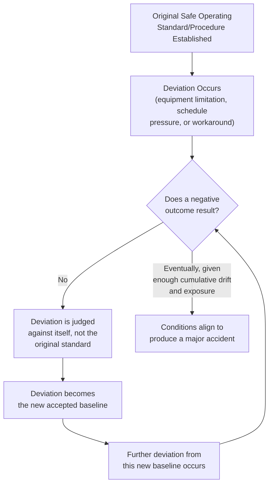

## Normalization of Deviance

### Definition

**Normalization of deviance** is the organizational and social process by which a group gradually accepts a deviation from an established safe standard or expected performance level as normal, acceptable practice, because repeated exposure to the deviation has not (yet) resulted in a negative outcome. The term was coined by sociologist **Diane Vaughan** in her sociological analysis *The Challenger Launch Decision* (1996), which examined how NASA and contractor engineers came to accept O-ring erosion on the Space Shuttle's solid rocket boosters as an expected, tolerable condition across multiple missions prior to the 1986 Challenger disaster.

Vaughan's core finding was that this drift did not occur through a single reckless decision, but through an incremental process in which each individual acceptance of a deviation seemed reasonable given the immediately preceding precedent, even though the cumulative departure from the original safety margin was substantial.

### Key Points

- Normalization of deviance is fundamentally a **social and organizational** phenomenon, not merely an individual lapse in judgment — it emerges from group dynamics, production pressure, and the absence of negative feedback, and can affect technically competent, well-intentioned people.
- The process is typically **incremental**, not a single large step: each small deviation is judged against the immediately preceding (already-deviated) baseline, rather than against the original design or procedural standard, allowing the gap between actual practice and the true safety margin to widen gradually and often imperceptibly.
- **Absence of a negative outcome is not evidence of safety.** A deviation that has not yet caused harm may simply reflect that the specific combination of conditions required to produce harm has not yet occurred — a probabilistic near-miss, not a validated safe practice.
- Normalization of deviance is closely related to, and often a precursor of, the broader cultural failure pattern of **complacency** and the erosion of **chronic unease** discussed in *Defining and Assessing Process Safety Culture*.
- It is a recurring root or contributing cause identified in numerous major accident investigations across industries, including the Space Shuttle Challenger and Columbia disasters, and multiple process industry incidents where bypassed interlocks, extended inspection intervals, or ignored alarm conditions became routine practice over time.

### The Mechanism of Normalization of Deviance

This creates what is sometimes called a **"ratchet effect"** or **"drift into failure"** (a related concept developed by safety researcher Sidney Dekker): the safety margin does not collapse suddenly, but is incrementally consumed over time through a series of individually reasonable-seeming decisions, none of which alone appears to constitute a significant risk acceptance.

$$\text{Perceived Risk}_n = f(\text{Deviation}_n - \text{Deviation}_{n-1})$$

Rather than the more accurate:

$$\text{Actual Risk}_n = f(\text{Deviation}_n - \text{Original Design/Procedural Standard})$$

[Inference: These expressions are conceptual illustrations of the cognitive mechanism Vaughan described — that each incremental deviation is judged relative to the most recent accepted baseline rather than the original standard — not formal quantitative risk models from the source literature.]

### The Challenger Case: Origin of the Concept

NASA's Solid Rocket Booster O-rings were originally designed to fully seal at ignition. Engineering data from early Space Shuttle flights showed some O-ring erosion (partial burn-through) on several missions, which had not resulted in a catastrophic failure. Each subsequent mission with observed erosion but no failure was treated as evidence that the condition, while outside the original design intent, was an "acceptable risk," progressively expanding the range of erosion considered tolerable. On January 28, 1986, at an unusually low ambient temperature, O-ring seals failed to seat properly, resulting in the loss of the Challenger orbiter and its seven-person crew. Vaughan's analysis found that engineers and managers involved had not acted recklessly or in willful disregard of safety by their own understanding at the time — they were operating within a culture in which the deviation had become the normalized, expected condition, illustrating that normalization of deviance can occur even among diligent, technically capable professionals operating in good faith.

### Application to Process Safety: Common Manifestations

Normalization of deviance appears in process safety contexts in recognizable patterns:

1. **Alarm and interlock bypassing** — a safety-critical interlock or alarm that triggers frequently due to a calibration or design issue is repeatedly bypassed or acknowledged without correction, until bypassing becomes the routine operating practice rather than an escalated engineering concern.
2. **Extended inspection/testing intervals** — a mandated inspection or relief valve testing interval is deferred once due to scheduling constraints without incident; subsequent deferrals become progressively easier to justify, extending the *de facto* interval well beyond the original mechanical integrity basis.
3. **Procedural shortcuts** — a written procedure specifies a sequence of verification steps; operators find that skipping certain steps saves time without apparent consequence, and the shortcut becomes the unwritten, accepted practice, potentially known to supervisors who do not intervene.
4. **Management of Change (MOC) informality** — "temporary" process modifications, approved without full MOC review due to time pressure, are extended indefinitely because the original temporary period passed without incident, and formal review is never completed.
5. **Permit-to-work degradation** — permit conditions (e.g., isolation verification, atmospheric testing frequency) are gradually relaxed in practice because the full rigor "has never caused a problem," particularly under production time pressure.

### Diagram: Drift From Original Safety Margin Over Time

<svg xmlns="http://www.w3.org/2000/svg" viewBox="0 0 700 400" font-family="Arial, sans-serif">
<title>Normalization of Deviance — Erosion of Safety Margin Over Time (svg_diagram)</title>
<rect x="0" y="0" width="700" height="400" fill="#fbfbfb" />

<line x1="70" y1="340" x2="650" y2="340" stroke="#333" stroke-width="2" />
<line x1="70" y1="40" x2="70" y2="340" stroke="#333" stroke-width="2" />
<text x="360" y="375" text-anchor="middle" font-size="13" fill="#333">Time / Successive Operating Cycles</text>
<text x="30" y="190" text-anchor="middle" font-size="13" fill="#333" transform="rotate(-90 30 190)">Safety Margin</text>

<line x1="70" y1="70" x2="650" y2="70" stroke="#2e7d32" stroke-width="2" stroke-dasharray="6,4" />
<text x="480" y="62" font-size="12" fill="#2e7d32">Original Design/Procedural Standard</text>

<polyline points="70,90 150,90 150,130 230,130 230,160 310,160 310,195 390,195 390,230 470,230 470,265 550,265 550,300 630,300" fill="none" stroke="`#c62828`" stroke-width="3" />

<text x="470" y="320" font-size="12" fill="`#c62828`" font-weight="bold">Actual Accepted Practice (drifting)</text>

<polyline points="70,95 150,95 150,135 230,135 230,165 310,165 310,200 390,200 390,235 470,235 470,270 550,270 550,305 630,305" fill="none" stroke="`#0288d1`" stroke-width="2" stroke-dasharray="3,3" />

<text x="150" y="115" font-size="11" fill="`#0288d1`">Perceived margin stays small</text>

<text x="150" y="128" font-size="11" fill="`#0288d1`">(judged against prior step)</text>

<line x1="630" y1="70" x2="630" y2="300" stroke="#000" stroke-width="1" stroke-dasharray="2,2" />
<text x="580" y="180" font-size="12" fill="#000" font-weight="bold">True cumulative</text>
<text x="580" y="195" font-size="12" fill="#000" font-weight="bold">margin lost</text>
</svg>

### Organizational Conditions That Enable Normalization of Deviance

- **Production pressure** — schedule and throughput demands create incentive to accept workarounds rather than halt operations to address the root cause of a deviation.
- **Absence of negative feedback loops** — without a system to systematically flag and escalate cumulative deviations (as opposed to evaluating each incident individually and in isolation), drift goes undetected.
- **Weak Management of Change discipline** — see *Just Culture Versus Blame Culture* and MOC-related content — informal or rushed MOC review allows temporary deviations to become permanent without adequate technical scrutiny.
- **Diffusion of responsibility** — in large organizations, no single individual may perceive themselves as accountable for the cumulative drift, since each incremental step was approved or tolerated by a different person or shift.
- **Success breeding complacency** — a long track record without a major incident can itself become evidence (fallaciously) that current practices, including accumulated deviations, are safe, undermining the "chronic unease" that CCPS identifies as essential to process safety culture.
- **Weak near-miss/hazard reporting culture** (see *Just Culture Versus Blame Culture*) — if raising concerns about a routine deviation is discouraged or unrewarded, the organization loses its primary detection mechanism for identifying drift before it results in harm.

### Practical Example

**Scenario:** A chemical batch reactor's standard operating procedure requires a nitrogen purge verification step before introducing a flammable solvent, taking approximately 12 minutes. Over several years:

- Operators find that a shortened 4-minute purge has never resulted in an incident and begin using it informally to meet production targets, without updating the written procedure.
- New operators are trained informally by experienced operators using the 4-minute practice, since it is what they observe in actual use, despite the written procedure still specifying 12 minutes.
- Supervisors, aware of the practice, do not intervene because production targets are consistently met and no incident has occurred.
- An MOC was never initiated to formally revise the purge time, meaning no engineering review ever assessed whether 4 minutes provides adequate inerting margin under all anticipated operating conditions (e.g., varying ambient temperature, nitrogen supply pressure fluctuations, or reactor headspace geometry changes from a prior modification).
- During an unusual combination of conditions (lower-than-typical nitrogen supply pressure coinciding with a slightly larger headspace following an equipment modification), the 4-minute purge proves insufficient, and a flammable atmosphere ignites during solvent charging, resulting in an explosion.

**Analysis:** No single operator or supervisor made a reckless decision at any point in this sequence — this is precisely the mechanism Vaughan described. Each incremental acceptance of the shortened purge appeared reasonable given the absence of negative outcomes up to that point, and the *actual* standard being judged against had silently shifted from the original 12-minute design basis to the informally accepted 4-minute practice. Investigation would need to examine not just the immediate technical cause (insufficient purge duration under specific conditions) but the underlying cultural and management system failure: absence of MOC discipline, absence of supervisory escalation, and the informal transmission of an unauthorized deviation through on-the-job training. [Inference: This is an illustrative scenario constructed to demonstrate standard normalization-of-deviance dynamics as documented in process safety literature; it does not describe a specific real, cited incident.]

### Detection and Countermeasures

1. **Periodic comparison against original design/procedural basis** — audits should compare actual practice against the *original* documented standard, not merely against the practice observed in the immediately preceding audit, to reveal cumulative drift that incremental comparisons would miss.
2. **Rigorous Management of Change (MOC) enforcement** — ensuring that any deviation intended to persist beyond a short, explicitly time-boxed trial period is subject to full technical review, closing the pathway by which "temporary" workarounds become permanent unreviewed practice.
3. **Maintaining chronic unease / sense of vulnerability** (see *Defining and Assessing Process Safety Culture*) — actively resisting the inference that a long incident-free track record validates current practice, and treating that absence of harm as potentially reflecting unexercised probability rather than genuine safety.
4. **Robust near-miss and hazard reporting systems** operating within a genuine Just Culture (see *Just Culture Versus Blame Culture*) — enabling early detection of emerging deviations before they become entrenched.
5. **Independent audits and third-party reviews** — external auditors, unfamiliar with the incrementally shifted "normal," are often better positioned to detect a significant gap between actual practice and the original design basis than internal personnel who have been socialized into the drifted baseline.
6. **Explicit "why" documentation in procedures** — procedures that document the engineering rationale behind specific parameters (e.g., "12-minute purge based on X air-change calculation for typical headspace volume Y") make it harder to informally justify deviation, since the safety basis is explicit rather than an unexplained rule that appears arbitrary and safely reducible.

### Common Misconceptions

- **"Normalization of deviance only happens in poorly managed or reckless organizations."** It has been documented in highly sophisticated, well-resourced organizations (including NASA) staffed by competent, well-intentioned professionals, underscoring that it is a systemic and social phenomenon rather than a simple indicator of incompetence or malice.
- **"If it hasn't caused a problem, it must be safe."** This is precisely the flawed reasoning pattern that drives normalization of deviance; absence of a negative outcome reflects that the specific hazardous condition combination has not yet occurred, not that the underlying risk has been eliminated.
- **"Normalization of deviance is the same as a single bad decision."** It is characterized by a *gradual, incremental* process across multiple decisions and time periods, distinguishing it from an isolated lapse in judgment or a single willful violation.
- **"Only frontline workers experience normalization of deviance."** The phenomenon can affect engineers, supervisors, and senior management alike, as it emerges from the social and organizational evaluation of risk against a shifting baseline rather than from any single role's specific error.

### Next Steps

- Defining and Assessing Process Safety Culture
- Just Culture Versus Blame Culture
- Management of Change (MOC): Preventing Informal and Undocumented Deviations
- The Challenger and Columbia Space Shuttle Disasters: Root Cause Analysis
- Drift Into Failure (Sidney Dekker) and Systemic Safety Theory
- Chronic Unease and High Reliability Organization (HRO) Principles
- Auditing Practices for Detecting Cumulative Procedural Drift
- Case Studies: Normalization of Deviance in Process Industry Incidents