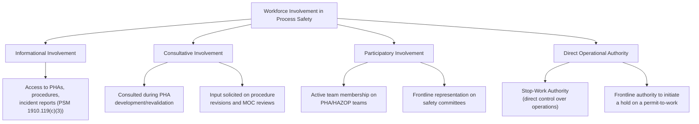
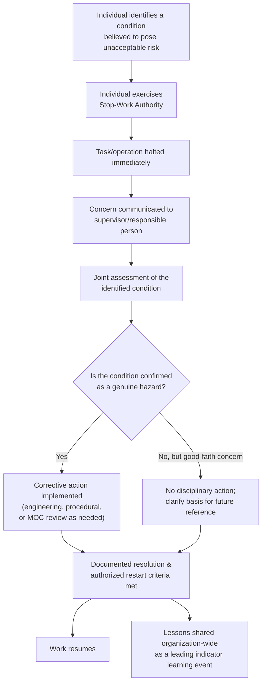

## Workforce Involvement and Stop-Work Authority

### Definition

**Workforce involvement** (also called employee participation) refers to the systematic engagement of frontline workers — operators, maintenance technicians, and contractors — in the design, review, and continuous improvement of process safety programs, rather than treating process safety as something designed and imposed exclusively by engineering or management staff. **Stop-work authority (SWA)** is the specific, formally granted right and organizational expectation that any employee, regardless of position or seniority, can halt a task, operation, or process when they identify a condition they believe poses an unacceptable safety risk, without fear of retaliation.

Both concepts are closely linked: stop-work authority is one of the most concrete and consequential expressions of genuine workforce involvement, because it converts participation from advisory input into direct operational control over hazardous situations.

### Key Points

- OSHA's PSM standard (29 CFR 1910.119(c)) explicitly requires **Employee Participation** as one of its 14 elements, mandating that employers develop a written plan of action for employee participation and consult with employees on the conduct and development of process hazard analyses and other PSM elements.
- Stop-work authority is only effective when it is **genuinely exercisable in practice**, not merely stated in policy — its real strength is measured by whether workers believe they can use it without negative career or social consequences (a direct application of the felt leadership and Just Culture principles discussed elsewhere in this chapter).
- Workforce involvement improves process safety outcomes because frontline workers often possess **tacit, ground-level knowledge** of process behavior, equipment quirks, and procedural gaps that is not fully captured in formal documentation or visible to engineering and management staff.
- A stop-work event should be treated as a **valuable leading indicator and learning opportunity**, not merely a disruption to be minimized — under Just Culture principles, an employee who stops work based on a reasonable, good-faith safety concern should never be disciplined for the decision to stop, even if subsequent investigation determines the concern did not materialize into an actual hazard.
- Effective stop-work programs require **clear reinstatement/restart criteria** — a defined process for how a stopped task is safely resumed once the concern is resolved, preventing ambiguity about who has authority to restart the work.

### OSHA PSM Employee Participation Requirements (Reference)

Under 29 CFR 1910.119(c), covered employers must:

1. Develop a written plan of action regarding the implementation of employee participation.
2. Consult with employees and their representatives on the conduct and development of process hazard analyses (PHAs) and on the development of other elements of process safety management.
3. Provide employees and their representatives access to process hazard analyses and all other information required to be developed under the PSM standard.

This establishes workforce involvement not as a discretionary best practice but as a distinct regulatory element with specific, auditable requirements.

### Structural Framework: Levels of Workforce Involvement

Effective process safety programs move progressively toward the right side of this spectrum; programs that remain limited to informational involvement (merely providing access to documents) fail to capture the tacit knowledge and real-time risk perception that frontline workers uniquely possess.

### Why Frontline Involvement Improves Hazard Identification

Frontline operators and technicians interact with equipment and procedures continuously and often notice discrepancies between the *documented* process (as written in procedures and PHAs) and the *actual* process as it behaves in practice — a gap sometimes described in safety science as the difference between "work as imagined" and "work as done." Involving frontline personnel in PHA teams, incident investigations, and procedure reviews surfaces this gap directly, rather than relying solely on engineering documentation that may not reflect current operating reality (particularly if equipment has degraded, been modified informally, or if workarounds have developed without formal Management of Change review — see *Normalization of Deviance*).

### Stop-Work Authority: Core Design Principles

1. **Universality** — SWA must apply to every individual on site, including contractors and visitors performing work, not only permanent employees or supervisors; a hazard does not discriminate by employment classification.
2. **No prerequisite for certainty** — workers should not be required to be certain a hazard exists before stopping work; a reasonable, good-faith belief that a condition is unsafe is sufficient grounds, since requiring certainty would delay action until after a hazard has already manifested.
3. **Protection from retaliation** — a stop-work decision, even one later determined to have been based on a misunderstanding or that did not reveal an actual hazard, must never result in disciplinary consequences, provided it was made in good faith; punishing "false positives" trains the workforce to under-report future concerns.
4. **Clear escalation pathway** — a defined process for how a stopped task is investigated, who has authority to authorize resumption, and how the resolution is documented and communicated back to the individual who stopped the work.
5. **Visible reinforcement by leadership** — leaders must actively and publicly recognize instances of stop-work authority being exercised (see *Leadership Commitment and Felt Leadership*), reinforcing that the behavior is valued rather than merely tolerated.

### Stop-Work Authority Process Flow

### Practical Example

**Scenario:** During a maintenance turnaround, a contractor technician preparing to enter a vessel for internal inspection notices that the atmospheric testing reading, while within the acceptable range specified in the permit, seems inconsistent with the technician's experience of similar vessels — the reading was taken at the entry point only, and the vessel geometry includes a lower section that could plausibly trap heavier-than-air vapors not reflected in the entry-point reading.

- The technician exercises stop-work authority, halting vessel entry preparations, despite the permit technically being signed off as compliant.
- The area supervisor and permit issuer are notified immediately; entry is paused pending further evaluation.
- Additional atmospheric testing is conducted at multiple points within the vessel, including the lower section the technician flagged, revealing an elevated concentration of a heavier-than-air hydrocarbon vapor that had not been captured by the original single-point entry test.
- The permit-to-work procedure is revised via Management of Change to require multi-point atmospheric testing for vessels with complex internal geometry, and the technician's stop-work action is specifically and publicly recognized during the next site safety meeting.

**Outcome:** This scenario illustrates stop-work authority functioning as intended — a frontline individual with direct, practical experience identified a gap between the documented safety basis (a permit signed off as compliant) and the actual risk present, and the organization's response (investigation, correction, and positive recognition rather than any suggestion the technician had caused unnecessary delay) reinforced the behavior for future situations. [Inference: This is an illustrative scenario constructed to demonstrate standard stop-work authority principles as documented in process safety literature, not a specific cited real-world incident.]

### Barriers to Effective Workforce Involvement and Stop-Work Authority

- **Perceived production pressure** — workers may hesitate to stop work if they believe schedule or output targets are prioritized over safety concerns by supervision (a direct consequence of weak felt leadership; see *Leadership Commitment and Felt Leadership*).
- **Fear of social or career consequences** — even without formal disciplinary action, informal social pressure from peers or supervisors (e.g., being labeled as "difficult" or "overly cautious") can suppress willingness to exercise SWA.
- **Ambiguous or inconsistent restart authority** — if it is unclear who can authorize resumption of a stopped task, delays and confusion can create informal pressure to resume work prematurely or to avoid stopping in the first place.
- **Contractor exclusion** — programs that formally or informally apply SWA only to direct employees, not contractors, create a population of workers (often performing some of the highest-risk tasks, such as turnaround maintenance) without genuine authority to halt unsafe conditions.
- **Lack of follow-through communication** — if workers who exercise SWA are not informed of the outcome or resolution, they may perceive the action as having had no effect, reducing future willingness to engage.
- **Weak underlying Just Culture** — as discussed in *Just Culture Versus Blame Culture*, if the organization's broader accountability system is punitive, stop-work authority policy will not be trusted regardless of how it is formally documented.

### Assessing the Health of Workforce Involvement and Stop-Work Programs

Consistent with the broader process safety culture assessment approaches (see *Defining and Assessing Process Safety Culture*), organizations can evaluate these programs through:

- **Frequency tracking** of stop-work events as a leading indicator (a very low or zero rate over an extended period is often a warning sign of underutilization rather than evidence of flawless operations).
- **Survey items** specifically asking whether employees believe they could exercise stop-work authority without negative consequences, and whether they can recall a specific instance of doing so or witnessing it.
- **Contractor-specific assessment** — verifying that contractor personnel are aware of and feel empowered to exercise the same stop-work authority as direct employees.
- **Review of PHA team composition** — auditing whether frontline operators and maintenance personnel are consistently included as active PHA/HAZOP team members, not merely consulted after the fact.
- **Root cause investigation trend analysis** — checking whether investigations of incidents and near misses reveal instances where an individual had relevant safety information but did not report it or stop work, which may indicate underlying barriers to workforce involvement.

### Common Misconceptions

- **"Stop-work authority slows down operations too much to be practical."** Programs are designed around the principle that the cost of a brief, unnecessary pause is far lower than the cost of a major accident that could have been prevented by timely intervention; a low-friction stop-work culture is generally associated with improved overall reliability, not merely increased downtime.
- **"Only supervisors or safety personnel should have stop-work authority."** Core to the concept's effectiveness is that authority is distributed to anyone directly observing the hazard, since the person closest to a developing situation is often best positioned to recognize it in time to prevent escalation.
- **"If workers had real stop-work authority, we'd see it used constantly."** Frequency of use depends heavily on underlying trust and Just Culture conditions; low usage in an environment with weak psychological safety more likely reflects suppression than an absence of legitimate concerns.
- **"Employee participation under PSM is satisfied by simply publishing procedures for employees to read."** OSHA's Employee Participation element requires active consultation, particularly in PHA development and revalidation, not merely passive information access.

### Next Steps

- Defining and Assessing Process Safety Culture
- Just Culture Versus Blame Culture
- Leadership Commitment and Felt Leadership
- OSHA PSM Employee Participation Element (29 CFR 1910.119(c))
- Process Hazard Analysis (PHA) Team Composition and Methodologies
- Permit-to-Work Systems and Atmospheric Testing Requirements
- Contractor Safety Management in Process Safety Programs
- Normalization of Deviance and Its Relationship to Underreporting