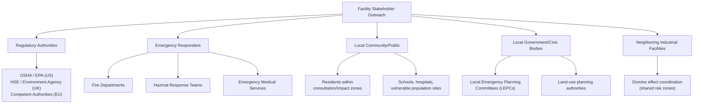
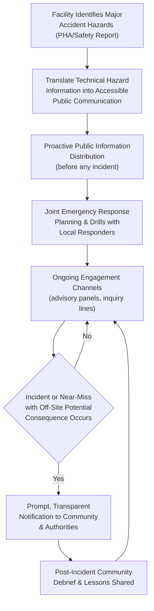

## Stakeholder Outreach and Community Engagement

### Definition

**Stakeholder outreach and community engagement**, in the context of process safety, refers to the systematic communication, consultation, and relationship-building activities an organization undertakes with parties external to the facility — surrounding residents, local emergency responders, regulatory authorities, and civic institutions — regarding the major hazard risks posed by the facility and the measures in place to prevent and mitigate them. Unlike internal process safety culture and leadership (addressed elsewhere in this chapter), this domain concerns the facility's relationship with the **off-site public and civil authorities** who could be affected by a major accident but who have no direct operational control over the hazards involved.

### Key Points

- Stakeholder outreach obligations are **explicitly embedded in regulatory frameworks** with a public/environmental protection mandate — most prominently the **Seveso III Directive** and **COMAH Regulations** (see *Comparing OSHA, Seveso III, and COMAH Approaches*), which require public information provisions and external emergency planning, and the U.S. **EPA Risk Management Program (RMP)**, which requires public availability of Risk Management Plan summary data.
- OSHA's PSM standard, being a worker-protection statute, does **not** itself impose community engagement requirements; in the U.S., this function is carried primarily by EPA's RMP rule and by **Local Emergency Planning Committees (LEPCs)** established under the Emergency Planning and Community Right-to-Know Act (EPCRA).
- Effective community engagement requires **proactive, ongoing communication**, not only reactive disclosure after an incident — organizations with strong practices engage stakeholders before an incident occurs, building trust and mutual understanding of hazards and emergency procedures in advance.
- Community engagement and internal process safety culture are interdependent: facilities with weak internal safety culture (see *Defining and Assessing Process Safety Culture*) often also under-invest in external transparency, while genuine internal chronic unease often correlates with more forthright community risk communication.
- Poor stakeholder engagement, particularly following an incident, can significantly amplify reputational, regulatory, and legal consequences even when the technical response to the incident itself was adequate — the **Bhopal disaster** remains the starkest historical illustration of the catastrophic consequences of inadequate community risk awareness and emergency coordination.

### Regulatory Drivers for Community Engagement

| Framework | Community Engagement Requirement |
| --- | --- |
| Seveso III Directive (EU) | Article 14: mandatory public information for upper-tier establishments, including information on the nature of hazards and expected behavior in an emergency |
| Seveso III Directive (EU) | Article 13: land-use planning consultation to maintain appropriate distances between hazardous establishments and residential areas |
| COMAH Regulations (UK) | Public information duties; HSE-maintained public register of COMAH sites; local authority-prepared external emergency plans (upper-tier) |
| EPA Risk Management Program (US) | Public availability of Risk Management Plan (RMP) executive summaries; coordination with Local Emergency Planning Committees |
| EPCRA (US) | Establishment of Local Emergency Planning Committees (LEPCs); Tier II chemical inventory reporting to state/local authorities and fire departments |
| OSHA PSM (US) | No direct community engagement requirement (worker-focused statute) |
| CCPS RBPS Guidelines | "Enhancement of Stakeholder Outreach" identified as one of 20 elements across the RBPS framework, applicable regardless of specific jurisdictional mandate |

### CCPS's Stakeholder Outreach Element

CCPS's *Risk Based Process Safety* framework explicitly includes **"Enhance Stakeholder Outreach"** as one of its 20 elements, situated within the broader pillar concerned with organizational commitment and communication. CCPS guidance frames stakeholder outreach as encompassing:

- Communication with the local community regarding facility hazards and risk reduction measures.
- Coordination with local emergency response organizations (fire departments, hazmat teams, emergency medical services).
- Engagement with regulators beyond minimum compliance reporting.
- Transparent communication following incidents, including near misses with off-site potential consequences.
- Solicitation of community feedback and concerns as an input to the facility's own risk management priorities.

### Categories of External Stakeholders

### Core Components of an Effective Community Engagement Program

1. **Proactive hazard communication** — providing clear, accessible (non-technical) information about the types of hazardous materials present, the nature of potential major accidents, and the safeguards in place, distinct from raw technical Safety Report content that is not readily interpretable by the public.
2. **Emergency response coordination and joint exercises** — regularly conducting joint emergency drills with local fire departments and emergency responders so that off-site responders are familiar with facility layout, hazards, and appropriate response tactics before a real emergency occurs.
3. **Accessible complaint and inquiry channels** — establishing clear points of contact for community members to raise concerns (odors, noise, visible incidents) and ensuring timely, substantive responses rather than dismissive or purely public-relations-oriented replies.
4. **Community advisory panels** — some facilities establish standing panels of local residents, civic leaders, and other stakeholders who meet periodically with facility management to discuss safety performance, upcoming changes, and community concerns.
5. **Incident and near-miss transparency** — communicating promptly and honestly with the community and authorities following incidents with actual or potential off-site consequence, rather than minimizing or delaying disclosure.
6. **Land-use planning engagement** — participating constructively in local land-use planning processes (required explicitly under Seveso III/COMAH) to help ensure new residential or public developments are not sited in ways that increase population exposure to major accident hazards.

### Community Engagement Process Flow

### The Bhopal Disaster as a Historical Case Study in Community Engagement Failure

The 1984 Bhopal disaster (see *Process Safety Versus Occupational Safety*) remains the most severe illustration of the consequences of inadequate stakeholder outreach and community engagement:

- Surrounding communities had limited awareness of the specific hazardous properties of methyl isocyanate (MIC) stored at the facility, or of appropriate protective actions to take in the event of a release.
- Local emergency responders and medical facilities were not adequately prepared with information on MIC's health effects, hampering effective emergency medical response.
- No effective external emergency plan or public warning system existed to alert nearby residents in time to take protective action (e.g., evacuation or shelter-in-place) once the release began.
- Residential settlements had developed in close proximity to the facility over time, reflecting an absence of the land-use planning safeguards that frameworks like Seveso III later mandated explicitly.

This disaster was a direct catalyst for the community right-to-know and emergency planning provisions subsequently enacted in major regulatory frameworks, including the U.S. **Emergency Planning and Community Right-to-Know Act (EPCRA)** of 1986 and strengthened provisions within what became the Seveso Directive framework in the EU.

### Practical Example

**Scenario:** A facility storing chlorine for water treatment purposes, classified as an upper-tier Seveso/COMAH establishment, implements the following community engagement practices:

- Distributes an annual, plain-language information leaflet to all households within the facility's designated consultation zone, describing the hazard (chlorine gas release), audible/visual warning signals used in an emergency, and specific protective actions residents should take (e.g., shelter-in-place instructions, ventilation shutdown guidance).
- Conducts a joint emergency exercise with the local fire brigade and hazmat response unit annually, simulating a chlorine release scenario, including a review of site access routes and available site-specific technical information the facility has pre-shared with responders.
- Maintains a standing community liaison panel that meets quarterly, including residents, a local school representative (given a school falls within the consultation zone), and a local government planning officer, to review safety performance metrics and any proposed site modifications.
- Following a minor chlorine leak that was fully contained on-site with no off-site consequence, the facility proactively notifies the local authority and community liaison panel of the event, its cause, and corrective actions taken, rather than waiting to see if the event became publicly known through other channels.

**Outcome:** This pattern of proactive, sustained engagement builds the community trust and emergency preparedness that is critical if a genuine major accident were to occur — residents are more likely to know the correct protective response, local responders are already familiar with site-specific hazards, and the facility's credibility (built through transparent minor-incident disclosure) supports more effective public compliance with emergency instructions during an actual major event. [Inference: This is an illustrative scenario constructed to demonstrate standard stakeholder outreach principles as documented in CCPS RBPS and Seveso III/COMAH regulatory guidance, not a specific cited real-world case.]

### Common Misconceptions

- **"Community engagement is a public relations function, not a process safety function."** CCPS explicitly frames stakeholder outreach as a process safety element because it directly affects the facility's own emergency response effectiveness, its ability to receive early external warning of concerns, and the ultimate consequence severity of any major accident through informed public protective action.
- **"If we comply with mandatory public disclosure requirements, we've fulfilled our community engagement obligations."** Regulatory minimums (e.g., RMP executive summary publication, Seveso public information provisions) establish a floor, not a ceiling; CCPS and leading practice emphasize proactive, relationship-based engagement beyond minimum disclosure.
- **"Engaging the community about hazards will alarm people unnecessarily."** Evidence from established community right-to-know frameworks generally supports that informed communities are better able to respond appropriately during an actual emergency, and that a lack of transparency more often erodes trust and amplifies alarm when hazards eventually become apparent through an incident.
- **"OSHA PSM covers community protection."** As a worker-safety statute, OSHA PSM has no direct community engagement or off-site consequence mandate; that function in the U.S. is carried by EPA RMP and EPCRA-derived LEPC structures.

### Next Steps

- Comparing OSHA, Seveso III, and COMAH Approaches
- EPA Risk Management Program (RMP) and Off-Site Consequence Analysis
- Emergency Planning and Community Right-to-Know Act (EPCRA) and Local Emergency Planning Committees
- Land-Use Planning and Consultation Zones Around Major Hazard Sites
- Domino Effect Analysis and Coordination Between Neighboring Facilities
- CCPS Risk-Based Process Safety (RBPS) — Full 20-Element Framework
- Emergency Response Planning and Joint Exercises with Local Responders
- Historical Case Study: Bhopal Disaster and Its Regulatory Legacy