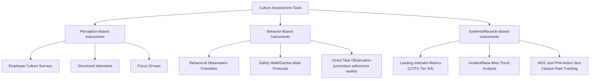
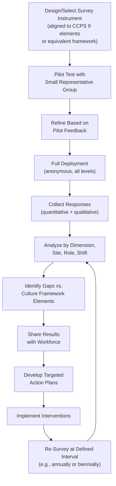

## Culture Assessment Tools and Surveys

### Overview

**Culture assessment tools and surveys** are the structured instruments and methodologies organizations use to measure, diagnose, and track process safety culture over time. While *Defining and Assessing Process Safety Culture* addresses the conceptual foundations and general assessment categories, this topic focuses specifically on the **concrete instruments, survey design principles, scoring approaches, and administration practices** used to operationalize culture measurement in practice.

### Key Points

- No single instrument fully captures process safety culture; credible assessment programs use **multiple complementary tools** (surveys, structured interviews, behavioral observation checklists, and leading indicator data) and triangulate findings across them.
- Survey design quality directly affects data validity — poorly worded, leading, or overly abstract questions produce data that appears quantifiable but does not reliably reflect actual culture.
- **Anonymity and confidentiality** are essential design requirements; without them, employees are likely to provide socially desirable rather than candid responses, particularly regarding sensitive topics like psychological safety and trust in leadership.
- Culture surveys should be **benchmarked and tracked longitudinally** (repeated at intervals) rather than treated as a one-time snapshot, since the primary value of culture assessment lies in detecting trends and the effects of interventions over time.
- Survey results must be **fed back to the workforce and acted upon** — a well-known failure pattern is administering a culture survey, never sharing results or resulting action plans with employees, which itself damages trust and future survey response candor.

### Categories of Culture Assessment Instruments

### CCPS Process Safety Culture Survey Approach

CCPS's guidance on process safety culture, aligned with its Risk-Based Process Safety framework, recommends survey instruments structured around the **nine essential features of a strong process safety culture** (see *Defining and Assessing Process Safety Culture*):

1. Process safety as a core value
2. Strong leadership
3. Just Culture
4. Sense of vulnerability (chronic unease)
5. Empowerment of individuals
6. Deference to expertise
7. Open and effective communication
8. High standards of performance
9. Continuous monitoring and organizational learning

A typical CCPS-aligned survey presents employees with Likert-scale statements (e.g., "I would feel comfortable raising a safety concern to my supervisor without fear of negative consequences" — rated from Strongly Disagree to Strongly Agree) mapped to each of these nine dimensions, allowing an organization to generate a **dimensional profile** rather than a single aggregate score, since a single composite number can mask significant weakness in one specific dimension (e.g., strong scores on "high standards of performance" alongside weak scores on "Just Culture").

### Example Survey Dimension Structure

| Culture Dimension | Example Survey Item (Illustrative) | What Low Scores May Indicate |
| --- | --- | --- |
| Sense of vulnerability | "I believe a major incident could happen at this facility, even though we haven't had one recently." | Complacency; eroded chronic unease |
| Just Culture | "I would report an honest mistake without fear of punishment." | Blame culture dynamics; suppressed reporting |
| Leadership commitment | "Senior leaders personally engage with process safety issues, not just production targets." | Weak felt leadership; say-do gap |
| Open communication | "I can raise a safety concern to anyone, regardless of their position, and be heard." | Hierarchical communication barriers |
| Deference to expertise | "Technical safety concerns take priority over schedule pressure in decision-making." | Production pressure overriding technical judgment |
| Empowerment | "I feel I have the authority to stop a job if I see something unsafe." | Weak or untrusted stop-work authority (see *Workforce Involvement and Stop-Work Authority*) |
| Standards of performance | "Safety-critical procedures are followed consistently, without informal shortcuts." | Normalization of deviance (see *Normalization of Deviance*) |
| Organizational learning | "Lessons from incidents at this site (or others) are actively applied here." | Weak incident investigation follow-through |

### Survey Design Principles

1. **Anonymity and aggregation thresholds** — responses should be anonymous, with results reported only in aggregate for groups large enough (commonly a minimum group size threshold, e.g., 5-10 respondents) to prevent individual identification, particularly in small work units.
2. **Balanced and neutral item wording** — avoiding leading language (e.g., "Don't you agree that safety is well managed here?") in favor of neutral statements that do not signal a socially desirable answer.
3. **Behavioral specificity over abstract agreement** — items that ask about specific, concrete experiences ("I have personally seen a supervisor stop work for a safety concern in the past year") tend to produce more reliable data than abstract agreement statements ("Leadership cares about safety"), since abstract items are more prone to socially desirable responding.
4. **Demographic segmentation (without compromising anonymity)** — collecting role-level, shift, or site-level demographic data (not individually identifying) enables analysis of whether culture perception varies meaningfully across the organization, such as between frontline operators and management, or between shifts.
5. **Mixed question types** — combining Likert-scale quantitative items with open-ended qualitative questions ("Describe a time you felt uncomfortable raising a safety concern") to capture nuance that purely quantitative scales may miss.
6. **Reverse-scored items** — including some items phrased in the negative direction (e.g., "Safety concerns are sometimes ignored due to production pressure") to detect straight-lining (respondents selecting the same response option repeatedly without genuine engagement).

### Survey Administration and Analysis Process

### Scoring and Interpretation Approaches

Culture survey results are commonly analyzed using several complementary techniques:

**1. Dimensional Profiling**

Presenting scores across each of the nine (or equivalent) culture dimensions separately, often visualized as a radar/spider chart, to identify specific areas of relative strength and weakness rather than relying on a single composite score.

**2. Gap Analysis Between Groups**

Comparing scores between organizational levels (e.g., frontline operators versus supervisors versus senior management) — a significant gap, such as leadership rating "leadership commitment" highly while frontline workers rate it low, is itself a critical finding indicating a felt leadership deficit (see *Leadership Commitment and Felt Leadership*).

**3. Trend Analysis Over Time**

Comparing results across successive survey administrations to assess whether specific interventions (e.g., a Just Culture training rollout) produced measurable improvement in the targeted dimension.

**4. Correlation with Leading/Lagging Indicators**

Examining whether survey dimension scores correlate with independently tracked leading indicators (e.g., near-miss reporting rates, PHA action item closure rates) or lagging indicators (Tier 1/2 process safety events), which can help validate whether the survey instrument is capturing meaningful, predictive information rather than merely abstract sentiment.

$$\text{Composite Dimension Score} = \frac{\sum_{i=1}^{n} \text{Response}_i}{n}$$

where $n$ is the number of valid responses for a given dimension's item set; low $n$ within a subgroup should trigger suppression of that subgroup's result to protect anonymity, per the aggregation threshold principle above.

### Complementary Behavioral and Systems-Based Tools

Because survey data reflects **perception**, it should be triangulated against **behavioral and records-based evidence**:

- **Behavioral observation checklists** — structured tools used during safety walks/Gemba walks to record specific observed behaviors (e.g., PPE compliance, permit-to-work adherence, presence of unauthorized bypasses) rather than subjective overall impressions.
- **MOC and PHA action item closure tracking** — a systems-based leading indicator; chronically overdue action items can indicate a culture that treats hazard identification as a paperwork exercise rather than a genuine commitment to risk reduction.
- **Incident investigation quality audits** — reviewing a sample of completed incident investigations against a quality rubric (depth of root cause analysis, avoidance of "operator error" as a terminal finding, tracking of corrective actions to closure) as an indirect but concrete measure of Just Culture and organizational learning in practice.
- **Alarm and interlock override logs** — quantitative system data tracking frequency of safety-critical alarm acknowledgments/overrides, which can reveal normalization of deviance patterns (see *Normalization of Deviance*) independent of self-reported survey perception.

### Practical Example

**Scenario:** A multi-site chemical company administers an annual CCPS-aligned culture survey across five facilities. Results reveal:

- Site A scores consistently high across all nine dimensions, with minimal gap between frontline and leadership responses.
- Site B scores high on "high standards of performance" and "leadership commitment" but notably low (2.1/5) on "Just Culture," with a wide gap between leadership's self-rating (4.2/5) and frontline ratings (1.8/5) on the same dimension.
- Cross-referencing Site B's near-miss reporting rate shows it is the lowest of the five sites and has declined 25% over the past two years, while its Tier 2 process safety event rate is the highest of the five sites.

**Interpretation:** The convergence of survey data (low Just Culture score, significant leadership-frontline perception gap) with independent leading indicator data (declining near-miss reports) and lagging indicator data (elevated Tier 2 events) provides **triangulated evidence** that Site B has a substantive Just Culture deficiency actively suppressing hazard reporting — a far more credible and actionable finding than any single data source alone. This would justify a targeted intervention (e.g., reviewing recent incident investigation and disciplinary case outcomes for consistency with Just Culture principles — see *Just Culture Versus Blame Culture*) rather than a generic, company-wide culture communication campaign that would not address Site B's specific, localized deficiency. [Inference: This is an illustrative scenario constructed to demonstrate standard culture assessment triangulation methodology as documented in CCPS guidance, not a specific cited real-world case.]

### Common Pitfalls in Culture Survey Implementation

1. **Survey fatigue and low response rates** — administering culture surveys too frequently, or alongside excessive other organizational surveys, can suppress response rates and engagement quality.
2. **Failure to close the feedback loop** — not communicating results and resulting action plans back to the workforce, which erodes trust and depresses candor and participation in future surveys.
3. **Treating the survey as the sole assessment method** — over-relying on perception data without triangulating against behavioral observation and systems/records data risks mistaking positive sentiment for actual risk control (or vice versa).
4. **Insufficient sample size for subgroup analysis** — attempting to report results for very small teams or shifts can compromise anonymity and discourage candid responses in future cycles.
5. **One-time administration without longitudinal tracking** — a single survey provides a static snapshot; the greatest diagnostic value comes from tracking dimensional scores over time and correlating shifts with specific organizational interventions or events.

### Common Misconceptions

- **"A high overall culture survey score means process safety risk is low."** Aggregate scores can mask significant weakness in a single critical dimension (e.g., Just Culture); dimensional analysis, not composite scoring alone, is necessary for meaningful interpretation.
- **"Survey results reflect objective safety performance."** Surveys measure *perception*, which must be triangulated against independent behavioral and systems data (leading/lagging indicators) to assess whether perception aligns with actual practice.
- **"Anonymous surveys guarantee honest responses."** Anonymity is necessary but not sufficient; poor question design, insufficient trust in how results will be used, or a recent punitive incident can still suppress candid responses even in a technically anonymous survey.
- **"Culture surveys are a one-time diagnostic exercise."** The greatest value of culture assessment comes from repeated administration and trend tracking, enabling organizations to evaluate whether specific interventions produce measurable cultural change over time.

### Next Steps

- Defining and Assessing Process Safety Culture
- Just Culture Versus Blame Culture
- Leadership Commitment and Felt Leadership
- Normalization of Deviance
- Workforce Involvement and Stop-Work Authority
- CCPS Risk-Based Process Safety (RBPS) — Full 20-Element Framework
- Leading vs. Lagging Indicators in Process Safety Performance
- Behavioral Observation and Safety Walk (Gemba Walk) Protocols
- Incident Investigation Quality Auditing Methods