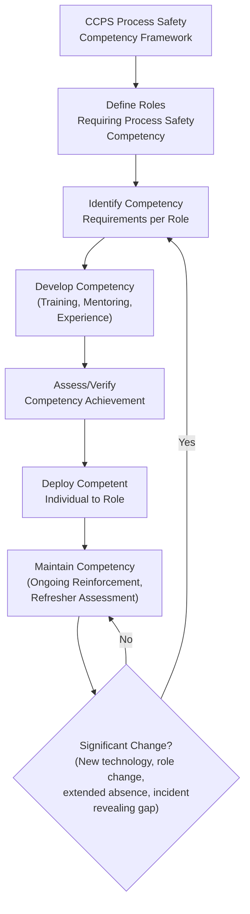
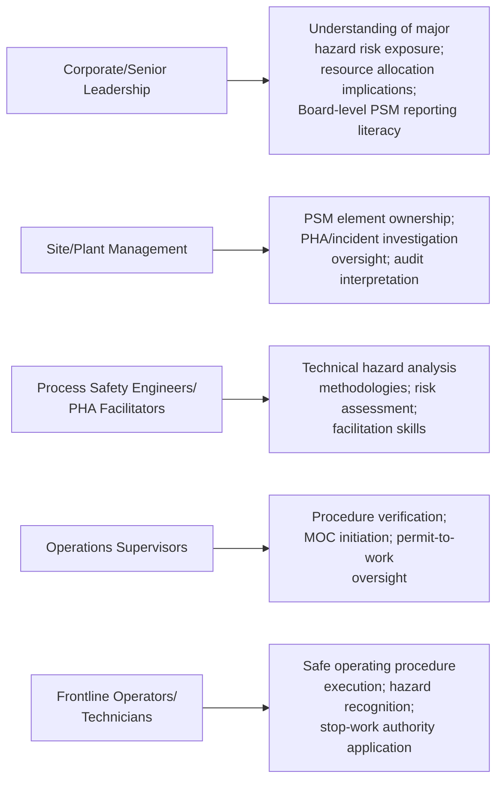

## CCPS Process Safety Competency Framework

### Overview

The **CCPS Process Safety Competency Framework**, published by the Center for Chemical Process Safety (CCPS) in its guideline *Guidelines for Defining Process Safety Competency Requirements*, provides a structured model for identifying, developing, and assessing the knowledge, skills, and behaviors individuals need to perform process safety roles effectively across an organization. Unlike training programs that focus narrowly on regulatory compliance content delivery, the competency framework is built around the principle that **process safety proficiency is role-specific, developmental, and verifiable**, requiring more than completion of a training course to be considered established.

### Key Points

- CCPS defines **competency** as the combination of **knowledge, skills, and abilities (KSAs)**, along with the underlying **behaviors**, needed to perform a specific process safety-related role or task effectively.
- The framework distinguishes between **training** (the delivery of information or instruction) and **competency** (the demonstrated, verified capability to apply that knowledge effectively in practice) — completing a training course is necessary but not sufficient evidence of competency.
- Competency requirements are **role-differentiated**: the framework explicitly rejects a one-size-fits-all training approach, recognizing that a process engineer, a frontline operator, a PHA facilitator, and a senior executive each require different depths and types of process safety competency.
- The framework incorporates a **competency lifecycle** — competency must be initially developed, verified, and then periodically reassessed and maintained over time, since skills and knowledge can atrophy, and process safety practices and technology evolve.
- CCPS positions the competency framework as directly supporting several Risk-Based Process Safety (RBPS) elements, particularly "Process Safety Competency," "Training and Performance Assurance," and "Workforce Involvement."

### Competency vs. Training: A Critical Distinction

| Aspect | Training | Competency |
| --- | --- | --- |
| Focus | Delivery of knowledge/information | Demonstrated capability to apply knowledge effectively |
| Verification method | Attendance records, course completion certificates | Skills demonstration, assessment, on-the-job evaluation |
| Duration of relevance | Point-in-time event | Ongoing state requiring maintenance and periodic reassessment |
| Typical failure mode | Assumed sufficient once completed | Recognized as requiring reinforcement and evolution over time |
| Example evidence | "Completed 8-hour PHA facilitation course" | "Independently facilitated 3 PHAs, evaluated as proficient by a qualified assessor" |

### The CCPS Competency Model Structure

### Core Elements of the CCPS Framework

**1. Role Identification**

Organizations must first identify which positions require process safety competency and to what depth — this typically includes process/chemical engineers, operations personnel, maintenance technicians, PHA facilitators and team members, process safety management system auditors, and increasingly, senior leadership and corporate management (recognizing that leadership decisions materially affect process safety outcomes, per *Leadership Commitment and Felt Leadership*).

**2. Competency Requirement Definition**

For each identified role, the organization defines the specific knowledge, skills, and behaviors required. CCPS guidance organizes process safety knowledge domains broadly, including (illustratively):

- Hazard recognition and evaluation (e.g., understanding flammability, reactivity, toxicity properties)
- Process hazard analysis methodologies (HAZOP, What-If, LOPA, Fault Tree Analysis)
- Risk assessment and management principles
- Process safety management system elements (the 14 OSHA PSM elements or 20 CCPS RBPS elements)
- Human factors and human error prevention
- Incident investigation methodologies
- Mechanical integrity principles
- Management of Change requirements and evaluation
- Emergency response planning

**3. Competency Development**

Competency is developed through a combination of methods, not training alone:

- Formal instruction/coursework
- Mentoring and coaching by experienced practitioners
- Supervised on-the-job experience
- Simulation and scenario-based exercises
- Cross-functional exposure (e.g., an operator participating in a PHA to develop broader hazard analysis understanding)

**4. Competency Assessment and Verification**

CCPS emphasizes that competency should be **verified through demonstration**, not assumed from training completion alone. Verification methods include:

- Written or scenario-based knowledge assessments
- Direct observation of skill application (e.g., observing an individual facilitate a HAZOP session)
- Peer or supervisor evaluation using structured competency rubrics
- Simulated emergency response exercises

**5. Competency Maintenance**

Because process safety knowledge and organizational context evolve, and because skills can degrade without use, the framework requires **periodic reassessment**, particularly triggered by:

- A defined refresher interval (e.g., periodic retraining cycles)
- Significant process or technology changes (potentially triggering Management of Change-related competency needs)
- Role changes or promotions
- Extended absence from the role
- Findings from an incident investigation revealing a competency gap

### Competency Framework Applied Across Organizational Levels

CCPS explicitly extends competency requirements beyond technical staff to include leadership, reflecting the broader recognition (see *Leadership Commitment and Felt Leadership*) that process safety outcomes depend on decisions made throughout the management hierarchy:

### Relationship to CCPS Risk-Based Process Safety (RBPS)

The Competency Framework is explicitly integrated with CCPS's broader **Risk-Based Process Safety (RBPS)** 20-element structure, most directly supporting:

- **Process Safety Competency** (an explicit RBPS element concerned with organizational-level process safety knowledge management, distinct from but closely related to individual role-based competency)
- **Training and Performance Assurance** (the RBPS element concerned with ensuring training programs actually produce demonstrated competency, not merely course completion)
- **Workforce Involvement** (see *Workforce Involvement and Stop-Work Authority*) — competency development benefits from active workforce participation in defining realistic, practice-based competency requirements

$$\text{Verified Competency} \neq \text{Training Completion}$$

$$\text{Verified Competency} = \text{Training} + \text{Applied Practice} + \text{Assessed Demonstration} + \text{Periodic Maintenance}$$

[Inference: These expressions are a conceptual summary of CCPS's competency-versus-training distinction as presented in its guidance, not formal quantitative equations from the source material.]

### Practical Example

**Scenario:** A specialty chemical manufacturer implements the CCPS Competency Framework for its PHA facilitator role.

- **Role identification:** The organization identifies "PHA Facilitator" as a distinct, safety-critical role requiring formal competency verification, separate from general process engineering competency.
- **Competency requirements defined:** Requirements include knowledge of HAZOP/What-If/LOPA methodologies, facilitation and group dynamics skills, ability to recognize when a hazard scenario warrants escalation to more rigorous quantitative analysis, and familiarity with the site's specific process safety information documentation.
- **Development:** A candidate completes formal HAZOP facilitation training, then observes three PHAs led by an experienced facilitator, then co-facilitates two additional PHAs under supervision.
- **Assessment/verification:** The candidate independently facilitates a PHA while being evaluated by a qualified assessor against a structured rubric covering technical accuracy, facilitation effectiveness, and appropriate scenario documentation; the assessor determines the candidate meets the defined competency standard.
- **Maintenance:** The organization requires PHA facilitators to facilitate a minimum number of PHAs annually to maintain active competency status, with a formal reassessment triggered if a facilitator has not led a PHA within an 18-month period, or following any significant methodology update adopted by the organization.

**Outcome:** This structured approach ensures that PHA facilitation — a role directly affecting the quality of hazard identification across the facility — is performed by individuals with demonstrated, verified capability, rather than relying solely on completion of an initial training course as a proxy for ongoing competence. [Inference: This is an illustrative scenario constructed to demonstrate standard CCPS competency framework application, not a specific cited real-world case.]

### Common Challenges in Implementation

- **Resource intensity** — developing role-specific competency requirements, assessment rubrics, and verification processes requires significantly more investment than delivering standardized training courses to all personnel.
- **Assessor availability and consistency** — verifying competency through observation and evaluation requires qualified assessors, and ensuring consistent assessment standards across assessors and sites can be challenging in larger organizations.
- **Balancing rigor with practicality** — overly burdensome assessment requirements can create resistance or become a compliance formality rather than a genuine competency verification, undermining the framework's intent.
- **Maintaining currency** — competency requirements must be periodically reviewed and updated as process technology, regulatory requirements, and industry practice evolve, requiring ongoing organizational investment rather than a one-time framework rollout.
- **Extending beyond technical roles** — organizations often find it more straightforward to define competency for technical/engineering roles than for leadership roles, despite CCPS's guidance that leadership competency is equally critical to process safety outcomes.

### Common Misconceptions

- **"Completing PSM training satisfies competency requirements."** CCPS's framework explicitly distinguishes training completion from verified, demonstrated competency; the two are related but not equivalent.
- **"Competency only applies to engineers and technical specialists."** The framework extends to all roles with process safety-relevant responsibilities, including frontline operators, supervisors, and senior leadership, each with role-appropriate competency requirements.
- **"Once competency is verified, it remains valid indefinitely."** The framework treats competency as requiring ongoing maintenance and periodic reassessment, since skills can degrade without use and organizational/technological context evolves.
- **"A generic industry training certification is sufficient evidence of site-specific competency."** CCPS guidance emphasizes that competency should reflect the specific processes, hazards, and management systems of the individual's actual work environment, which generic external certifications may not fully address.

### Next Steps

- CCPS Risk-Based Process Safety (RBPS) — Full 20-Element Framework
- Training Program Design for Process Safety Roles
- PHA Facilitator Qualification and Assessment Methods
- Leadership Commitment and Felt Leadership
- Workforce Involvement and Stop-Work Authority
- Human Factors and Human Error Prevention in Process Safety
- Management of Change: Competency Implications of Process Modifications
- Building an Internal Process Safety Competency Assessment Program