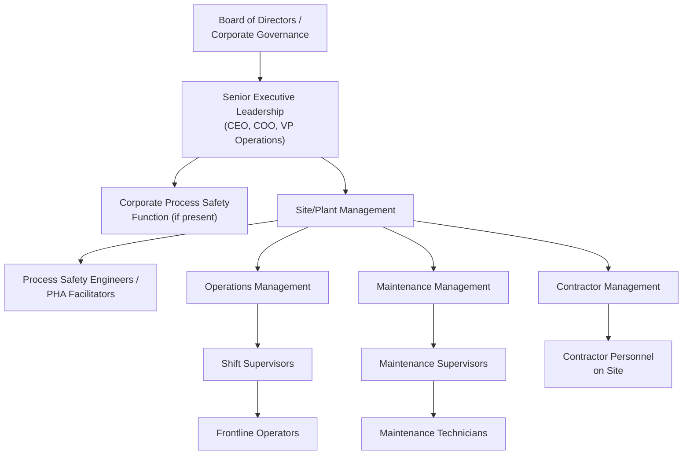

## Roles and Responsibilities Across the Organization

### Overview

Effective process safety management depends on clearly defined **roles and responsibilities** distributed across every level of an organization — from the board of directors down to frontline operators and contractors. Because process safety risk arises from decisions made throughout the organizational hierarchy (design engineering, capital allocation, operational execution, and maintenance), no single role or department can own process safety in isolation. CCPS's Risk-Based Process Safety framework explicitly emphasizes that process safety must be embedded as a **shared organizational responsibility**, with role clarity preventing both dangerous gaps (where no one believes a task is theirs) and unproductive duplication.

### Key Points

- Process safety responsibility exists on a **continuum from strategic to operational** — board-level and executive roles set risk tolerance, resource allocation, and governance structure; site leadership translates this into operational programs; frontline personnel execute safe operations and provide the ground-level hazard awareness that no other level possesses directly.
- OSHA's PSM standard (29 CFR 1910.119) does not prescribe an organizational chart, but its 14 elements imply specific responsibilities (e.g., PHA team leadership, MOC approval authority, mechanical integrity program ownership) that organizations must explicitly assign to avoid ambiguity.
- **RACI-style clarity** (who is Responsible, Accountable, Consulted, and Informed) for each PSM element and major decision point (e.g., MOC approval, PHA action item closure, incident investigation sign-off) reduces the risk of critical process safety tasks falling through organizational gaps.
- A recurring root cause in major accident investigations (including Texas City and Deepwater Horizon) is **diffuse or unclear accountability**, where multiple parties believed a safety-critical responsibility belonged to someone else, or where organizational restructuring left a previously assigned responsibility unassigned.
- Contractor and third-party roles must be explicitly integrated into the responsibility structure, since contractors often perform high-risk work (turnarounds, maintenance, construction) while sitting outside the direct employee reporting hierarchy.

### Organizational Hierarchy of Process Safety Responsibility

### Role-by-Role Responsibility Breakdown

**1. Board of Directors / Corporate Governance**

- Establishes organizational risk tolerance and ensures process safety receives appropriate visibility at the governance level (distinct from, but informed by, occupational safety metrics — see *Process Safety Versus Occupational Safety*).
- Reviews process safety performance indicators (typically Tier 1/Tier 2 metrics per API RP 754) as part of board risk oversight, following the pattern of governance reform recommended after incidents like Texas City (the Baker Panel Report explicitly recommended board-level process safety oversight).
- Ensures adequate resources are allocated for process safety programs, recognizing that under-resourcing is a common root cause of degraded mechanical integrity and PHA program quality.

**2. Senior Executive Leadership**

- Sets the tone for process safety culture through visible, felt leadership (see *Leadership Commitment and Felt Leadership*).
- Makes or ratifies major capital allocation decisions affecting process safety-critical infrastructure (relief systems, safety instrumented systems, mechanical integrity programs).
- Establishes corporate-level process safety policy and ensures consistency of PSM program expectations across multiple sites.

**3. Corporate Process Safety Function (where present)**

- Develops corporate-wide process safety standards, often exceeding minimum regulatory requirements (frequently aligned with CCPS RBPS).
- Conducts or oversees corporate audits of site-level PSM program compliance and effectiveness.
- Provides technical expertise and support to sites, particularly smaller sites without dedicated process safety engineering staff.
- Aggregates and reports process safety performance metrics across the organization to senior leadership and the board.

**4. Site/Plant Management**

- Owns overall site-level PSM program implementation and compliance.
- Allocates site-level resources (staffing, budget) to process safety-critical activities, balancing against production and cost pressures.
- Approves or escalates Management of Change requests based on defined authority thresholds.
- Ensures PHA revalidation schedules (e.g., the OSHA-required 5-year PHA revalidation cycle) are maintained.
- Personally participates in incident investigations and PHA reviews to demonstrate felt leadership.

**5. Process Safety Engineers / PHA Facilitators**

- Lead or facilitate Process Hazard Analyses (HAZOP, What-If, LOPA) per the competency standards discussed in *CCPS Process Safety Competency Framework*.
- Maintain Process Safety Information (PSI) documentation required under PSM element 1910.119(d).
- Provide technical support for Management of Change reviews, evaluating the process safety implications of proposed modifications.
- Support incident investigations with technical root-cause analysis expertise.

**6. Operations Management and Shift Supervisors**

- Ensure operating procedures are followed and kept current, escalating discrepancies between documented procedures and actual practice (a key defense against normalization of deviance — see *Normalization of Deviance*).
- Authorize and oversee permit-to-work systems, including atmospheric testing and isolation verification for hazardous work.
- Reinforce and personally model stop-work authority (see *Workforce Involvement and Stop-Work Authority*), ensuring frontline exercise of SWA is supported rather than discouraged.
- Initiate Management of Change requests for operational modifications, however minor they may appear.

**7. Maintenance Management and Technicians**

- Own execution of the Mechanical Integrity program, including inspection, testing, and preventive maintenance of safety-critical equipment (relief valves, pressure vessels, piping).
- Maintain equipment maintenance records supporting mechanical integrity compliance documentation.
- Identify and report equipment conditions that may indicate emerging process safety risk (e.g., corrosion, unusual vibration, seal degradation) through established hazard reporting channels.

**8. Frontline Operators and Technicians**

- Execute operations in accordance with safe operating procedures, providing real-time feedback when procedures do not match actual operating conditions.
- Exercise stop-work authority when unsafe conditions are identified.
- Participate as active PHA team members, contributing tacit operational knowledge not always captured in engineering documentation.
- Report near misses and hazardous conditions through established reporting systems, supported by a genuine Just Culture (see *Just Culture Versus Blame Culture*).

**9. Contractor Management and Contractor Personnel**

- Site contractor management functions ensure contractors receive appropriate process safety orientation, hazard communication, and are integrated into site permit-to-work and stop-work authority systems.
- Contractor personnel are held to the same safe work practice expectations as direct employees for work they perform, particularly during high-risk activities such as turnarounds.
- OSHA PSM explicitly addresses contractor responsibilities under element 1910.119(h), requiring the host employer to evaluate contractor safety performance and inform contractors of known hazards.

### RACI Framework Application to Key PSM Activities

A **RACI matrix** (Responsible, Accountable, Consulted, Informed) is a widely used tool to formalize role clarity for specific process safety activities, reducing the ambiguity that contributes to accountability gaps.

| PSM Activity | Responsible | Accountable | Consulted | Informed |
| --- | --- | --- | --- | --- |
| PHA Facilitation | Process Safety Engineer/Facilitator | Site Manager | Operations, Maintenance, Frontline Operators | Corporate Process Safety Function |
| Management of Change Approval | Requesting Engineer/Supervisor | Site Manager (or designated MOC authority) | Process Safety Engineering, Operations, Maintenance | Affected Personnel |
| Mechanical Integrity Inspection Scheduling | Maintenance Planner | Maintenance Manager | Process Safety Engineering | Operations |
| Incident Investigation | Investigation Team Lead | Site Manager | Affected Employees, Process Safety Engineering | Corporate Leadership, Regulatory Bodies (as required) |
| Emergency Response Plan Maintenance | EHS/Emergency Coordinator | Site Manager | Local Emergency Responders, Operations | All Site Personnel |

### Practical Example

**Scenario:** A facility experiences a near miss involving an unplanned pressure excursion during a batch reactor startup. Applying clear role-based responsibility:

- The **frontline operator** who identified the abnormal pressure reading exercises stop-work authority and immediately notifies the **shift supervisor**.
- The **shift supervisor** initiates the incident/near-miss reporting process and ensures the unit is brought to a safe state, consulting the **process safety engineer** on whether an emergency Management of Change or immediate operational restriction is warranted pending investigation.
- **Site management** is informed promptly and ensures the incident investigation team (which includes the process safety engineer, an operations representative, and a maintenance representative, per RACI-defined roles) is convened within the site's defined investigation timeline requirement.
- The **incident investigation team** conducts root-cause analysis, applying Just Culture principles (see *Just Culture Versus Blame Culture*) to distinguish system/design contributing factors from any individual behavioral factors.
- Findings and corrective actions are reported to **corporate process safety leadership** for cross-site learning applicability (if the same reactor design or procedure exists at other facilities) and summarized for **board-level process safety reporting** if the event meets the organization's Tier 1/Tier 2 threshold criteria.

**Outcome:** Each role's contribution is distinct and complementary — the frontline operator's real-time hazard recognition, the supervisor's immediate operational response, the process safety engineer's technical investigation expertise, and site/corporate leadership's oversight and cross-organizational learning function together, illustrating how clearly assigned roles prevent the diffusion of responsibility that has historically contributed to major accident escalation. [Inference: This is an illustrative scenario constructed to demonstrate standard organizational role integration during incident response, not a specific cited real-world case.]

### Common Failure Patterns from Unclear Role Assignment

- **Diffusion of responsibility** — when a safety-critical task (e.g., relief valve inspection scheduling) is not clearly assigned to a specific role, each party may assume another party is responsible, resulting in the task being performed by no one.
- **Authority-responsibility mismatch** — assigning responsibility for a task (e.g., MOC technical review) without corresponding authority to delay or halt work pending resolution of identified concerns, undermining the practical effectiveness of the assigned role.
- **Contractor role ambiguity** — failure to clearly integrate contractor personnel into stop-work authority and hazard reporting systems, leaving a substantial workforce segment (often performing high-risk turnaround and maintenance work) without clear access to safety-critical organizational processes.
- **Post-restructuring gaps** — organizational changes (mergers, restructuring, staff turnover) that eliminate or reassign a role without explicitly re-assigning its underlying process safety responsibilities, a pattern identified in multiple major incident investigations as a contributing factor.

### Common Misconceptions

- **"Process safety is the safety department's responsibility."** CCPS and virtually all major investigation findings emphasize that process safety is a shared, organization-wide responsibility, with the safety/process safety function typically providing technical expertise and program stewardship rather than sole ownership of risk control.
- **"Contractors are the contracting company's responsibility, not the host facility's."** OSHA PSM explicitly assigns host employer responsibilities for contractor safety communication and performance evaluation under element 1910.119(h); host facilities retain meaningful process safety obligations regarding contracted work performed on-site.
- **"Board-level involvement in process safety is excessive oversight of operational detail."** Post-Texas City governance reforms (Baker Panel recommendations) established that board-level process safety metric review is now considered standard governance practice for major-hazard operators, distinct from involvement in day-to-day operational decisions.
- **"Clear job titles are sufficient for role clarity."** Effective role clarity requires explicit definition of responsibility, accountability, and authority for specific process safety activities (e.g., via RACI matrices), since job titles alone often do not resolve ambiguity in cross-functional processes like MOC or incident investigation.

### Next Steps

- CCPS Process Safety Competency Framework
- Leadership Commitment and Felt Leadership
- Just Culture Versus Blame Culture
- Workforce Involvement and Stop-Work Authority
- OSHA PSM Contractor Requirements (29 CFR 1910.119(h))
- Management of Change: Approval Authority and Technical Review Roles
- Board-Level Process Safety Governance and Reporting
- Incident Investigation Team Composition and Process