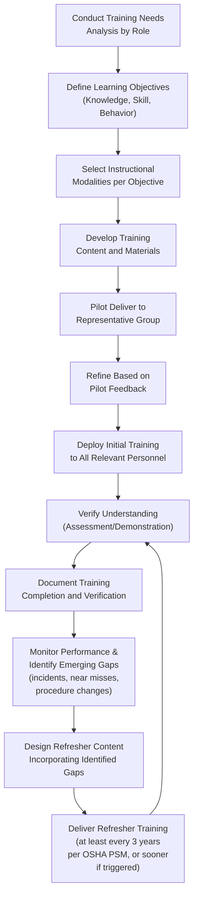

## Designing Initial and Refresher Training Programs

### Overview

Designing effective process safety training programs requires distinguishing between **initial training** (equipping personnel with the foundational knowledge and skills required before independently performing safety-critical tasks) and **refresher training** (periodically reinforcing, updating, and re-verifying that knowledge and skill over time). Both are explicit requirements under OSHA's PSM standard (29 CFR 1910.119(g)) and are foundational to the broader competency model discussed in *CCPS Process Safety Competency Framework* — training is the primary mechanism through which competency is initially developed and subsequently maintained, though CCPS emphasizes that training completion alone does not constitute verified competency.

### Key Points

- OSHA PSM 1910.119(g) requires that each employee presently involved in operating a covered process be trained in an overview of the process and in the operating procedures, and that **refresher training be provided at least every three years** (or more frequently if necessary) to ensure employees understand and adhere to current operating procedures.
- Initial training should be structured around **demonstrated proficiency**, not merely course attendance — OSHA requires that the employer certify that the employee has received and understood the training, which implies some form of verification beyond passive attendance.
- Refresher training is not simply a repeat of initial content; effective programs use refresher cycles to address **identified performance gaps, procedural changes, incident lessons learned, and emerging hazards** that were not present or fully understood during initial training.
- Training program design should be informed by a **systematic training needs analysis**, identifying the specific knowledge and skill gaps relevant to each role, rather than applying generic, one-size-fits-all content across dissimilar positions.
- Effective programs incorporate **multiple instructional modalities** (classroom instruction, hands-on simulation, on-the-job mentoring, computer-based training) matched to the type of knowledge or skill being developed, since procedural knowledge, hazard recognition skill, and emergency response capability each benefit from different training approaches.

### OSHA PSM Training Requirements (29 CFR 1910.119(g)) — Reference

1. **Initial Training:** Each employee presently involved in operating a process, and each employee before being involved in operating a newly assigned process, must be trained in an overview of the process and in the operating procedures. Training must include emphasis on the specific safety and health hazards, emergency operations including shutdown, and safe work practices applicable to the employee's job tasks.
2. **Refresher Training:** Refresher training must be provided at least every three years, and more often if necessary, to each employee involved in operating a process to ensure that the employee understands and adheres to the current operating procedures.
3. **Training Documentation:** The employer must ascertain that each employee involved in operating a process has received and understood the training required, and must prepare a record containing the identity of the employee, the date of training, and the means used to verify that the employee understood the training.

### Training Program Design Process

### Initial Training: Core Design Principles

**1. Role-Specific Content Scoping**

Aligned with the competency framework's role differentiation (see *CCPS Process Safety Competency Framework*), initial training content should be scoped to the specific process safety knowledge and skills required for the employee's actual job tasks — an operator's initial training will emphasize operating procedures and hazard recognition, while a maintenance technician's will emphasize mechanical integrity and safe work practices for equipment intervention.

**2. Process Overview and Hazard-Specific Content**

OSHA explicitly requires that initial training include an overview of the process and specific emphasis on the safety and health hazards of that specific process, meaning generic process safety training content must be supplemented with facility- and process-specific hazard information (e.g., specific chemical hazards, reaction chemistry risks, and unique equipment configurations present at that site).

**3. Emergency Operations Training**

Initial training must cover emergency shutdown procedures and emergency operations relevant to the employee's role, ensuring personnel can respond appropriately to abnormal conditions, not only routine operations.

**4. Verification of Understanding**

Rather than relying solely on training attendance, effective initial training incorporates a verification mechanism — written assessments, scenario-based questioning, or direct observation of task performance — to substantiate the employer's certification that the employee has received and understood the training, as OSHA requires.

**5. Supervised Practical Application**

Following formal instruction, initial training programs commonly incorporate a period of supervised, hands-on task performance (e.g., an operator performing startup procedures under the direct oversight of a qualified mentor) before being certified to perform the task independently.

### Refresher Training: Core Design Principles

**1. Gap-Driven Content Updates**

Rather than repeating identical initial training content, refresher training should be informed by:

- Procedural changes implemented since the last training cycle (often via Management of Change)
- Findings from incident investigations, both site-specific and from industry-wide case studies
- Identified performance gaps observed through audits, behavioral observations, or near-miss trends
- Regulatory or standard updates affecting the process safety program

**2. Interval Determination**

While OSHA PSM establishes a maximum three-year refresher interval, organizations should determine actual refresher frequency based on task criticality, complexity, and frequency of performance — infrequently performed but high-consequence tasks (e.g., emergency shutdown of a rarely-used but safety-critical system) may warrant more frequent refresher cycles than the regulatory maximum.

**3. Scenario-Based Reinforcement**

Refresher training often benefits from scenario-based exercises (e.g., tabletop emergency response drills, simulated abnormal situation management) rather than purely didactic content repetition, since scenario-based learning better reinforces decision-making under realistic conditions.

**4. Incorporating Organizational Learning**

CCPS's Risk-Based Process Safety framework emphasizes that lessons learned from incidents (both internal and industry-wide) should be systematically fed into refresher training content, closing the loop between incident investigation findings (see *Roles and Responsibilities Across the Organization*) and workforce competency maintenance.

### Instructional Modality Selection

| Learning Objective Type | Recommended Modality | Rationale |
| --- | --- | --- |
| Factual/procedural knowledge (e.g., regulatory requirements, chemical properties) | Classroom instruction, computer-based training | Efficient for standardized information transfer; supports assessment via testing |
| Physical/manual skill (e.g., valve lineup, PPE donning) | Hands-on practice, supervised on-the-job training | Skill development requires physical repetition and direct feedback |
| Judgment/decision-making under pressure (e.g., emergency response, abnormal situation management) | Simulation, tabletop exercises, scenario-based training | Builds decision-making capability in a controlled, consequence-free environment |
| Hazard recognition (e.g., identifying early warning signs of a developing upset) | Case study review, PHA participation, mentored observation | Develops pattern recognition through exposure to real and historical examples |
| Team coordination (e.g., emergency response roles) | Joint drills, multi-role simulations | Reinforces coordination and communication under realistic multi-person scenarios |

### Diagram: Initial vs. Refresher Training Content Emphasis Over Time

<svg xmlns="http://www.w3.org/2000/svg" viewBox="0 0 700 380" font-family="Arial, sans-serif">
<title>Training Content Emphasis: Initial vs. Refresher Cycles (svg_diagram)</title>
<rect x="0" y="0" width="700" height="380" fill="#fbfbfb" />
<line x1="70" y1="320" x2="650" y2="320" stroke="#333" stroke-width="2" />
<line x1="70" y1="40" x2="70" y2="320" stroke="#333" stroke-width="2" />
<text x="360" y="355" text-anchor="middle" font-size="13" fill="#333">Training Timeline (Initial → Refresher Cycles)</text>
<text x="30" y="180" text-anchor="middle" font-size="13" fill="#333" transform="rotate(-90 30 180)">Content Proportion</text>

<rect x="100" y="60" width="100" height="240" fill="#0b3d63" />
<text x="150" y="55" text-anchor="middle" font-size="11" fill="#0b3d63" font-weight="bold">Initial Training</text>
<text x="150" y="180" text-anchor="middle" font-size="10" fill="white">Foundational</text>
<text x="150" y="195" text-anchor="middle" font-size="10" fill="white">Process Overview,</text>
<text x="150" y="210" text-anchor="middle" font-size="10" fill="white">Procedures, Hazards,</text>
<text x="150" y="225" text-anchor="middle" font-size="10" fill="white">Emergency Operations</text>

<rect x="280" y="120" width="100" height="180" fill="#1c5d8c" />
<rect x="280" y="90" width="100" height="30" fill="#c62828" />
<text x="330" y="55" text-anchor="middle" font-size="11" fill="#1c5d8c" font-weight="bold">Refresher 1</text>
<text x="330" y="105" text-anchor="middle" font-size="9" fill="white">Gap-Driven Content</text>
<text x="330" y="215" text-anchor="middle" font-size="10" fill="white">Core Reinforcement</text>

<rect x="460" y="150" width="100" height="150" fill="#3a86c8" />
<rect x="460" y="100" width="100" height="50" fill="#c62828" />
<text x="510" y="55" text-anchor="middle" font-size="11" fill="#3a86c8" font-weight="bold">Refresher 2</text>
<text x="510" y="130" text-anchor="middle" font-size="9" fill="white">Incident Lessons,</text>
<text x="510" y="143" text-anchor="middle" font-size="9" fill="white">Procedure Updates</text>
<text x="510" y="230" text-anchor="middle" font-size="10" fill="white">Core Reinforcement</text>

<text x="620" y="105" font-size="10" fill="`#c62828`" font-weight="bold">= Gap-driven</text>

<text x="620" y="118" font-size="10" fill="`#c62828`" font-weight="bold"> updates</text>

</svg>

### Documentation and Recordkeeping Requirements

Consistent with OSHA PSM 1910.119(g)(3), training programs must maintain records including:

- Identity of each trained employee
- Date(s) of training completion
- The means used to verify the employee understood the training (e.g., assessment scores, observed demonstration sign-off)

This documentation serves both regulatory compliance and organizational purposes — enabling tracking of refresher due dates, identifying personnel with lapsed or overdue training, and providing an audit trail demonstrating the employer's diligence in training verification (relevant both to regulatory inspection and to incident investigation, where training adequacy is frequently examined as a potential contributing factor).

### Practical Example

**Scenario:** A facility redesigns its operator training program following a near miss in which an operator, though having attended initial procedural training two years prior, was unable to correctly execute an infrequently performed emergency shutdown sequence during an abnormal situation drill.

- **Root cause identification:** Investigation finds that initial training relied solely on classroom instruction and a written test, with no hands-on simulation of the emergency shutdown sequence, and that the operator had never practically performed this specific sequence since initial training due to its rarity in normal operations.
- **Redesigned initial training:** The revised program adds a mandatory simulator-based practical demonstration of all emergency shutdown sequences as a condition of initial certification, in addition to the existing classroom and written assessment components.
- **Redesigned refresher training:** Rather than waiting for the full three-year OSHA-maximum refresher cycle, the facility implements an annual simulator-based refresher specifically for emergency shutdown sequences (a more frequent interval than required for general procedural refresher training), based on the criticality and infrequent real-world practice opportunity for this specific skill.
- **Documentation:** Each operator's simulator performance is assessed against a structured rubric, with results documented alongside standard attendance records, providing verifiable evidence of demonstrated competency rather than attendance alone.

**Outcome:** This example illustrates the core design principle that refresher intervals and modalities should be calibrated to task criticality and practice frequency, rather than uniformly applying the OSHA-maximum three-year interval and classroom-only modality across all training content regardless of risk or skill decay characteristics. [Inference: This is an illustrative scenario constructed to demonstrate standard training program design principles, not a specific cited real-world case.]

### Common Pitfalls in Training Program Design

1. **Treating attendance as equivalent to understanding** — signing an attendance sheet does not verify comprehension or capability; assessment or demonstration is needed to substantiate the OSHA-required certification of understanding.
2. **Static refresher content** — repeating identical content every three years without incorporating incident lessons, procedural changes, or identified performance gaps reduces refresher training's practical value.
3. **Mismatched modality** — using purely classroom/lecture-based instruction for skills that require hands-on practice (e.g., emergency response actions) often fails to produce genuine capability, despite satisfying minimum documentation requirements.
4. **Uniform intervals regardless of task criticality** — applying the same refresher interval to all content regardless of task complexity, consequence severity, or frequency of real-world practice can leave high-consequence, infrequently performed skills under-reinforced.
5. **Disconnected from incident investigation findings** — failing to systematically feed lessons learned from incidents and near misses (see *Roles and Responsibilities Across the Organization*) back into training content design.

### Common Misconceptions

- **"OSHA's three-year refresher requirement means training every three years is always sufficient."** The three-year interval is a regulatory maximum, not a recommended standard for all content; task criticality and skill decay characteristics may warrant more frequent refresher training for specific high-consequence, infrequently practiced tasks.
- **"Refresher training should repeat initial training content exactly."** Effective refresher training incorporates updates, incident lessons, and identified gaps rather than static repetition of unchanged initial content.
- **"Completing a written test proves an operator can perform the task safely."** Written assessment verifies knowledge but not necessarily physical or judgment-based skill; tasks requiring manual dexterity or real-time decision-making benefit from hands-on or scenario-based verification methods.
- **"Training documentation exists only for regulatory compliance."** Beyond compliance, training records serve operational purposes — identifying overdue refresher training, supporting incident investigation analysis of training adequacy, and informing competency management per the broader CCPS framework.

### Next Steps

- CCPS Process Safety Competency Framework
- Roles and Responsibilities Across the Organization
- OSHA PSM Training Requirements (29 CFR 1910.119(g)) — Detailed Compliance
- Simulation and Scenario-Based Training for Emergency Response
- Management of Change: Training Implications of Process Modifications
- Incident Investigation: Identifying Training and Competency Gaps
- Training Needs Analysis Methodologies
- Building a Training Verification and Recordkeeping System