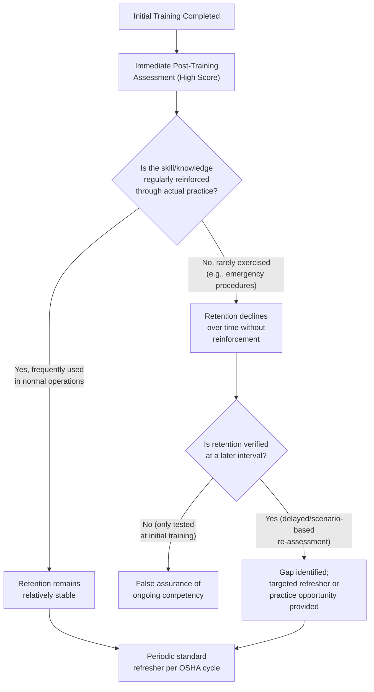
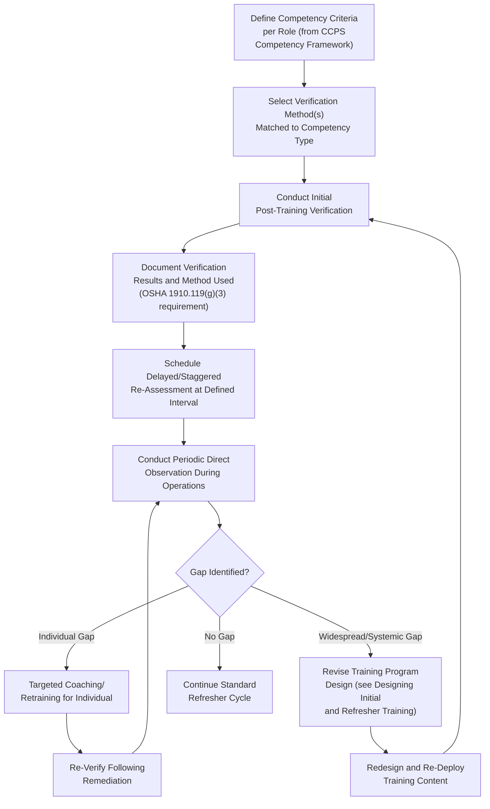

## Verifying Competency and Knowledge Retention

### Overview

**Verifying competency and knowledge retention** is the discipline of confirming, through structured and defensible methods, that personnel not only received process safety training but genuinely retained and can apply the underlying knowledge and skills over time. This topic extends the conceptual competency-versus-training distinction introduced in *CCPS Process Safety Competency Framework* and the interval/design considerations in *Designing Initial and Refresher Training Programs* into the specific methods, tools, and organizational practices used to actually **measure and confirm** that competency exists and persists.

### Key Points

- **Verification is distinct from assessment timing** — an individual may pass an assessment immediately following training (demonstrating short-term knowledge acquisition) while still experiencing significant **knowledge decay** over subsequent months, particularly for infrequently used skills; robust programs verify retention at intervals beyond the immediate post-training period, not only at course completion.
- OSHA PSM 1910.119(g)(3) requires employers to **ascertain** that each employee has received and understood training and to document the **means used to verify** understanding — this creates a regulatory expectation for a defensible verification methodology, not merely attendance tracking.
- Verification methods should be matched to the **type of competency being confirmed** — declarative/factual knowledge, procedural skill, and judgment-based decision-making each require different verification approaches, paralleling the modality-matching principle discussed in training design.
- **Knowledge and skill decay curves** are well-documented in learning science; competency verification programs that ignore this phenomenon and rely solely on point-in-time, post-training testing risk a false sense of assurance about ongoing workforce capability.
- Verification findings should feed back into both **individual remediation** (additional coaching or retraining for individuals with identified gaps) and **program-level design revision** (if verification reveals widespread gaps, the training program itself, not just individuals, likely requires redesign).

### Verification Methods by Competency Type

| Competency Type | Verification Method | Example |
| --- | --- | --- |
| Declarative knowledge (facts, regulations, hazard properties) | Written or computer-based testing | Multiple-choice assessment on chemical hazard properties |
| Procedural skill (task execution sequence) | Direct observation with structured checklist | Observed execution of a startup procedure against a step-by-step checklist |
| Physical/manual skill | Hands-on demonstration | Correct donning/doffing of PPE in a supervised setting |
| Judgment/decision-making under uncertainty | Scenario-based simulation, oral defense of reasoning | Tabletop exercise requiring the trainee to diagnose and respond to a simulated abnormal condition |
| Team coordination | Multi-person simulation/drill observation | Joint emergency response drill with structured team performance evaluation |
| Long-term retention (post-initial-training) | Delayed/staggered re-assessment | Unannounced or scheduled re-testing 6-12 months after initial training, independent of the standard refresher cycle |

### The Knowledge Decay Problem

Learning science research consistently documents that knowledge and skill retention **decline over time following training**, particularly for information or skills not regularly reinforced through practical application. This decay pattern has direct implications for process safety, where many safety-critical skills (e.g., emergency shutdown execution, abnormal situation diagnosis) are, by design, infrequently exercised in normal operations precisely because the conditions requiring them are meant to be rare.

This dynamic is a key rationale for the design principle discussed in *Designing Initial and Refresher Training Programs*, that refresher intervals for high-consequence, infrequently practiced skills should often be shorter than the OSHA-maximum three-year interval, since knowledge decay for rarely used skills can occur well within that window.

### Structured Verification Approaches

**1. Immediate Post-Training Assessment**

Conducted at the conclusion of initial or refresher training, verifying that the individual has acquired the intended knowledge or skill at that point in time. This is the minimum baseline OSHA expects employers to document but is insufficient on its own to confirm sustained competency.

**2. Delayed/Staggered Re-Assessment**

Re-testing knowledge or skill at an interval after initial training (e.g., 6-12 months later), independent of the standard refresher training cycle, specifically to detect knowledge decay before it manifests as an operational failure. This approach directly addresses the limitation of relying solely on immediate post-training results.

**3. Direct Observation During Normal Operations**

Periodic, structured observation of personnel performing actual job tasks (distinct from a formal test setting), verifying that trained procedures are being followed correctly in practice — this also serves as a defense against normalization of deviance (see *Normalization of Deviance*), since observation can reveal informal drift from trained procedures that a written test would not detect.

**4. Simulation and Scenario-Based Verification**

Particularly valuable for judgment-based and emergency response competencies, simulation exercises (ranging from tabletop discussions to full-scale drills) verify that personnel can apply knowledge under realistic, dynamic conditions rather than only in a static testing environment.

**5. Peer and Supervisor Structured Evaluation**

Using standardized rubrics, supervisors or qualified peer assessors evaluate on-the-job performance against defined competency criteria, providing a verification method grounded in actual work context rather than an artificial testing environment.

**6. Incident and Near-Miss Correlation Analysis**

Reviewing whether incidents or near misses reveal gaps between documented training completion and actual demonstrated competency during the event — a reactive but important verification signal indicating that existing verification methods may have missed a real capability gap (see *Roles and Responsibilities Across the Organization* for incident investigation role integration).

### Verification Program Design Flow

### Distinguishing Individual vs. Systemic Verification Findings

A critical analytical step in competency verification programs is determining whether an identified gap reflects an **individual performance issue** or a **systemic training program deficiency**:

$$\text{If gap rate across cohort} > \text{expected baseline threshold} \Rightarrow \text{likely systemic (program design) issue}$$

$$\text{If gap isolated to one or few individuals} \Rightarrow \text{likely individual remediation need}$$

[Inference: These represent a conceptual decision heuristic commonly applied in training evaluation practice, not a formally standardized quantitative threshold; organizations typically define their own baseline expectations based on historical verification data and risk tolerance.]

If, for example, 40% of operators fail a delayed re-assessment on emergency shutdown procedure execution, this pattern points toward inadequate initial training design, insufficient practice opportunity, or an overly long refresher interval — a program-level issue requiring redesign — rather than treating each failing individual as a discrete performance problem warranting only individual coaching.

### Practical Example

**Scenario:** A facility implements a delayed re-assessment program for its emergency shutdown procedure competency, testing operators via simulator six months after their most recent refresher training (rather than waiting for the next standard refresher cycle).

- Results show that 35% of operators, despite having passed their most recent refresher assessment with high scores, struggle to correctly execute the full shutdown sequence without significant hesitation or error during the six-month follow-up simulation.
- Root cause analysis reveals that the shutdown sequence, while covered thoroughly in refresher training, is rarely practiced in actual operations (occurring perhaps once every several years in real conditions), consistent with the knowledge decay pattern for infrequently exercised skills.
- Given the widespread pattern (35% of the cohort, not isolated individuals), the facility determines this is a **systemic training program issue** rather than individual performance gaps, and redesigns its approach: implementing quarterly brief simulator refreshers specifically for the emergency shutdown sequence (in addition to, not replacing, the standard three-year comprehensive refresher cycle), based on the specific decay pattern observed for this particular skill.
- Six months after implementing the quarterly simulator refreshers, a follow-up delayed re-assessment shows the failure rate has dropped to under 5%, and the facility now treats any individual failure within that low baseline as warranting targeted individual coaching rather than program redesign.

**Outcome:** This illustrates the value of delayed verification (beyond immediate post-training testing) in surfacing a decay pattern that a standard three-year refresher cycle, evaluated only via passing scores at the point of training, would not have revealed until an actual emergency exposed the gap. [Inference: This is an illustrative scenario constructed to demonstrate standard competency verification and knowledge decay principles, not a specific cited real-world case.]

### Documentation and Recordkeeping for Verification

Beyond the baseline OSHA PSM 1910.119(g)(3) requirement to document the means used to verify training understanding, robust competency verification programs maintain:

- Individual competency verification history across multiple assessment types and intervals, not merely a single completion date.
- Aggregate cohort-level verification trend data, enabling detection of systemic patterns (as in the example above) rather than only individual-level tracking.
- Linkage between verification records and identified training program revisions, providing an audit trail demonstrating continuous improvement in response to verification findings.
- Correlation tracking between verification results and subsequent incident/near-miss involvement, supporting longer-term validation of whether the verification program is genuinely predictive of operational performance.

### Common Pitfalls in Competency Verification

1. **Relying solely on immediate post-training testing** — failing to account for knowledge decay over time, particularly for infrequently practiced high-consequence skills.
2. **Testing recall rather than application** — written tests that verify an individual can recognize the correct answer among options may not confirm the individual can execute the corresponding action correctly under real operating conditions.
3. **Treating all gaps as individual failures** — attributing a widespread verification failure pattern to individual underperformance rather than recognizing a systemic training design deficiency, delaying necessary program-level correction.
4. **Verification fatigue** — excessive or poorly designed verification testing can create disengagement or test-taking shortcuts (e.g., answer memorization) that undermine the validity of the verification data itself.
5. **Disconnected from incident investigation** — failing to systematically cross-reference verification records against incident and near-miss findings, missing an opportunity to validate (or challenge) whether current verification methods are actually predictive of real-world performance.

### Common Misconceptions

- **"Passing a test immediately after training confirms lasting competency."** Immediate post-training performance reflects short-term acquisition, not necessarily durable retention; delayed re-assessment is needed to confirm competency persists over time, particularly for infrequently used skills.
- **"Verification and training are the same activity."** Training delivers knowledge/skill; verification independently confirms that delivery was effective and that the resulting competency persists — the two serve distinct, complementary functions.
- **"A written test is sufficient verification for all competency types."** Physical, procedural, and judgment-based competencies typically require observation, simulation, or scenario-based verification methods beyond what written testing alone can confirm.
- **"If most people pass, the training program is working."** A high pass rate on immediate post-training assessment does not rule out significant retention decay revealed only through delayed verification; both immediate and longer-interval data points are needed for a complete picture.

### Next Steps

- CCPS Process Safety Competency Framework
- Designing Initial and Refresher Training Programs
- Roles and Responsibilities Across the Organization
- Simulation and Scenario-Based Training for Emergency Response
- Human Factors and Knowledge Decay in Safety-Critical Skills
- OSHA PSM Training Documentation Requirements (29 CFR 1910.119(g)(3))
- Incident Investigation: Cross-Referencing Training and Competency Records
- Building a Delayed Re-Assessment Program for High-Consequence Skills