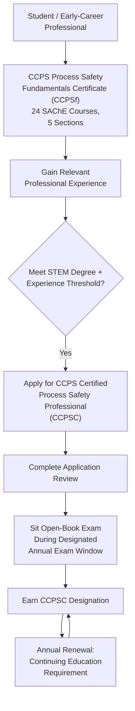
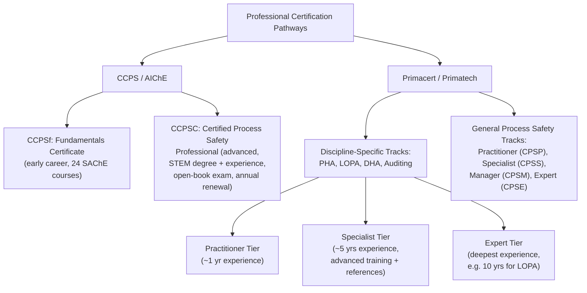

## Professional Certification Pathways in Process Safety

### Overview

Professional certification in process safety provides an independent, third-party-verified credential attesting that an individual has met defined standards of education, experience, and demonstrated knowledge in process safety practice. Certification differs from the internal competency verification discussed in *Verifying Competency and Knowledge Retention* in that it is administered by an **external, independent body**, typically involves a **standardized examination**, and produces a **portable, industry-recognized credential** that follows the individual across employers, rather than an internal, organization-specific competency record.

The two most prominent process safety certification bodies are the **Center for Chemical Process Safety (CCPS)**, operating under AIChE, and **Primatech's Primacert** program, though other sector-specific and regional certifications also exist.

### Key Points

- CCPS explicitly frames its flagship credential as **not a training program** but a rigorous, independently administered certification verifying demonstrated competency in Risk-Based Process Safety (RBPS) tools and techniques. The CCPSC is a rigorous certification process that verifies competency in the latest process safety tools and techniques, is administered independently, and is respected industry-wide. [AIChE](https://www.aiche.org/ccps/resources/certified-process-safety-professional)
- Certification pathways are typically **tiered by experience level** — CCPS offers a foundational certificate program for early-career professionals alongside its more rigorous professional certification, while Primacert offers three explicit competency tiers (Practitioner, Specialist, Expert) across multiple technical disciplines.
- Eligibility for advanced-tier certifications generally requires a combination of a **relevant STEM degree** and a **minimum number of years of documented process safety experience**, with the specific experience threshold varying by credential and tier.
- Certification is **not indefinite** — all major process safety credentials require **periodic renewal**, typically involving continuing education requirements, to ensure certified individuals remain current with evolving process safety practice, methodologies, and regulatory expectations.
- Certification credentials are **specific to a scope of practice** — some certify general process safety management competency, while others certify competency in a specific technical discipline (e.g., PHA facilitation, LOPA), meaning individuals may pursue multiple credentials aligned with their specific role responsibilities.

### CCPS Certification Pathway (AIChE)

**1. CCPS Process Safety Fundamentals Certificate Program (CCPSf)**

Designed for students, early-career professionals, and those adding process safety responsibilities to an existing role. Completion is based on finishing 24 Safety and Chemical Engineering Education (SAChE) courses, grouped into five sections of three to six courses each, with credit given for courses already completed. The self-paced courses are aligned with the CCPS Risk Based Process Safety elements and are intended to start the student or early-career professional on the path toward the more advanced CCPS Certified Process Safety Professional credential. [Aiche](https://www.aiche.org/ccps/resources/certification/process-safety-fundamentals-certificate-program)[Aiche](https://www.aiche.org/ccps/resources/certification/process-safety-fundamentals-certificate-program)

**2. CCPS Certified Process Safety Professional (CCPSC)**

The flagship, advanced-tier credential. To qualify for the CCPSC designation, candidates must have a degree in a STEM area (science, technology, engineering, or math) and five years of relevant work experience in process safety. Some sources describe a somewhat different threshold — for instance, one certification-preparation resource describes a requirement of at least seven years of experience in process safety, a written exam, and continuing education requirements for renewal — so candidates should verify current published eligibility criteria directly with CCPS/AIChE rather than relying on a single secondary source. [Unverified: exact minimum experience-year requirement varies across sources; confirm current criteria on AIChE's CCPS certification page before applying.] [Best Accredited Colleges](https://bestaccreditedcolleges.org/articles/process-safety-management-certification-online.html)[ResumeCat](https://resumecat.com/blog/process-safety-engineer-certifications)

The application and examination process generally follows this structure: candidates complete an online application for review; once approved, they select one of several annual exam windows and take an open-book examination during that period. The exam content is grounded in the CCPS Risk-Based Process Safety framework's four pillars and twenty elements, and may include topics such as consequence and dispersion modeling. Renewal is annual and includes a continuing education requirement to demonstrate ongoing proficiency. [Process Safety Management Certification Online +2](https://bestaccreditedcolleges.org/articles/process-safety-management-certification-online.html)

### CCPS Pathway Structure

### Primacert (Primatech) Certification Pathway

Primacert offers a distinctly structured, **discipline-specific, tiered certification model**. Primacert offers certifications in PHA, LOPA, DHA (Dust Hazard Analysis), process safety auditing, process safety, and procedure writing, at three increasing levels of competence — Practitioner, Specialist, and Expert — with the exception of procedure writing. [Primacert](https://www.primacert.com/)

**Tier Definitions (General, per Primacert's overview):**

A Practitioner is a professional who has the knowledge and understanding of the technical discipline necessary to competently take a leading role, possessing a minimum of one year's experience related to the discipline. A Specialist is a professional who competently performs the functions in the specific technical discipline, with in-depth knowledge and abilities, possessing a minimum of five years' experience. An Expert is a professional who expertly performs the functions of the technical discipline, generally with the deepest experience threshold among the three tiers (for example, the Certified LOPA Expert credential requires a minimum of ten years of relevant experience and frequent, regular conduct of LOPA studies). [Primacert](https://www.primacert.com/certifications/overview)[Primacert](https://www.primacert.com/certifications/lopa/certified-lopa-expert-cle)

**Example: Certified PHA Practitioner/Specialist Pathway**

The Certified PHA Practitioner (CPP) designation is intended for a process safety professional ready to take the role of team leader for PHA studies, requiring a minimum of one year of relevant experience and a relevant technical degree. Progressing further, the Certified PHA Specialist (CPS) designation is intended for a professional who routinely acts as team leader for PHA studies, requiring a minimum of five years of relevant experience and regular conduct of studies, along with completion of an advanced PHA facilitation training course, two references attesting to qualifications and ethics, and two additional references from PHA team members who can rate the applicant's leadership skills. [Primacert](https://www.primacert.com/certifications/pha/certified-pha-practitioner-cpp)[Primacert](https://www.primacert.com/certifications/pha/certified-pha-specialist-cps)

**General Process Safety Credentials**

Beyond discipline-specific certifications (PHA, LOPA, DHA), Primacert also offers broader process safety management credentials:

- Certified Process Safety Practitioner (CPSP) — intended for a process safety professional ready to take responsibility for one or more aspects of process safety, requiring a minimum of one year of relevant experience, a relevant technical degree with at least three years of full-time tertiary education, and successful completion of the Primacert examination; certification is valid for three years. [Primacert](https://www.primacert.com/certifications/process-safety/certified-process-safety-practitioner)
- Certified Process Safety Specialist (CPSS) — requiring a relevant technical degree, a minimum of five years of recent relevant work experience, and completion of additional training courses covering at least two specified advanced process safety topics beyond the practitioner level. [Primacert](https://www.primacert.com/certifications/process-safety/certified-process-safety-specialist)
- Certified Process Safety Manager (CPSM) — intended for a process safety manager responsible for a process safety management system, requiring a relevant technical degree, a minimum of five years of relevant experience, and completion of a training course on managing process safety compliance programs; certification is valid for three years. [Primacert](https://www.primacert.com/certifications/process-safety/certified-process-safety-manager)

### Comparative Certification Structure

### Recertification and Renewal

Sustained certification validity, across both major pathways, requires **periodic renewal demonstrating ongoing proficiency**, reflecting the same competency-maintenance principle discussed in *CCPS Process Safety Competency Framework*:

- CCPSC renewal occurs annually and includes a continuing education requirement to demonstrate ongoing proficiency. [AIChE](https://www.aiche.org/ccps/resources/certified-process-safety-professional)
- Primacert's Certified Process Safety Practitioner credential requires recertification involving maintaining current understanding of process safety practices through continued training attendance and ongoing relevant work experience, with specific recertification requirements applicable at each three-year renewal cycle. [Primacert](https://primacert.com/recertifications/process-safety/certified-process-safety-practitioner)

### Practical Example

**Scenario:** An early-career chemical engineer joins a process safety team after two years in a general process engineering role.

- The engineer first pursues the **CCPS Process Safety Fundamentals Certificate (CCPSf)**, completing the required set of SAChE courses aligned with the RBPS elements, building foundational process safety knowledge while gaining on-the-job PHA team participation experience.
- After several years of documented process safety experience, meeting the relevant STEM degree and experience threshold, the engineer applies for the **CCPS Certified Process Safety Professional (CCPSC)** credential, completing the application review and sitting the open-book examination during a designated annual exam window.
- Separately, because the engineer's role increasingly involves leading PHA/HAZOP sessions, they pursue the **Primacert Certified PHA Practitioner (CPP)** credential to formally validate this specific facilitation competency, later progressing to the **Certified PHA Specialist (CPS)** tier after accumulating the required five years of regular PHA facilitation experience and completing advanced facilitation training.
- The engineer maintains both credentials through their respective renewal cycles — annual continuing education for CCPSC, and periodic (three-year) recertification requirements for the Primacert credential.

**Outcome:** This illustrates how professional certification pathways can be **combined and layered** — a broad, general process safety management credential (CCPSC) alongside a discipline-specific credential (PHA facilitation) — reflecting the reality that process safety careers often require both broad management-system literacy and deep, verifiable expertise in specific technical methodologies. [Inference: This is an illustrative scenario constructed to demonstrate how the certification pathways described above are typically combined in practice, not a specific cited real-world case.]

### Value and Application of Certification

- **Individual career development** — certification provides an externally validated, portable credential distinguishing an individual's demonstrated expertise, independent of any single employer's internal competency program.
- **Organizational assurance** — employers may use industry certification as one input (though not a complete substitute) when evaluating candidates for safety-critical process safety roles, complementing the internal competency verification discussed in *CCPS Process Safety Competency Framework* and *Verifying Competency and Knowledge Retention*.
- **Industry-wide standardization** — because certification bodies apply consistent examination and eligibility standards across candidates and employers, certification helps establish a common, industry-recognized baseline for what "competent" means in specific process safety disciplines.

### Common Misconceptions

- **"CCPSC is a training course you complete."** CCPS explicitly states the CCPSC is not a training program, but rather a rigorous certification process that verifies competency in process safety tools and techniques. Training courses (including CCPS's own SAChE courses) may help prepare candidates, but certification itself is a separate, independently administered assessment. [AIChE](https://www.aiche.org/ccps/resources/certified-process-safety-professional)
- **"All process safety certifications require the same experience threshold."** Experience requirements vary meaningfully by credential and tier — from as little as one year (e.g., Primacert's Practitioner tier) to five, seven, or ten years depending on the specific credential and source consulted, so candidates should verify current, credential-specific requirements directly with the certifying body.
- **"Certification, once earned, is permanent."** All major process safety certifications require periodic renewal involving continuing education or re-demonstration of ongoing proficiency; certifications can lapse if renewal requirements are not met.
- **"A general process safety certification covers all technical disciplines equally."** Discipline-specific credentials (e.g., PHA facilitation, LOPA) certify competency in that specific methodology; a general process safety management credential does not necessarily substitute for discipline-specific certification where a role requires deep expertise in a particular technical method.

### Next Steps

- CCPS Process Safety Competency Framework
- Verifying Competency and Knowledge Retention
- Designing Initial and Refresher Training Programs
- Process Hazard Analysis (PHA) Facilitation Skills and Qualification
- Layers of Protection Analysis (LOPA) Methodology
- Roles and Responsibilities Across the Organization
- Continuing Education Requirements in Process Safety Practice
- Building an Organizational Certification Development Pathway for Staff