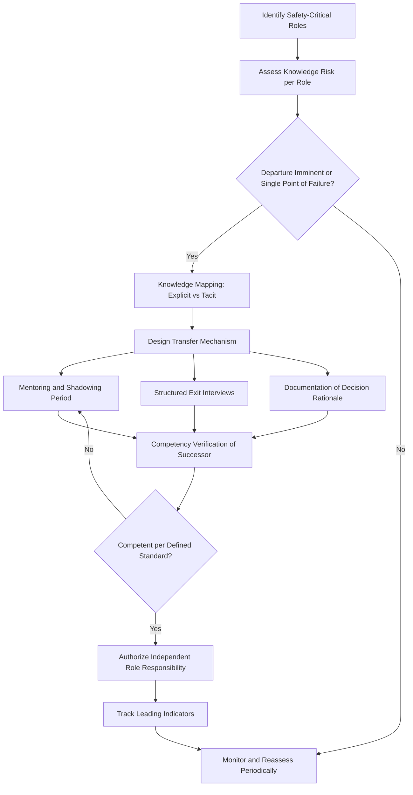

## Succession Planning and Institutional Knowledge Loss

### Definition and Scope

Succession planning in the Process Safety Management (PSM) context refers to the structured, proactive process of identifying, developing, and transitioning personnel who hold safety-critical knowledge, skills, and authority so that process safety performance does not degrade when individuals retire, resign, are promoted, or are otherwise unavailable. Institutional knowledge loss is the erosion of tacit, undocumented, or poorly transferred operational understanding — the "why" behind procedures, the history of near-misses, the rationale for design margins, and the informal relationships that enable rapid incident response — that accumulates in long-tenured personnel and disappears when they leave without adequate transfer mechanisms.

This topic sits at the intersection of human factors engineering, knowledge management, organizational change management, and the PSM elements of Process Safety Competency, Training, and Management of Change (MOC). It is not addressed as a standalone element in OSHA 1910.119 or the equivalent Seveso III / EU regulations, but its neglect is a recognized root cause contributor in major incident investigations (e.g., CSB findings on Texas City and other events cite loss of experienced personnel as a contributing organizational factor).

### Why This Matters in Process Safety

**Key Points**

- Process safety relies heavily on tacit knowledge: operators and engineers who have lived through startups, upsets, and near-misses develop pattern recognition that is rarely fully captured in written procedures.
- Demographic trends in mature process industries (oil and gas, chemicals, refining) show a disproportionate share of highly experienced personnel approaching retirement simultaneously ("the great crew change"), compressing the risk window.
- Knowledge loss manifests as: degraded hazard recognition, slower abnormal-situation response, erosion of "why" behind safeguards (leading to unauthorized changes or safeguard defeat), and loss of historical incident memory that previously deterred repeat events.
- The Center for Chemical Process Safety (CCPS) identifies workforce competency and organizational knowledge as foundational to sustaining process safety culture, explicitly linking it to the "Process Safety Competency" pillar in its Risk Based Process Safety (RBPS) framework.
- Succession failures are a latent (organizational) cause category in incident causation models (e.g., Reason's Swiss Cheese Model, Bowtie analysis) — they weaken barriers without being the immediate trigger.

### Types of Knowledge at Risk

#### Explicit Knowledge

Documented, codified information: P&IDs, operating procedures, PHA/HAZOP reports, MOC records, design basis documents, safe operating limits. This is at lower risk of total loss but can become orphaned — technically present but practically inaccessible because no one remaining understands its context or can interpret ambiguous entries.

#### Tacit Knowledge

Undocumented, experience-based understanding: how a particular compressor "sounds" before a trip, which alarms are historically nuisance versus genuinely predictive, informal workarounds for known equipment quirks, and interpersonal knowledge of who to call for what. Tacit knowledge is the highest-risk category because it typically resides in a small number of individuals and has no natural repository.

#### Cultural/Historical Knowledge

Organizational memory of past incidents, near-misses, and the reasoning behind current safeguards ("why do we do it this way" / "what happened the last time we didn't"). Loss of this knowledge is strongly associated with **practical drift** — the gradual, unauthorized divergence of actual practice from documented procedure — because the deterrent effect of institutional memory fades.

### Root Causes of Institutional Knowledge Loss

- **Workforce demographics**: retirement waves concentrated in a narrow time window, common in industries that hired heavily during a single historical expansion period.
- **High turnover**: contract labor dependence, competitive labor markets, and economic downsizing cycles that shed experienced staff disproportionately (early retirement/voluntary separation packages often target senior, higher-cost employees).
- **Inadequate knowledge transfer time**: overlap periods between outgoing and incoming personnel are frequently compressed or eliminated for cost reasons.
- **Poor documentation culture**: reliance on verbal tradition, "the way we've always done it," and undocumented workarounds.
- **Organizational restructuring/M&A**: mergers, site closures, and reorganizations that scatter teams and sever informal knowledge networks.
- **Failure to capture PHA/incident rationale**: HAZOP worksheets and incident investigation reports that record *what* was decided without recording *why*, leaving future reviewers unable to evaluate whether original assumptions still hold.
- **Lack of structured mentoring**: absence of formal pairing between experienced and junior personnel, especially for safety-critical roles (e.g., process safety engineers, unit operating authorities).

### Regulatory and Standards Context

**[Inference]** No jurisdiction currently mandates "succession planning" as an explicit PSM element by that name; however, several frameworks impose obligations that functionally require it:

- **OSHA 1910.119(g) — Training**: requires employers to ensure employees understand and adhere to current operating procedures, which implicitly requires a mechanism to transfer that understanding as personnel change.
- **OSHA 1910.119(j) — Mechanical Integrity**: requires that maintenance personnel be trained, which is vulnerable to knowledge loss if training relies on a single retiring expert.
- **CCPS RBPS — Process Safety Competency pillar**: explicitly addresses organizational knowledge as a management system requirement, including capturing and sustaining process safety knowledge across personnel changes.
- **Seveso III Directive (EU) and COMAH (UK)**: require demonstration of a competent organization within the Safety Report/Safety Case, which regulators increasingly interpret to include continuity of competency, not just point-in-time training records.
- **API RP 754** (process safety performance indicators): while focused on metrics, sustained performance tracking depends on continuity of the personnel who understand indicator context.

### CCPS Framework for Managing Knowledge Continuity

CCPS's Risk Based Process Safety guidance frames workforce/knowledge continuity through several practical mechanisms:

1. **Competency assurance systems**: defined competency profiles per safety-critical role, with periodic assessment independent of tenure.
2. **Knowledge capture programs**: structured interviews, "brain drain" documentation projects, and video/audio capture of retiring experts explaining rationale, not just procedure steps.
3. **Mentoring and shadowing programs**: formal overlap periods pairing outgoing experts with successors, with defined competency sign-off criteria before full independent authority is granted.
4. **Critical role identification**: a formal risk assessment of which positions carry disproportionate process safety knowledge risk (single point of failure roles).

### Practical Succession Planning Process

#### Step 1: Critical Role and Knowledge Risk Assessment

Identify positions where knowledge concentration creates process safety risk. Typical criteria:

- Sole subject-matter expert on a hazardous process or legacy system
- Authority to approve safety-critical MOCs, PSSR sign-offs, or PHA facilitation
- Long tenure combined with limited documentation of decision rationale
- Upcoming retirement eligibility (commonly flagged at 1–3 years out)

#### Step 2: Knowledge Mapping

Document what each critical role actually knows, distinguishing explicit (findable in documents) from tacit (exists only in the person's head). Techniques include structured knowledge-elicitation interviews, "day in the life" shadowing logs, and decision-log reconstruction from historical MOC and incident records.

#### Step 3: Transfer Mechanism Design

- Formal mentoring/apprenticeship periods with explicit competency milestones
- Cross-training and job rotation before departure is imminent, not after
- Structured "exit knowledge capture" interviews for departing personnel, focused on rationale ("why") rather than restating procedures
- Communities of practice / technical forums that distribute knowledge across multiple people rather than concentrating it

#### Step 4: Competency Verification

Successors should be assessed against defined competency standards (not simply "time served") before assuming independent safety-critical authority — consistent with CCPS competency assurance principles and typical operator authorization/verification (OAV) programs used in high-hazard industries.

#### Step 5: Continuous Monitoring

Track leading indicators such as: percentage of safety-critical roles with an identified and in-training successor, average knowledge-transfer overlap duration, and time-to-competency for new personnel in critical roles.

### Illustrative Process Flow

### Relationship to Practical Drift and Normalization of Deviance

**[Inference]** A well-documented organizational pattern is that succession gaps accelerate **practical drift** (Vaughan, 1996 — *The Challenger Launch Decision*) because incoming personnel lack the historical context to recognize when current practice has silently diverged from the original safety basis. Without institutional memory of *why* a safeguard exists, successors are more likely to treat a deviation as normal rather than as an anomaly requiring investigation. This connects succession planning directly to MOC rigor: robust MOC documentation (capturing rationale, not just the change itself) partially mitigates this risk by giving future personnel an auditable trail independent of any one individual's memory.

### Knowledge Continuity vs. Traditional Succession Planning — Comparison

| Dimension | Traditional Succession Planning (General Management) | PSM-Focused Knowledge Continuity |
| --- | --- | --- |
| Primary goal | Leadership pipeline, career development | Preservation of safety-critical competency and hazard awareness |
| Failure consequence | Business disruption, reduced efficiency | Potential loss of barrier integrity, increased incident likelihood |
| Key artifact | Talent review, org chart bench strength | Competency matrix, knowledge maps, PHA/MOC rationale records |
| Timing driver | Career progression, promotion cycles | Retirement waves, turnover, single-point-of-failure roles |
| Verification method | Performance reviews | Formal competency assessment/authorization (e.g., OAV) |

### Barriers and Common Pitfalls

- **Treating documentation as sufficient**: procedures alone do not transfer the tacit judgment behind abnormal-situation response.
- **Compressed handover windows**: cost pressure often reduces or eliminates overlap periods, undermining transfer quality.
- **No formal identification of critical knowledge holders**: risk is invisible until the person has already left.
- **Overreliance on contractors**: outsourcing operational or engineering roles can accelerate tacit knowledge loss because contractors typically have shorter tenure and weaker incentive to build lasting institutional memory.
- **Siloed knowledge**: knowledge concentrated in one person rather than distributed across a team, creating brittle single points of failure.

### Metrics and Leading Indicators

- Percentage of identified critical roles with a documented, in-progress successor
- Average knowledge-transfer/overlap duration (days/weeks) prior to departure
- Ratio of tacit-to-explicit knowledge captured per critical role (assessed qualitatively via audit)
- Time-to-independent-competency for new personnel in safety-critical roles
- Age/tenure distribution of personnel holding safety-critical authorizations (workforce risk profiling)

### Example Scenario

A refinery's sole process safety engineer with 30 years of tenure, who personally facilitated every HAZOP revalidation and held informal knowledge of every relief system's design basis quirks, announces retirement with only a two-month notice period. Because no knowledge-risk assessment had flagged this role, no successor had been cross-trained, and HAZOP worksheets recorded conclusions but not underlying assumptions. The replacement engineer, hired externally, cannot readily reconstruct why certain relief valve set points deviate from a straightforward calculation, increasing the risk of an inappropriate future MOC approval that inadvertently removes a safety margin whose rationale was never documented. **[Inference]** This type of scenario is a recurring theme in CSB investigation narratives discussing organizational and human factors contributors, though specific causal attribution varies by incident.

### Next Steps

- **Related Topics**: Process Safety Competency Frameworks (CCPS RBPS); Management of Change (MOC) Documentation Rigor; Operator Authorization and Verification (OAV) Systems; Mentoring and Shadowing Program Design; Workforce Demographics and the "Great Crew Change"; Practical Drift and Normalization of Deviance; Incident Investigation Knowledge Capture; Contractor Management and Knowledge Retention; Process Safety Culture Assessment; Human Factors Engineering in PSM.