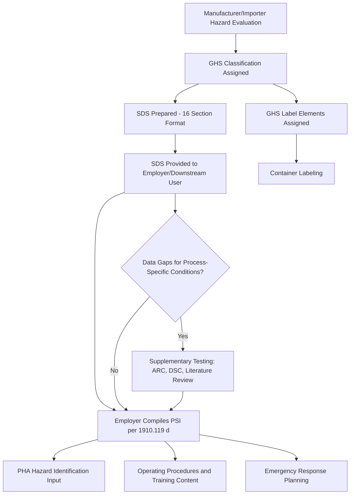

## Chemical Hazard Data and Safety Data Sheets

### Definition and Regulatory Basis

Chemical hazard data encompasses the physical, chemical, toxicological, and reactivity properties of substances handled in a process, compiled to support hazard identification, engineering design, and emergency response. The Safety Data Sheet (SDS) — formerly Material Safety Data Sheet (MSDS) in pre-2012 US terminology — is the standardized document format through which manufacturers and importers communicate this hazard information to downstream users.

In the US, SDS requirements are governed by **OSHA's Hazard Communication Standard (HCS), 29 CFR 1910.1200**, which was aligned with the **UN Globally Harmonized System of Classification and Labelling of Chemicals (GHS)** in the 2012 update. Internationally, GHS implementation varies by jurisdiction (EU CLP Regulation, Health Canada's Hazardous Products Regulation, etc.), but the 16-section SDS format is now broadly harmonized across major regulatory regimes.

Within PSM specifically, chemical hazard data is a required component of **Process Safety Information (PSI)** under **OSHA 1910.119(d)(1)**, which explicitly requires employers to compile written information on the hazards of highly hazardous chemicals (HHCs) used or produced by the process.

### Role Within Process Safety Information (PSI)

**Key Points**

- OSHA 1910.119(d)(1)(i) requires PSI to include, at minimum: toxicity, permissible exposure limits, physical data, reactivity data, corrosivity data, thermal and chemical stability data, and hazardous effects of inadvertent mixing of different materials.
- SDSs are typically the primary source document employers use to satisfy this requirement, but OSHA does not consider a manufacturer's SDS alone to be automatically sufficient — employers retain responsibility for compiling complete and accurate PSI, supplementing SDS data with process-specific information where gaps exist.
- PSI hazard data feeds directly into Process Hazard Analysis (PHA), operating procedures, training content, and emergency response planning — it is upstream of nearly every other PSM element.
- Employers covered by 1910.119 must ensure PSI is complete and current before conducting a PHA, per the standard's sequencing logic (accurate PSI is a prerequisite for a valid hazard analysis).

### SDS Structure — GHS 16-Section Format

| Section | Content |
| --- | --- |
| 1 | Identification (product identifier, manufacturer, emergency contact) |
| 2 | Hazard(s) identification (GHS classification, signal word, pictograms, hazard statements) |
| 3 | Composition/information on ingredients |
| 4 | First-aid measures |
| 5 | Fire-fighting measures |
| 6 | Accidental release measures |
| 7 | Handling and storage |
| 8 | Exposure controls/personal protection |
| 9 | Physical and chemical properties |
| 10 | Stability and reactivity |
| 11 | Toxicological information |
| 12 | Ecological information |
| 13 | Disposal considerations |
| 14 | Transport information |
| 15 | Regulatory information |
| 16 | Other information (revision date, disclaimers) |

**[Unverified]** Sections 12–15 are not mandatory under OSHA HCS (they fall under other agencies' jurisdiction — EPA, DOT) but are required for full GHS/international compliance and are customarily included by manufacturers regardless.

### Critical Sections for Process Safety Engineering

#### Section 2 — Hazard Identification

Provides the GHS hazard classification (e.g., Flammable Liquid Category 2, Acute Toxicity Category 3), signal word (Danger/Warning), pictograms, and hazard statements (H-codes, e.g., H225 "Highly flammable liquid and vapor"). This is the primary input for initial hazard categorization in a PHA and for determining whether a chemical qualifies as a "highly hazardous chemical" under 1910.119 Appendix A (threshold quantity list).

#### Section 9 — Physical and Chemical Properties

Supplies flash point, boiling point, vapor pressure, autoignition temperature, flammable/explosive limits (LEL/UEL), specific gravity, and solubility — data directly used for:

- Classifying flammable/combustible liquids (NFPA 30, API 2000)
- Vapor cloud dispersion modeling
- Electrical area classification (NFPA 70, Class I Division 1/2)
- Relief system sizing inputs (in conjunction with Section 10 reactivity data)

#### Section 10 — Stability and Reactivity

Documents reactivity hazards, conditions to avoid, incompatible materials, and hazardous decomposition products. This section is essential for:

- Reactive chemical hazard screening (per CSB recommendations following incidents such as the 2008 Bayer CropScience and earlier T2 Laboratories events, which highlighted reactive hazard gaps in PSM programs)
- MOC evaluation of new material introductions or storage co-location changes
- Segregation requirements in storage and warehousing

#### Section 11 — Toxicological Information

Provides acute and chronic toxicity data, exposure routes, and target organ effects, feeding into:

- Permissible Exposure Limit (PEL) / Threshold Limit Value (TLV) comparisons for industrial hygiene monitoring
- Consequence modeling for toxic release scenarios (e.g., AEGL, ERPG, IDLH thresholds)
- PPE selection (Section 8 cross-reference)

### Limitations of SDS Data for PSM Purposes

**[Inference]** SDSs are designed primarily for hazard communication to workers handling a chemical in its as-supplied form, not for detailed process engineering. Common gaps process safety practitioners must address include:

- **Mixture and process-condition data**: SDSs describe the pure or as-supplied substance; they typically do not address hazards arising from process-specific mixtures, elevated temperatures/pressures, or contaminant interactions unique to the facility.
- **Reactive hazard screening depth**: many SDSs provide only qualitative reactivity statements ("avoid contact with oxidizers") without quantitative data (e.g., onset temperature, heat of reaction) needed for calorimetry-informed relief system design.
- **Runaway reaction kinetics**: rarely present on standard SDSs; typically requires supplementary testing (e.g., Accelerating Rate Calorimetry (ARC), Differential Scanning Calorimetry (DSC)) commissioned separately by the process safety or R&D function.
- **Variability across manufacturers**: SDSs for the same nominal chemical can differ in format quality, classification conservatism, and completeness between suppliers, requiring employer due diligence rather than blind acceptance.
- **Update lag**: SDS revisions may lag behind updated toxicological or regulatory findings; employers are responsible for maintaining currency independent of supplier update cycles.

### Supplementing SDS Data — Additional PSI Sources

- **NIOSH Pocket Guide to Chemical Hazards** — exposure limits, IDLH values
- **AIChE/CCPS DIPPR database** — physical property data for process design
- **NFPA 704 hazard diamond ratings** — quick-reference health/flammability/reactivity/special hazard ratings
- **Reactive chemical testing** (ARC, DSC, VSP2) — for runaway reaction and thermal stability characterization beyond SDS scope
- **Peer-reviewed literature and CHEMTREC/emergency response databases** — supplementary toxicological and emergency response data
- **Company-specific incident/near-miss history** — captures hazards observed in actual process conditions not reflected in generic supplier data

### SDS Management System Requirements

#### Accessibility (OSHA 1910.1200(g)(8))

SDSs must be readily accessible to employees during each work shift, without barriers such as locked cabinets requiring supervisor access. Electronic SDS management systems are permitted provided reliable access is maintained (including during power/network outages, which is a common audit finding).

#### Currency and Update Management

Employers must maintain a system to ensure SDSs reflect the most current manufacturer revision. Best practice includes:

- Periodic reconciliation of the chemical inventory against the SDS library (commonly annual, more frequent for high-hazard chemicals)
- Vendor notification tracking for reformulations or reclassifications
- Version control with revision date tracking (SDS Section 16)

#### Integration with Process Safety Information

Best-practice PSM programs link the SDS library directly to the PSI documentation package, the chemical inventory (for Tier II/EPCRA reporting), and the PHA hazard evaluation records, ensuring a single source of truth for hazard classification used consistently across compliance obligations.

### GHS Classification and Labeling Workflow

### Reactive Hazard Screening — Illustrative Diagram

The relationship between SDS reactivity data and formal reactive chemical hazard evaluation:

<svg xmlns="http://www.w3.org/2000/svg" viewBox="0 0 700 320">
<text x="350" y="25" text-anchor="middle" font-size="15" font-weight="bold" fill="#1a1a1a">Reactive Hazard Data Pathway (svg_diagram)</text>
<rect x="20" y="60" width="180" height="60" rx="6" fill="#dbeafe" stroke="#2563eb" stroke-width="1.5" />
<text x="110" y="85" text-anchor="middle" font-size="12" fill="#1e3a8a">SDS Section 10</text>
<text x="110" y="102" text-anchor="middle" font-size="11" fill="#1e3a8a">Qualitative Reactivity</text>
<rect x="260" y="60" width="180" height="60" rx="6" fill="#fef3c7" stroke="#d97706" stroke-width="1.5" />
<text x="350" y="85" text-anchor="middle" font-size="12" fill="#78350f">Screening Assessment</text>
<text x="350" y="102" text-anchor="middle" font-size="11" fill="#78350f">Literature + Chemistry Review</text>
<rect x="500" y="60" width="180" height="60" rx="6" fill="#fee2e2" stroke="#dc2626" stroke-width="1.5" />
<text x="590" y="85" text-anchor="middle" font-size="12" fill="#7f1d1d">Quantitative Testing</text>
<text x="590" y="102" text-anchor="middle" font-size="11" fill="#7f1d1d">ARC / DSC / VSP2</text>
<line x1="200" y1="90" x2="260" y2="90" stroke="#4b5563" stroke-width="2" marker-end="url(#arrow1)" />
<line x1="440" y1="90" x2="500" y2="90" stroke="#4b5563" stroke-width="2" marker-end="url(#arrow1)" />
<rect x="260" y="180" width="180" height="60" rx="6" fill="#dcfce7" stroke="#16a34a" stroke-width="1.5" />
<text x="350" y="205" text-anchor="middle" font-size="12" fill="#14532b">Relief System Design</text>
<text x="350" y="222" text-anchor="middle" font-size="11" fill="#14532b">DIERS Methodology</text>
<line x1="590" y1="120" x2="350" y2="180" stroke="#4b5563" stroke-width="2" marker-end="url(#arrow1)" />
<rect x="500" y="180" width="180" height="60" rx="6" fill="#dcfce7" stroke="#16a34a" stroke-width="1.5" />
<text x="590" y="205" text-anchor="middle" font-size="12" fill="#14532b">PHA / Bowtie Barriers</text>
<text x="590" y="222" text-anchor="middle" font-size="11" fill="#14532b">Safeguard Identification</text>
<line x1="590" y1="120" x2="590" y2="180" stroke="#4b5563" stroke-width="2" marker-end="url(#arrow1)" />
</svg>

### Example: Applying SDS Data to a PHA

A HAZOP team evaluating a reactor charging step for acrylonitrile references the SDS to confirm: flash point (0°C, Section 9) drives electrical classification requirements; the H-codes in Section 2 flag acute toxicity and specific target organ toxicity, informing the consequence severity ranking for a leak scenario; and Section 10 notes polymerization hazard under heat/light/absence of inhibitor, which the team uses to verify that inhibitor monitoring and temperature control are correctly identified as safeguards in the node's cause-consequence analysis. Where the SDS states polymerization hazard only qualitatively, the team flags a follow-up action to obtain the manufacturer's stabilizer depletion data or commission DSC testing to quantify onset conditions — an example of using the SDS as a starting point rather than a complete hazard dataset.

### Common Audit and Compliance Findings

- SDS library not current with latest manufacturer revisions
- SDSs missing for on-site intermediates or process-generated byproducts not covered by a purchased-chemical SDS
- PSI package relying solely on SDS without supplementing process-specific reactive/thermal hazard data
- Electronic SDS access systems lacking a verified backup/offline access method
- Inconsistent GHS classification between multiple suppliers of nominally identical chemicals, without employer reconciliation

### Next Steps

- **Related Topics**: Process Safety Information (PSI) Compilation Requirements; Reactive Chemical Hazard Screening and Testing (ARC/DSC/VSP2); GHS Classification and Labeling; Chemical Inventory Management and EPCRA/Tier II Reporting; Process Hazard Analysis (PHA) Methodologies; Relief System Design (DIERS Methodology); Industrial Hygiene Exposure Limits (PEL/TLV/IDLH); Management of Change for New Chemical Introduction; Emergency Response Planning and CHEMTREC Integration.