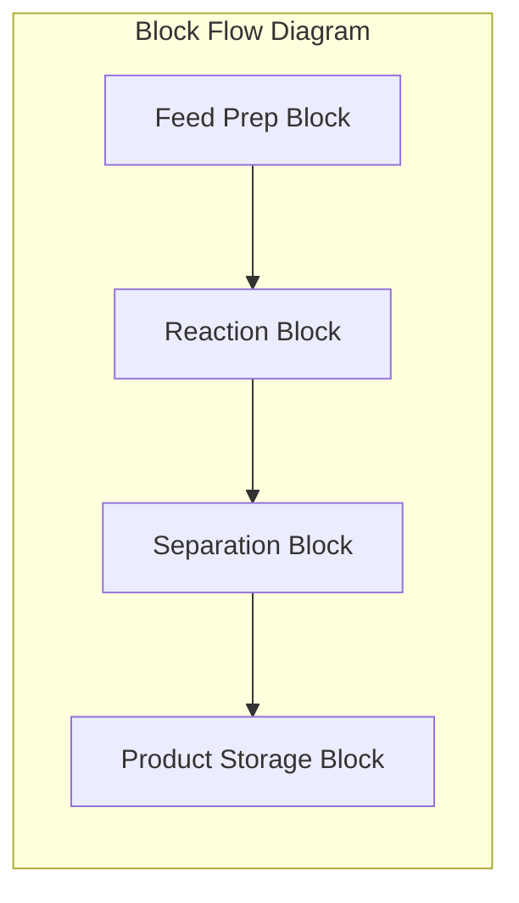
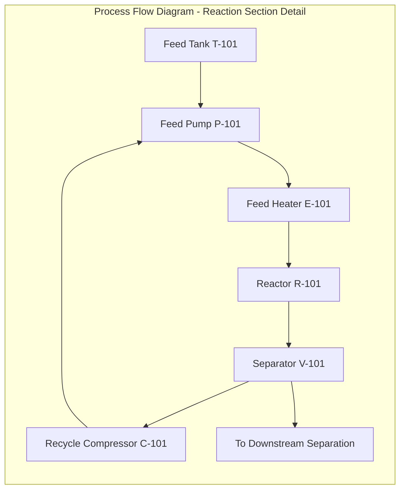
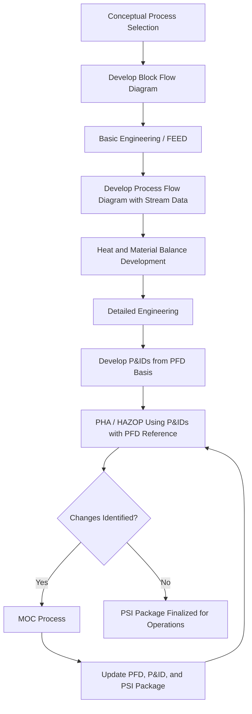

## Block Flow Diagrams and Process Flow Diagrams

### Definition and Regulatory Basis

Block Flow Diagrams (BFDs) and Process Flow Diagrams (PFDs) are graphical representations of a chemical process that document the sequence of major processing steps, equipment, and material flows at progressively increasing levels of detail. Within Process Safety Management, both are explicitly required components of **Process Safety Information (PSI)** under **OSHA 1910.119(d)(2)**, which mandates documentation of information pertaining to the technology of the process, including (at minimum) block flow diagrams or simplified process flow diagrams.

These diagrams form the foundational visual reference from which more detailed engineering documents — notably Piping and Instrumentation Diagrams (P&IDs) — are developed, and they serve as the primary orientation tool during Process Hazard Analysis (PHA) scoping and node definition.

### Hierarchy of Process Diagrams

Process diagrams exist on a spectrum of increasing detail, each serving distinct purposes in process safety documentation:

| Diagram Type | Detail Level | Primary Use |
| --- | --- | --- |
| Block Flow Diagram (BFD) | Lowest — major process areas as blocks | Conceptual overview, PHA scoping, training orientation |
| Process Flow Diagram (PFD) | Intermediate — major equipment, flow lines, key stream data | Process design basis, mass/energy balance reference |
| Piping and Instrumentation Diagram (P&ID) | Highest — all piping, instrumentation, valves, control loops | Detailed engineering, HAZOP node analysis, construction/operations reference |

**[Inference]** This hierarchy generally reflects the sequence in which documents are developed during a project lifecycle (BFD during conceptual/feasibility stage, PFD during basic engineering/FEED, P&ID during detailed design), though document evolution and update cycles vary by company practice and project execution model.

### Block Flow Diagrams (BFDs)

#### Purpose and Content

A BFD represents each major processing step or unit operation as a simple labeled block, connected by directional lines indicating material flow, without equipment detail, instrumentation, or piping specifics. BFDs are used to:

- Provide an at-a-glance overview of overall process technology and configuration
- Orient new personnel, auditors, or regulators unfamiliar with the facility
- Define battery limits and major process sections for PHA scoping
- Support conceptual/feasibility-stage engineering and licensor technology comparisons

#### Typical Elements

- Rectangular blocks representing unit operations (e.g., "Reaction," "Distillation," "Product Storage")
- Directional arrows showing primary material flow paths
- Major raw material inputs and product/byproduct outputs
- Recycle streams shown at a conceptual level
- Minimal or no quantitative data (though overall mass balance summaries are sometimes included at the block level)

### Process Flow Diagrams (PFDs)

#### Purpose and Content

A PFD provides a more detailed representation showing major equipment items (with tag numbers), primary process flow lines, and key stream data, but generally omits minor piping, all instrumentation, and utility systems (which are typically covered in separate utility flow diagrams). PFDs are the standard reference for:

- Documenting the process design basis and mass/energy balance
- Serving as the design authority against which P&IDs are checked for consistency
- Providing the "why" behind a P&ID's configuration during PHA discussions

#### Typical Elements per PSI/Engineering Practice

- Major equipment (vessels, columns, reactors, heat exchangers, major pumps/compressors) with equipment tag numbers
- Primary process flow lines with directional arrows
- **Stream data tables** (commonly positioned below the drawing) listing, per stream: temperature, pressure, flow rate, composition, phase
- Major control philosophy indicated conceptually (without full instrumentation detail — e.g., a level control loop may be shown schematically without valve types or setpoints)
- Heat and material balance summary, often cross-referenced to a separate Heat & Material Balance (H&MB) document

### Comparison of BFD and PFD Content

### Role in Process Hazard Analysis (PHA)

**Key Points**

- PFDs (or P&IDs, depending on facility documentation maturity) are used to establish **node boundaries** for HAZOP/What-If studies — the PFD's major equipment groupings often inform the initial node breakdown before P&ID-level detail refines it further.
- Stream data on the PFD (temperatures, pressures, flow rates) provides the baseline "design intent" values against which HAZOP deviation guidewords (More/Less/No/Reverse/etc.) are evaluated.
- BFDs are frequently used at the start of a PHA kickoff meeting to orient the team to overall process technology before diving into P&ID-level node analysis.
- Discrepancies discovered between the PFD design basis and the as-built P&ID during a PHA are a common finding requiring Management of Change (MOC) reconciliation or PSI update action items.

### Document Control and Currency Requirements

Per OSHA 1910.119(d), PSI documents including BFDs/PFDs must be kept current, which in practice requires:

- Formal linkage to the **Management of Change (MOC)** process — any physical or process change affecting flow paths, equipment, or design conditions must trigger review and update of affected diagrams
- Periodic reconciliation against as-built conditions (commonly performed as part of PSI/PHA revalidation cycles, typically every 5 years under 1910.119(e)(6), though interim updates should occur continuously as changes are approved)
- Revision control blocks (drawing number, revision letter/number, date, approval signatures) consistent with the facility's engineering document control system
- Distinction between "design basis" PFDs (representing original or revamped design intent) and any as-operated deviations, which should be reconciled rather than allowed to silently diverge

### Common Compliance and Quality Gaps

- **Outdated diagrams**: PFDs not updated following MOCs, creating a mismatch between documented PSI and actual process configuration — a frequent PSM audit and CSB investigation finding.
- **Missing stream data**: PFDs lacking complete temperature/pressure/composition data, limiting their usability for consequence modeling or relief system verification.
- **BFD/PFD absent entirely for legacy or debottlenecked units**: older facilities sometimes lack a formal BFD or maintain only fragmented PFDs, requiring reconstruction efforts during PSI compilation.
- **Inconsistency with P&IDs**: recycle streams, bypass lines, or alternate operating modes shown on the PFD but not reflected consistently on the P&ID (or vice versa), creating ambiguity during hazard evaluation.
- **Lack of revision traceability**: no clear linkage between MOC records and the specific diagram revision that incorporated the approved change.

### Illustrative Example — Stream Data Table Format

A typical PFD stream data table accompanying the diagram:

| Stream No. | Description | Temp (°C) | Pressure (barg) | Flow (kg/h) | Phase |
| --- | --- | --- | --- | --- | --- |
| 1 | Fresh Feed | 25 | 2.0 | 5,000 | Liquid |
| 2 | Reactor Feed (post-heater) | 180 | 3.5 | 8,200 | Liquid |
| 3 | Reactor Effluent | 220 | 3.2 | 8,200 | Vapor/Liquid |
| 4 | Recycle to Feed | 45 | 3.0 | 3,200 | Liquid |
| 5 | Product to Storage | 40 | 1.5 | 4,950 | Liquid |

This stream data enables a HAZOP team to immediately reference design conditions when discussing deviation scenarios (e.g., "Stream 2: More Temperature" — evaluating heater control failure consequences against the 180°C design basis).

### Practical Development Workflow

### Next Steps

- **Related Topics**: Piping and Instrumentation Diagrams (P&ID) Development and Symbology; Heat and Material Balance Documentation; Process Hazard Analysis Node Definition; Management of Change (MOC) Documentation Requirements; Process Safety Information (PSI) Compilation and Currency; HAZOP Guideword Methodology; Relief System Design Basis Documentation; As-Built Drawing Reconciliation and Document Control Systems.