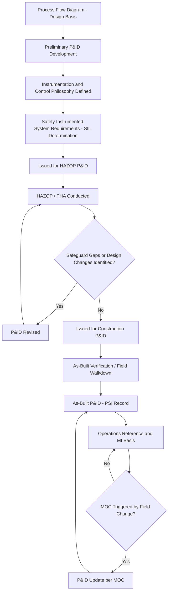

## Piping and Instrumentation Diagrams

### Definition and Regulatory Basis

A Piping and Instrumentation Diagram (P&ID) is the most detailed schematic representation of a process, depicting all piping, equipment, instrumentation, control loops, valves, and interconnections necessary to operate, maintain, and analyze the process. P&IDs are the primary technical reference document used throughout the operating life of a facility and are the standard basis for node definition in Process Hazard Analysis.

Within PSM, P&IDs are an explicit required element of **Process Safety Information (PSI)** under **OSHA 1910.119(d)(2)(i)(B)**, which requires that PSI include documentation of the technology of the process, including piping and instrumentation diagrams (P&IDs). ANSI/ISA-5.1 ("Instrumentation Symbols and Identification") is the primary US standard governing instrumentation symbology and tag numbering conventions used on P&IDs; ISO 10628 provides the equivalent international framework for process diagram conventions.

### Purpose and Function

**Key Points**

- P&IDs are the single most-referenced document during Process Hazard Analysis (HAZOP, What-If, LOPA), serving as the basis for node definition and deviation analysis.
- They document every safeguard, interlock, relief device, and control loop relevant to hazard evaluation — making them indispensable for identifying independent protection layers (IPLs) in LOPA studies.
- P&IDs are the reference document for Mechanical Integrity (MI) programs, defining the piping classes, valve types, and instrumentation subject to inspection, testing, and preventive maintenance.
- They serve as the as-built record against which field verification (walkdowns) and Management of Change (MOC) updates are conducted.
- Operating and emergency procedures are typically written with direct reference to P&ID tag numbers (valve numbers, instrument tags), making P&ID accuracy essential to procedure validity.

### Standard Symbology (ANSI/ISA-5.1)

#### Instrument Identification System

ISA-5.1 tag numbering follows a functional identification structure:

$$\text{Tag} = \text{[Loop Letter(s)]} - \text{[Loop Number]}$$

The first letter designates the measured/initiating variable (e.g., T = Temperature, P = Pressure, F = Flow, L = Level, A = Analytical), and subsequent letters designate function (e.g., I = Indicator, C = Controller, T = Transmitter, V = Valve, S = Switch, R = Recorder). Example: `TIC-101` denotes Temperature Indicating Controller, loop 101; `PSV-205` denotes Pressure Safety Valve, loop 205.

#### Common Symbol Categories

- **Line symbols**: differentiate process piping, instrument signal lines (electronic, pneumatic, hydraulic), and connection types
- **Valve symbols**: gate, globe, ball, check, control, relief/safety valves — each with distinct standardized symbols indicating actuation type (manual, pneumatic, motor-operated, solenoid)
- **Instrument bubbles**: circles (field-mounted, discrete instrument), circles with a horizontal line (shared display/control, accessible to operator), squares with circles (PLC/DCS-based function)
- **Equipment symbols**: vessels, pumps, compressors, heat exchangers, drawn schematically but recognizably per equipment type

### Information Content Required for PSM Adequacy

A P&ID intended to satisfy PSI requirements and support a rigorous PHA should include:

- All major and minor process piping, with line numbers indicating size, material specification, and insulation/tracing where relevant
- All valves, including manual block valves, control valves, and relief/safety devices, each uniquely tagged
- All instrumentation: transmitters, indicators, controllers, switches, and their associated control loops
- Safety instrumented system (SIS) components, distinctly marked from basic process control system (BPCS) instrumentation
- Relief device set points and discharge routing (to atmosphere, flare, closed system)
- Equipment design parameters where relevant (e.g., vessel MAWP noted on or cross-referenced from the P&ID)
- Interlock and permissive logic references (often summarized in an accompanying cause-and-effect matrix rather than fully detailed on the P&ID itself)
- Utility tie-ins relevant to the process (nitrogen purge, steam, cooling water) where they affect process safety

### P&ID Development in the Engineering Lifecycle

### Role in HAZOP Node Definition

**Key Points**

- A "node" in HAZOP methodology is a discrete section of the P&ID (typically bounded by major equipment or significant process state changes) selected for deviation analysis.
- Node boundaries are drawn directly on the P&ID (often marked in colored highlighter during study preparation) to ensure the team systematically covers the entire process without gaps or redundant overlap.
- Design intent for each node (the "why" — expected temperature, pressure, flow, composition, phase) is derived from the P&ID in conjunction with the PFD stream data and written into the HAZOP worksheet before deviation analysis begins.
- Safeguards identified during HAZOP (relief valves, interlocks, alarms) are cross-verified against what is actually depicted on the P&ID — a common finding is that a "credited" safeguard exists in a procedure or the team's assumption but is not actually present or correctly configured on the current P&ID, indicating a document currency issue requiring resolution before the PHA can be finalized.

### P&ID Accuracy and Field Verification

**[Inference]** A P&ID's value as a safety document is contingent on it accurately representing as-built conditions; a P&ID that has drifted from field reality functions as a source of hazard rather than a hazard management tool, since decisions made in a PHA or MI program based on an inaccurate P&ID may fail to identify or correctly evaluate an actual field configuration.

Common practices to maintain accuracy include:

- **Field walkdowns/verification programs**: physical comparison of the P&ID against installed piping, valves, and instrumentation, typically performed on a defined cycle (commonly aligned with the PSI/PHA 5-year revalidation cycle, though higher-risk units may warrant more frequent verification)
- **Redline/markup procedures**: field personnel document observed discrepancies via redline markups, which are then formally incorporated through the document control/MOC process rather than left as informal field notes
- **MOC linkage**: every approved MOC affecting piping, equipment, or instrumentation must trigger a P&ID revision as part of MOC closeout — this linkage is one of the most frequently cited audit and incident investigation gaps when absent or incompletely executed

### Common P&ID Quality and Compliance Findings

- **Outstanding redlines not incorporated**: field-identified discrepancies remain as informal markups for extended periods rather than being formally revised into the controlled document
- **MOC-P&ID disconnect**: approved changes implemented in the field without a corresponding P&ID revision, leaving PSI out of sync with actual configuration
- **Inconsistent safeguard representation**: a safety-critical instrument or relief device shown on the P&ID no longer physically exists (or vice versa — installed but undocumented), discovered only during a PHA or incident investigation
- **Missing SIS/BPCS distinction**: safety instrumented functions not visually differentiated from basic control instrumentation, creating ambiguity about which loops are credited as independent protection layers in LOPA
- **Legacy units lacking complete P&IDs**: older facilities acquired through M&A or built before modern documentation standards may have incomplete or fragmented P&ID sets requiring reconstruction as part of PSI compilation

### Example Instrument Tag Interpretation

Consider a P&ID showing `LAH-304` and `LSH-304A`:

- `LAH-304`: Level Alarm High, loop 304 — a control-room-visible alarm alerting the operator that level has exceeded a defined threshold, functioning as a safeguard requiring human response (an IPL only if response is validated as sufficiently reliable and independent)
- `LSH-304A`: Level Switch High, loop 304, instrument "A" (a second, independent switch, distinguished by suffix) — typically wired to a shutdown or trip function, potentially credited as an automated Safety Instrumented Function (SIF) if it meets independence and SIL requirements

A LOPA team reviewing this node would use the P&ID to confirm whether these two instruments are genuinely independent (separate sensors, separate logic solvers, separate final elements) as required to credit them as distinct IPLs — a determination that requires the P&ID to accurately reflect actual wiring/logic architecture, not just a nominal tag distinction.

### Relationship to Other PSM Elements

| PSM Element | P&ID's Role |
| --- | --- |
| Process Hazard Analysis | Primary basis for node definition and deviation/safeguard analysis |
| Mechanical Integrity | Defines piping classes, valve types, and instrumentation subject to inspection |
| Operating Procedures | Referenced directly via valve/instrument tag numbers in step-by-step instructions |
| Management of Change | Trigger and record of required document updates following approved changes |
| Training | Used to orient operators to system configuration and safeguard locations |
| Incident Investigation | Reference for reconstructing sequence of events and evaluating safeguard performance |

### Next Steps

- **Related Topics**: ANSI/ISA-5.1 Instrumentation Symbology Standards; HAZOP Node Definition and Deviation Analysis; Safety Instrumented Systems and SIL Determination (IEC 61511); Layer of Protection Analysis (LOPA) and Independent Protection Layers; Mechanical Integrity Program Scope Definition; Management of Change Documentation Linkage; Field Verification and Redline Walkdown Programs; Process Flow Diagram to P&ID Development Continuity.