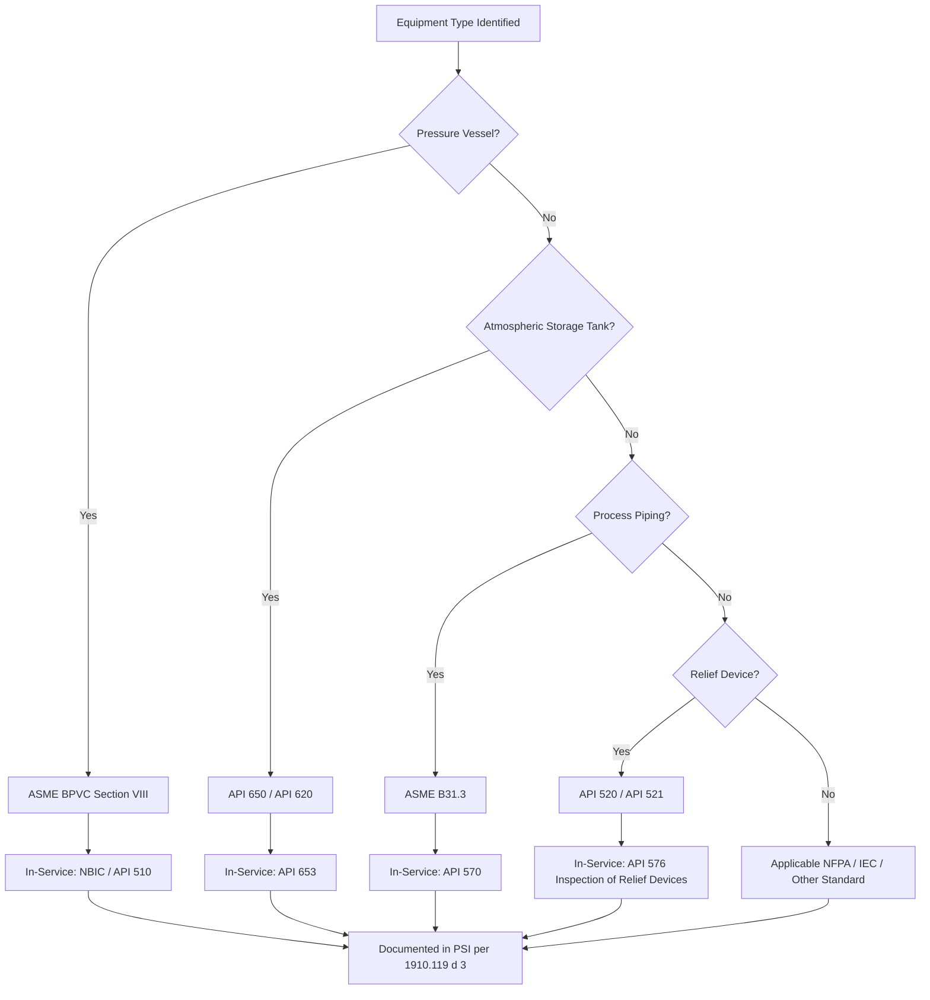

## Equipment Design Codes and Standards

### Definition and Regulatory Basis

Equipment design codes and standards are the consensus engineering documents that establish minimum requirements for the design, fabrication, inspection, testing, and certification of pressure vessels, piping, storage tanks, relief devices, and other process equipment. Within Process Safety Management, documentation of the codes and standards used in process equipment design is an explicit required element of **Process Safety Information (PSI)** under **OSHA 1910.119(d)(3)(ii)**, which requires employers to document that equipment complies with recognized and generally accepted good engineering practices (RAGAGEP).

For equipment designed and constructed before the applicability of consensus codes, or where the original code of construction is no longer in print or has been superseded, 1910.119(d)(3)(ii) requires the employer to determine and document that the equipment is designed, maintained, inspected, tested, and operating in a safe manner — establishing RAGAGEP as an ongoing, not merely historical, compliance obligation.

### RAGAGEP — Recognized and Generally Accepted Good Engineering Practice

**Key Points**

- RAGAGEP is not a single document but a category encompassing consensus codes (ASME, API, NFPA), internal engineering standards, and, where consensus codes do not exist, documented sound engineering judgment.
- OSHA's enforcement policy (per its 2016 memorandum on RAGAGEP) distinguishes between "internal" and "external" RAGAGEP — external RAGAGEP being widely recognized codes (e.g., ASME BPVC), and internal RAGAGEP being an employer's own engineering standards, which must be technically justified and consistently applied.
- Equipment must be designed and maintained to the edition of the code in effect at the time of design/construction, or to a later edition if the employer elects to upgrade; OSHA does not generally require retroactive upgrade to the newest code edition, but does require that the equipment continue to meet the code basis under which it was built and any applicable in-service inspection code.
- **[Inference]** Where original design documentation is lost or the code of construction cannot be determined (common in legacy or acquired facilities), employers commonly rely on fitness-for-service assessment (e.g., API 579-1/ASME FFS-1) to establish current safe operating parameters as a substitute basis for RAGAGEP compliance.

### Major Applicable Codes and Standards by Equipment Category

#### Pressure Vessels

- **ASME Boiler and Pressure Vessel Code (BPVC), Section VIII** — Rules for Construction of Pressure Vessels (Divisions 1, 2, and 3, covering increasing design complexity and pressure ranges). This is the primary design/fabrication code for unfired pressure vessels in process facilities.
- **ASME BPVC Section II** — Materials specifications referenced by Section VIII
- **National Board Inspection Code (NBIC, ANSI/NB-23)** — governs in-service inspection, repair, and alteration of pressure vessels after initial construction

#### Piping Systems

- **ASME B31.3** — Process Piping, the primary code for piping design in chemical process facilities, covering material selection, wall thickness calculations, flexibility analysis, and testing requirements
- **ASME B31.1** — Power Piping (applicable where steam systems fall under this scope rather than B31.3)
- **API 570** — Piping Inspection Code, governing in-service inspection, repair, and alteration of process piping

#### Atmospheric and Low-Pressure Storage Tanks

- **API 650** — Welded Tanks for Oil Storage, the primary design/construction standard for large atmospheric storage tanks
- **API 620** — Design and Construction of Large, Welded, Low-Pressure Storage Tanks (for tanks operating above atmospheric but below typical pressure vessel thresholds)
- **API 653** — Tank Inspection, Repair, Alteration, and Reconstruction, governing in-service integrity management of API 650/620 tanks

#### Relief Devices

- **API 520 Parts I and II** — Sizing, Selection, and Installation of Pressure-Relieving Devices; and Installation
- **API 521** — Pressure-Relieving and Depressuring Systems, providing guidance on relief scenario identification and flare/disposal system design
- **ASME BPVC Section VIII, Appendix M/UG-125 through UG-137** — relief device requirements integral to vessel code compliance

#### Electrical and Instrumentation

- **NFPA 70 (National Electrical Code)** — general electrical installation requirements
- **NFPA 70E** — electrical safety in the workplace (arc flash and shock hazard)
- **IEC 60079 / NEC Article 500-506** — hazardous (classified) location electrical equipment requirements
- **IEC 61511 / ISA 84** — functional safety for Safety Instrumented Systems in the process industry sector

#### Fire Protection

- **NFPA 30** — Flammable and Combustible Liquids Code
- **NFPA 15** — Water Spray Fixed Systems for Fire Protection
- **API 2000** — Venting Atmospheric and Low-Pressure Storage Tanks (normal and emergency venting)

### Code Applicability Hierarchy

### Documentation Requirements for PSI Compliance

Per 1910.119(d)(3)(i)–(ii), the equipment-related PSI documentation must address:

1. Materials of construction
2. Piping and instrument diagrams (P&IDs)
3. Electrical classification
4. Relief system design and design basis
5. Ventilation system design
6. Design codes and standards employed
7. Material and energy balances (for processes built after May 26, 1992)
8. Safety systems (e.g., interlocks, detection/suppression systems)

**[Inference]** In practice, this documentation is typically compiled as a "code of construction" register or equipment design basis file, cross-referenced to the equipment list, P&IDs, and mechanical integrity inspection records, rather than as a single monolithic document — the specific organizational format is not prescribed by the standard itself.

### Design Code vs. Inspection Code — Distinguishing the Two Categories

| Category | Governs | Example |
| --- | --- | --- |
| Design/Construction Code | Original fabrication, material selection, pressure/temperature ratings, welding requirements | ASME BPVC Section VIII, API 650, ASME B31.3 |
| In-Service Inspection Code | Ongoing integrity management: inspection intervals, corrosion rate monitoring, repair/alteration rules | API 510 (pressure vessels), API 570 (piping), API 653 (tanks) |

This distinction matters because equipment remains subject to its original design/construction code basis indefinitely (absent a formal re-rating or alteration under the applicable in-service code), while inspection requirements evolve based on operating history, corrosion rates, and periodic code revisions — meaning an employer's RAGAGEP obligation is not static even when the design code itself is not retroactively applied.

### Handling Legacy Equipment and Undocumented Code Basis

**Key Points**

- Equipment predating the applicability of a current consensus code, or for which original design documentation has been lost (common following acquisitions, mergers, or extended operating histories), still requires a documented RAGAGEP determination under 1910.119(d)(3)(ii).
- Common remediation approaches include: fitness-for-service (FFS) assessment per **API 579-1/ASME FFS-1** to establish current safe operating limits independent of original documentation; engaging original equipment manufacturers (OEMs) or licensors for reconstructed design data where feasible; and applying conservative assumptions consistent with the most restrictive plausible original code edition when data cannot be recovered.
- **[Inference]** This scenario is a recurring theme in facilities with long operating histories or those acquired through M&A, and is frequently identified as a PSI compliance gap during compliance audits or third-party PSM assessments.

### Code Currency and the Management of Change Interface

When equipment is repaired, altered, or re-rated, the applicable in-service code (e.g., API 510, API 570, API 653) governs whether the change constitutes a "repair" (restoring to original condition, generally not requiring MOC) versus an "alteration" (a physical change affecting the pressure-containing capability, mechanical design, or material, which typically does require MOC review under 1910.119(l)). Equipment design basis documentation must be updated to reflect the current configuration following any alteration, maintaining consistency with the RAGAGEP documentation trail.

### Common Compliance and Audit Findings

- Equipment design basis documentation incomplete or unavailable for legacy assets, particularly following facility acquisition
- Ambiguity regarding whether an internal engineering standard used as RAGAGEP has adequate technical justification and consistent application, as expected under OSHA's internal RAGAGEP enforcement guidance
- Repairs/alterations performed without clear determination of applicable in-service code requirements, creating uncertainty about whether MOC was appropriately triggered
- Code editions referenced in PSI documentation not reconciled with the edition actually used for a given piece of equipment's original fabrication
- Relief device sizing basis not clearly traceable to the specific API 520/521 methodology and scenario set used, complicating later verification during PHA/LOPA revalidation

### Next Steps

- **Related Topics**: RAGAGEP Determination and OSHA Enforcement Policy; Fitness-for-Service Assessment (API 579-1/ASME FFS-1); Mechanical Integrity Inspection Codes (API 510/570/653); Relief System Design Basis (API 520/521); Management of Change for Equipment Repairs and Alterations; Hazardous Location Electrical Classification (NEC/IEC); Safety Instrumented System Standards (IEC 61511/ISA 84); Process Safety Information Compilation Requirements.