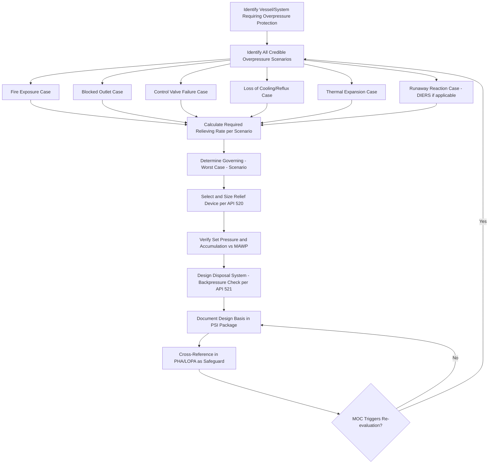

## Relief System Design Basis Documentation

### Definition and Regulatory Basis

Relief system design basis documentation is the compiled technical record establishing why a pressure relief device is sized and configured as it is — the governing overpressure scenario(s), the calculation methodology, the required relieving capacity, and the disposal path for the released material. Within PSM, this documentation is required as part of **Process Safety Information (PSI)** under **OSHA 1910.119(d)(3)(i)(D)**, which explicitly requires documentation of relief system design and design basis as part of the equipment-related PSI package.

Relief system documentation is also foundational to **Process Hazard Analysis (PHA)** — a HAZOP or LOPA team cannot properly evaluate whether a relief device is an adequate safeguard against a given overpressure scenario without understanding what scenario the device was originally sized for, since a relief valve adequate for one overpressure case may be inadequate for a different or newly identified scenario.

### Purpose Within the PSM Framework

**Key Points**

- Relief device sizing is scenario-specific: a Pressure Safety Valve (PSV) sized for external fire exposure may be significantly undersized for a blocked-outlet or control valve failure scenario on the same vessel, making the documented design basis essential to determining fitness for current conditions.
- Without documented design basis, a PHA/LOPA team cannot verify whether a relief device should be credited as an Independent Protection Layer (IPL) for a specific overpressure cause, since IPL credit requires confirmation that the device is actually sized for that specific initiating cause.
- Relief system design basis documentation is a frequent focus area in CSB investigations and OSHA PSM audits, because undersized or improperly configured relief systems are a recurring root/contributing cause in loss-of-containment incidents.
- The documentation must be maintained current through the **Management of Change (MOC)** process — any change to process conditions, equipment, or configuration that could affect the governing relief scenario or required capacity must trigger relief system re-evaluation.

### Governing Codes and Standards

- **API 520 Part I** — Sizing, Selection, and Installation of Pressure-Relieving Devices — governs relief valve sizing methodology for various scenario types
- **API 520 Part II** — Installation requirements for pressure-relieving devices
- **API 521** — Pressure-Relieving and Depressuring Systems — provides guidance on identifying credible overpressure scenarios and designing the downstream disposal system (flare, knockout drum, vent)
- **ASME BPVC Section VIII** — establishes the vessel's Maximum Allowable Working Pressure (MAWP), which is the reference basis against which relief device set pressure and accumulation limits are established
- **API 2000** — Venting Atmospheric and Low-Pressure Storage Tanks — governs normal and emergency venting for atmospheric/low-pressure tanks (distinct scope from ASME-code pressure vessels)
- **DIERS methodology** (Design Institute for Emergency Relief Systems, AIChE/CCPS) — specialized methodology for two-phase flow and runaway reaction relief scenarios not adequately addressed by standard single-phase API 520 sizing

### Core Elements of Relief Design Basis Documentation

#### 1. Governing Overpressure Scenario Identification

Documentation must identify the specific credible cause(s) of overpressure evaluated, commonly including:

- Fire exposure (external fire case, per API 521 methodology)
- Blocked outlet / closed outlet valve
- Control valve failure (fail-open on inlet, fail-closed on outlet)
- Loss of cooling or reflux (for distillation systems)
- Thermal expansion (blocked-in liquid-full lines/vessels)
- Runaway/exothermic reaction (requiring DIERS-based two-phase methodology where applicable)
- Utility failure (loss of instrument air, power, cooling water) with resulting cascading effects
- Tube rupture (heat exchanger high-pressure-to-low-pressure side failure)

#### 2. Governing (Worst-Case) Scenario Determination

Where multiple credible scenarios exist, the design basis documentation must identify which scenario governs (produces the highest required relieving rate) and record the basis for that determination — since the relief device must be sized for the worst credible single scenario, not an average or typical case.

#### 3. Required Relieving Rate Calculation

The quantitative basis for the required capacity, including the calculation methodology (per API 520/521 for conventional scenarios, or DIERS methodology for two-phase/reactive scenarios), key input assumptions (fire zone area for fire case, valve Cv for control valve failure case, etc.), and the resulting required mass/volumetric relieving rate.

#### 4. Device Selection and Sizing Verification

Documentation confirming the selected device (conventional spring-loaded PSV, balanced bellows PSV, pilot-operated relief valve, rupture disk, or combination) provides certified relieving capacity meeting or exceeding the required rate, including the manufacturer's certified capacity data and any derating factors applied.

#### 5. Set Pressure and Accumulation Basis

Documentation of the relief device set pressure relative to the vessel MAWP, and the accumulation percentage used (per ASME Section VIII allowable accumulation limits, which vary by scenario type — e.g., typically higher allowable accumulation for fire case than for single non-fire overpressure scenarios), consistent with code requirements.

#### 6. Disposal System Design Basis

Documentation of the downstream disposal path — direct atmospheric discharge, knockout drum, flare header — including backpressure calculations (built-up backpressure from the relief device's own discharge plus any superimposed backpressure from other simultaneously relieving devices in a shared header), since excessive backpressure can significantly derate a conventional relief valve's capacity.

### Relief Scenario Evaluation Logic

### Interface with LOPA and IPL Credit

**Key Points**

- In Layer of Protection Analysis, a relief device can only be credited as an Independent Protection Layer for a specific initiating cause if the documented design basis confirms the device is actually sized for that specific cause.
- **[Inference]** A relief valve sized only for the fire case, for example, generally cannot be credited as an adequate IPL against a control-valve-failure overpressure scenario unless the design basis documentation demonstrates the fire-case sizing also happens to bound the control-valve-failure required rate — this determination requires the documented calculation basis, not just the device's presence.
- Relief devices, while a critical safeguard, are typically the last layer of protection in a bowtie/LOPA framework (protecting against consequences after other prevention layers have failed) and their credited PFD (probability of failure on demand) in LOPA calculations depends on inspection/testing history per the Mechanical Integrity program, not solely on the design basis documentation.

### Management of Change Interface

Relief system design basis must be re-evaluated whenever a change could plausibly alter the governing scenario or required relieving rate. Common MOC triggers include:

- Changes to process operating pressure, temperature, or composition
- Changes to upstream/downstream equipment affecting blocked-outlet or control-valve-failure flow rates
- Addition or removal of equipment sharing a common relief header (affecting superimposed backpressure)
- Changes to fire zone configuration or insulation/fireproofing affecting fire case heat input assumptions
- Catalyst or chemistry changes affecting runaway reaction potential (requiring reassessment against DIERS methodology)

**[Inference]** Facilities with mature MOC-relief system linkage typically incorporate a relief system impact screening question directly into the MOC request form, prompting the requester to flag whether the proposed change could affect any existing relief device's design basis — this is a common best practice though not a universally standardized requirement.

### Common Compliance and Technical Gaps

- **Undocumented or lost original sizing calculations**: legacy equipment where the original relief sizing basis cannot be located, requiring re-derivation from current process conditions and applicable codes
- **Scenario set not revisited following process changes**: relief device remains physically unchanged while upstream/downstream conditions have shifted, potentially invalidating the original governing scenario determination
- **Reactive/runaway scenarios evaluated with conventional (single-phase) methodology**: use of standard API 520 vapor-only sizing for a system with credible two-phase or reactive relief requirements, understating required capacity — a recurring theme in CSB findings following runaway reaction relief failures
- **Backpressure not re-evaluated after header modifications**: addition of new relief devices tying into a shared flare header without reconfirming that built-up/superimposed backpressure remains within the original design basis for existing devices
- **PHA/LOPA teams crediting relief devices without verifying design basis alignment**: assuming a relief valve is adequate protection for a given cause without confirming via documentation that it was actually sized for that specific scenario

### Example: Design Basis Discrepancy Identified in PHA

During a PHA revalidation, a team evaluating a reactor's cooling water supply node proposes crediting the reactor's relief valve as an IPL against a loss-of-cooling-induced runaway scenario. Upon reviewing the relief system design basis documentation, the team discovers the PSV was originally sized only for the external fire case using conventional API 520 single-phase methodology, with no DIERS-based evaluation of two-phase relief requirements for a runaway scenario. This discrepancy is logged as a PHA action item requiring a dedicated reactive hazard/DIERS-based relief re-evaluation before the device can be credited as an IPL for that specific cause — illustrating how design basis documentation directly gates what safeguard credit is defensible in hazard analysis.

### Relief Device Documentation vs. Mechanical Integrity Records — Distinguishing the Two

| Aspect | Design Basis Documentation | Mechanical Integrity (MI) Records |
| --- | --- | --- |
| Focus | Why the device is sized/configured as it is | Confirming the device functions as designed over time |
| Governed by | API 520/521, ASME Section VIII | API 576 (inspection of relief devices), facility MI program |
| Key content | Scenario analysis, sizing calculations, set pressure basis | Test/inspection history, as-found/as-left set pressure, popping tests |
| PSM element | Process Safety Information (PSI) | Mechanical Integrity (MI) |
| Update trigger | MOC affecting process conditions or configuration | Scheduled inspection/test interval per MI program |

### Next Steps

- **Related Topics**: DIERS Methodology for Two-Phase and Reactive Relief Sizing; Layer of Protection Analysis (LOPA) and IPL Credit Criteria; Flare and Disposal System Design (API 521); Mechanical Integrity Inspection of Relief Devices (API 576); Management of Change Screening for Relief System Impact; Reactive Chemical Hazard Testing (ARC/DSC/VSP2); ASME Section VIII Accumulation and Overpressure Limits; Process Hazard Analysis Safeguard Verification.