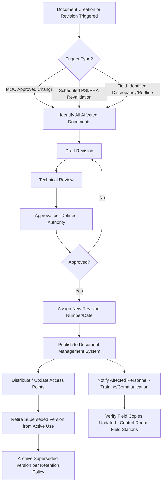
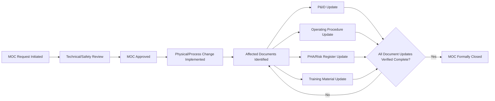

## Document Control and Configuration Management

### Definition and Scope

Document control and configuration management refers to the systematic processes governing the creation, review, approval, distribution, revision, and retirement of Process Safety Information (PSI) and related technical documents, ensuring that all personnel reference a single, current, authoritative version and that changes to documentation remain synchronized with actual physical/process configuration. While OSHA 1910.119 does not contain a standalone "document control" element by that name, document control is the implicit infrastructure requirement underlying multiple explicit PSM elements — most directly **Process Safety Information (1910.119(d))** and **Management of Change (1910.119(l))**, both of which are unenforceable in practice without a functioning document control system.

**[Inference]** Document control failures are frequently cited as a contributing organizational factor in major incident investigations (e.g., CSB reports) not as a standalone regulatory violation, but as the mechanism by which other PSM element failures (outdated PSI, uncommunicated MOC changes, inconsistent procedures) actually manifest in the field.

### Why Document Control Is Foundational to PSM

**Key Points**

- Nearly every PSM element depends on documents remaining current and consistent: PSI (P&IDs, PFDs, equipment specifications), operating procedures, PHA worksheets, MOC records, training materials, and mechanical integrity inspection records.
- A change approved through MOC is only "complete" from a document control perspective once every affected document (P&ID, operating procedure, PHA record, training material) has been updated and the obsolete version retired from active use — a step frequently underperformed in practice.
- Document control failures create a distinctive hazard pattern: personnel following an outdated procedure or referencing an outdated P&ID may take actions that were safe under the old configuration but are hazardous under the new (unreflected) configuration.
- Configuration management extends document control to the physical/digital systems themselves (e.g., DCS logic, SIS programming) — ensuring that software/logic configurations are version-controlled with the same rigor as paper/electronic drawings.

### Core Elements of a Document Control System

#### 1. Document Identification and Classification

Each controlled document requires a unique identifier (document number), classification (e.g., PSI, procedure, PHA record, training material), and defined ownership (responsible department/role for content accuracy).

#### 2. Revision Control

Formal versioning showing revision number/letter, date, and a summary of changes from the prior revision, typically maintained in a revision history block on the document itself and/or in a centralized document management system (DMS).

#### 3. Review and Approval Workflow

Defined approval authority appropriate to document type and risk significance — e.g., a P&ID revision affecting a safety-critical system may require process engineering, operations, and process safety sign-off, while a minor administrative correction may require only originator/supervisor approval.

#### 4. Distribution Control

Mechanism ensuring users access only the current approved version — historically achieved through controlled paper copy distribution lists with stamped/numbered copies; in modern systems, through electronic document management systems (EDMS) that serve only the latest approved revision and restrict access to superseded versions (or clearly mark them "superseded"/"for reference only").

#### 5. Obsolete Document Control

Formal removal or clear marking of superseded documents from active-use locations (control rooms, field stations, procedure binders) to prevent inadvertent use of outdated information — a frequently underperformed step, particularly for paper-based systems in the field.

#### 6. Retention and Archival

Defined retention periods and archival requirements, particularly relevant for PSI, PHA records (retained per 1910.119(e)(5) — PHA and response documentation retained for the life of the process), incident investigation reports, and MOC records, which may be needed for regulatory inspection, litigation, or historical hazard analysis reference years after creation.

### Document Control Lifecycle

### Configuration Management — Extending Beyond Paper Documents

**Key Points**

- Configuration management applies the same version-control discipline to non-paper "documents" that define process behavior: DCS control logic, SIS/PLC programming, alarm setpoint databases, and equipment tag/asset databases.
- **DCS/PLC logic changes** require the same MOC rigor as physical equipment changes — an unauthorized or undocumented control logic modification can alter process behavior as significantly as a physical piping change, yet may be far easier to make informally (a few keystrokes vs. a physical work order), creating a distinctive risk profile requiring specific safeguards (e.g., logic change audit trails, restricted engineering access, mandatory MOC linkage for safety-critical logic).
- **Alarm setpoint management**: alarm rationalization databases (per ISA 18.2) require configuration control to prevent informal setpoint changes made by operators or engineers outside the MOC process, which is a recognized contributor to alarm system degradation and "alarm flood" phenomena.
- **[Inference]** Facilities with mature configuration management typically implement electronic change logs or audit trails for DCS/SIS logic modifications specifically because these changes are otherwise invisible in traditional paper-based document control systems — this is an increasingly common but not universally implemented practice, particularly in older control system architectures lacking native audit trail capability.

### Interface with Management of Change (MOC)

Document control and MOC are tightly coupled: MOC is the *authorization* mechanism for a change, while document control is the *implementation and record-keeping* mechanism ensuring the authorized change is fully reflected across all affected documentation. A common failure mode is "MOC closeout without document closeout" — the MOC is formally approved and the physical change implemented, but the linked document updates (P&ID revision, procedure update, training material revision) are not completed or verified before the MOC is administratively closed, leaving a documentation gap despite an apparently complete change management record.

### Document Hierarchy Typically Under Control

| Document Category | Example | Typical Revision Trigger |
| --- | --- | --- |
| Process Safety Information | P&IDs, PFDs, equipment specifications | MOC, PSI/PHA revalidation cycle |
| Operating Procedures | Startup/shutdown, normal operations, emergency procedures | MOC, procedure review cycle, incident learnings |
| PHA Records | HAZOP worksheets, LOPA studies | 5-year revalidation, significant MOC |
| Mechanical Integrity Records | Inspection reports, RBI assessments | Scheduled inspection, repair/alteration |
| Training Materials | Operator training modules, competency assessments | Procedure changes, PHA findings, incident learnings |
| Control System Configuration | DCS logic, SIS programming, alarm database | MOC affecting control philosophy or safety logic |

### Electronic Document Management Systems (EDMS)

**[Inference]** Most facilities of significant scale now rely on electronic document management systems rather than purely paper-based control, given the practical difficulty of maintaining synchronized paper distribution across multiple field locations; however, system-specific architecture (cloud-based vs. on-premise, integration with MOC/CMMS software) varies considerably by organization and is not standardized by regulation. Common EDMS capabilities relevant to PSM include:

- Automated version control with check-in/check-out to prevent simultaneous conflicting edits
- Role-based access control restricting approval authority to designated personnel
- Automated obsolescence marking/watermarking of superseded documents
- Integration with MOC workflow software to link approved changes directly to triggered document revisions
- Search and retrieval supporting audit and PHA revalidation activities
- Audit trail logging all access, edits, and approvals for regulatory inspection readiness

### Common Compliance and Quality Gaps

- **Field copies out of sync with the master/controlled version**: control room binders or field-posted procedures not updated following a revision, particularly in facilities with incomplete transition from paper to electronic systems
- **MOC closed without verifying document updates**: administrative closure of the change record before all affected documents are confirmed updated
- **Uncontrolled "convenience copies"**: personnel maintaining personal printed or saved copies of procedures/P&IDs that silently become outdated and are used in place of the controlled version
- **DCS/SIS logic changes made outside MOC**: informal control system modifications lacking the same change authorization rigor as physical changes, often due to the low perceived barrier to making a software change compared to a hardware change
- **Inconsistent revision numbering across related documents**: a P&ID revision and its corresponding PFD or operating procedure showing different, unreconciled revision dates, creating ambiguity about which reflects current configuration
- **Retention gaps**: PHA, incident investigation, or MOC records not retained for the required duration, discovered only during a regulatory audit or incident investigation requiring historical documentation

### Example Scenario

An operator references a printed operating procedure from a control room binder to execute a startup sequence. Unknown to the operator, the procedure was revised three months earlier following an MOC that changed a valve sequencing step to address a previously identified overpressure risk, but the printed control room copy was never replaced — a document control failure separate from the MOC's technical adequacy. The operator follows the outdated sequence, recreating the overpressure exposure the MOC was intended to eliminate. This illustrates why document control is treated as inseparable from MOC effectiveness: an unimplemented document update effectively nullifies an otherwise sound change management decision.

### Next Steps

- **Related Topics**: Management of Change (MOC) Process and Documentation Linkage; Process Safety Information Currency and Revalidation; Alarm Rationalization and Setpoint Management (ISA 18.2); Safety Instrumented System Logic Change Control; Electronic Document Management System Selection and Implementation; PHA/LOPA Record Retention Requirements; Field Verification and Redline Walkdown Programs; Training Material Currency and Competency Record-Keeping.