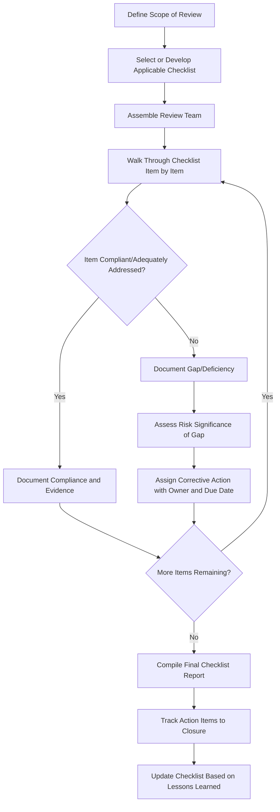

## Hazard Identification and Checklist Analysis

### Definition and Regulatory Context

Hazard identification is the systematic process of recognizing conditions, events, or characteristics of a process that have the potential to cause harm to people, the environment, or assets. Checklist analysis is one of the foundational, structured techniques for hazard identification, using a predetermined list of hazard categories, design considerations, or compliance items to systematically prompt reviewers to identify hazards or verify conformance to established good practice.

Within PSM, checklist analysis is explicitly recognized as an acceptable **Process Hazard Analysis (PHA)** methodology under **OSHA 1910.119(e)(2)(i)**, which lists "What-If," "Checklist," "What-If/Checklist," "Hazard and Operability Study (HAZOP)," "Failure Mode and Effects Analysis (FMEA)," and "an appropriate equivalent methodology" as acceptable approaches, to be selected based on the complexity of the process.

### Position Within Hazard Identification Methods

**Key Points**

- Checklist analysis is generally considered a lower-rigor, higher-efficiency method compared to HAZOP or FMEA, making it most appropriate for simpler, well-understood processes or as a supplementary screening tool for more complex analyses.
- OSHA guidance and CCPS practice generally position checklist analysis as suitable for less complex processes, or for processes where a mature, well-established checklist exists reflecting extensive industry experience (e.g., standard utility systems, common storage configurations).
- Checklist analysis is frequently combined with What-If analysis (the "What-If/Checklist" hybrid method explicitly named in 1910.119(e)(2)(i)) to add structured completeness to the more open-ended, brainstorming-driven What-If approach.
- **[Inference]** For highly complex or novel processes, checklist analysis alone is generally considered insufficient as the primary PHA methodology because a static checklist cannot anticipate hazards specific to a unique or first-of-a-kind process configuration — this is a widely held view in PSM practice literature though not a strict numerical threshold defined in the regulation itself.

### How Checklist Analysis Works

#### Basic Methodology

A team (or individual analyst, for simpler applications) works through a pre-developed checklist item by item, evaluating whether the item's requirement or good-practice criterion is met for the process, equipment, or activity under review. Each checklist item typically corresponds to a known hazard category, common failure mode, or regulatory/code requirement. Responses are typically recorded as "Yes/Compliant," "No/Gap Identified," or "N/A," with a comment field capturing rationale, evidence, or follow-up action for any gap.

#### Sources of Checklist Content

- Industry-standard checklists (e.g., CCPS-published checklists, API/NFPA-derived compliance checklists)
- Company-specific standards and internal engineering practices
- Lessons learned from prior incidents (both internal and industry-wide, e.g., CSB investigation recommendations incorporated into a facility's checklist)
- Applicable code and regulatory requirements relevant to the equipment/process type
- Prior PHA findings, converted into checklist items to verify recurring hazard themes are addressed in future reviews

### Checklist Analysis Process Flow

### Strengths of Checklist Analysis

- **Efficiency**: significantly faster to execute than HAZOP or FMEA for a given scope, making it practical for high-volume or lower-risk applications (e.g., routine equipment reviews, minor MOC screening).
- **Consistency**: because the checklist is predetermined, different reviewers or teams applying the same checklist to similar equipment tend to produce more consistent, comparable results than open-ended brainstorming methods.
- **Captures institutionalized lessons learned**: a well-maintained checklist accumulates organizational knowledge over time, embedding lessons from past incidents and audits into a repeatable tool that does not depend on individual reviewer experience or memory.
- **Low barrier to entry**: does not require the same level of specialized facilitation training as HAZOP, allowing broader deployment across an organization for lower-complexity applications.
- **Useful as a completeness check**: even when used alongside a more rigorous primary method (HAZOP, What-If), a checklist can serve as a final verification step to catch categorically standard hazards that a scenario-based brainstorming approach might overlook.

### Limitations of Checklist Analysis

**Key Points**

- **Bounded by what is already known**: a checklist can only prompt recognition of hazards that were anticipated when the checklist was developed — it is structurally unable to identify genuinely novel hazards arising from unique process configurations, new chemistry, or first-of-a-kind equipment.
- **Risk of superficial application**: because checklist items can be answered quickly, there is a recognized risk that reviewers treat the exercise as a compliance formality rather than engaging in genuine critical hazard evaluation, particularly under time pressure.
- **Does not inherently rank or quantify risk**: a basic checklist identifies gaps but does not, by itself, provide the scenario-consequence-likelihood structure needed for risk ranking or LOPA-style quantification — this typically requires supplementing checklist findings with a separate risk assessment step.
- **Requires periodic maintenance**: an outdated checklist that has not incorporated recent incident learnings, code updates, or process changes provides false assurance, since passing an obsolete checklist does not indicate a process is free of currently relevant hazards.
- **[Inference]** OSHA and CCPS guidance generally caution against reliance on checklist analysis as the sole PHA method for highly hazardous, complex, or continuous processes precisely because of this bounded-knowledge limitation, favoring HAZOP or equivalent structured deviation-based methods for such processes.

### Checklist Analysis vs. Other PHA Methodologies — Comparison

| Attribute | Checklist Analysis | What-If Analysis | HAZOP |
| --- | --- | --- | --- |
| Structure | Highly structured (predetermined items) | Semi-structured (open brainstorming) | Highly structured (systematic guidewords per node) |
| Novel hazard identification | Limited (bounded by checklist scope) | Moderate (depends on team creativity) | Strong (systematic deviation analysis) |
| Speed of execution | Fast | Moderate | Slower (most resource-intensive) |
| Typical application | Simple processes, routine reviews, MOC screening | Simple-to-moderate complexity processes | Complex, continuous, or highly hazardous processes |
| Facilitator expertise required | Low-to-moderate | Moderate | High (trained HAZOP facilitator) |
| Risk ranking capability | Limited (often paired with separate ranking) | Moderate | Often paired with LOPA for quantification |

### Application Within the PSM Lifecycle

- **Initial PHA for lower-complexity processes**: standalone checklist analysis (or What-If/Checklist) may satisfy the 1910.119(e)(2)(i) methodology requirement for processes of appropriate complexity.
- **MOC hazard screening**: many organizations use a checklist as the first-pass hazard screening tool for proposed changes, determining whether a change is significant enough to require a full PHA/HAZOP revalidation or can proceed with checklist-level review.
- **Pre-startup safety review (PSSR)**: PSSR itself is fundamentally a checklist-based verification (per 1910.119(i)) confirming construction matches design, procedures are in place, and PHA recommendations are resolved before introducing hazardous materials.
- **Supplementary completeness check in HAZOP/LOPA studies**: applying a standard hazard-category checklist near the conclusion of a more rigorous study to catch any standard hazard category not naturally surfaced through the primary methodology's scenario-based approach.
- **Mechanical integrity and equipment inspection**: checklist-based verification of design/installation compliance against applicable codes (e.g., electrical classification checklist, relief system installation checklist).

### Example Checklist Excerpt — Storage Tank Area Review

| Item | Compliant (Y/N) | Comments/Action |
| --- | --- | --- |
| Secondary containment sized per applicable code (e.g., 110% of largest tank volume) |  |  |
| Overfill protection (high-level alarm and/or automatic shutoff) installed and tested |  |  |
| Emergency venting sized per API 2000 for tank service |  |  |
| Grounding/bonding provided for flammable liquid transfer operations |  |  |
| Fire detection/suppression system appropriate for stored material hazard class |  |  |
| Spill/leak detection provided for underground or hard-to-inspect piping |  |  |
| Emergency isolation valves accessible and clearly identified |  |  |

A reviewer working through this checklist for a new or existing tank farm would mark each item, document evidence of compliance (e.g., referencing the relevant drawing or inspection record), and generate a corrective action for any "No" response — illustrating the direct, auditable structure that distinguishes checklist analysis from more open-ended hazard identification approaches.

### Best Practices for Effective Checklist Analysis

- Maintain checklists as living documents, formally updated following incident investigations, code revisions, and PHA revalidation findings, with a defined owner responsible for currency
- Combine checklist analysis with a scenario-based method (What-If, or full HAZOP for higher-complexity processes) rather than relying on it in isolation for higher-hazard processes
- Ensure checklist reviewers include personnel with sufficient process knowledge to recognize when a "compliant" answer masks an underlying nuance the checklist item does not fully capture
- Track checklist-identified gaps to closure with the same rigor as HAZOP/PHA action items, avoiding the perception that checklist findings are lower priority simply because the method itself is lower-rigor
- Periodically benchmark internal checklists against updated industry-standard checklists (CCPS, API, NFPA) to capture evolving good practice

### Next Steps

- **Related Topics**: What-If and What-If/Checklist Analysis Methodology; HAZOP Study Methodology and Guidewords; Pre-Startup Safety Review (PSSR) Requirements; Management of Change Hazard Screening Criteria; Layer of Protection Analysis (LOPA) for Risk Quantification; PHA Methodology Selection Based on Process Complexity; Incident Investigation Findings Integration into Checklists; Mechanical Integrity Inspection Checklists.