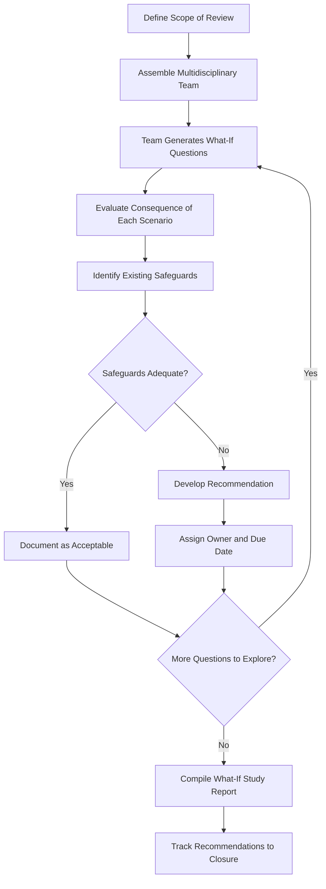

## What-If Analysis

### Definition and Regulatory Basis

What-If Analysis is a structured brainstorming technique for hazard identification in which a review team poses a series of exploratory questions beginning with "What if...?" to systematically probe potential deviations, failures, or unintended events within a process, and to evaluate their consequences and existing safeguards. It is one of the methodologies explicitly recognized by **OSHA 1910.119(e)(2)(i)** as acceptable for satisfying the Process Hazard Analysis requirement, listed alongside Checklist, What-If/Checklist, HAZOP, FMEA, and appropriate equivalent methodologies.

Unlike HAZOP, which imposes a rigid guideword-and-node structure, What-If Analysis relies more heavily on the experience and creativity of the review team to generate relevant questions, making team composition and facilitation skill particularly influential on the thoroughness of results.

### Position Within PHA Methodology Selection

**Key Points**

- What-If Analysis is generally considered intermediate in rigor and resource intensity — more open-ended and faster than HAZOP, but more systematic than an unstructured discussion, and more flexible/creative than pure checklist analysis.
- It is frequently applied to processes of low-to-moderate complexity, or combined with a checklist (the explicitly named "What-If/Checklist" hybrid) to add a layer of systematic completeness to the open-ended questioning approach.
- **[Inference]** OSHA does not prescribe numerical complexity thresholds dictating which methodology must be used for a given process; methodology selection is a documented employer determination based on process complexity, consistent with the standard's language that methodology be "appropriate to the complexity of the process."
- What-If Analysis is also commonly used for non-routine or task-specific hazard reviews (e.g., a specific maintenance activity, a temporary operation, or a single MOC) where a full HAZOP would be disproportionate to the scope.

### Methodology and Process

#### Step 1: Define Scope

The team establishes the boundaries of the review — a specific process unit, activity, piece of equipment, or proposed change — analogous to node definition in HAZOP but typically less granular.

#### Step 2: Team Assembly

A multidisciplinary team is assembled, typically including process/operations knowledge, engineering, and (depending on scope) maintenance, safety, or specialized technical expertise relevant to the process. Team diversity of experience directly affects the range of "What if" questions generated, since the method relies on participant knowledge rather than a predetermined structure to surface hazards.

#### Step 3: Question Generation

Team members pose "What if" questions covering credible deviations, failures, and unintended events, such as:

- "What if the feed pump fails while the reactor is at operating temperature?"
- "What if an operator opens the wrong valve during startup?"
- "What if cooling water supply is lost during an exothermic reaction?"
- "What if two incompatible materials are inadvertently mixed during a tank changeover?"

#### Step 4: Consequence and Safeguard Evaluation

For each question, the team evaluates the potential consequence (severity, and where relevant, likelihood), identifies existing safeguards that would prevent or mitigate the scenario, and determines whether those safeguards are adequate.

#### Step 5: Recommendation Development

Where the team determines existing safeguards are inadequate, a recommendation is developed (additional safeguard, procedural change, further engineering evaluation) and assigned to a responsible party with a target completion date, consistent with the same follow-up rigor expected of HAZOP recommendations under 1910.119(e)(5).

### What-If Analysis Process Flow

### What-If/Checklist Hybrid Methodology

**Key Points**

- The What-If/Checklist method, explicitly named in 1910.119(e)(2)(i), combines open-ended "What if" brainstorming with a structured checklist applied either concurrently or as a follow-up completeness check.
- This hybrid approach addresses a core limitation of pure What-If Analysis — namely, that its thoroughness depends heavily on team creativity and experience, and a team may inadvertently overlook standard hazard categories that a checklist would systematically prompt.
- Typical execution sequence: the team conducts open What-If brainstorming first to capture scenario-specific and experience-driven hazards, then applies a relevant checklist afterward to verify no standard hazard category was missed.

### Comparison: What-If Analysis vs. HAZOP vs. Checklist

| Attribute | What-If Analysis | HAZOP | Checklist Analysis |
| --- | --- | --- | --- |
| Structure | Semi-structured, brainstorming-driven | Highly structured (guidewords per node) | Highly structured (predetermined items) |
| Dependence on team experience | High | Moderate (guidewords provide structure) | Low (checklist provides structure) |
| Typical process complexity fit | Low-to-moderate | Moderate-to-high, continuous/complex processes | Low complexity or supplementary use |
| Resource intensity | Moderate | High | Low |
| Novel hazard identification | Good (if team is experienced/creative) | Strong (systematic deviation coverage) | Limited (bounded by checklist scope) |
| Common regulatory application | Standalone PHA for simpler processes, or MOC/task-specific reviews | Primary PHA method for high-hazard continuous processes | MOC screening, PSSR, supplementary check |

### Strengths of What-If Analysis

- **Flexibility**: adaptable to a wide range of scopes — from a full process unit PHA to a narrowly defined single-task or single-MOC review — without requiring the more rigid node/guideword infrastructure of HAZOP.
- **Encourages creative hazard identification**: because questions are not constrained to a fixed guideword list, experienced teams can surface scenario-specific hazards that a rigid methodology might not directly prompt.
- **Efficient for lower-complexity scope**: generally faster to execute than HAZOP for a given scope, making it practical for smaller-scale reviews (individual MOCs, specific procedures, temporary operations).
- **Effective for non-routine/task-based hazard reviews**: well-suited to activities that don't map cleanly onto a continuous-process node structure, such as a maintenance task, a confined space entry plan, or a one-time process modification.

### Limitations of What-If Analysis

- **Thoroughness heavily dependent on team composition and facilitation**: without the systematic guideword prompting of HAZOP, a less experienced or less diverse team may leave significant gaps in hazard coverage, and this gap can be difficult to detect after the fact since there is no structural checklist confirming completeness.
- **Less defensible completeness argument**: because the method does not follow a fixed systematic structure, demonstrating (e.g., to a regulator or auditor) that the analysis was comprehensive can be more difficult than for a HAZOP, which inherently documents node-by-node, guideword-by-guideword coverage.
- **Risk of groupthink or dominant-personality bias**: in an open brainstorming format, a small number of vocal participants can disproportionately shape which scenarios are explored, unless the facilitator actively manages participation.
- **[Inference]** For this reason, PSM practice literature generally recommends the What-If/Checklist hybrid over pure What-If Analysis for processes with meaningful hazard potential, reserving standalone What-If for genuinely lower-risk or narrowly scoped applications.

### Facilitator Role and Best Practices

**Key Points**

- Effective facilitation is disproportionately important to What-If Analysis quality compared to more structured methods, since the facilitator must actively draw out participation, ensure balanced coverage across process areas, and recognize when the team's questioning has become repetitive or has prematurely narrowed.
- Facilitators commonly use prompting categories (even informally) to guide question generation across major hazard themes — process deviations, human error, equipment failure, external events (utility loss, weather), and management system gaps — providing loose structure without converting the exercise into a full checklist.
- Documenting the rationale for "no action needed" conclusions (not just recommendations) is important for defensibility, since a purely brainstorming-based method can otherwise appear to lack a clear record of what was actually considered and dismissed versus simply never raised.

### Application Within the PSM Lifecycle

- **Initial or revalidation PHA for lower-complexity processes**: standalone or hybrid What-If/Checklist may satisfy the 1910.119(e)(2)(i) methodology requirement where process complexity does not warrant full HAZOP.
- **Management of Change hazard review**: What-If Analysis is commonly used to evaluate the hazard implications of a specific proposed change, particularly where the change scope is narrow enough that a full HAZOP revalidation of the entire node would be disproportionate.
- **Non-routine work and temporary operations**: evaluating hazards associated with a specific maintenance activity, temporary equipment installation, or non-standard operating mode.
- **Supplementary review alongside HAZOP**: applying What-If questioning to specific areas of concern identified during a broader HAZOP, where the team wants to explore a scenario in more open-ended depth than the guideword structure naturally allows.

### Example Excerpt — What-If Study for a Tank Truck Unloading Operation

| What-If Question | Consequence | Existing Safeguards | Adequate? | Recommendation |
| --- | --- | --- | --- | --- |
| What if the wrong chemical is connected during unloading? | Contamination, potential reactive hazard | Color-coded/keyed hose connections, operator verification procedure | Marginal | Add mandatory second-person verification before connection |
| What if the transfer hose ruptures during unloading? | Spill, potential vapor release | Secondary containment, emergency shutoff | Yes | None |
| What if the truck driver disconnects before transfer is complete? | Spill, employee exposure | Interlock preventing truck departure during active transfer | Yes | Verify interlock tested per MI schedule |
| What if a static discharge occurs during transfer of a flammable liquid? | Fire/explosion | Bonding/grounding cable | Marginal | Verify grounding continuity check is performed and documented every transfer |

This structure illustrates the direct scenario-consequence-safeguard-recommendation flow characteristic of What-If Analysis, distinguishing it from HAZOP's more granular deviation-by-deviation node analysis while still producing an auditable, action-tracked output.

### Next Steps

- **Related Topics**: What-If/Checklist Hybrid Methodology; HAZOP Study Methodology and Guidewords; Checklist Analysis for Hazard Identification; PHA Methodology Selection Based on Process Complexity; Management of Change Hazard Screening; Facilitator Training and Team Composition for PHA; Layer of Protection Analysis for Risk Quantification; Non-Routine Work and Temporary Operations Hazard Review.