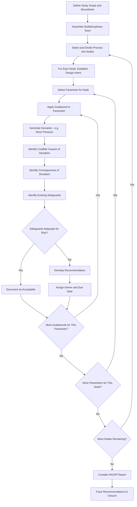

## Hazard and Operability Study Methodology

### Definition and Regulatory Basis

Hazard and Operability Study (HAZOP) is a structured, systematic technique for identifying potential hazards and operability problems in a process by examining planned or existing operations for deviations from design intent, using a predetermined set of guidewords applied to defined process parameters at discrete points ("nodes") within the process. HAZOP is explicitly named among the acceptable methodologies under **OSHA 1910.119(e)(2)(i)** and is widely regarded as the most rigorous and thorough of the commonly applied PHA methodologies, making it the default choice for complex, continuous, or highly hazardous processes.

The method originated at ICI (Imperial Chemical Industries) in the UK in the 1960s–1970s and is codified internationally in **IEC 61882** ("Hazard and operability studies (HAZOP studies) — Application guide"), which provides the internationally recognized methodological framework.

### Core Concepts

#### Nodes

A node is a defined section of the process (typically bounded by significant equipment, or points where process parameters change meaningfully) selected as the unit of analysis. Node boundaries are marked directly on the P&ID, and the team systematically works through every node to ensure complete process coverage without gaps or excessive overlap.

#### Design Intent

For each node, the team first establishes the design intent — the intended parameters (temperature, pressure, flow, level, composition, phase) under normal operation, derived from the PFD/P&ID and supporting design documentation (heat and material balance, equipment specifications).

#### Parameters

Process parameters relevant to each node are identified — commonly Flow, Pressure, Temperature, Level, Composition, Phase, Reaction, Addition, and others specific to the process (e.g., Mixing, Agitation, for batch/reactive systems).

#### Guidewords

Guidewords are standardized prompt words combined with parameters to systematically generate deviations from design intent:

| Guideword | Meaning | Example Deviation |
| --- | --- | --- |
| No / None | Complete negation of design intent | No Flow |
| More | Quantitative increase | More Temperature |
| Less | Quantitative decrease | Less Pressure |
| Reverse | Opposite of design intent | Reverse Flow |
| As Well As | Additional/qualitative increase | Contamination (composition as well as) |
| Part Of | Only part of design intent achieved | Part Of Composition (missing component) |
| Other Than | Complete substitution | Other Than intended material charged |
| Early/Late | Timing deviation (for sequential/batch operations) | Late Addition of catalyst |

### HAZOP Study Process Flow

### Team Composition and Roles

**Key Points**

- HAZOP is inherently a team-based method; individual analysis is not considered adequate given the method's reliance on diverse expertise to correctly identify causes, consequences, and safeguards for each deviation.
- Typical team composition includes: a trained HAZOP facilitator (leads the systematic guideword process, independent of direct responsibility for the design being reviewed to maintain objectivity), a scribe/recorder (documents the session, often using specialized HAZOP software), process/design engineer (provides design intent and technical basis), operations representative (provides operational reality and practical safeguard knowledge), and, depending on scope, instrumentation/controls, maintenance, and process safety/loss prevention representatives.
- **[Inference]** CCPS and API guidance generally emphasize that facilitator independence and skill are among the most significant determinants of HAZOP study quality, since a facilitator too closely tied to the original design may unconsciously steer the team away from critical findings, and an inexperienced facilitator may fail to maintain the discipline needed to complete systematic guideword coverage without excessive schedule pressure shortcuts.

### Documentation and Worksheet Structure

A standard HAZOP worksheet captures, per deviation examined:

| Field | Content |
| --- | --- |
| Node | Identifier and description of process section |
| Design Intent | Expected parameter values/conditions |
| Parameter | Process variable being examined (Flow, Pressure, etc.) |
| Guideword | Applied guideword (No, More, Less, etc.) |
| Deviation | Combined guideword + parameter statement |
| Causes | Credible causes of the deviation |
| Consequences | Potential outcomes if deviation occurs and propagates |
| Safeguards | Existing prevention/mitigation measures |
| Risk Ranking | Qualitative or semi-quantitative severity/likelihood assessment (often feeding into LOPA for further quantification) |
| Recommendations | Actions where safeguards are judged inadequate |
| Action Owner/Due Date | Responsibility and timeline for recommendation resolution |

### Relationship to Layer of Protection Analysis (LOPA)

**Key Points**

- HAZOP identifies deviations, causes, consequences, and existing safeguards qualitatively; where a scenario's risk ranking suggests further quantification is warranted, the scenario is commonly carried forward into a separate LOPA study to quantitatively evaluate whether existing Independent Protection Layers (IPLs) provide sufficient risk reduction.
- This HAZOP-then-LOPA sequencing is a widely adopted industry practice (reflected in CCPS guidance) rather than a strict regulatory mandate — 1910.119 does not explicitly require LOPA, though it is broadly considered a recognized and generally accepted good practice for risk-based safeguard adequacy determination following HAZOP.
- Not every HAZOP-identified scenario requires LOPA; typically only scenarios exceeding a predetermined qualitative risk threshold (per the facility's risk matrix) are escalated to quantitative LOPA analysis.

### Revalidation Requirements

Per **OSHA 1910.119(e)(6)**, PHAs (including HAZOP studies) must be updated and revalidated at least every five years, based on a methodology similar to the original study. Revalidation may take the form of a full re-study or, where circumstances support it, a review confirming the original study remains valid combined with an update capturing changes since the prior study (e.g., accumulated MOCs, incident learnings, process modifications).

### Strengths of HAZOP

- **Systematic completeness**: the guideword/node structure provides a defensible, auditable demonstration that every parameter at every node was deliberately considered, reducing the risk of gaps compared to less structured methods.
- **Well-suited to complex, continuous processes**: the granular deviation-by-deviation approach is effective at surfacing subtle interaction effects and cascading consequences that broader brainstorming methods may miss.
- **Widely recognized and defensible**: as the most established and internationally codified PHA methodology (IEC 61882), HAZOP findings carry strong credibility with regulators, auditors, and insurers.
- **Naturally generates safeguard inventory**: the systematic causes-consequences-safeguards structure produces a comprehensive safeguard inventory useful for subsequent LOPA, bowtie analysis, and mechanical integrity scoping.

### Limitations of HAZOP

- **Resource-intensive**: full HAZOP studies require significant team time (often multiple full-day sessions for a moderately complex unit), specialized facilitation, and correspondingly higher cost compared to What-If or Checklist methods.
- **Effectiveness dependent on P&ID accuracy**: since node definition and design intent derive directly from the P&ID, an outdated or inaccurate P&ID undermines the validity of the entire study (see Document Control and Configuration Management).
- **Can suffer from "guideword fatigue"**: in long sessions, systematic guideword application risk becoming perfunctory, particularly for parameters with limited credible deviations at a given node — effective facilitation must balance thoroughness against diminishing returns and team engagement.
- **Primarily deviation-focused**: HAZOP's structure is oriented around parameter deviations from design intent, and may be less naturally suited (without adaptation) to hazards arising from entirely different failure categories, such as organizational/human-factors-driven scenarios, which methods like bowtie analysis or dedicated human factors reviews may address more directly.

### Example HAZOP Worksheet Entry

**Node**: Reactor R-101 Feed Line (between Feed Pump P-101 and Reactor R-101 inlet)

**Design Intent**: Continuous feed of Reactant A at 15 m³/h, 25°C, 3.5 barg

| Guideword | Deviation | Causes | Consequences | Safeguards | Risk | Recommendation |
| --- | --- | --- | --- | --- | --- | --- |
| No | No Flow | Pump failure, valve inadvertently closed, line blockage | Loss of reactant feed, potential reverse reaction conditions in reactor | Low-flow alarm (FAL-101), operator response procedure | Medium | Verify FAL-101 alarm response time is adequate per reaction kinetics; confirm via LOPA |
| More | More Flow | Control valve fails open, pump speed control failure | Reactor overfill, potential runaway if reaction rate exceeds cooling capacity | High-level alarm (LAH-101), high-flow trip (FSH-101A) to isolation valve | Medium-High | Confirm FSH-101A independence from FAL-101 per LOPA IPL criteria |
| Reverse | Reverse Flow | Downstream pressure exceeds upstream, check valve failure | Contamination of feed system, potential reactor material backflow | Check valve CV-101 | Low | Verify check valve tested per MI program interval |

This worksheet structure illustrates the granular, auditable format that distinguishes HAZOP from less structured methods, with each deviation traceable through a discrete cause-consequence-safeguard-recommendation chain.

### Next Steps

- **Related Topics**: Layer of Protection Analysis (LOPA) Methodology; PHA Team Composition and Facilitator Training; Node Definition and P&ID Accuracy Requirements; PHA Revalidation Requirements (5-Year Cycle); Bowtie Analysis and Barrier Management; Risk Ranking Matrices and Qualitative Risk Assessment; Safety Instrumented System Independence Criteria for IPL Credit; What-If and Checklist Analysis as Alternative Methodologies.