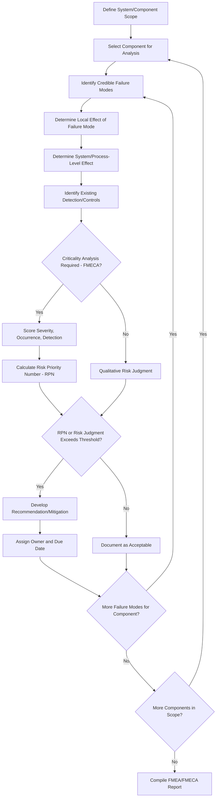

## Failure Mode and Effects Analysis

### Definition and Regulatory Basis

Failure Mode and Effects Analysis (FMEA) is a bottom-up, inductive analysis technique that systematically examines individual components or equipment items to identify all credible ways each item can fail (failure modes), and evaluates the effects of each failure mode on the system, process, and overall safety. FMEA is explicitly named among the acceptable PHA methodologies under **OSHA 1910.119(e)(2)(i)**, alongside What-If, Checklist, What-If/Checklist, HAZOP, and appropriate equivalent methodologies.

FMEA originated in reliability engineering (formalized in military and aerospace standards, notably MIL-STD-1629A) before being adapted for process safety and broader industrial applications. The extended variant **FMECA** (Failure Mode, Effects, and Criticality Analysis) adds a formal criticality ranking step, quantifying the significance of each failure mode based on severity, occurrence probability, and detectability.

### Distinguishing Feature: Component-Level, Bottom-Up Approach

**Key Points**

- FMEA is fundamentally different in analytical direction from HAZOP: HAZOP is a top-down, deviation-based method starting from process parameters at a node; FMEA is a bottom-up, component-based method starting from an individual piece of equipment and asking "how can this specific component fail?"
- This makes FMEA particularly well-suited to analyzing the reliability and failure behavior of discrete equipment items (a specific pump, a specific control valve, a specific instrument), rather than systematically analyzing an entire process flow the way HAZOP does.
- **[Inference]** Because of this component-level focus, FMEA is commonly applied as a complementary or supplementary technique alongside HAZOP (used for overall process-level hazard identification) rather than as a wholesale substitute, particularly for complex processes — though 1910.119(e)(2)(i) permits FMEA as a standalone PHA methodology where appropriate to process complexity.
- FMEA is especially well established for analyzing Safety Instrumented Systems, where its failure-mode granularity aligns naturally with the component-level reliability calculations (e.g., PFD, SIL verification) required under IEC 61511.

### Core Methodology

#### Step 1: System/Component Definition

Define the scope of analysis — a specific system, subsystem, or discrete list of components (e.g., all instrumentation and final elements within a specific safety instrumented function).

#### Step 2: Failure Mode Identification

For each component, systematically identify all credible ways it can fail. Common failure mode categories include:

- Fails to operate on demand (e.g., valve fails to close)
- Fails in place / spurious operation (e.g., valve closes when it should remain open)
- Fails open / fails closed (for valves, specifically)
- Degraded performance (partial failure, e.g., reduced flow capacity)
- Fails to indicate / instrument drift (for sensors/transmitters)
- Structural/mechanical failure (rupture, leak, fatigue failure)

#### Step 3: Effects Analysis

For each identified failure mode, determine the local effect (on the immediate component/subsystem), and the system-level or process-level effect (the ultimate consequence propagating through the process).

#### Step 4: Severity, Occurrence, and Detection Ranking (FMECA extension)

Where criticality analysis is performed, each failure mode is scored on standardized scales (commonly 1–10) for:

- **Severity (S)**: consequence magnitude if the failure occurs
- **Occurrence (O)**: likelihood/frequency of the failure mode occurring
- **Detection (D)**: likelihood that existing controls would detect the failure before it causes harm

#### Step 5: Risk Priority Number (RPN) Calculation

$$RPN = S \times O \times D$$

The RPN provides a relative prioritization score for addressing failure modes, with higher RPN values indicating higher-priority items for corrective action, mitigation, or design improvement.

#### Step 6: Existing Controls and Recommendations

Document existing safeguards/controls addressing each failure mode, and develop recommendations where controls are judged inadequate relative to the failure mode's criticality.

### FMEA Process Flow

### FMEA Worksheet Structure

| Field | Content |
| --- | --- |
| Component | Specific equipment item under analysis |
| Function | Intended function of the component |
| Failure Mode | Specific way the component can fail |
| Local Effect | Immediate consequence at the component/subsystem |
| System Effect | Ultimate process-level consequence |
| Existing Controls | Current detection/mitigation measures |
| Severity (S) | Consequence severity ranking (if FMECA) |
| Occurrence (O) | Failure likelihood ranking (if FMECA) |
| Detection (D) | Detectability ranking (if FMECA) |
| RPN | S × O × D (if FMECA) |
| Recommendation | Action where risk is judged unacceptable |

### FMEA vs. HAZOP — Comparison

| Attribute | FMEA | HAZOP |
| --- | --- | --- |
| Analytical direction | Bottom-up (component → system effect) | Top-down (process parameter deviation → cause/consequence) |
| Unit of analysis | Individual component/equipment item | Process node |
| Best suited for | Equipment reliability, SIS/instrumentation analysis, mechanical systems | Overall process hazard identification, continuous processes |
| Quantification | Often incorporates RPN scoring (FMECA) | Typically qualitative, feeding into separate LOPA for quantification |
| Interaction effects between systems | Less naturally captured (component-focused) | Naturally captured through node-based process flow analysis |
| Common combined use | Often supplements HAZOP for critical equipment/SIS analysis | Often the primary process-level PHA method |

### Application to Safety Instrumented Systems (SIS)

**Key Points**

- FMEA is a standard technique within the SIS lifecycle described in **IEC 61511**, used to systematically evaluate failure modes of sensors, logic solvers, and final elements comprising a Safety Instrumented Function (SIF).
- FMEA results feed directly into quantitative reliability calculations supporting Safety Integrity Level (SIL) verification, since the probability of failure on demand (PFD) calculation for a SIF depends on understanding the specific failure modes (safe vs. dangerous, detected vs. undetected) of each component.
- **[Inference]** This SIS-focused application is one of the most well-established and widely adopted uses of FMEA in the process industries, given the close alignment between FMEA's component-failure-mode structure and the reliability engineering basis of SIL verification methodology.

### Strengths of FMEA

- **Rigorous component-level failure analysis**: provides depth of analysis for individual equipment reliability that node-based methods like HAZOP do not naturally provide.
- **Strong alignment with reliability/SIS engineering**: the failure-mode structure integrates naturally with quantitative reliability calculations (PFD, SIL verification) required for safety instrumented systems.
- **Effective prioritization via RPN (FMECA)**: provides a structured, semi-quantitative basis for prioritizing corrective actions across a large population of components, useful for reliability-centered maintenance (RCM) programs as well as safety applications.
- **Well-suited to mechanical integrity program scoping**: failure mode identification directly informs which components warrant which type of inspection/testing strategy, supporting risk-based inspection (RBI) program development.

### Limitations of FMEA

- **Does not naturally capture multi-component interaction effects**: because analysis proceeds component by component, FMEA can miss hazards arising from the interaction of simultaneous or cascading failures across multiple components — a limitation HAZOP's node-based, process-flow-oriented structure is generally better positioned to address.
- **RPN scoring subjectivity and inconsistency**: **[Inference]** severity, occurrence, and detection rankings are inherently judgment-based, and without well-calibrated, consistently applied scoring guides, RPN values can vary significantly between analysts or teams, undermining the comparability the RPN is intended to provide — this is a widely recognized critique in reliability engineering literature.
- **RPN can misrepresent true risk priority**: a mathematically identical RPN can result from very different severity/occurrence/detection combinations (e.g., high severity/low occurrence vs. low severity/high occurrence), and some practitioners argue RPN alone should not be the sole basis for prioritization without considering the underlying component scores individually.
- **Resource-intensive for large component populations**: comprehensive FMEA across an entire complex process can require substantial time investment, motivating its common use as a targeted technique for critical systems (SIS, key equipment) rather than blanket application across an entire facility.

### Example FMEA Worksheet Entry — Pressure Transmitter in a High-Pressure Trip Function

**Component**: Pressure Transmitter PT-205 (input to high-pressure trip SIF)

**Function**: Continuously measure reactor pressure and transmit signal to logic solver for high-pressure trip function

| Failure Mode | Local Effect | System Effect | Existing Controls | S | O | D | RPN | Recommendation |
| --- | --- | --- | --- | --- | --- | --- | --- | --- |
| Fails low (stuck/drifted low reading) | Transmitter reports pressure below actual | Trip function fails to actuate on genuine high pressure (dangerous undetected failure) | Periodic proof testing per SIS testing interval | 9 | 3 | 6 | 162 | Evaluate diagnostic coverage improvement (e.g., partial stroke/HART diagnostics) to reduce detection score |
| Fails high (stuck/drifted high reading) | Transmitter reports pressure above actual | Spurious trip (nuisance shutdown, safe failure) | Operator alarm response procedure | 3 | 3 | 4 | 36 | None — acceptable as safe-direction failure |
| Complete signal loss (open circuit) | No signal to logic solver | Detected by logic solver diagnostics; trip function fails safe | Logic solver diagnostic alarm | 3 | 2 | 2 | 12 | None |

This example illustrates how FMEA's component-level structure directly supports the quantitative reliability basis (failure mode categorization by safe/dangerous and detected/undetected) required for SIL verification calculations under IEC 61511, in a way distinct from HAZOP's process-deviation framing.

### Next Steps

- **Related Topics**: Safety Instrumented System Design and SIL Verification (IEC 61511); Reliability-Centered Maintenance (RCM) and Risk-Based Inspection (RBI); HAZOP Methodology as a Complementary Process-Level Technique; Layer of Protection Analysis and IPL Reliability Data; Mechanical Integrity Program Scoping; Probability of Failure on Demand (PFD) Calculation Methods; FMECA Criticality Ranking Calibration and Consistency.