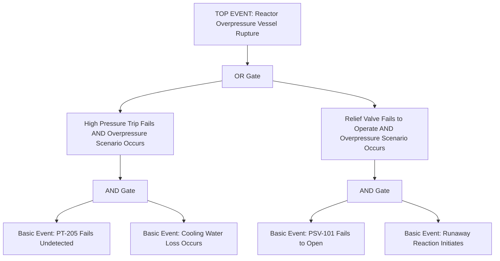
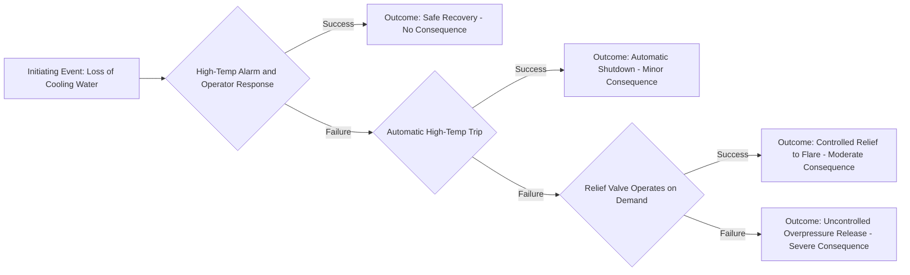
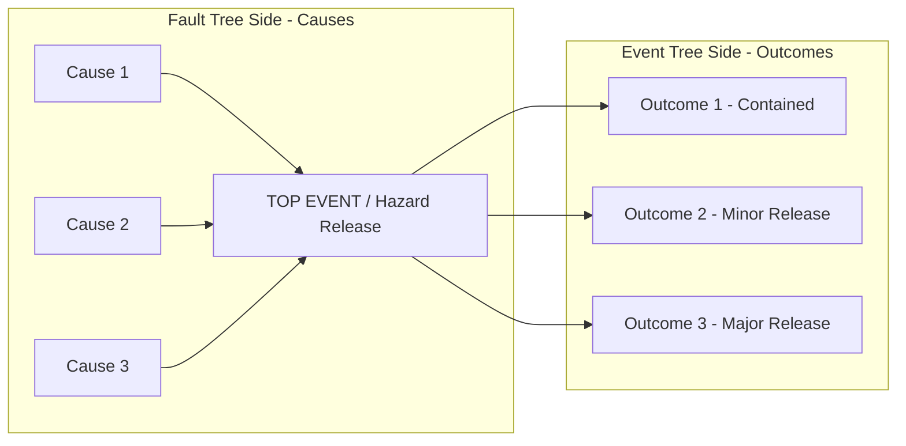

## Fault Tree Analysis and Event Tree Analysis

### Definition and Regulatory Context

Fault Tree Analysis (FTA) and Event Tree Analysis (ETA) are complementary quantitative/logical modeling techniques used to analyze the causes and consequences of undesired events in a process. FTA is a deductive, top-down technique that starts from a defined undesired top event and works backward to identify the combinations of basic causes (component failures, human errors, external events) that could lead to it. ETA is an inductive, forward-looking technique that starts from an initiating event and maps the branching sequence of subsequent successes/failures of safeguards to determine the range of possible outcomes and their probabilities.

Neither FTA nor ETA is explicitly named in the list of acceptable methodologies under **OSHA 1910.119(e)(2)(i)**, but both fall within the standard's allowance for "an appropriate equivalent methodology," and both are well-established techniques recognized in CCPS guidance and API RP 580/581 (risk-based inspection) as supplementary quantitative tools, particularly for complex or high-consequence scenarios warranting deeper analysis than qualitative HAZOP/What-If alone provides.

### Fault Tree Analysis (FTA)

#### Core Logic and Structure

FTA represents the logical relationships between a top event (the undesired outcome, e.g., "Reactor Overpressure Resulting in Vessel Rupture") and the underlying combinations of basic events (equipment failures, human errors, external conditions) using Boolean logic gates.

**Key Logic Gates:**

| Gate Type | Symbol Meaning | Logic |
| --- | --- | --- |
| AND Gate | Output occurs only if all inputs occur | All contributing events must happen simultaneously |
| OR Gate | Output occurs if any input occurs | Any single contributing event is sufficient |

#### Basic Events and Quantification

Each basic event at the bottom of the tree is assigned a failure probability (derived from reliability data sources such as OREDA, component manufacturer data, or plant-specific failure history). The tree structure allows calculation of the overall top event probability by propagating these basic event probabilities through the Boolean logic:

$$P(\text{AND gate output}) = P(A) \times P(B)$$

$$P(\text{OR gate output}) = P(A) + P(B) - P(A)P(B) \approx P(A) + P(B) \text{ for small probabilities}$$

#### Minimal Cut Sets

A key analytical output of FTA is the identification of **minimal cut sets** — the smallest combinations of basic events that, if they all occur, are sufficient to cause the top event. Single-basic-event cut sets represent single points of failure, which are typically flagged as high-priority findings warranting additional independent safeguards.

### Fault Tree Structure Diagram

#### Applications of FTA in Process Safety

- **LOPA scenario quantification**: FTA provides the rigorous logical/mathematical basis for calculating scenario frequency where multiple contributing failures combine, supporting or cross-checking simplified LOPA order-of-magnitude calculations.
- **SIS reliability verification**: fault tree modeling of a Safety Instrumented Function's architecture (sensor, logic solver, final element, including redundancy configurations) is a standard technique supporting PFD calculation for SIL verification per IEC 61511.
- **Common cause failure analysis**: FTA structure is well suited to explicitly modeling common cause failures (a single underlying cause affecting multiple nominally independent components), which is critical for correctly evaluating redundant safety systems rather than assuming full independence.
- **Root cause analysis support**: FTA logic structure is also applied retrospectively in incident investigation to map the combination of failures that led to an actual event.

### Event Tree Analysis (ETA)

#### Core Logic and Structure

ETA begins with a defined initiating event and branches at each subsequent safeguard/barrier, with each branch representing success or failure of that safeguard, ultimately mapping to a set of distinct possible outcomes with associated probabilities.

#### Structure Elements

- **Initiating Event**: the starting undesired event (e.g., "Loss of Cooling Water to Reactor")
- **Pivotal Events (Safeguards/Barriers)**: sequential independent protection layers evaluated in the order they would actually respond (e.g., high-temperature alarm/operator response, then automatic shutdown, then relief valve)
- **Branches**: at each pivotal event, the tree branches into "Success" (safeguard functions as intended) and "Failure" (safeguard does not function), each assigned a probability
- **End States/Outcomes**: the terminal branches representing distinct consequence outcomes (e.g., "Safe Shutdown," "Controlled Relief," "Uncontrolled Release")

### Event Tree Structure Diagram

#### Quantification

The probability of each end state is calculated by multiplying the probabilities along the path leading to it:

$$P(\text{End State}) = P(\text{Initiating Event}) \times \prod P(\text{branch probabilities along path})$$

This structure directly parallels the LOPA calculation logic, and ETA can be understood as a more visually explicit, branching representation of the same sequential-independent-layer concept LOPA applies in tabular form.

### FTA vs. ETA — Comparison

| Attribute | Fault Tree Analysis (FTA) | Event Tree Analysis (ETA) |
| --- | --- | --- |
| Analytical direction | Deductive, backward (top event → causes) | Inductive, forward (initiating event → outcomes) |
| Primary question answered | "What combinations of failures could cause this event?" | "Given this initiating event, what outcomes are possible?" |
| Typical output | Minimal cut sets, top event probability | Range of outcome probabilities across end states |
| Best suited for | Analyzing causes of a specific undesired top event, SIS reliability | Analyzing consequence range and safeguard effectiveness for a given initiator |
| Relationship to LOPA | Supports rigorous frequency calculation for LOPA scenarios | Structurally parallels LOPA's sequential-IPL logic |
| Common cause failure modeling | Naturally accommodated via shared basic events across branches | Less naturally captured unless explicitly modeled |

### Bowtie Analysis as a Combined Representation

**[Inference]** Bowtie analysis, widely used in process safety barrier management, is commonly understood as a visual combination of a fault tree (on the "threats" side, showing causes converging on a central top event) and an event tree (on the "consequences" side, showing the top event branching into outcomes based on barrier success/failure) — providing an integrated, communication-friendly visualization that combines FTA's causal analysis strength with ETA's consequence-mapping strength in a single diagram, though bowtie is typically presented qualitatively/semi-quantitatively rather than with the full mathematical rigor of standalone FTA/ETA.

### Data Sources for Quantification

- **OREDA (Offshore and Onshore Reliability Data)** — widely used industry failure rate database, originally offshore-focused but broadly applied
- **CCPS Guidelines for Process Equipment Reliability Data** — process industry specific failure rate data
- **Manufacturer-supplied reliability data** — particularly for SIS components (certified PFD/failure rate data per IEC 61508 certification)
- **Plant-specific historical failure/maintenance data** — where sufficient population and history exist to support statistically meaningful plant-specific rates
- **Generic industry data compilations** (e.g., IEEE 500, various national nuclear/chemical industry reliability databases)

**[Inference]** Selection between generic and plant-specific data involves a trade-off: plant-specific data reflects actual local conditions and maintenance practices but often lacks sufficient failure event population for statistical confidence, while generic industry data offers larger sample sizes but may not reflect facility-specific factors — practitioners commonly blend both sources using Bayesian updating or engineering judgment weighting, though specific methodology varies across organizations.

### Strengths and Limitations

**Strengths:**

- Provide rigorous, mathematically defensible quantification of scenario frequency/probability where qualitative risk ranking (as produced by HAZOP alone) is insufficient for decision-making
- FTA's minimal cut set analysis directly identifies single points of failure and inadequate independence between claimed safeguards
- ETA's branching structure makes the effectiveness (or inadequacy) of sequential safeguards visually and numerically explicit
- Both techniques integrate naturally with SIS reliability engineering (IEC 61511 PFD calculations)

**Limitations:**

- Require specialized training and quantitative reliability engineering skill beyond typical HAZOP/What-If facilitation, limiting broad organizational deployment
- Results are highly sensitive to the quality and applicability of input failure rate data — **[Inference]** garbage-in-garbage-out risk is a widely recognized limitation, where an FTA/ETA built on poorly justified or inappropriately generic failure rates can produce a misleadingly precise-looking numerical result that does not reflect genuine confidence
- Resource-intensive to construct and maintain for complex systems with many contributing events, generally reserving full FTA/ETA for high-consequence or high-complexity scenarios rather than routine PHA use
- Common cause failure modeling, while structurally possible in FTA, requires deliberate analyst attention — a fault tree naively treating redundant components as fully independent can substantially understate actual top event probability

### Application Within the PSM Framework

- **Supplementing LOPA for complex scenarios**: where a scenario involves multiple interacting failure combinations too complex for LOPA's simplified order-of-magnitude table format, FTA provides the rigorous underlying calculation.
- **SIL verification for Safety Instrumented Functions**: FTA (or equivalent reliability block diagram methods) is standard practice for calculating PFD of SIF architectures per IEC 61511.
- **Incident investigation root cause mapping**: FTA logic structure applied retrospectively to systematically map the combination of actual failures contributing to a real event.
- **High-consequence scenario deep-dive**: for scenarios identified during HAZOP/LOPA as carrying particularly severe potential consequences, FTA/ETA provide a more rigorous quantitative basis supporting risk tolerance decisions and safeguard investment justification.

### Next Steps

- **Related Topics**: Layer of Protection Analysis (LOPA) Methodology; Bowtie Analysis and Barrier Management; Safety Instrumented System PFD Calculation and SIL Verification (IEC 61511); Common Cause Failure Analysis; Reliability Data Sources (OREDA, CCPS Equipment Reliability Data); Minimal Cut Set Analysis and Single Point of Failure Identification; Quantitative Risk Assessment (QRA) Integration; Incident Investigation Root Cause Analysis Techniques.