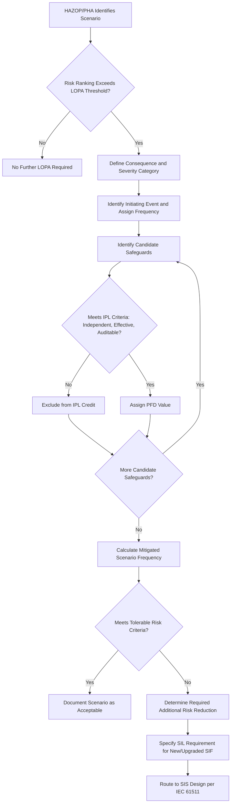

## Layer of Protection Analysis

### Definition and Regulatory Context

Layer of Protection Analysis (LOPA) is a semi-quantitative risk assessment methodology used to evaluate whether the Independent Protection Layers (IPLs) safeguarding against a specific hazardous scenario provide adequate risk reduction to meet a defined tolerable risk criterion. LOPA occupies a position between qualitative hazard identification (HAZOP, What-If) and fully quantitative risk assessment (FTA/ETA-based Quantitative Risk Assessment), offering order-of-magnitude rigor without the full resource intensity of detailed probabilistic modeling.

LOPA is not explicitly named in **OSHA 1910.119(e)(2)(i)**'s list of PHA methodologies, but it is universally recognized in CCPS guidance (notably the foundational CCPS publication *Layer of Protection Analysis: Simplified Process Risk Assessment*) as the standard follow-on technique applied to HAZOP-identified scenarios warranting further risk quantification, and is broadly considered recognized and generally accepted good practice (RAGAGEP) for safeguard adequacy determination.

### Core Concept: Independent Protection Layers (IPLs)

**Key Points**

- An Independent Protection Layer is a device, system, or action capable of preventing a scenario from proceeding to its undesired consequence, independent of the initiating event and of other IPLs credited for the same scenario.
- To qualify as an IPL, a safeguard must generally meet several criteria: **effectiveness** (specifically designed to prevent or mitigate the consequence of concern), **independence** (functionally independent from the initiating event and from other credited IPLs — no shared component, power source, or common cause), **auditability** (the safeguard's performance must be verifiable through testing, inspection, or maintenance records), and **reliability data availability** (a defensible probability of failure on demand (PFD) value must exist for the safeguard).
- Common examples of IPLs include: Safety Instrumented Functions (SIFs) meeting a verified SIL rating, relief devices sized for the specific scenario, physical containment (dikes, blast walls), and certain procedural safeguards (though procedural/human-action IPLs are generally credited more conservatively and are subject to stricter qualification criteria than automated hardware IPLs).
- **[Inference]** Alarms requiring operator response can be credited as an IPL only if the team can demonstrate the operator has sufficient time to detect, diagnose, and correctly respond, and this credit is generally applied conservatively — CCPS guidance and common industry practice typically cap credited human-response IPL effectiveness more conservatively than automated hardware layers, reflecting greater uncertainty in human reliability.

### LOPA Methodology and Calculation Structure

#### Core Risk Equation

LOPA evaluates whether the mitigated scenario frequency meets a tolerable risk target through the relationship:

$$f_{mitigated} = f_{initiating\ event} \times \prod_{i=1}^{n} PFD_i$$

Where $f_{initiating\ event}$ is the frequency of the initiating cause (events per year), and $PFD_i$ is the probability of failure on demand for each independent protection layer credited in the scenario.

#### Step-by-Step Process

1. **Scenario Selection**: Identify scenarios (typically carried forward from HAZOP/What-If findings that exceed a predetermined qualitative risk threshold) warranting LOPA-level quantification.
2. **Consequence Description and Severity**: Define the specific consequence of concern and its severity category (per the facility's risk matrix — e.g., minor injury, serious injury/single fatality potential, multiple fatality potential).
3. **Initiating Event Identification and Frequency**: Identify the specific initiating cause and assign a frequency value (events per year), drawn from generic industry data or plant-specific history.
4. **IPL Identification and PFD Assignment**: Identify each credited IPL and assign its PFD value, verifying each meets independence and effectiveness criteria before crediting.
5. **Mitigated Frequency Calculation**: Multiply the initiating event frequency by the product of all credited IPL PFDs to determine the mitigated scenario frequency.
6. **Comparison to Risk Tolerance Criteria**: Compare the calculated mitigated frequency against the facility's tolerable risk target for the given consequence severity category.
7. **Gap Determination and Additional IPL Requirement**: Where the mitigated frequency exceeds the tolerable target, determine the additional risk reduction required, which commonly translates into a required Safety Integrity Level (SIL) for an additional or upgraded Safety Instrumented Function.

### LOPA Process Flow

### LOPA Worksheet Structure

| Field | Content |
| --- | --- |
| Scenario Description | Narrative of the hazard scenario |
| Consequence | Specific outcome and severity category |
| Initiating Event | Specific cause and its frequency (events/year) |
| IPL 1, 2, 3... | Each credited independent protection layer and its PFD |
| Intermediate Event Likelihood | Running product of frequency × PFDs |
| Mitigated Consequence Frequency | Final calculated scenario frequency |
| Risk Tolerance Criteria | Facility's target frequency for this severity category |
| Gap / SIL Required | Additional risk reduction needed, translated to SIL target |

### Example LOPA Calculation

**Scenario**: Runaway reaction in Reactor R-101 due to loss of cooling water, potentially leading to vessel overpressure and toxic release (Severity Category: Multiple potential fatalities)

| Element | Value |
| --- | --- |
| Initiating Event: Loss of cooling water supply | $1 \times 10^{-1}$ /year |
| IPL 1: Basic Process Control System (BPCS) high-temp alarm + operator response | PFD = $1 \times 10^{-1}$ |
| IPL 2: Independent high-temperature SIF (SIL 2, verified) trip to emergency cooling | PFD = $1 \times 10^{-2}$ |
| IPL 3: Pressure relief valve sized for this scenario | PFD = $1 \times 10^{-2}$ |
| **Mitigated Frequency** | $1 \times 10^{-1} \times 1 \times 10^{-1} \times 1 \times 10^{-2} \times 1 \times 10^{-2} = 1 \times 10^{-5}$ /year |
| Tolerable Risk Criterion (multiple fatality category) | $1 \times 10^{-5}$ /year or lower |
| Gap | Meets criterion — no additional IPL required |

If the calculated mitigated frequency had instead exceeded the tolerable criterion, the team would determine the required additional risk reduction factor and specify it as a SIL target for a new or upgraded Safety Instrumented Function, which then proceeds to detailed SIS design per IEC 61511.

### IPL Independence — Common Pitfalls

**Key Points**

- A frequent LOPA error is crediting two safeguards as independent IPLs when they in fact share a common component, sensor, power supply, or logic solver — violating the independence criterion and overstating actual risk reduction.
- **[Inference]** A commonly cited example pattern: crediting both a BPCS alarm and a SIS trip as separate IPLs when both derive their signal from the same physical sensor — if that sensor fails, both "independent" layers fail simultaneously, meaning the two should not both receive full independent PFD credit in the calculation.
- The initiating event itself cannot also serve as (or share common cause with) any credited IPL — for example, a control loop malfunction cannot be counted as the initiating event while a safeguard reliant on the same control system is credited as an independent layer.
- Human response IPLs credited multiple times for the same underlying human factors weakness (e.g., crediting both "operator responds to alarm A" and "operator responds to alarm B" as independent layers when the same operator, same control room, and same potential distraction/workload conditions apply to both) require careful scrutiny to avoid overstating independence.

### LOPA's Position Relative to Other Methods

| Attribute | Qualitative PHA (HAZOP/What-If) | LOPA | Full QRA (FTA/ETA-based) |
| --- | --- | --- | --- |
| Rigor | Qualitative | Semi-quantitative (order of magnitude) | Fully quantitative |
| Typical resource intensity | Moderate-to-high (HAZOP) | Low-to-moderate (per scenario) | High |
| Output | Risk ranking, safeguard identification | Numerical gap determination, SIL targets | Precise probability/frequency estimates |
| Common cause failure handling | Implicit, team judgment | Explicit independence criteria (qualitative screen) | Explicit mathematical modeling |
| Typical trigger for use | Standard PHA requirement | Scenarios exceeding qualitative risk threshold from HAZOP | High-consequence or high-complexity scenarios warranting deeper analysis |

### Strengths of LOPA

- **Bridges the gap between qualitative and fully quantitative risk assessment**: provides meaningful numerical rigor without the full resource burden of detailed FTA/ETA-based QRA.
- **Directly informs SIL determination**: LOPA's gap analysis output translates naturally into a required SIL target for Safety Instrumented Functions, integrating cleanly with IEC 61511 SIS lifecycle requirements.
- **Standardized, auditable methodology**: the CCPS-codified framework and order-of-magnitude approach (typically using powers of 10 for frequency and PFD values) provides a consistent, comparable basis across scenarios and facilities.
- **Efficient screening tool**: because only HAZOP-flagged higher-risk scenarios typically proceed to LOPA, the method efficiently focuses quantitative rigor where it adds the most value rather than applying detailed analysis universally.

### Limitations of LOPA

- **Order-of-magnitude approximation**: the simplified powers-of-10 approach sacrifices precision for efficiency; scenarios with results close to the tolerable risk threshold boundary may warrant more detailed FTA/ETA-based analysis to resolve genuine ambiguity.
- **Sensitive to IPL independence judgment quality**: as noted above, incorrectly crediting non-independent safeguards is a well-recognized failure mode that can significantly understate actual risk.
- **Generic PFD data limitations**: **[Inference]** reliance on generic industry PFD values (rather than facility-specific verified data) for non-SIS safeguards introduces uncertainty that is not always transparently communicated in the final numerical output, potentially creating false precision.
- **Does not inherently address multiple simultaneous scenarios or cumulative site risk**: LOPA evaluates individual scenarios independently; aggregate risk across multiple overlapping scenarios at a facility level typically requires broader QRA-level analysis.

### Relationship to Safety Instrumented Systems (IEC 61511)

LOPA's SIL-target output is the standard bridge into the SIS lifecycle defined by **IEC 61511**: once LOPA establishes the required risk reduction factor for a scenario needing a new or upgraded automated safeguard, this translates directly to a target SIL (SIL 1 through SIL 4, corresponding to defined PFD ranges), which then governs the subsequent SIS conceptual design, detailed design, and verification activities (including FMEA/FTA-based PFD calculation for the proposed SIF architecture) before implementation.

### Next Steps

- **Related Topics**: Independent Protection Layer (IPL) Qualification Criteria; Safety Instrumented System SIL Determination and Verification (IEC 61511); Fault Tree Analysis for Scenario Frequency Quantification; HAZOP Methodology and Risk Ranking Thresholds; Common Cause Failure Analysis and IPL Independence; Human Reliability and Operator Response Credit in Risk Assessment; Quantitative Risk Assessment (QRA) for High-Complexity Scenarios; Risk Tolerance Criteria Development.