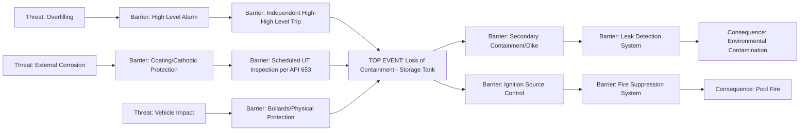
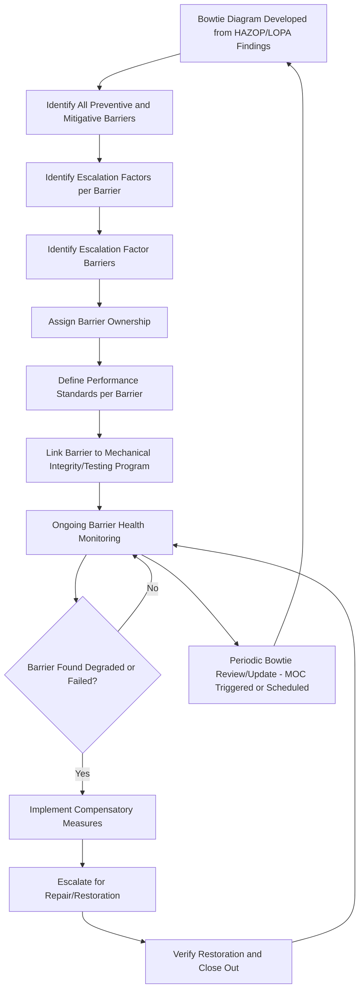

## Bowtie Analysis and Barrier Management


### Definition and Conceptual Basis

Bowtie analysis is a visual risk assessment methodology that maps the full range of causes (threats) leading to a defined hazardous top event, and the full range of consequences that could result, connected through the barriers (safeguards) intended to prevent the threats from causing the top event and to mitigate the consequences if it occurs. The resulting diagram resembles a bowtie shape: a fault-tree-like structure of threats converging on the top event from the left, and an event-tree-like structure of consequences diverging from the top event to the right.

Bowtie analysis is not explicitly named in **OSHA 1910.119(e)(2)(i)**'s list of PHA methodologies, but it is widely adopted across the process industries (particularly in oil and gas, and increasingly chemicals) as a barrier management and risk communication tool, falling within the standard's allowance for equivalent methodologies, and is extensively documented in CCPS guidance on bowtie methodology and barrier-based risk management.

### Core Structure

#### Top Event

The central point of the bowtie — a loss of control event representing the point at which a hazard is released from control (e.g., "Loss of Containment of Flammable Liquid from Storage Tank"). The top event is deliberately defined at this loss-of-control point, distinct from both its underlying causes and its potential consequences.

#### Threats (Left Side)

The distinct causes that could independently lead to the top event, analogous to the "OR" branches converging on a fault tree's top event — each threat represents a separate credible pathway to loss of control (e.g., overfilling, corrosion-induced failure, external impact).

#### Consequences (Right Side)

The distinct potential outcomes that could result once the top event occurs, analogous to event tree end states — each consequence represents a distinct credible outcome pathway (e.g., pool fire, vapor cloud explosion, environmental contamination, toxic exposure).

#### Barriers (Preventive and Mitigative)

Barriers positioned along each threat-to-top-event line are **preventive barriers** (also called proactive barriers), intended to prevent the threat from causing the top event. Barriers positioned along each top-event-to-consequence line are **mitigative barriers** (also called reactive barriers), intended to reduce the severity of consequences once the top event has occurred.

### Bowtie Diagram Structure



### Escalation Factors and Escalation Factor Barriers

**Key Points**

- An escalation factor is a condition that can defeat or degrade a barrier's effectiveness — for example, "loss of power" as an escalation factor that could defeat an automated shutdown barrier, or "operator fatigue" as an escalation factor degrading a procedural response barrier.
- Escalation factor barriers are safeguards specifically intended to prevent or manage the escalation factor itself (e.g., backup/uninterruptible power supply as an escalation factor barrier protecting the automated shutdown barrier from the "loss of power" escalation factor).
- Formal bowtie methodology explicitly documents escalation factors and their corresponding barriers, providing a more granular and complete representation of barrier vulnerability than a simple threat-barrier-top event line would show on its own — this is a defining feature that distinguishes rigorous bowtie analysis from a simplified visual summary.

### Barrier Criteria — What Qualifies as a Credited Barrier

**[Inference]** Drawing on principles closely related to LOPA's IPL qualification criteria, a barrier credited in a rigorous bowtie analysis is generally expected to be effective (specifically capable of stopping the threat-to-top-event or top-event-to-consequence pathway), independent (not defeated by the same failure that could defeat other barriers on the same line, absent explicit escalation factor management), and auditable (verifiable through inspection, testing, or performance monitoring) — though bowtie is typically applied at a qualitative-to-semi-quantitative level, in contrast to LOPA's explicit numerical PFD-based rigor.

### Bowtie vs. HAZOP/LOPA — Relationship and Positioning

| Attribute | HAZOP | LOPA | Bowtie Analysis |
| --- | --- | --- | --- |
| Primary purpose | Systematic hazard/deviation identification | Numerical risk gap quantification | Visual barrier communication and management |
| Rigor | Qualitative | Semi-quantitative | Qualitative-to-semi-quantitative |
| Structure | Node/guideword-based | Scenario/IPL-based tabular calculation | Threat-barrier-top event-barrier-consequence diagram |
| Best used for | Initial systematic hazard identification | Determining if safeguards meet tolerable risk criteria | Communicating barrier status, ongoing barrier health monitoring |
| Typical audience | PHA team, technical specialists | PHA/LOPA team, SIS engineers | Broader audience including operations, management, auditors |

**[Inference]** Bowtie analysis is commonly developed downstream of or in parallel with HAZOP/LOPA findings, essentially reorganizing and visually presenting the causes, consequences, and safeguards already identified through those more granular methodologies into a format optimized for communication, barrier ownership assignment, and ongoing operational barrier health monitoring — rather than functioning as a wholly independent hazard identification technique from first principles.

### Barrier Management — The Operational Application

#### Purpose

Barrier management extends bowtie analysis from a one-time diagram into an ongoing operational discipline: assigning clear ownership for each barrier's performance, defining performance standards, and continuously monitoring barrier health to ensure barriers remain effective throughout the operating life of the facility — directly supporting the intent of Mechanical Integrity and broader PSM element sustainment.

#### Core Elements of Barrier Management

- **Barrier Ownership**: each barrier assigned a specific accountable owner (role/position, not just an individual) responsible for ensuring the barrier remains functional.
- **Performance Standards**: defined criteria for what constitutes an effective, functioning barrier (e.g., specific test intervals, response time requirements, functional test pass criteria).
- **Barrier Health Monitoring**: ongoing tracking of barrier status — often visualized through a "barrier health" indicator (e.g., green/yellow/red status) reflecting current inspection/test results, overdue maintenance, or known degradation.
- **Degraded Barrier Escalation**: defined process for escalating and responding when a barrier is found degraded or non-functional, including interim risk management (compensatory measures) until the barrier is restored.

### Barrier Management Process Flow

```plaintext
===syllabot_placeholder===
```



### Software and Digital Barrier Management Systems

**[Inference]** Given the operational, ongoing nature of barrier management, many organizations implement dedicated bowtie/barrier management software (rather than static diagrams) to maintain live linkage between the bowtie diagram, barrier performance standards, and underlying maintenance/inspection systems (CMMS), enabling real-time barrier health dashboards — specific platform architectures vary by vendor and organization, and this space has seen continued development; facilities should verify current tool capabilities against their specific integration needs (e.g., CMMS/SIS diagnostic data linkage) rather than assume a standardized architecture.

### Strengths of Bowtie Analysis and Barrier Management

- **Superior risk communication**: the visual threat-barrier-consequence structure is significantly more accessible to non-specialist audiences (operations personnel, senior management, auditors, regulators) than tabular HAZOP or LOPA worksheets.
- **Explicit barrier ownership and accountability**: formalizing barrier ownership addresses a common organizational gap where safeguard responsibility is implicitly assumed but never explicitly assigned to a specific role.
- **Connects hazard analysis to ongoing operations**: barrier management extends the value of PHA/LOPA findings beyond the point-in-time study into continuous operational risk management, directly supporting sustained process safety performance between PHA revalidation cycles.
- **Explicit escalation factor treatment**: systematically surfaces the "barriers protecting the barriers" — a nuance that simpler safeguard lists in HAZOP/LOPA worksheets do not always make as visually explicit.

### Limitations of Bowtie Analysis

- **Not a substitute for systematic hazard identification**: bowtie's threat/consequence branches are typically populated from prior HAZOP/LOPA findings rather than generated through bowtie's own structure from first principles, meaning gaps in the underlying HAZOP/LOPA will propagate into an incomplete bowtie.
- **Risk of oversimplification**: the visually clean single-line threat-barrier-top-event representation can understate genuinely complex interactions (e.g., multiple simultaneous threats, barriers shared across multiple threat lines) if not carefully constructed with appropriate escalation factor detail.
- **Qualitative nature limits precision**: unlike LOPA's explicit numerical PFD-based calculation, bowtie barriers are typically not individually quantified with the same rigor, meaning bowtie alone does not answer "is this scenario's risk tolerable" with the same numerical defensibility LOPA provides — the two are generally considered complementary rather than substitutable.
- **Maintenance burden**: keeping a bowtie diagram and its associated barrier management data current requires ongoing effort tied to MOC and PHA revalidation processes; an outdated bowtie can create false assurance similar to any other stale PSM document.

### Example: Barrier Health Status Table

| Barrier | Type | Owner | Performance Standard | Current Status |
| --- | --- | --- | --- | --- |
| High-High Level Trip (SIF) | Preventive | Instrumentation Engineer | SIL 2 verified, annual proof test | Green — last test passed, within interval |
| Secondary Containment Dike | Mitigative | Operations Manager | Sized per code, visual inspection quarterly | Green — last inspection satisfactory |
| Fire Suppression System | Mitigative | Fire Protection Engineer | NFPA-compliant, semi-annual functional test | Yellow — functional test overdue by 15 days |
| Cathodic Protection System | Preventive (escalation factor barrier for corrosion threat) | Corrosion Engineer | Annual survey, rectifier readings within spec | Green — last survey satisfactory |

This table illustrates how barrier management translates the bowtie diagram's conceptual barriers into an operationally trackable status, directly supporting proactive intervention (in this example, the overdue fire suppression test) before a barrier becomes a genuine gap during an actual demand.

### Next Steps

- **Related Topics**: Independent Protection Layer (IPL) Criteria and LOPA Integration; Escalation Factor Identification and Management; Mechanical Integrity Program Linkage to Barrier Performance; Fault Tree and Event Tree Analysis Structural Relationship to Bowtie; Safety Instrumented System Barrier Verification (IEC 61511); Process Safety Performance Indicators (API RP 754) and Barrier Health Metrics; Management of Change Impact on Barrier Configuration; Digital Barrier Management Software Selection.