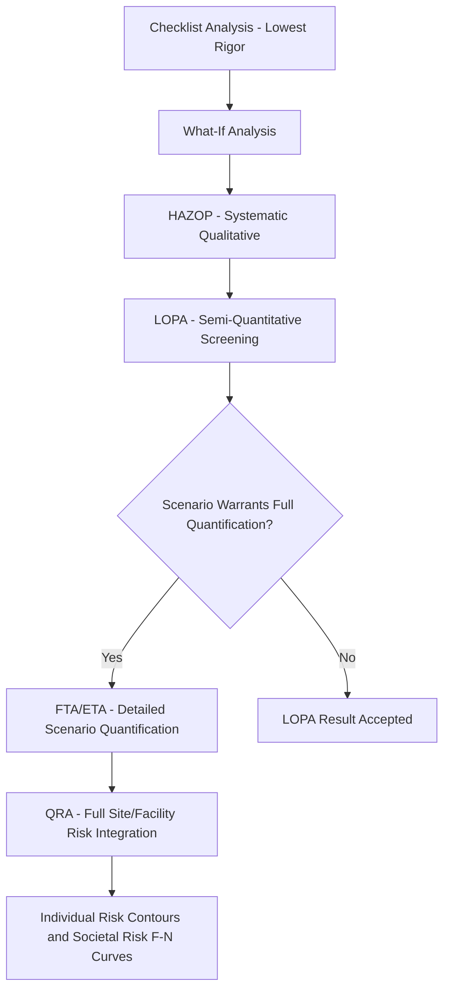
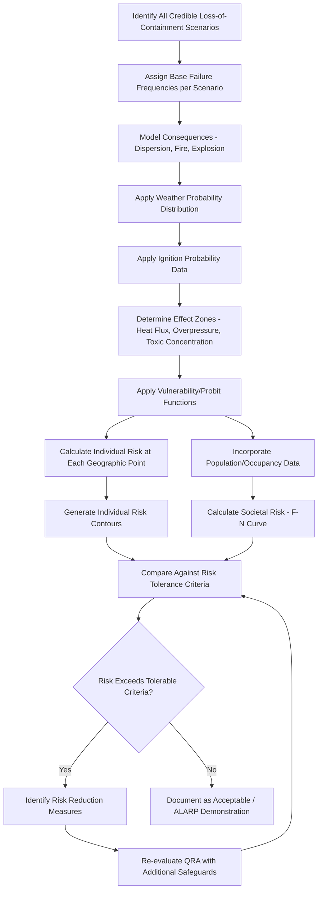

## Quantitative Risk Assessment

### Definition and Regulatory Context

Quantitative Risk Assessment (QRA) is the most rigorous and resource-intensive tier of process safety risk analysis, combining consequence modeling (physical effects of potential loss-of-containment events — fires, explosions, toxic dispersion) with frequency analysis (probability of the events occurring, typically via FTA/ETA-based methods) to produce numerical estimates of risk, commonly expressed as individual risk contours and societal risk (F-N) curves. QRA sits at the top of the risk analysis rigor hierarchy, above qualitative PHA (HAZOP/What-If) and semi-quantitative LOPA.

QRA is not explicitly named in **OSHA 1910.119(e)(2)(i)**'s list of acceptable PHA methodologies, and OSHA does not mandate QRA for covered facilities. However, QRA is widely used voluntarily by high-hazard facilities for land-use planning support, major capital project risk justification, and in jurisdictions with quantitative risk-based regulatory regimes (notably the **EU Seveso III Directive** in several member states, and certain international regulatory frameworks that impose explicit individual/societal risk criteria), making it an important complementary technique within the broader hazard identification and risk analysis toolkit even where not domestically mandated.

### Position in the Risk Analysis Hierarchy

### Core Components of QRA

#### 1. Hazard Identification and Scenario Definition

Comprehensive identification of all credible loss-of-containment scenarios across the facility, typically building on prior HAZOP findings, covering the full range of hole sizes/release scenarios for each equipment item (commonly modeled across a spectrum from small leaks to full-bore ruptures).

#### 2. Frequency Analysis

Assignment of failure frequencies to each identified scenario, typically drawing on generic industry failure rate databases (equipment failure rate per unit time, adjusted for hole size distribution) combined with FTA-based analysis of any contributing safeguard failures, producing a base event frequency for each scenario before consequence modeling.

#### 3. Consequence Modeling

Physical effects modeling to determine the spatial extent and severity of each scenario's potential outcomes:

- **Dispersion modeling**: for toxic or flammable vapor releases, modeling downwind concentration as a function of distance, weather conditions (stability class, wind speed), and release characteristics
- **Fire modeling**: pool fire, jet fire, and flash fire thermal radiation modeling to determine heat flux contours at varying distances
- **Explosion modeling**: vapor cloud explosion (VCE) overpressure modeling, including methods such as TNT-equivalent, multi-energy, or Baker-Strehlow-Tang methods depending on congestion/confinement characteristics
- **BLEVE modeling**: for pressurized flammable/liquefied gas vessels, boiling liquid expanding vapor explosion thermal radiation and blast effects

#### 4. Vulnerability/Effect Modeling

Translation of physical effect levels (heat flux, overpressure, toxic concentration) into probability of fatality or injury using probit functions or established threshold criteria (e.g., ERPG, AEGL, IDLH for toxics; specific heat flux/overpressure thresholds for thermal/blast effects).

#### 5. Risk Integration

Combination of scenario frequencies, consequence footprints, and vulnerability data — accounting for weather probability distributions, ignition probability, and population/occupancy patterns — to produce integrated risk metrics across the facility and surrounding area.

### QRA Process Flow

### Key Output Metrics

#### Individual Risk Contours

Individual risk represents the probability per year that a hypothetical person permanently present at a specific geographic location would be fatally affected by any credible scenario at the facility. Results are typically presented as contour lines on a site plan (e.g., $1 \times 10^{-4}$, $1 \times 10^{-5}$, $1 \times 10^{-6}$ per year contours), commonly used to inform land-use planning decisions and minimum safe distances to occupied buildings or public areas.

#### Societal Risk (F-N Curves)

Societal risk accounts for the number of people potentially affected simultaneously by a scenario, plotted as a Frequency-Number (F-N) curve showing the cumulative frequency of events causing N or more fatalities. F-N curves are particularly relevant where population density near a facility means a single scenario could affect multiple people simultaneously, a dimension individual risk contours alone do not capture.

#### ALARP (As Low As Reasonably Practicable)

**[Inference]** Many QRA-based regulatory frameworks (particularly in jurisdictions influenced by UK HSE practice) frame risk tolerance using a three-tier ALARP structure: an upper bound above which risk is considered intolerable regardless of cost, a lower bound below which risk is considered broadly acceptable without further action, and an intermediate "ALARP region" where risk must be reduced further unless the cost of doing so is grossly disproportionate to the risk reduction achieved — though specific numerical thresholds and the degree of formal adoption vary significantly by jurisdiction and are not uniformly mandated in the US regulatory framework.

### QRA vs. LOPA — Key Distinctions

| Attribute | LOPA | QRA |
| --- | --- | --- |
| Scope | Individual scenario, order-of-magnitude | Full facility, integrated across all scenarios |
| Consequence modeling | Simplified severity categories | Detailed physical effects modeling (dispersion, fire, explosion) |
| Output | Pass/fail against tolerable frequency for a single scenario | Risk contours, F-N curves, spatial/population-integrated risk |
| Typical use case | Determining SIL requirements for specific scenarios | Land-use planning, facility siting, major project risk justification |
| Resource intensity | Low-to-moderate per scenario | High — specialized software, dispersion/consequence modeling expertise |
| Weather/population integration | Not typically included | Core component (weather probability, population density) |

### Software and Modeling Tools

**[Inference]** QRA typically requires specialized consequence modeling software rather than manual calculation, given the complexity of dispersion, fire, and explosion physics involved. Commonly referenced tool categories in industry practice include dedicated consequence modeling packages (e.g., tools implementing dense gas dispersion models, fire/explosion effect models per methodologies such as those compiled in the **TNO "Yellow Book," "Purple Book," and "Green Book"** — the widely referenced Dutch consequence/risk assessment methodology series) and integrated QRA platforms combining frequency databases with consequence modeling engines. **[Unverified]** Specific current commercial tool names, vendor market positioning, and version capabilities were not verified via search for this response and should be confirmed against current vendor documentation if tool selection is required.

### Application Within the PSM and Regulatory Landscape

- **Facility siting studies**: QRA-derived individual risk contours directly inform minimum safe distances between hazardous process units and occupied buildings, a focus area reinforced by CSB investigation findings (e.g., following incidents where occupied buildings were sited within significant hazard footprints).
- **Land-use planning support**: in jurisdictions with formal QRA-based land-use regulation (common in parts of Europe under Seveso III implementation), QRA results directly constrain permissible development near high-hazard facilities.
- **Major capital project risk justification**: QRA is frequently used to compare risk profiles of alternative facility designs or layouts during front-end engineering design (FEED), supporting risk-informed siting and design decisions before capital is committed.
- **Regulatory risk criteria demonstration**: in jurisdictions requiring explicit numerical risk criteria compliance (e.g., certain Seveso III member state implementations), QRA provides the direct evidentiary basis for regulatory submission.
- **Insurance and risk financing**: QRA outputs are sometimes used to support insurance underwriting and risk financing decisions for high-hazard facilities, though this application sits outside the PSM regulatory framework itself.

### Strengths of QRA

- **Most comprehensive risk picture available**: integrates frequency, consequence, weather, and population data into a single coherent risk metric, providing decision-support rigor beyond what LOPA's per-scenario screening offers.
- **Directly supports facility siting and land-use decisions**: individual risk contours provide spatially explicit information that qualitative or semi-quantitative methods cannot produce.
- **Enables risk-informed comparison of design alternatives**: allows quantitative comparison of competing facility layouts or design options during early project phases when major siting decisions are most cost-effectively changed.

### Limitations of QRA

- **Significant resource and expertise requirements**: requires specialized modeling software, consequence modeling expertise, and substantial data compilation effort, generally limiting QRA to high-hazard facilities, major capital projects, or regulatory-mandated applications rather than routine PHA use.
- **Sensitivity to input assumptions**: **[Inference]** consequence modeling results can be highly sensitive to input parameters (weather data selection, ignition probability assumptions, hole size distribution assumptions), and results from different QRA practitioners analyzing the same facility can vary meaningfully depending on modeling choices — this is a widely recognized limitation requiring transparent documentation of key assumptions for result defensibility.
- **False precision risk**: the numerical specificity of QRA outputs (e.g., risk contours to a specific order of magnitude) can create an impression of certainty that exceeds the genuine confidence supportable by underlying frequency and consequence data quality.
- **Not required by US federal PSM regulation**: unlike some international frameworks, OSHA 1910.119 does not mandate QRA, meaning its use in the US is generally voluntary or driven by corporate risk management practice, state-level requirements (e.g., California's Contra Costa County or similar programs with quantitative elements), or specific project/insurance drivers rather than a uniform federal PSM obligation.

### Next Steps

- **Related Topics**: Fault Tree and Event Tree Analysis as QRA Frequency Inputs; Consequence Modeling Methods (Dispersion, Fire, Explosion); Facility Siting Studies and Occupied Building Risk Assessment; ALARP Risk Tolerance Framework; Seveso III Directive and International QRA Regulatory Requirements; Layer of Protection Analysis as a Screening Precursor to QRA; TNO Yellow Book/Purple Book Consequence Modeling Methodology; Land-Use Planning Near Major Hazard Facilities.