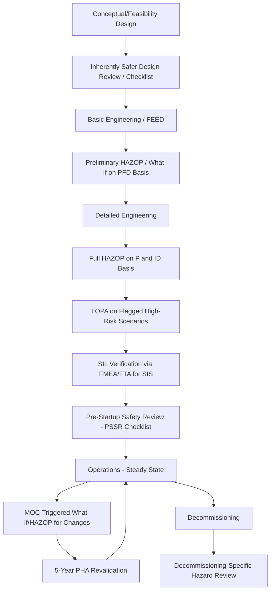

## Selecting a Method for the Project Lifecycle Stage

### Definition and Purpose

Selecting a method for the project lifecycle stage refers to the deliberate matching of hazard identification and risk analysis techniques (Checklist, What-If, HAZOP, FMEA, FTA/ETA, LOPA, Bowtie, QRA) to the level of design maturity, available information, and decision-making needs at each phase of a process facility's lifecycle — from conceptual design through decommissioning. Rather than treating hazard analysis methodologies as interchangeable, a mature PSM program applies a staged approach in which analysis rigor and technique selection evolve as design detail, and the cost of making changes, both increase.

**OSHA 1910.119(e)(2)(i)** requires that the PHA methodology be "appropriate to the complexity of the process," which implicitly requires the employer to make and document a deliberate methodology selection decision rather than defaulting to a single method regardless of context — this lifecycle-stage matching is the primary practical framework through which that regulatory requirement is operationalized.

### The Cost-of-Change Curve and Rationale for Staged Analysis

**Key Points**

- A foundational principle underlying lifecycle-stage method selection is that the cost and difficulty of changing a design increases dramatically as a project progresses — a hazard identified during conceptual design might be resolved with a configuration change costing little; the same hazard identified after construction may require costly retrofit or remain as an accepted residual risk.
- This principle (sometimes referred to informally as the "MacLeamy curve" concept in broader engineering/design literature, though most directly articulated in process safety practice through CCPS guidance on inherently safer design) motivates applying hazard identification as early as possible, even with less detailed information, followed by progressively more detailed re-analysis as design matures.
- **[Inference]** Early-stage analysis using less detailed methods (checklist, What-If) is not a lesser-quality substitute for later HAZOP — it serves a fundamentally different purpose: influencing inherently safer design choices while they remain cheaply changeable, before detailed engineering commits the design to a specific configuration.

### Lifecycle Stages and Associated Analysis Methods

### Stage-by-Stage Methodology Guidance

#### Conceptual / Feasibility Design

At this earliest stage, process chemistry, general configuration, and major equipment types are being selected, but detailed P&IDs do not yet exist. Appropriate techniques include **inherently safer design (ISD) reviews** (often structured as a checklist covering the ISD principles of minimize, substitute, moderate, simplify) and high-level **What-If** brainstorming applied to the Block Flow Diagram. The goal is to influence fundamental process selection and configuration decisions while they remain cheaply reversible, rather than to exhaustively identify every deviation.

#### Basic Engineering / Front-End Engineering Design (FEED)

As the Process Flow Diagram and preliminary equipment list develop, a **preliminary HAZOP** or structured **What-If/Checklist** study is commonly applied, using the PFD as the reference document since detailed P&IDs are not yet finalized. This stage-appropriate study identifies major hazard scenarios and safeguard philosophy decisions (e.g., whether a particular protection function will be a SIS or a relief device) while design remains flexible enough to accommodate significant safeguard architecture changes.

#### Detailed Engineering

Once P&IDs reach a sufficient level of completeness, the **full HAZOP** is conducted — this is typically the primary, most rigorous PHA study of the facility's design, using the systematic node/guideword structure against finalized P&IDs. Scenarios identified as high-risk during HAZOP are carried forward into **LOPA** for quantitative gap determination, and where LOPA indicates a SIL requirement, **FMEA/FTA-based PFD verification** supports detailed SIS design per IEC 61511.

#### Pre-Commissioning / Pre-Startup

As construction nears completion, **Pre-Startup Safety Review (PSSR)** — fundamentally a checklist-based verification per **OSHA 1910.119(i)** — confirms construction matches design intent, PHA recommendations have been resolved, and operating/emergency procedures and training are in place before hazardous materials are introduced.

#### Operations (Steady State)

During ongoing operations, hazard analysis is primarily triggered by **Management of Change (MOC)**, using **What-If** or targeted **HAZOP** revalidation scoped to the specific change, plus the mandatory **5-year PHA revalidation** cycle required under **1910.119(e)(6)**. **Bowtie analysis and barrier management** commonly operate continuously during this phase, translating the underlying HAZOP/LOPA findings into ongoing operational barrier health monitoring rather than functioning as a distinct point-in-time study.

#### Major Modification / Expansion

Significant capital modifications (debottlenecking, capacity expansion, new unit addition) typically warrant returning to a full lifecycle-stage sequence scoped to the modification — beginning with early-stage ISD/What-If review of the modification concept, progressing through preliminary and detailed HAZOP as the modification design matures, consistent with treating a major modification as its own mini-project lifecycle within the context of the existing facility's PSM program.

#### Decommissioning

**[Inference]** Decommissioning warrants its own targeted hazard review (commonly structured as What-If or checklist-based) addressing hazards specific to deconstruction sequencing, residual material handling, and equipment isolation/cleaning — distinct from the operational hazard profile the original PHA addressed, since the process configuration and credible failure modes during decommissioning differ substantially from steady-state operation.

### Methodology Selection Matrix by Lifecycle Stage

| Lifecycle Stage | Primary Document Basis | Typical Method(s) | Purpose |
| --- | --- | --- | --- |
| Conceptual/Feasibility | Block Flow Diagram | ISD Review, high-level What-If | Influence fundamental process/configuration choices |
| Basic Engineering/FEED | Process Flow Diagram | Preliminary HAZOP, What-If/Checklist | Identify major hazards, safeguard philosophy |
| Detailed Engineering | P&ID | Full HAZOP | Systematic, comprehensive deviation analysis |
| Detailed Engineering (high-risk scenarios) | HAZOP findings | LOPA | Quantify risk gap, determine SIL requirements |
| SIS Design | LOPA SIL target | FMEA/FTA | Verify SIS architecture meets required PFD |
| Pre-Startup | As-built P&ID, procedures | PSSR Checklist | Verify readiness before hazardous material introduction |
| Operations | Current P&ID | MOC-triggered What-If/HAZOP, 5-year revalidation | Maintain currency, address ongoing changes |
| Operations (continuous) | Bowtie diagram | Barrier management | Ongoing safeguard health monitoring |
| Decommissioning | Decommissioning plan | Targeted What-If/Checklist | Address deconstruction-specific hazards |

### Factors Influencing Method Selection Beyond Lifecycle Stage

**Key Points**

- **Process complexity**: per 1910.119(e)(2)(i)'s explicit language, complexity remains a primary driver independent of lifecycle stage — a simple utility system may appropriately use checklist analysis even at the detailed engineering stage, while a complex reactive chemistry process warrants full HAZOP even for a relatively contained modification.
- **Consequence severity potential**: processes handling higher-hazard chemicals (toxic, highly reactive, large inventory) generally warrant more rigorous methods at each stage, and are more likely to warrant progression to LOPA, FTA/ETA, or QRA regardless of where in the lifecycle the analysis occurs.
- **Novelty of technology**: first-of-a-kind processes or equipment configurations lacking established industry operating history warrant more rigorous, less checklist-dependent methods, since checklists are inherently bounded by previously encountered hazard categories.
- **Regulatory/jurisdictional requirements**: facilities in jurisdictions with quantitative risk criteria (e.g., certain Seveso III implementations) may require QRA at specific lifecycle stages (particularly siting/permitting) regardless of what would otherwise be the "typical" stage-appropriate method.
- **Available time and resources**: while not a technically valid sole justification for under-scoping analysis rigor, practical schedule and budget constraints do influence real-world method selection decisions, and a mature PSM program documents this trade-off transparently rather than allowing it to silently compromise analysis adequacy.

### Common Pitfalls in Lifecycle-Stage Method Selection

- **Skipping early-stage analysis entirely**: proceeding directly to detailed-engineering-stage HAZOP without any conceptual-stage inherently safer design review, missing the opportunity to influence fundamental process choices while cheaply changeable.
- **Treating preliminary HAZOP as sufficient without a detailed-stage repeat**: relying on a FEED-stage preliminary HAZOP conducted against a PFD as the final PHA, without repeating the systematic analysis against the more detailed, potentially significantly revised P&ID developed during detailed engineering.
- **Failure to re-scope method for major modifications**: applying only a narrow MOC-level What-If to what is, in substance, a major modification warranting a fuller lifecycle-stage sequence of its own.
- **Mismatched rigor to consequence severity**: applying checklist-level rigor to a high-consequence-potential process simply because it occurs later in the lifecycle when "full HAZOP should already be complete," without recognizing that a significant late-stage change may itself warrant HAZOP-level re-analysis regardless of the facility's overall lifecycle stage.
- **Neglecting decommissioning-specific analysis**: applying the original operational PHA's findings to decommissioning activities without recognizing that decommissioning hazards (residual material, altered process configuration, deconstruction sequencing) require distinct hazard identification.

### Example: Staged Methodology Application for a New Reactor Unit

A company developing a new specialty chemical reactor unit applies staged analysis as follows: during conceptual design, an inherently safer design checklist review identifies an opportunity to reduce in-process inventory of a hazardous intermediate by modifying the reaction sequence — a change that would be far more costly to implement after detailed engineering. During FEED, a preliminary HAZOP against the PFD identifies that the exothermic reaction step will likely require both a high-integrity SIS trip and DIERS-based relief sizing, informing safeguard philosophy decisions before detailed engineering commits to specific equipment. During detailed engineering, full HAZOP against the finalized P&ID systematically evaluates every node, with the previously flagged reactor overpressure scenario carried into LOPA, which determines a SIL 2 requirement for the high-temperature trip — triggering FMEA-based PFD verification of the proposed SIS architecture. Before startup, PSSR checklist verification confirms the SIS was installed and tested per the verified design, and all HAZOP/LOPA recommendations were resolved. This staged sequence illustrates how each method serves a distinct purpose appropriate to the information available and decisions being made at that specific lifecycle point, rather than any single method attempting to serve all purposes across the entire project.

### Next Steps

- **Related Topics**: Inherently Safer Design Principles (Minimize, Substitute, Moderate, Simplify); HAZOP Methodology and P&ID Dependency; LOPA and SIL Determination Sequencing; Pre-Startup Safety Review (PSSR) Requirements; Management of Change Scoping for Major Modifications; PHA Revalidation Requirements (5-Year Cycle); Decommissioning Hazard Review Planning; Process Safety Information Maturity by Design Stage.