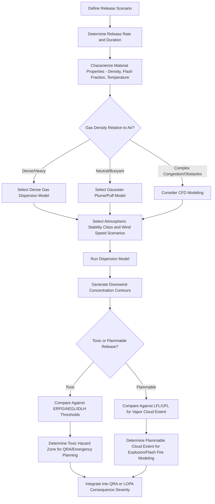

## Dispersion Modeling for Toxic and Flammable Releases

### Definition and Purpose

Dispersion modeling is the quantitative prediction of how a released gas or vapor travels, dilutes, and disperses through the atmosphere following a loss-of-containment event, used to estimate downwind concentration as a function of distance, time, and atmospheric conditions. Within Process Safety Management, dispersion modeling is a core consequence-analysis technique supporting **Quantitative Risk Assessment (QRA)**, **facility siting studies**, **emergency response planning**, and increasingly, **LOPA scenario severity determination** for toxic and flammable release scenarios.

Dispersion modeling is not itself a PSM element explicitly named in OSHA 1910.119, but it is a foundational supporting technique referenced in CCPS guidance and applied wherever a PHA, LOPA, or QRA needs to translate a release rate into a physical hazard footprint (toxic concentration zone or flammable cloud extent).

### Fundamental Release and Dispersion Categories

#### Release Type

- **Continuous release**: sustained release at a relatively constant rate (e.g., a leaking flange, a stuck-open relief valve), producing a steady-state plume once atmospheric equilibrium is reached
- **Instantaneous (puff) release**: a rapid, large-quantity release (e.g., catastrophic vessel rupture), producing a discrete cloud that disperses and dilutes as it travels rather than a sustained plume
- **Time-varying release**: intermediate cases (e.g., a large relief event of limited duration) requiring modeling approaches that account for the release rate profile over time

#### Gas Density Behavior

- **Neutrally buoyant/passive dispersion**: gas density close to ambient air, dispersing primarily through atmospheric turbulence and mechanical/thermal mixing
- **Dense gas (heavy gas) dispersion**: gas denser than ambient air (due to molecular weight, low temperature from flashing/refrigeration, or aerosol/droplet loading), which initially slumps and spreads laterally near ground level before eventually transitioning to passive dispersion as it dilutes — requiring fundamentally different modeling physics than passive dispersion
- **Buoyant/positively buoyant dispersion**: gas lighter than ambient air or released at elevated temperature, rising and dispersing upward, relevant for certain releases (e.g., heated vapor releases, some combustion products)

### Governing Atmospheric Parameters

#### Atmospheric Stability Class

Dispersion behavior is strongly influenced by atmospheric turbulence, commonly categorized using the **Pasquill-Gifford stability classes** (A through F, or the extended A–G scheme), ranging from highly unstable (A, associated with strong solar heating and high turbulence, promoting rapid dilution) to very stable (F/G, associated with calm, clear nights with strong temperature inversions, promoting minimal vertical mixing and correspondingly longer, narrower, higher-concentration downwind plumes).

**[Inference]** Because stable atmospheric conditions (associated with light wind, clear skies, and nighttime hours) generally produce the longest and most concentrated downwind hazard footprints for a given release rate, many QRA and emergency planning studies deliberately evaluate a range of stability/wind-speed combinations (rather than only the statistically most frequent local weather condition) to ensure the modeled risk picture captures reasonably foreseeable worst-case dispersion behavior, not merely average conditions.

#### Wind Speed and Direction

Downwind concentration is inversely related to wind speed for a given release rate under passive dispersion (higher wind speed generally dilutes the plume faster, but also transports the peak concentration further before adequate dilution occurs at very low wind speeds under stable conditions) — meaning the relationship between wind speed and worst-case downwind hazard distance is not always monotonic and requires proper modeling rather than simple intuition.

#### Surface Roughness

Terrain characteristics (open field, urban/industrial congestion, forested terrain) affect near-ground turbulence and mixing, with rougher terrain generally promoting faster near-source dilution but also generating more localized turbulent mixing effects that dispersion models must account for through surface roughness length parameters.

### Modeling Approaches

#### Gaussian Plume/Puff Models

The most widely used class of dispersion models for passive (neutrally buoyant) releases, based on the assumption that concentration follows a Gaussian (normal) distribution both laterally and vertically around the plume centerline, with dispersion coefficients ($\sigma_y$, $\sigma_z$) that grow with downwind distance according to empirically derived correlations tied to atmospheric stability class. Gaussian models are computationally efficient and well-validated for passive dispersion but become increasingly inaccurate for dense gas releases, where the gravity-driven slumping behavior violates the Gaussian assumption.

#### Dense Gas Dispersion Models

Specialized models accounting for the gravity-driven spreading, air entrainment, and eventual transition to passive dispersion characteristic of dense gas releases. **[Unverified]** Specific proprietary and public-domain dense gas model implementations (e.g., models historically associated with DEGADIS, SLAB, and similar dense gas dispersion codes referenced in process safety literature) were not verified via search for this response for current maintenance/availability status; facilities selecting a specific dense gas modeling tool should verify current documentation and validation status directly with the software source.

#### Computational Fluid Dynamics (CFD) Models

The most detailed and computationally intensive modeling approach, numerically solving the governing fluid dynamics equations across a discretized spatial grid, capable of representing complex obstacle/congestion effects (equipment, buildings, piping racks) that simplified Gaussian or dense gas models cannot directly capture. CFD is generally reserved for scenarios where obstacle-induced turbulence and congestion effects are expected to significantly influence dispersion behavior (e.g., dense process areas, confined/semi-confined spaces) given its substantially higher computational cost and specialized expertise requirement compared to simplified models.

### Dispersion Modeling Process Flow

### Threshold Criteria for Toxic Release Consequence Evaluation

| Threshold | Definition | Typical Use |
| --- | --- | --- |
| ERPG-1/2/3 (Emergency Response Planning Guidelines) | Concentration thresholds for mild transient effects (ERPG-1), irreversible/serious health effects (ERPG-2), and life-threatening effects (ERPG-3) for a 1-hour exposure | Emergency response planning, community risk assessment |
| AEGL-1/2/3 (Acute Exposure Guideline Levels) | EPA-developed thresholds analogous to ERPG tiers, with defined values across multiple exposure durations (10 min, 30 min, 1 hr, 4 hr, 8 hr) | Emergency planning, regulatory consequence assessment |
| IDLH (Immediately Dangerous to Life or Health) | NIOSH-established concentration representing a maximum exposure level from which a worker could escape without irreversible health effects | Industrial hygiene, worker exposure/PPE planning |
| LFL/UFL (Lower/Upper Flammable Limit) | Concentration range within which a flammable vapor-air mixture can ignite | Flammable cloud extent determination for explosion/flash fire consequence modeling |

### Application Within Consequence and Risk Assessment

**Key Points**

- In **QRA**, dispersion modeling results (combined with weather probability distributions) directly generate the concentration-based effect zones that feed into individual risk contour and societal risk (F-N curve) calculations for toxic release scenarios.
- In **LOPA**, dispersion modeling (often in simplified form) can support consequence severity category determination for toxic release scenarios, helping the team assign an appropriate severity tier consistent with the facility's risk matrix.
- In **emergency response planning**, dispersion modeling results inform protective action zone determination (shelter-in-place vs. evacuation boundaries) and are commonly integrated into facility emergency response plans and, where applicable, community right-to-know/LEPC coordination.
- In **facility siting studies**, dispersion-derived toxic hazard footprints directly inform minimum separation distances between hazardous process units and occupied buildings, a focus reinforced by CSB investigations addressing occupied building placement within hazard footprints.

### Key Input Parameters and Sensitivity

**[Inference]** Dispersion modeling results are highly sensitive to several key input parameters, and small changes in these inputs can produce substantial changes in predicted hazard distances — a limitation requiring transparent documentation of modeling assumptions for result defensibility:

- **Release rate and duration**: directly proportional influence on downwind concentration and hazard distance
- **Flash fraction and aerosol formation**: for pressurized liquefied gas releases, the fraction that flashes to vapor versus remains as liquid aerosol significantly affects the effective release density and dispersion behavior
- **Atmospheric stability class and wind speed selection**: as noted above, worst-case (stable, low wind speed) conditions can produce dramatically longer hazard distances than average/typical conditions
- **Surface roughness and terrain representation**: particularly influential for dense gas releases where near-ground slumping behavior is sensitive to local terrain features
- **Building/obstacle representation**: simplified models generally cannot capture the channeling, recirculation, or enhanced dilution effects of dense equipment congestion, motivating CFD use where these effects are judged significant

### Common Technical and Compliance Pitfalls

- **Applying Gaussian passive dispersion models to dense gas releases**: a well-recognized modeling error that significantly underestimates near-source concentration and overestimates dilution rate for dense gas scenarios, since Gaussian models do not represent gravity-driven slumping behavior.
- **Using only "typical" or average weather data**: relying solely on the most statistically frequent local weather condition rather than evaluating a range including stable/low-wind-speed conditions, potentially understating worst-case hazard footprint.
- **Neglecting flash fraction/aerosol effects for pressurized liquefied gas releases**: treating a pressurized liquefied gas release as a simple vapor release without accounting for flashing and aerosol formation, which can substantially alter both the effective release rate and the initial cloud density/temperature.
- **Ignoring obstacle/congestion effects in dense process areas**: applying open-field dispersion assumptions to a release occurring within dense equipment congestion, where actual dispersion behavior (particularly for dense gases) may differ substantially from open-field model predictions.
- **Mismatched threshold selection**: comparing modeled concentrations against an inappropriate threshold for the assessment's purpose (e.g., using IDLH, intended for worker escape scenarios, when ERPG-2 or AEGL-2 would be more appropriate for community emergency planning purposes).

### Example: Dispersion Modeling Application in a LOPA Scenario

A LOPA team evaluating a chlorine transfer line rupture scenario needs to determine the consequence severity category for the mitigated frequency calculation. Dispersion modeling of the release (accounting for chlorine's dense-gas behavior at ambient conditions) under a stable atmospheric condition and low wind speed indicates the ERPG-2 concentration threshold could be exceeded at a distance encompassing a nearby control room, supporting the team's determination that this scenario warrants the "multiple potential fatality" severity category rather than a lower category — directly informing the tolerable risk frequency target used in the subsequent LOPA gap calculation, and illustrating how dispersion modeling output feeds numerically into upstream risk assessment decisions rather than serving only as a standalone emergency planning tool.

### Next Steps

- **Related Topics**: Fire and Explosion Consequence Modeling; Quantitative Risk Assessment Integration of Dispersion Results; Emergency Response Planning and Protective Action Zones; Facility Siting and Occupied Building Risk Assessment; LOPA Consequence Severity Determination; Toxic Exposure Threshold Criteria (ERPG/AEGL/IDLH); Flash Fraction and Two-Phase Release Characterization; Atmospheric Stability Classification and Weather Data Selection for Risk Studies.