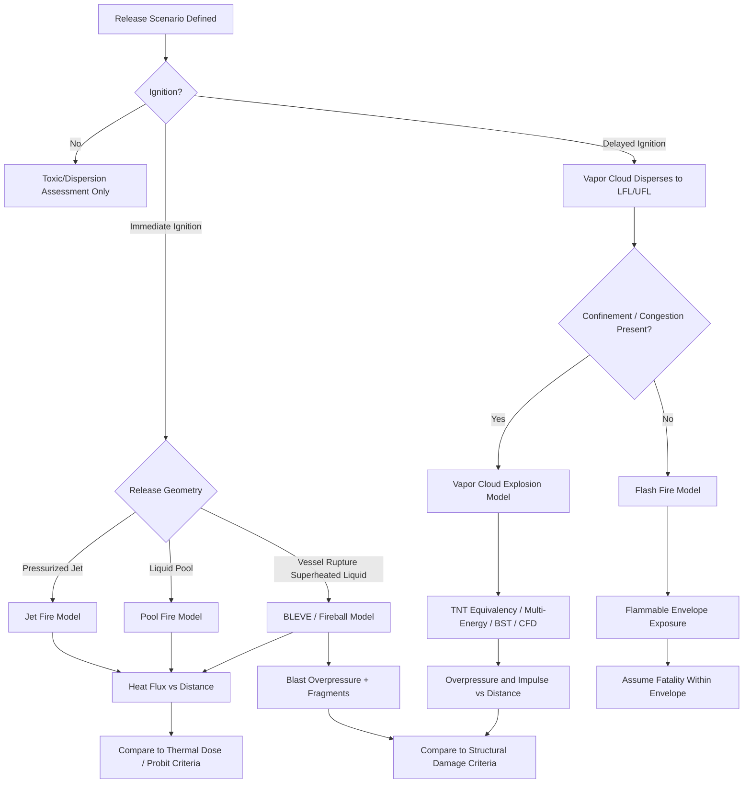

## Fire and Explosion Consequence Modeling

### Purpose and Scope

Fire and explosion consequence modeling quantifies the physical effects (heat flux, overpressure, impulse) that result once a flammable release has ignited. It sits downstream of source term modeling (discharge rate, dispersion) and upstream of risk criteria evaluation (harm/damage thresholds, individual and societal risk). In Process Safety Management (PSM), this modeling supports Process Hazard Analysis (PHA), Quantitative Risk Assessment (QRA), facility siting studies, fire and gas system design, blast-resistant building design, and emergency response planning.

The general workflow is:

1. Define the release scenario (hole size, inventory, phase).
2. Model dispersion to establish the flammable cloud size/duration (if applicable).
3. Determine ignition probability and timing (immediate vs. delayed).
4. Select the appropriate fire or explosion model based on release geometry and confinement.
5. Calculate consequence outputs (heat flux vs. distance, overpressure vs. distance).
6. Compare against injury/damage/fatality criteria.

### Classification of Fire Scenarios

**Jet Fire**

Occurs when a pressurized flammable gas or two-phase release ignites immediately or shortly after release, producing a stable, directional turbulent flame anchored at the release point.

- **Key Points**
  - Governed by momentum-dominated turbulent combustion; buoyancy is secondary except at low exit velocities.
  - Flame length is a strong function of mass release rate and, for gases, exit velocity and stoichiometric mixture fraction.
  - Common correlations: API 521 flame length correlation, Chamberlain model (used in PHAST), Kalghatgi model.
  - Radiative heat flux is typically calculated using a single-point or multi-point source model (SPM/MPM), where a fraction of the total combustion heat release ($f_s$, the radiant fraction, typically 0.1–0.4 depending on fuel and soot production) is treated as radiating from a point or set of points along the flame axis.
- **Governing Equation (Point Source Model)**

$$q'' = \frac{f_s \cdot \dot{m} \cdot \Delta H_c \cdot \tau_a}{4\pi r^2}$$

Where $q''$ is incident heat flux (kW/m²), $f_s$ is the fraction of heat radiated, $\dot{m}$ is mass burning rate (kg/s), $\Delta H_c$ is heat of combustion (kJ/kg), $\tau_a$ is atmospheric transmissivity, and $r$ is distance from the source to the target (m).

- **[Inference]** Multi-point source models generally give more accurate near-field flux predictions than single-point models because they distribute radiant energy along the actual flame geometry rather than concentrating it at one location; the magnitude of this improvement is scenario-dependent.

**Pool Fire**

Results from ignition of a liquid pool formed by a spill of a flammable/combustible liquid on land or water.

- **Key Points**
  - Pool diameter depends on spill rate, duration, containment (bunded/diked area), and substrate (land vs. water, absorbent vs. non-absorbent).
  - Burning rate (mass loss rate per unit area, $\dot{m}''$) is a key input, often taken from empirical data (e.g., Babrauskas correlation) as a function of pool diameter, since large pools approach a maximum burning rate as radiative feedback saturates.
  - Flame height is commonly estimated with the Thomas correlation, relating flame height to pool diameter and a dimensionless burning rate.
  - Surface Emissive Power (SEP) — the radiative power emitted per unit flame surface area — is central to solid flame radiation models; large pool fires often exhibit smoke shrouding, which reduces effective SEP compared to smokeless combustion.
- **Solid Flame Model**

$$q'' = SEP \cdot F_{view} \cdot \tau_a$$

Where $F_{view}$ is the geometric view factor between the flame (idealized as a tilted cylinder or frustum) and the target, dependent on flame height, diameter, tilt (from wind), and target distance/orientation.

- **Example**

  A 15 m diameter gasoline pool fire on a bunded area: burning rate ≈ 0.048–0.06 kg/(m²·s) from empirical data; SEP for large hydrocarbon pool fires is often reduced to 20–60 kW/m² due to smoke obscuration, versus theoretical unshielded values that could exceed 130 kW/m² for smaller, cleaner-burning pools.

**Flash Fire**

A transient, non-explosive combustion of a vapor cloud that has dispersed to within its flammability limits before ignition, characterized by a fast-moving flame front through the cloud with negligible overpressure.

- **Key Points**
  - Consequence is dominated by thermal exposure duration (seconds) rather than steady-state heat flux; anyone within the flammable envelope (roughly the LFL-to-UFL boundary at the time of ignition) is typically assumed to suffer fatal or severe thermal injury.
  - The "flash fire zone" is commonly approximated as the area swept by the cloud between LFL and UFL (or sometimes ½ LFL for conservatism) from dispersion modeling output.
  - Unlike jet/pool fires, detailed heat flux vs. time curves are less emphasized in typical QRA; presence/absence within the flammable envelope is the primary consequence metric.

**BLEVE (Boiling Liquid Expanding Vapor Explosion) and Fireball**

Occurs when a vessel containing a pressurized, superheated liquid catastrophically ruptures (typically due to external fire impingement weakening the shell above the liquid level), causing near-instantaneous flash vaporization, blast wave generation, fragment projection, and — if the contents are flammable — a fireball.

- **Key Points**
  - Fireball diameter and duration are commonly correlated to the mass of flammable material involved (e.g., $D_{max} = 5.8 \, M^{1/3}$, $t = 0.45 \, M^{1/3}$ for $M < 30{,}000$ kg, per widely used correlations such as those in the TNO Yellow Book and CCPS guidelines), where $M$ is mass in kg, $D$ in m, and $t$ in seconds.
  - Thermal dose to a target is calculated using the fireball's surface emissive power (often 200–350 kW/m² for hydrocarbon fireballs) and view factor, similar to the pool fire solid flame approach, but as a transient rather than steady-state event.
  - BLEVE consequences also include blast overpressure (from flashing vapor expansion) and fragment/missile hazards, making it a combined thermal-mechanical event requiring separate treatment for each hazard type.
  - **[Unverified]** Exact SEP values vary significantly by source material, vessel pressure, and fill level at rupture; site-specific validation against test data or vendor-specific models is recommended rather than relying on a single generic value.

### Classification of Explosion Scenarios

**Vapor Cloud Explosion (VCE)**

Occurs when a flammable vapor cloud, having mixed with air to within flammable limits, ignites in a partially or fully confined/congested region, generating a pressure wave due to flame acceleration.

- **Key Points**
  - Overpressure generation requires flame acceleration, which is driven by congestion (piping, equipment, structural steel) and confinement (buildings, decks); unconfined, uncongested clouds typically flash-fire rather than explode with significant overpressure.
  - Common modeling approaches:
    - **TNT Equivalency Method**: Converts the flammable mass in the cloud to an equivalent mass of TNT using an empirical yield factor, then applies standard TNT blast curves (scaled distance, Hopkinson-Cranz scaling law). Simple but historically criticized for poor accuracy, especially in the near field, because it does not represent the actual flame-acceleration mechanism.
    - **TNO Multi-Energy Method**: Divides the cloud into congested/confined sub-regions, each assigned a blast strength curve (1–10) based on the degree of confinement/congestion, producing more realistic pressure-distance curves than TNT equivalency.
    - **Baker-Strehlow-Tang (BST) Method**: Uses flame speed (Mach number) as a function of fuel reactivity, obstacle density, and confinement to select a blast curve; widely used in modern QRA (e.g., in CCPS guidance and API RP 752/753 siting studies).
    - **CFD-based methods** (e.g., FLACS): Solve the reactive flow equations directly over a 3D representation of the actual plant geometry, providing the highest fidelity but requiring significant computational resources and detailed geometric input.
  - TNT Equivalency scaled distance:

$$Z = \frac{R}{W^{1/3}}$$

Where $Z$ is scaled distance (m/kg$^{1/3}$), $R$ is standoff distance (m), and $W$ is equivalent TNT mass (kg).

- **[Inference]** The BST and Multi-Energy methods are generally preferred over TNT equivalency in modern facility siting practice because they better capture congestion/confinement effects; the degree of accuracy improvement is scenario- and geometry-specific.

**Confined/Vessel Explosion**

Combustion or overpressure buildup within a closed vessel, pipe, or building, from either a flammable gas/dust explosion inside the equipment or a runaway reaction generating gas.

- **Key Points**
  - Governed by adiabatic flame temperature, initial pressure, and the deflagration index ($K_G$ for gases, $K_{St}$ for dusts), which characterizes the rate of pressure rise: $K_G = (dP/dt)_{max} \cdot V^{1/3}$.
  - Relevant for pressure-relief device sizing (per NFPA 68/69 or DIERS methodology) rather than distance-based consequence modeling, since the "target" is the vessel/building shell itself.

**Dust Explosion**

Analogous to VCE but involving combustible dust dispersed in air within a confined space (silos, dust collectors, buildings with accumulated dust layers).

- **Key Points**
  - Requires the "explosion pentagon": fuel (dust), oxidizer, ignition source, dispersion, and confinement (the fifth element beyond the standard fire triangle).
  - Secondary dust explosions (from disturbed accumulated dust layers reigniting after a primary event) are often more destructive than the primary explosion; this is a major driver of NFPA 652/654 housekeeping requirements.
  - $K_{St}$ values from standardized test methods (ASTM E1226/E1515-derived) classify dust explosion severity (St-1, St-2, St-3 classes) for vent sizing.

### Overpressure and Impulse Damage Criteria

Explosion consequences are typically characterized by two parameters, not overpressure alone:

- **Peak Side-On Overpressure ($P_{so}$)**: The pressure spike above ambient as the shock/pressure wave passes a point.
- **Impulse ($I$)**: The time-integral of the pressure-time history, $I = \int P(t) \, dt$, representing the "dose" of energy delivered.

For short-duration blast waves, structural response depends on both parameters (pressure-impulse, or P-I, diagrams); a very high but very brief pressure spike may cause less damage than a moderate, sustained pressure, depending on the natural frequency of the structure.

**Typical Overpressure Damage Thresholds (order-of-magnitude, from CCPS/API guidance)**

| Overpressure (psi) | Typical Effect |
| --- | --- |
| 0.5–1.0 | Glass breakage, minor structural damage |
| 1.0–3.0 | Partial demolition of houses; damage to steel-frame buildings |
| 3.0–5.0 | Wall and roof failures of typical industrial buildings |
| 5.0–8.0 | Serious structural damage; potential for building collapse |
| >10.0 | Near-total destruction of most conventional structures |

**[Unverified]** These ranges are illustrative and building-type dependent; actual siting studies should use structure-specific fragility curves or P-I diagrams (e.g., as compiled in CCPS "Guidelines for Evaluating Process Plant Buildings for External Explosions and Fires") rather than single-point thresholds.

### Thermal Radiation Damage Criteria

Thermal effects are generally expressed as heat flux (kW/m²) combined with exposure duration, often through a **thermal dose** unit:

$$V = q^{4/3} \cdot t$$

Where $V$ is thermal dose (typically in $(\text{kW/m}^2)^{4/3}\text{s}$), $q$ is incident heat flux, and $t$ is exposure time. Probit models (e.g., Eisenberg probit for fatality from thermal radiation) convert dose to probability of harm.

**Typical Heat Flux Reference Levels**

| Heat Flux (kW/m²) | Typical Effect |
| --- | --- |
| 1.6 | No discomfort for prolonged exposure (solar radiation reference) |
| 4.5–5.0 | Pain within seconds; blistering possible with prolonged exposure |
| 12.5 | Sufficient to ignite wood with prolonged exposure; significant injury |
| 25–37.5 | Damage to process equipment; spontaneous ignition of most materials |

### Illustrative Diagram: Consequence Modeling Decision Flow

### Illustrative Diagram: Heat Flux Falloff with Distance (svg_diagram)

<svg xmlns="http://www.w3.org/2000/svg" viewBox="0 0 640 340">
<text x="320" y="24" font-size="16" text-anchor="middle" font-family="sans-serif" font-weight="bold">Incident Heat Flux vs Distance (svg_diagram)</text>
<line x1="70" y1="280" x2="600" y2="280" stroke="black" stroke-width="1.5" />
<line x1="70" y1="280" x2="70" y2="50" stroke="black" stroke-width="1.5" />
<text x="335" y="315" font-size="13" text-anchor="middle" font-family="sans-serif">Distance from Source (m)</text>
<text x="30" y="165" font-size="13" text-anchor="middle" font-family="sans-serif" transform="rotate(-90 30 165)">Heat Flux (kW/m²)</text>
<path d="M 90 70 Q 200 90 300 160 Q 400 220 580 265" stroke="#c0392b" stroke-width="2.5" fill="none" />
<line x1="70" y1="120" x2="600" y2="120" stroke="#888" stroke-width="1" stroke-dasharray="4,4" />
<text x="605" y="124" font-size="11" font-family="sans-serif" fill="#555">12.5 kW/m² (ignition)</text>
<line x1="70" y1="200" x2="600" y2="200" stroke="#888" stroke-width="1" stroke-dasharray="4,4" />
<text x="605" y="204" font-size="11" font-family="sans-serif" fill="#555">4.5 kW/m² (pain)</text>
<circle cx="90" cy="70" r="4" fill="#c0392b" />
<text x="95" y="65" font-size="11" font-family="sans-serif">Flame Surface</text>
<text x="70" y="295" font-size="11" text-anchor="middle" font-family="sans-serif">0</text>
<text x="335" y="295" font-size="11" text-anchor="middle" font-family="sans-serif">Distance →</text>
</svg>

### Software Tools Commonly Used

- **PHAST (DNV)**: Integrated dispersion, fire, and explosion consequence modeling; implements Chamberlain jet fire model, solid flame pool fire model, and Multi-Energy/BST explosion models.
- **FLACS-CFD**: 3D CFD tool specifically for gas dispersion and explosion (VCE) modeling in congested/confined geometries; widely used for offshore and onshore facility siting.
- **ALOHA / CAMEO (EPA/NOAA)**: Free tool commonly used for simpler screening-level fire, explosion, and toxic release consequence estimates.
- **EFFECTS (TNO)**: Implements TNO Yellow Book models including Multi-Energy method and BLEVE/fireball correlations.
- **SuperChems / Process Safety Enterprise tools**: Used for integrated consequence and QRA calculations, including detailed jet fire and pool fire radiation modeling.

**[Inference]** Tool selection in practice often depends on regulatory expectations (e.g., some jurisdictions or corporate standards specify Multi-Energy or BST for VCE), available geometric detail, and whether screening-level or detailed QRA-grade results are required.

### Integration with PSM Elements

- **Process Hazard Analysis (PHA)**: Consequence modeling outputs (heat flux/overpressure at specific distances) inform severity rankings in HAZOP/LOPA risk matrices.
- **Facility Siting**: API RP 752 (occupied buildings) and API RP 753 (portable buildings) rely directly on VCE overpressure and fire heat flux modeling to set minimum safe distances or building hardening requirements.
- **Fire and Gas System Design**: Jet fire and pool fire flame length/heat flux outputs inform detector placement and passive fire protection (PFP) design.
- **Emergency Response Planning**: Flash fire envelopes and thermal radiation contours define evacuation and shelter-in-place zones in ERPs.
- **Mechanical Integrity**: BLEVE fragment/missile modeling informs equipment spacing and blast-resistant design for critical safety systems.

### Common Pitfalls

- Applying TNT equivalency to open, uncongested vapor cloud releases, which tends to significantly overpredict near-field overpressure relative to methods that account for the absence of flame acceleration mechanisms.
- Neglecting smoke shrouding effects in large pool fire SEP estimates, which can lead to overly conservative (or in some parameter combinations, non-conservative) thermal dose predictions.
- Treating flash fire and VCE as interchangeable; the presence/absence of congestion and confinement is the deciding factor, not merely the fact that a cloud ignited.
- Ignoring transient effects in BLEVE/fireball modeling by applying steady-state solid flame equations without accounting for the short (seconds-scale) duration, which affects thermal dose calculations disproportionately for probit-based fatality estimates.

### Related Topics

- Source Term and Discharge Rate Modeling (liquid, gas, two-phase releases)
- Vapor Cloud Dispersion Modeling (Gaussian, dense gas, CFD approaches)
- Probit Functions and Injury/Fatality Correlations
- TNO Multi-Energy Method and Baker-Strehlow-Tang Method (detailed derivation)
- Facility Siting Studies (API RP 752/753)
- Quantitative Risk Assessment (QRA) Methodology and Risk Criteria (individual/societal risk)
- Explosion Vent Sizing (NFPA 68) and Deflagration Isolation (NFPA 69)
- Blast-Resistant Building Design and P-I Diagrams
- Layer of Protection Analysis (LOPA) Severity Categorization