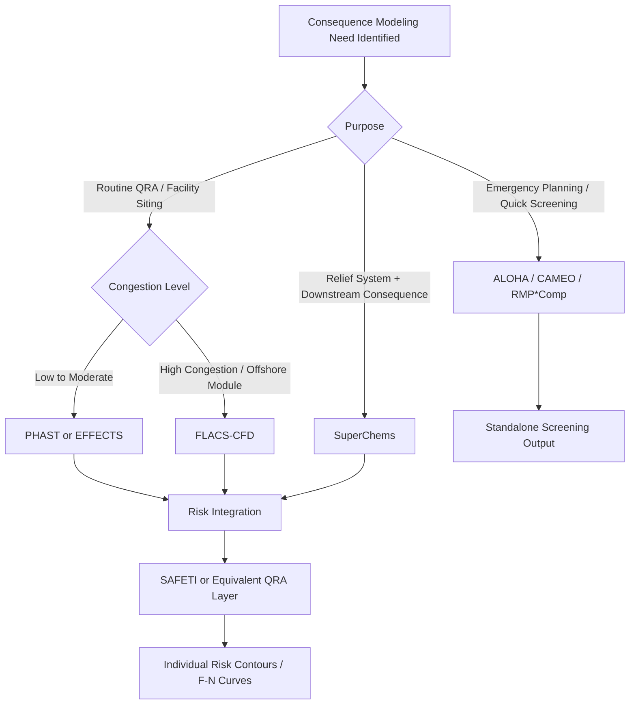

## Consequence Modeling Software and Tools

### Purpose and Scope

Consequence modeling software packages implement the physical and mathematical models (discharge, dispersion, fire, explosion, toxic effects) needed to translate a release scenario into quantified physical effects at distance. These tools range from free screening-level utilities to integrated commercial suites used in full Quantitative Risk Assessment (QRA). Selection depends on required fidelity, regulatory acceptance, geometric complexity, and whether the output feeds a PHA, a QRA, a facility siting study, or emergency response planning.

This topic surveys the major tool categories, representative software, their underlying model bases, typical inputs/outputs, and selection criteria.

### Categories of Consequence Modeling Tools

**Integrated Consequence/QRA Suites**

Full-featured commercial platforms covering discharge, dispersion, fire, explosion, and toxic endpoint modeling, often with risk integration (individual risk contours, societal risk/F-N curves).

- **PHAST (Process Hazard Analysis Software Tool) — DNV**
  - Industry-standard integrated tool combining discharge modeling (orifice/choked flow, two-phase flashing releases), the Unified Dispersion Model (UDM, transitioning from jet to dense-gas to passive dispersion), pool spreading/vaporization, jet fire (Chamberlain model), pool fire (solid flame model), flash fire, BLEVE/fireball, and vapor cloud explosion (Multi-Energy and TNO methods).
  - Commonly paired with **SAFETI** (also DNV) for full QRA, which adds frequency analysis, event trees, and risk contour/F-N curve generation on top of PHAST consequence outputs.
  - **Key Points**
    - Uses the Unified Dispersion Model, which blends jet-momentum, dense-gas (heavier-than-air slumping), and passive Gaussian dispersion regimes into a single continuous solution rather than requiring the user to pick a regime.
    - Weather sensitivity (Pasquill stability class, wind speed) is a first-class input, typically run across multiple weather categories (e.g., D5, F2) to bound consequence variability.
    - Widely accepted by regulators (e.g., UK COMAH, various API/OSHA-adjacent voluntary programs) due to extensive validation history against field trials (e.g., Thorney Island, Desert Tortoise, Maplin Sands trials).
- **EFFECTS — TNO**
  - Implements the models published in the TNO "Yellow Book" (Methods for the Calculation of Physical Effects) and "Purple Book" (risk criteria), including the Multi-Energy explosion method (which TNO originated), BLEVE/fireball correlations, and pool fire/jet fire models.
  - Often used in European regulatory contexts (Seveso III Directive compliance) given its direct lineage from the reference methodology those regulations cite.
- **SuperChems (ioMosaic)**
  - Detailed thermodynamic and consequence modeling tool with strong emphasis on relief system design (DIERS methodology) integrated with downstream consequence modeling (flare/vent discharge dispersion, fire radiation).
  - **[Inference]** Frequently selected when relief system sizing and downstream consequence modeling need to be performed in a single consistent thermodynamic framework, rather than exporting relief rates to a separate dispersion tool.

**CFD-Based Tools**

Solve the governing fluid dynamics (and, for explosions, reactive flow) equations over an explicit 3D representation of plant geometry, providing the highest fidelity for congested/confined scenarios where empirical correlations break down.

- **FLACS-CFD (Gexcon)**
  - Purpose-built for gas dispersion and vapor cloud explosion simulation in congested/confined industrial and offshore geometries; uses a porosity/distributed-resistance approach to represent small-scale congestion (piping, cable trays) without needing to mesh every individual object explicitly.
  - Extensively used and validated for offshore oil & gas facility explosion risk assessment; also applied onshore for petrochemical and LNG facility siting.
  - **Key Points**
    - Requires a detailed 3D geometry model (often imported from plant CAD/PDMS models) — a significant setup investment compared to correlation-based tools.
    - Produces spatially resolved overpressure and drag load maps across the modeled volume, rather than single distance-based curves, capturing how congestion pockets locally accelerate flame speed.
    - **[Unverified]** Computational run time and required expertise are substantially higher than correlation-based tools (PHAST, EFFECTS); exact resource requirements depend on geometry complexity, mesh resolution, and scenario count, and should be scoped against project-specific computing resources.
- **Ansys Fluent / CFX (with combustion/explosion add-ons)**
  - General-purpose CFD platforms occasionally adapted for consequence modeling (dispersion, fire plume simulation) when highly customized geometry or physics beyond what purpose-built tools offer is required.
  - **[Inference]** Generally reserved for specialized research or non-standard scenarios, since purpose-built tools (FLACS, PHAST) are more efficient for routine process safety consequence work.

**Screening-Level and Free/Public-Domain Tools**

- **ALOHA (Areal Locations of Hazardous Atmospheres) — EPA/NOAA**
  - Free tool for screening-level dispersion and, to a lesser degree, fire/explosion consequence estimation; commonly paired with **CAMEO** (Computer-Aided Management of Emergency Operations) for chemical database lookup and **MARPLOT** for GIS-based plotting of results.
  - Widely used for emergency planning (e.g., under EPCRA/RMP-adjacent public-sector use in the U.S.) rather than detailed engineering design, given its simplified model set relative to commercial suites.
  - **Key Points**
    - Supports Gaussian and dense-gas (DEGADIS-derived) dispersion models, pool evaporation, jet fires, pool fires, BLEVEs, and vapor cloud explosions (TNT equivalency-based) — but with fewer configurable model options than PHAST or EFFECTS.
    - Free and widely accessible, making it a common tool for training, public-sector emergency planning, and quick order-of-magnitude screening before committing to detailed modeling in a commercial suite.
- **RMP*Comp (US EPA)**
  - Simplified calculator specifically for the worst-case and alternative release scenario distance calculations required under the U.S. EPA Risk Management Program (40 CFR Part 68); implements EPA's prescribed simplified equations rather than general-purpose consequence physics.

**Specialized/Niche Tools**

- **Kameleon FireEx (KFX)**: CFD-based fire and smoke simulation tool, notably used in offshore and marine fire risk assessment, particularly for smoke ingress and fire propagation studies.
- **Breeze/Trinity Consultants suite**: Primarily air dispersion modeling (AERMOD-based) for regulatory air quality permitting; overlaps with consequence modeling for toxic release scenarios but is oriented toward routine/chronic emissions rather than accidental release consequence.
- **DNV Synergi Gas / Pipeline-specific tools**: Used for pipeline-specific rupture and dispersion consequence modeling where linear source geometry (rather than point source) is significant.

### Comparative Selection Criteria

| Criterion | Correlation-Based (PHAST, EFFECTS) | CFD-Based (FLACS, CFD) | Screening (ALOHA) |
| --- | --- | --- | --- |
| Setup effort | Moderate | High (detailed 3D geometry) | Low |
| Congestion/confinement fidelity | Approximate (via curve selection, e.g., Multi-Energy class) | High (explicit geometry resolved) | Low |
| Run time per scenario | Seconds to minutes | Hours (per scenario) | Seconds |
| Typical use case | Routine QRA, siting studies | Complex/critical congested-plant VCE assessment | Screening, training, emergency planning |
| Regulatory acceptance | High (validated, widely cited) | High for offshore/high-hazard where required | Moderate (accepted for planning, less for detailed design) |

**[Inference]** In practice, many organizations use a tiered approach: screening tools for initial scenario triage, correlation-based suites (PHAST/EFFECTS) for the bulk of QRA scenarios, and CFD (FLACS) reserved for the subset of scenarios in highly congested/confined areas where correlation-based Multi-Energy/BST curve selection introduces significant uncertainty.

### Illustrative Diagram: Tool Selection Logic

### Typical Inputs Required Across Tools

- **Release data**: fluid composition, phase, pressure, temperature, hole size/rupture type, inventory available.
- **Meteorological data**: wind speed, atmospheric stability class (Pasquill), ambient temperature, humidity, surface roughness.
- **Geometric data**: for CFD tools, detailed 3D equipment/structure layout; for correlation tools, simplified congestion volume and confinement class.
- **Ignition data**: probability of immediate vs. delayed ignition (often from industry-standard ignition probability curves, e.g., UK HSE or API-published data).

### Typical Outputs

- Concentration/distance contours (toxic or flammable endpoints: LFL, ½ LFL, IDLH, ERPG/AEGL levels).
- Heat flux vs. distance contours (jet fire, pool fire, BLEVE/fireball).
- Overpressure and impulse vs. distance contours (VCE).
- When paired with frequency/QRA modules: individual risk contours and societal risk (F-N) curves.

### Common Pitfalls

- Using a screening tool's output (e.g., ALOHA) as the sole basis for facility siting or blast-resistant design decisions, where the simplified model set may not capture site-specific congestion/confinement effects.
- Running CFD (FLACS) with an oversimplified or outdated geometry model, which undermines the primary advantage of CFD (explicit congestion resolution) while incurring its full computational cost.
- Treating output from correlation-based tools as precise, single-value predictions rather than as estimates subject to significant model and input uncertainty; sensitivity runs across weather categories and release scenarios are standard practice, not optional refinement.
- Mixing model bases inconsistently across a single study (e.g., TNT equivalency in one area, Multi-Energy in another) without documented justification, which complicates risk comparison across scenarios.

### Related Topics

- Fire and Explosion Consequence Modeling (model theory underlying these tools)
- Vapor Cloud Dispersion Modeling and the Unified Dispersion Model
- Quantitative Risk Assessment (QRA) Methodology
- Facility Siting Studies (API RP 752/753)
- Ignition Probability Modeling
- Toxic Release Consequence Modeling and Endpoint Selection (ERPG/AEGL/IDLH)
- CFD Fundamentals for Process Safety Applications
- Model Validation and Uncertainty Quantification in Consequence Analysis