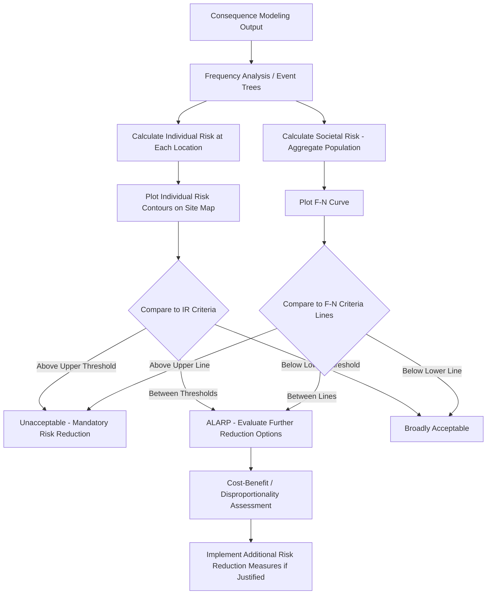

## Individual and Societal Risk Criteria

### Purpose and Scope

Individual and societal risk criteria are the quantitative benchmarks against which the outputs of consequence and frequency analysis (from a QRA) are judged to determine whether a facility's risk to people is tolerable. They translate calculated risk contours and F-N curves into a decision: acceptable, tolerable-if-ALARP (As Low As Reasonably Practicable), or unacceptable. These criteria underpin regulatory decisions (land-use planning, permitting), facility siting (API RP 752/753), and internal corporate risk acceptance standards.

### Individual Risk (IR)

**Definition**

Individual Risk is the frequency (per year) at which a specific person, or a hypothetical person at a specific location, is expected to sustain a specified level of harm (typically fatality) from all identified hazardous events at a facility.

$$IR_{x,y} = \sum_{i=1}^{n} f_i \cdot P_{f,i}(x,y)$$

Where $f_i$ is the frequency of scenario $i$ (per year), $P_{f,i}(x,y)$ is the probability of fatality at location $(x,y)$ given scenario $i$ occurs (derived from consequence modeling and probit functions), and the summation is over all $n$ scenarios that could affect that location.

**Types of Individual Risk**

- **Location-Specific Individual Risk (LSIR)**: Risk at a fixed geographic point, assuming a person is present there continuously (100% occupancy), regardless of whether anyone actually is. Used to generate risk contours on a site plan — concentric or irregular lines of equal risk (e.g., 10⁻⁴/yr, 10⁻⁵/yr, 10⁻⁶/yr contours) independent of actual population.
- **Individual Risk per Annum (IRPA)**: Risk to an actual, specific individual (e.g., an operator, a resident at a defined address), accounting for their real occupancy/exposure time at each location they occupy during a year. This is generally lower than LSIR at the same point because it factors in the fraction of time actually spent there.

**Typical Numerical Criteria**

Widely referenced (though jurisdiction- and organization-specific) individual risk benchmarks:

| Risk Level (fatalities/year) | Typical Classification |
| --- | --- |
| $>10^{-3}$ | Generally unacceptable for any exposed group (workers or public) |
| $10^{-4}$ | Often the upper bound of tolerability for workers; frequently unacceptable for members of the public |
| $10^{-5}$ | Common upper threshold for new developments near hazardous facilities in several regulatory frameworks (e.g., UK HSE land-use planning) |
| $10^{-6}$ | Commonly cited as a broadly acceptable ("negligible") risk level in several frameworks, comparable to background risks from everyday activities |

**[Unverified]** These numerical values vary meaningfully by jurisdiction, industry sector, and whether the exposed population is workers versus the public; a specific regulatory or corporate standard should always be consulted rather than relying on these illustrative figures for actual compliance decisions.

### Societal Risk (F-N Curves)

**Definition**

Societal Risk expresses the relationship between the frequency ($F$) of an accident and the number of people ($N$) who could be affected (typically fatalities) by it, aggregated across an entire facility or study area. Unlike individual risk, societal risk explicitly accounts for population density and distribution, capturing society's generally greater aversion to a single event killing many people versus the same total number of fatalities spread across many independent smaller events.

**F-N Curve Construction**

1. For each scenario $i$, determine frequency $f_i$ and the number of fatalities $N_i$ (by integrating individual fatality probability over the actual population distribution around the facility).
2. Rank scenarios by $N_i$.
3. Construct the cumulative frequency of $N$ or more fatalities:

$$F(\geq N) = \sum_{i: N_i \geq N} f_i$$

4. Plot $F(\geq N)$ against $N$ on log-log axes, producing a stepped, monotonically non-increasing curve.

**Typical Criteria Lines**

Societal risk criteria are usually presented as upper and lower bound lines on the F-N plot, dividing the plane into three regions, mirroring the individual-risk ALARP structure:

- **Unacceptable region**: F-N curve lies above the upper bound line — risk must be reduced regardless of cost, or the activity is not permitted.
- **ALARP (Tolerable) region**: F-N curve lies between the bounds — risk reduction should be pursued where reasonably practicable, weighing further risk reduction against the cost, time, and effort required.
- **Broadly acceptable region**: F-N curve lies below the lower bound line — no further risk reduction is generally required.

A common criterion line slope follows a form such as $F \cdot N = \text{constant}$ (risk-neutral) or a steeper slope (risk-averse, penalizing large-$N$ events more than proportionally), reflecting a given regulator's or company's degree of aversion to catastrophic, high-fatality events versus their aggregate expected-fatality equivalent.

**[Inference]** Risk-averse (steeper) F-N criteria slopes are generally adopted where public risk perception strongly disfavors large single-event fatalities compared to the same expected annual fatality rate spread across many smaller events; the specific slope value adopted is a policy choice rather than a derived physical quantity.

### The ALARP Principle

Central to both individual and societal risk frameworks is the ALARP (As Low As Reasonably Practicable) principle, which holds that:

- Risks above the upper tolerability threshold are unacceptable under (almost) any circumstances.
- Risks below the lower (broadly acceptable/negligible) threshold require no further action, though good practice should still be maintained.
- Risks in the intermediate ALARP band must be reduced further unless the cost (in money, time, or effort) of doing so is grossly disproportionate to the risk reduction achieved — a comparison sometimes formalized through Cost-Benefit Analysis (CBA) or the implied cost of averting a fatality (ICAF/value of a statistory life-derived metrics).

### Illustrative Diagram: ALARP Triangle (svg_diagram)

<svg xmlns="http://www.w3.org/2000/svg" viewBox="0 0 600 400">
<text x="300" y="24" font-size="16" text-anchor="middle" font-family="sans-serif" font-weight="bold">ALARP Framework (svg_diagram)</text>
<polygon points="300,50 500,340 100,340" fill="none" stroke="black" stroke-width="2" />
<line x1="150" y1="240" x2="450" y2="240" stroke="black" stroke-width="1.5" stroke-dasharray="6,4" />
<line x1="200" y1="140" x2="400" y2="140" stroke="black" stroke-width="1.5" stroke-dasharray="6,4" />
<text x="300" y="100" font-size="13" text-anchor="middle" font-family="sans-serif" font-weight="bold">Unacceptable Region</text>
<text x="300" y="190" font-size="13" text-anchor="middle" font-family="sans-serif" font-weight="bold">Tolerable if ALARP</text>
<text x="300" y="200" font-size="11" text-anchor="middle" font-family="sans-serif">(reduce risk further where</text>
<text x="300" y="214" font-size="11" text-anchor="middle" font-family="sans-serif">reasonably practicable)</text>
<text x="300" y="300" font-size="13" text-anchor="middle" font-family="sans-serif" font-weight="bold">Broadly Acceptable Region</text>
<text x="510" y="150" font-size="11" font-family="sans-serif">Upper threshold (e.g., 10⁻⁴/yr)</text>
<text x="510" y="245" font-size="11" font-family="sans-serif">Lower threshold (e.g., 10⁻⁶/yr)</text>
</svg>

### Illustrative Diagram: Risk Evaluation Process Flow

### Regulatory and Industry Frameworks Referencing These Criteria

- **UK HSE**: Long-established individual and societal risk criteria underpinning land-use planning advice around major hazard sites (COMAH-regulated facilities), including the well-known "Purple Book"-derived and HSE-specific tolerability frameworks.
- **Netherlands (VROM)**: One of the earliest formal national frameworks with explicit numerical individual risk ($10^{-6}$/yr) and societal risk F-N criteria embedded in land-use planning law.
- **API RP 752/753**: Uses risk-based approaches (including individual risk concepts) for siting occupied and portable buildings relative to blast, fire, and toxic hazards, though typically framed in terms of building performance categories rather than a standalone F-N criterion.
- **Corporate/Internal Standards**: Many major operating companies maintain internal risk matrices and numerical risk criteria (sometimes more conservative than regulatory minimums) applied consistently across global operations, since regulatory criteria vary or may not exist in all operating jurisdictions.

**[Inference]** Where a facility operates in a jurisdiction without codified numerical risk criteria, companies commonly default to internal corporate criteria or reference well-established frameworks (e.g., UK HSE or Dutch criteria) as a matter of demonstrated good practice, though this is a risk-management choice rather than a universal regulatory requirement.

### Common Pitfalls

- Confusing Location-Specific Individual Risk (LSIR) with Individual Risk per Annum (IRPA); using LSIR (100% occupancy assumption) where actual personnel exposure/occupancy data would give a more representative (and typically lower) IRPA can lead to overly conservative — or, if misapplied in the other direction, non-conservative — decision-making.
- Comparing F-N curves generated using different population data vintages, aggregation methods, or fatality probability assumptions across different studies or facilities without normalizing methodology, which undermines valid comparison.
- Treating the ALARP boundary as a bright-line pass/fail test rather than a framework requiring documented, reasoned judgment about cost/benefit disproportionality for any risk falling in the tolerable band.
- Omitting transient or non-routine population changes (e.g., construction crews, temporary occupancy, shift changes) from societal risk population inputs, understating actual societal risk exposure.

### Related Topics

- Quantitative Risk Assessment (QRA) Methodology
- Probit Functions and Fatality/Injury Correlation Models
- Facility Siting Studies (API RP 752/753)
- Layer of Protection Analysis (LOPA) and Risk Matrices
- Cost-Benefit Analysis and Value of a Statistical Life in ALARP Justification
- Land-Use Planning Around Major Hazard Facilities
- Frequency Analysis: Fault Trees and Event Trees
- Fire and Explosion Consequence Modeling (upstream input to risk calculations)