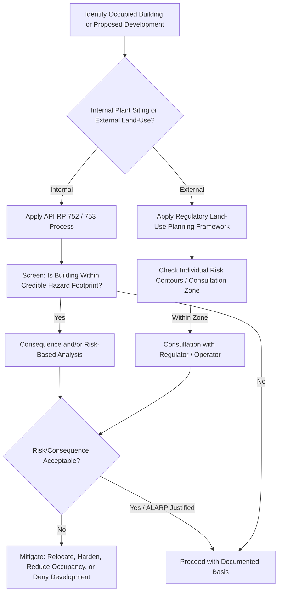

## Facility Siting and Land-Use Planning

### Purpose and Scope

Facility siting and land-use planning address where hazardous processes, occupied buildings, and surrounding populations should be located relative to one another to keep fire, explosion, and toxic release risk within tolerable limits. It operates at two scales: **internal siting** (arrangement of equipment, occupied buildings, and control rooms within a plant boundary) and **external/land-use planning** (managing development — residential, commercial, other industrial — around the plant's perimeter). Both draw directly on the outputs of consequence modeling and individual/societal risk criteria to translate calculated hazard footprints into physical separation distances, building specifications, or development restrictions.

Facility siting became a codified PSM discipline largely in response to major incidents where occupied buildings failed catastrophically under blast or fire loads that were not accounted for in original plant layout — most notably the 2005 Texas City refinery explosion, where a temporary trailer sited too close to a process unit contributed significantly to the fatality count.

### Internal Facility Siting

**Objective**

Ensure that occupied buildings (control rooms, offices, maintenance shops, break rooms) and safety-critical equipment are positioned and/or hardened such that credible fire, explosion, and toxic scenarios do not cause unacceptable harm to occupants or loss of critical safety functions.

**Key Inputs**

- Consequence modeling outputs: heat flux contours (jet fire, pool fire, BLEVE), overpressure/impulse contours (VCE), toxic concentration contours.
- Occupancy data: building population, occupancy schedule/duration, building construction type and existing blast/fire rating.
- Ignition and event frequency data feeding into risk-based siting criteria (where a full QRA-based approach is used rather than a purely consequence-based/deterministic approach).

**Siting Approaches**

- **Consequence-Based (Deterministic) Siting**: Establishes minimum separation distances or building performance requirements based on the worst-case (or a defined credible) scenario's physical effects reaching a given point, without explicitly weighting by probability/frequency.
- **Risk-Based (Probabilistic) Siting**: Integrates frequency of scenarios with their consequences to calculate individual and/or societal risk at the building location, compared against tolerability criteria — generally considered more rigorous and resource-intensive, and typically the approach used for high-consequence, high-population occupied buildings.

**API RP 752 — Management of Hazards Associated with Location of Process Plant Permanent Buildings**

- Applies to permanent occupied buildings (control rooms, offices, labs) at existing and new facilities.
- Establishes a structured process: identify occupied buildings, screen for applicability, conduct consequence and/or risk analysis for fire, explosion, and toxic hazards, and determine whether building location/construction is adequate or requires mitigation (relocation, blast-resistant upgrade, occupancy reduction, or protective systems).
- Encourages a risk-based approach where feasible, using facility-specific consequence modeling and, where available, frequency data.

**API RP 753 — Management of Hazards Associated with Location of Process Plant Portable Buildings**

- Specifically targets portable/temporary buildings (trailers, modular offices) — directly responsive to the Texas City incident, where a temporary trailer was sited within the blast-affected zone of a process unit during startup.
- Establishes explicit siting distance tables/criteria and structural performance requirements for portable buildings based on their proximity to processes handling flammable/combustible materials, given that portable buildings historically have not been designed to the same structural robustness as permanent facilities.

**Building Hardening and Blast-Resistant Design**

Where relocation outside the hazard footprint is impractical, occupied buildings may be hardened rather than moved:

- **Blast-Resistant Buildings (BRBs)**: Designed to withstand a specified design overpressure/impulse combination (from a P-I diagram derived from VCE consequence modeling) without structural collapse or excessive occupant injury from debris/fragments.
- **Fire-rated construction and passive fire protection (PFP)**: Applied to structural steel, cable trays, and vessel supports in areas exposed to credible jet fire or pool fire heat flux, sized to maintain structural integrity for a required duration (e.g., to allow safe evacuation or emergency shutdown).
- **[Inference]** The choice between relocation, hardening, and occupancy reduction is typically driven by a cost-benefit comparison, since hardening large existing buildings to a high blast rating can be substantially more expensive than either relocating a smaller occupancy or reducing the number of personnel routinely present.

### External Land-Use Planning

**Objective**

Manage the compatibility between a hazardous facility's risk footprint and surrounding land uses (residential areas, schools, hospitals, other industrial facilities) — both by constraining new development near existing hazardous facilities and by constraining new hazardous facilities near existing populated areas.

**Key Mechanisms**

- **Consultation Zones / Distances**: Many regulatory frameworks establish defined zones around major hazard facilities within which proposed developments trigger mandatory consultation with the facility operator, safety regulator, or both, before approval.
- **Risk-Based Zoning**: Some frameworks (e.g., the Netherlands, parts of Australia) directly zone land based on calculated individual risk contours (e.g., no residential development permitted within the $10^{-6}$/yr individual risk contour), tying land-use decisions numerically to QRA output.
- **Consequence-Based Zoning**: Simpler frameworks may instead zone based on a fixed consequence distance (e.g., a defined heat flux or overpressure threshold distance from a specific set of reference scenarios) without full probabilistic risk integration.

**Regulatory Frameworks**

- **Seveso III Directive (EU)**: Requires member states to ensure land-use planning policies take into account the need to maintain appropriate distances between Seveso-classified establishments (upper- and lower-tier, based on hazardous substance inventory thresholds) and residential areas, publicly used buildings, and environmentally sensitive areas.
- **UK HSE Land-Use Planning (LUP) Advice**: Provides risk-based consultation zones (inner, middle, outer) around major hazard sites, with development recommendations varying by zone and by the vulnerability/sensitivity of the proposed land use (e.g., schools and hospitals held to stricter standards than general residential).
- **U.S. Framework**: Land-use planning around hazardous facilities in the U.S. is comparatively less centralized at the federal level, generally handled through a combination of local zoning ordinances, state-level programs, and facility-level RMP (Risk Management Program, 40 CFR Part 68) and PSM (OSHA 29 CFR 1910.119) obligations rather than a single national siting-distance framework; some states and municipalities have adopted more prescriptive local requirements.
- **[Unverified]** The degree of U.S. local/state variation is significant; a specific facility's applicable land-use planning obligations should be confirmed against the relevant state and municipal requirements rather than assumed from a general federal baseline.

### Illustrative Diagram: Siting Zones Around a Process Unit (svg_diagram)

<svg xmlns="http://www.w3.org/2000/svg" viewBox="0 0 600 420">
<text x="300" y="24" font-size="16" text-anchor="middle" font-family="sans-serif" font-weight="bold">Facility Siting Zones (svg_diagram)</text>
<circle cx="300" cy="230" r="180" fill="#fdecea" stroke="#c0392b" stroke-width="1.5" />
<circle cx="300" cy="230" r="120" fill="#fdf3d0" stroke="#d4a017" stroke-width="1.5" />
<circle cx="300" cy="230" r="60" fill="#e8f6ee" stroke="#27ae60" stroke-width="1.5" />
<circle cx="300" cy="230" r="14" fill="#7f8c8d" />
<text x="300" y="234" font-size="10" text-anchor="middle" fill="white" font-family="sans-serif">Unit</text>
<text x="300" y="185" font-size="11" text-anchor="middle" font-family="sans-serif">Inner Zone</text>
<text x="300" y="120" font-size="11" text-anchor="middle" font-family="sans-serif">Middle Zone</text>
<text x="300" y="58" font-size="11" text-anchor="middle" font-family="sans-serif">Outer Zone / Consultation Distance</text>
<text x="300" y="400" font-size="11" text-anchor="middle" font-family="sans-serif">Inner: highest consequence severity — new occupied buildings generally restricted</text>
</svg>

### Illustrative Diagram: Siting Decision Workflow

### Integration with Other PSM Elements

- **Consequence Modeling**: Provides the heat flux, overpressure, and toxic concentration contours that define siting hazard footprints.
- **Risk Criteria (Individual/Societal Risk)**: Provides the tolerability thresholds against which siting adequacy is judged in risk-based approaches.
- **Management of Change (MOC)**: Any change in occupancy, building use, or nearby process inventory that could alter the siting basis should trigger a siting re-evaluation.
- **Process Hazard Analysis (PHA)**: Siting adequacy is often reviewed as part of PHA revalidation, particularly where nearby units or occupancy have changed since the original siting study.
- **Emergency Response Planning**: Siting zones and building performance categories inform shelter-in-place versus evacuation guidance for both on-site personnel and, where applicable, off-site emergency responders.

### Common Pitfalls

- Treating a facility siting study as a one-time exercise rather than revisiting it when process inventories, occupancy levels, or nearby land use change — a gap directly implicated in incidents where temporary or relocated occupancy fell within an unassessed hazard zone.
- Applying only consequence-based (deterministic) siting criteria in situations where cumulative risk from multiple credible scenarios would be more appropriately assessed through a risk-based (probabilistic) approach, particularly for high-occupancy buildings.
- Overlooking portable/temporary buildings (trailers, modular units) during turnarounds or construction activities, since these are often introduced on a schedule that bypasses the permanent-building siting review process addressed by API RP 752.
- Assuming land-use planning obligations are satisfied by a single national standard, when significant local, state, or facility-specific variation may apply.

### Related Topics

- Fire and Explosion Consequence Modeling
- Individual and Societal Risk Criteria
- API RP 752 and API RP 753 (detailed requirements)
- Blast-Resistant Building Design and P-I Diagrams
- Management of Change (MOC)
- Seveso III Directive and EU Major Accident Hazard Regulation
- Quantitative Risk Assessment (QRA) Methodology
- Case Study: Texas City Refinery Explosion (2005) and Its Influence on Siting Standards