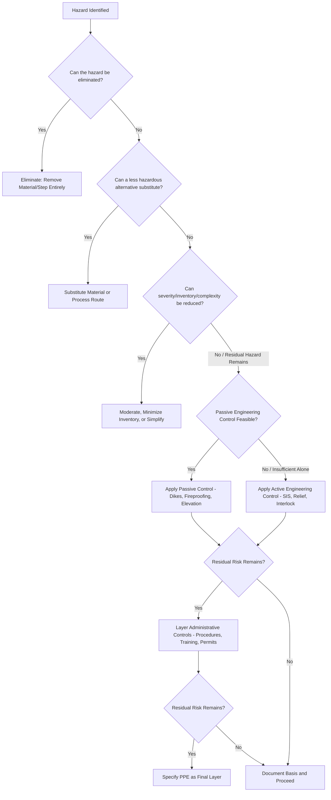

## Hierarchy of Controls in Process Design

### Purpose and Scope

The hierarchy of controls is a ranking framework for risk reduction strategies, ordered by inherent reliability and effectiveness rather than cost or convenience. In Process Safety Management, it guides decision-making at every stage — conceptual design, PHA recommendation resolution, Management of Change (MOC) review, and incident corrective action development — by pushing practitioners toward eliminating or reducing hazards at the source before relying on layers of protection that merely control or mitigate an already-present hazard. The framework originates from general industrial safety and occupational hygiene practice but is applied in PSM with a specific process-hazard emphasis, most explicitly through the concept of Inherently Safer Design (ISD).

### The Hierarchy, Ranked Most to Least Effective

**1. Elimination**

Physically removing the hazard entirely, such that no credible scenario involving it can occur.

- **Key Points**
  - The most effective and permanent risk reduction measure, since a hazard that does not exist cannot cause harm regardless of the reliability of any subsequent safeguard.
  - In process design, this often means removing a hazardous material or process step from the process entirely, not merely reducing its quantity or improving its containment.
- **Example**

  Replacing a chlorine gas disinfection system at a water treatment plant with an on-site sodium hypochlorite generation system eliminates the large pressurized chlorine gas inventory and its associated toxic release hazard entirely, rather than managing that hazard with improved containment or detection.

**2. Substitution**

Replacing a hazardous material, condition, or process route with a less hazardous alternative that still achieves the process objective.

- **Key Points**
  - Distinct from elimination in that the hazard category persists, but its severity, likelihood, or physical form is reduced.
  - Substitution decisions require care to confirm the replacement does not introduce a different, potentially comparable or greater hazard (e.g., a less toxic but more flammable or reactive substitute).
- **Example**

  Replacing a flammable solvent with a lower-flammability alternative in a cleaning process, or substituting a high-pressure liquefied gas storage system with an equivalent quantity stored as a dilute aqueous solution at atmospheric pressure.

**3. Moderation (Attenuation) / Simplification**

Reducing the hazard's severity through less severe operating conditions, smaller inventories, or reduced process complexity, without eliminating or substituting the hazardous material itself. This tier is often grouped together with the two above under the broader banner of **Inherently Safer Design (ISD)**, since all three act on the hazard itself rather than adding external protective layers.

- **Key Points**
  - **Minimization (Intensification)**: Reducing the quantity of hazardous material present at any given time (e.g., smaller intermediate storage vessels, continuous processing in place of large-batch processing to reduce standing inventory).
  - **Moderation**: Using less severe process conditions (lower pressure, lower temperature, dilute concentration) to reduce the energy available to drive an incident or reduce consequence severity if a release occurs.
  - **Simplification**: Designing the process to reduce the number of ways it can fail, eliminate unnecessary complexity, and make operator errors less likely or less consequential — for example, using gravity feed instead of a pumped transfer system with associated valves, instrumentation, and control logic.
  - **[Inference]** Simplification is sometimes treated as a distinct fourth ISD principle alongside minimization, substitution, and moderation, since it addresses human/system error likelihood rather than the physical hazard magnitude directly; different sources organize the ISD principle set somewhat differently.

**4. Engineering Controls (Passive and Active Safeguards)**

Once the hazard itself cannot be further reduced through elimination, substitution, or moderation, engineering controls physically constrain the hazard's effects or prevent the hazardous event from occurring, without depending on human action for their primary function.

- **Passive Engineering Controls**: Rely on physics/design geometry rather than moving parts, sensors, or logic to function (e.g., dikes/bunds for spill containment, blast walls, fireproofing, elevation of equipment above flood level). Generally considered more reliable than active controls because they have fewer failure modes and typically do not require power, signal, or actuation to function.
- **Active Engineering Controls**: Require detection, decision logic, and actuation to function (e.g., Safety Instrumented Systems (SIS), relief valves, interlocks, fire and gas detection systems triggering deluge or shutdown). More prone to failure modes such as sensor failure, logic solver malfunction, or actuator failure, and therefore typically assigned a quantified Probability of Failure on Demand (PFD) or Safety Integrity Level (SIL) rating to characterize their reliability, per IEC 61511/ISA-84.

**5. Administrative Controls**

Procedures, training, permits, and organizational rules intended to reduce risk by governing how people interact with the hazard, rather than by modifying the hazard or installing a physical safeguard.

- **Key Points**
  - Examples include standard operating procedures (SOPs), permit-to-work systems, lockout/tagout (LOTO), operator training and competency verification, and safety signage.
  - Generally regarded as less reliable than engineering controls because effectiveness depends on consistent human compliance, which can degrade under fatigue, time pressure, workload, or normalization of deviance over time.
  - Still essential in PSM programs — administrative controls are foundational elements under OSHA PSM (29 CFR 1910.119), including Operating Procedures, Training, and Permit-to-Work — but are not considered a substitute for available higher-tier controls where those are reasonably practicable.

**6. Personal Protective Equipment (PPE)**

The last line of defense, protecting the individual worker from a hazard that has not been eliminated, substituted, moderated, engineered against, or fully controlled administratively.

- **Key Points**
  - PPE protects only the wearer, does not reduce the hazard's likelihood or magnitude, and depends entirely on correct selection, fit, maintenance, and consistent use to be effective.
  - In process safety specifically (as distinct from general occupational safety), PPE is generally viewed as inadequate as a primary control for major hazard scenarios (large fires, explosions, toxic releases) given the potential severity and the impracticality of protecting bystanders, emergency responders, or the public through PPE alone.

### Relationship to Layers of Protection

The hierarchy of controls maps conceptually onto the Layers of Protection Analysis (LOPA) / Swiss cheese model used elsewhere in PSM, but with an important distinction: LOPA generally assumes the hazard is already present and asks how many independent protection layers stand between the hazard and a consequence, whereas the hierarchy of controls asks whether the hazard's presence or magnitude can be reduced *before* protection layers are even needed. Inherently safer design (elimination, substitution, moderation) reduces the *demand* on subsequent protection layers, while engineering, administrative, and PPE controls constitute those protection layers themselves.

### Illustrative Diagram: Hierarchy of Controls Pyramid (svg_diagram)

<svg xmlns="http://www.w3.org/2000/svg" viewBox="0 0 600 460">
<text x="300" y="24" font-size="16" text-anchor="middle" font-family="sans-serif" font-weight="bold">Hierarchy of Controls (svg_diagram)</text>
<polygon points="300,50 380,120 220,120" fill="#1a5632" />
<text x="300" y="90" font-size="12" text-anchor="middle" fill="white" font-family="sans-serif">Elimination</text>
<polygon points="220,120 380,120 420,180 180,180" fill="#2e7d4f" />
<text x="300" y="155" font-size="12" text-anchor="middle" fill="white" font-family="sans-serif">Substitution</text>
<polygon points="180,180 420,180 460,240 140,240" fill="#5a9e6f" />
<text x="300" y="215" font-size="12" text-anchor="middle" fill="white" font-family="sans-serif">Moderation / Simplification</text>
<polygon points="140,240 460,240 500,310 100,310" fill="#c8a13e" />
<text x="300" y="280" font-size="12" text-anchor="middle" fill="white" font-family="sans-serif">Engineering Controls</text>
<text x="300" y="296" font-size="10" text-anchor="middle" fill="white" font-family="sans-serif">(Passive then Active)</text>
<polygon points="100,310 500,310 540,380 60,380" fill="#c0632a" />
<text x="300" y="350" font-size="12" text-anchor="middle" fill="white" font-family="sans-serif">Administrative Controls</text>
<polygon points="60,380 540,380 570,440 30,440" fill="#a4302a" />
<text x="300" y="415" font-size="12" text-anchor="middle" fill="white" font-family="sans-serif">Personal Protective Equipment (PPE)</text>
<text x="300" y="455" font-size="11" text-anchor="middle" font-family="sans-serif">Reliability and permanence decrease from top to bottom</text>
</svg>

### Illustrative Diagram: Control Selection Decision Flow

### Application Across the Process Lifecycle

- **Conceptual/Front-End Design**: Highest leverage point for elimination, substitution, and minimization, since inventory and hazardous material selection decisions made early are far more costly to revisit once detailed engineering or construction has proceeded.
- **PHA (HAZOP/What-If) Recommendation Development**: Recommendations arising from a PHA should be evaluated against the hierarchy — a recurring PHA finding is that teams default to administrative controls (procedure changes, additional training) when a higher-tier engineering or inherently safer option was feasible but not considered.
- **Management of Change (MOC)**: Proposed changes should be screened for opportunities to apply higher-tier controls, and any change that removes or downgrades an existing higher-tier control (e.g., replacing an engineering interlock with a procedural check) warrants particular scrutiny.
- **Incident Investigation Corrective Actions**: Root cause analysis findings are strengthened when corrective actions target higher tiers of the hierarchy rather than defaulting to retraining or procedure revision alone, particularly where the causal chain reveals a hazard that could have been designed out.

### Common Pitfalls

- Defaulting to administrative controls or PPE because they are typically lower-cost and faster to implement, without documenting why higher-tier options (elimination, substitution, engineering controls) were not reasonably practicable.
- Treating "inherently safer design" as synonymous with "engineering controls," when ISD specifically refers to the top three tiers (elimination, substitution, moderation/simplification) that act on the hazard itself, not to added protective equipment.
- Introducing a substitute material or condition without independently assessing its own hazard profile, potentially trading one hazard category (e.g., toxicity) for another (e.g., increased flammability or reactivity) without a net risk reduction.
- Allowing MOC processes to approve downgrades from engineering to administrative controls without the same level of scrutiny applied to the original higher-tier control's implementation.

### Related Topics

- Inherently Safer Design Principles (Minimize, Substitute, Moderate, Simplify) in Detail
- Layers of Protection Analysis (LOPA)
- Safety Instrumented Systems (SIS) and SIL Determination (IEC 61511)
- Management of Change (MOC)
- Process Hazard Analysis (PHA) Methodologies
- Human Factors and Administrative Control Reliability
- Passive vs. Active Fire Protection Design
- Incident Investigation and Root Cause Analysis