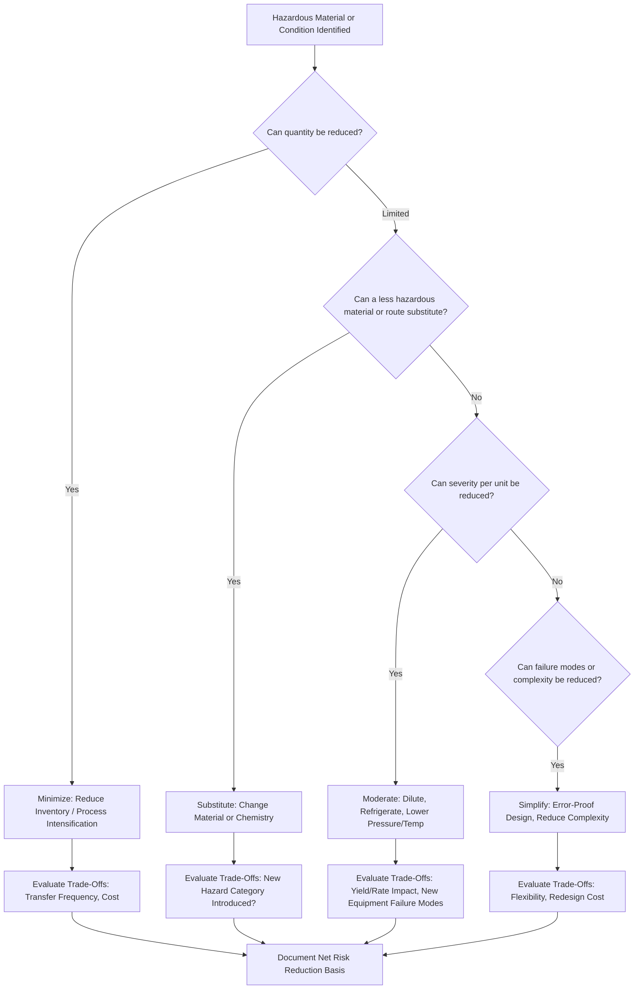

## Minimize, Substitute, Moderate, and Simplify Strategies

### Purpose and Scope

Minimize, Substitute, Moderate, and Simplify (often abbreviated MSMS) are the four core strategies of Inherently Safer Design (ISD) — the set of approaches that reduce or remove process hazards at their source rather than adding protective layers around an unchanged hazard. Together with elimination (the most radical form of minimization, reducing an inventory to zero), these strategies occupy the top tiers of the hierarchy of controls. This topic examines each strategy in technical depth, including engineering trade-offs, since ISD decisions frequently involve balancing one hazard reduction against a different, potentially offsetting risk.

The CCPS (Center for Chemical Process Safety) is the primary reference body formalizing these four categories, notably in *Inherently Safer Chemical Processes: A Life Cycle Approach*.

### Minimize (Intensification)

**Definition**

Reducing the quantity of hazardous material present in the process at any given time — the inventory available to participate in a loss-of-containment event — without necessarily removing the material or changing its form.

- **Key Points**
  - Directly reduces worst-case consequence magnitude (smaller flammable/toxic release mass means smaller fire, explosion, or toxic cloud footprint), independent of whether the frequency of a loss-of-containment event changes.
  - Common techniques: reducing intermediate storage vessel size, converting batch processes with large hold-up to continuous processes with small in-process inventory, using just-in-time feedstock delivery to avoid large on-site bulk storage, and process intensification (combining multiple unit operations into a single, smaller-volume unit, e.g., reactive distillation or microreactor technology).
  - **Process Intensification** is a specific engineering discipline within minimization: using microchannel reactors, spinning disc reactors, or other high-surface-area/high-heat-transfer designs to conduct reactions with dramatically reduced reaction volume and residence time compared to conventional stirred-tank reactors, for the same production rate.
- **Example**

  A specialty chemical manufacturer replaces a 5,000-gallon batch reactor (with a correspondingly large in-process inventory of a reactive intermediate) with a continuous plug-flow microreactor system that holds only a few liters of the same intermediate at any instant, reducing the worst-case release inventory by several orders of magnitude while maintaining equivalent annual production.
- **[Inference]** Minimization strategies that reduce standing inventory often also reduce the required size (and cost) of downstream protective systems (e.g., smaller relief systems, smaller secondary containment), providing a secondary economic benefit beyond the direct risk reduction, though this is not guaranteed in every case.

### Substitute

**Definition**

Replacing a hazardous material, chemical route, or process condition with a fundamentally different one that achieves the same process objective with reduced hazard.

- **Key Points**
  - Substitution can target any hazard dimension: toxicity, flammability, reactivity, corrosivity, or physical state (e.g., replacing a compressed gas with a liquid or solid form of a similar chemical function).
  - Route substitution (changing the reaction chemistry itself, not just a single material) is a more fundamental — and often more effective — application than simply swapping one raw material for a less hazardous one while keeping the same overall process.
  - Substitution decisions require full hazard characterization of the replacement, since a material safer along one axis may be more hazardous along another (e.g., a less toxic solvent that is significantly more flammable, or a less flammable material that is more reactive/unstable).
- **Example**

  The historic replacement, following the 1984 Bhopal disaster, of large on-site stored inventories of methyl isocyanate (MIC) — an extremely toxic intermediate — in some carbaryl pesticide manufacturing routes with alternative process chemistries that generate and consume MIC (or avoid it) with minimal or no bulk storage, is frequently cited as a landmark substitution/minimization case study in ISD literature.
- **[Unverified]** Not all carbaryl manufacturers adopted MIC-avoiding routes industry-wide, and the extent of adoption varies by facility and time period; this example is best understood as an illustrative case of the substitution principle rather than a claim about universal industry practice.

### Moderate (Attenuation)

**Definition**

Using less severe operating conditions (lower pressure, lower temperature, more dilute concentration) or a less hazardous physical form of the same material, reducing the energy available to drive an incident or the severity of its consequences if one occurs.

- **Key Points**
  - **Dilution**: Storing or handling a hazardous material in dilute (aqueous or otherwise) form rather than concentrated/pure form reduces the total hazardous mass fraction available in a given release volume.
  - **Refrigerated storage in place of pressurized storage**: Storing a liquefied gas at its boiling point at atmospheric pressure (refrigerated) rather than at ambient temperature under pressure reduces the flash fraction and initial release rate upon a containment breach, since refrigerated storage removes the driving force of stored pressure energy. This is a classic moderation example applied to materials such as ammonia and LPG.
  - **Lower-severity process conditions**: Operating a reaction at a lower temperature/pressure than the maximum theoretically achievable yield conditions, trading some yield or rate for a substantially reduced consequence severity if containment is lost or if a runaway reaction is initiated.
  - Moderation is distinct from minimization: minimization reduces *quantity*, moderation reduces *severity per unit quantity* (energy content, concentration, or physical form).
- **Example**

  Storing anhydrous ammonia refrigerated at approximately -33°C at near-atmospheric pressure, instead of at ambient temperature under approximately 8-10 bar pressure, means that a containment breach releases ammonia at a much lower initial flash-and-vaporization rate, producing a smaller and slower-developing vapor cloud for the same total mass released.

### Simplify

**Definition**

Designing a process to reduce the number of ways it can fail and to make errors — by operators, maintenance personnel, or the control system — less likely to occur or less consequential if they do occur.

- **Key Points**
  - Simplification targets complexity itself as a hazard driver: more components, more interconnections, more operator decision points, and more possible failure modes generally correlate with more opportunities for error or equipment failure, even when each individual component is reliable.
  - Techniques include: eliminating unnecessary piping/valve complexity, using gravity flow instead of pumped transfer where elevation permits, designing piping and equipment to make incorrect assembly or connection physically impossible (error-proofing/"poka-yoke" principles), using clear and unambiguous instrumentation/control system displays, and standardizing equipment and procedures across similar units to reduce the cognitive burden of operating multiple slightly different systems.
  - Simplification also encompasses reducing the need for human intervention in error-prone or hazardous tasks — for example, designing a system so that an operator does not need to manually align a complex valve lineup for a routine transfer, reducing the chance of an incorrect lineup causing a release or cross-contamination.
- **Example**

  A tank farm redesign standardizes all transfer piping to use color-coded, physically incompatible connection fittings for different chemical services, making it physically impossible to connect an incompatible hose to the wrong tank — removing reliance on operator vigilance or procedural compliance alone to prevent a cross-contamination or incompatible-mixing incident.

### Interactions and Trade-Offs Between Strategies

The four strategies are frequently applied in combination, and decisions in one dimension often affect feasibility or desirability in another:

| Strategy | Primary Hazard Dimension Addressed | Common Trade-Off Risk |
| --- | --- | --- |
| Minimize | Consequence magnitude (release mass) | May require more frequent transfers/deliveries, increasing transportation risk or transfer-operation frequency |
| Substitute | Intrinsic material hazard (toxicity, flammability, reactivity) | Replacement material may introduce a different hazard category |
| Moderate | Energy/severity per unit release | Lower-severity conditions may reduce yield, rate, or require additional equipment (e.g., refrigeration systems, which themselves have failure modes and energy requirements) |
| Simplify | Failure/error likelihood and consequence of error | Simplification may reduce operational flexibility or require upfront redesign investment |

**[Inference]** Because these trade-offs exist, a rigorous ISD evaluation is generally expected to include an assessment of whether a proposed change to one hazard dimension inadvertently increases risk along another dimension, rather than assuming any application of MSMS strategies is automatically net risk-reducing.

### Illustrative Diagram: MSMS Strategy Selection Flow

### Application in the Process Lifecycle

- **Research and Development / Route Selection**: The highest-leverage point for substitution (chemical route selection) and minimization (choosing continuous vs. batch chemistry), since changing the fundamental chemistry becomes progressively more difficult and costly once a route is scaled and committed to detailed design.
- **Conceptual and Basic Engineering Design**: Primary window for moderation decisions (storage conditions, operating pressure/temperature envelopes) and major simplification opportunities (plant layout, gravity flow feasibility).
- **Detailed Engineering**: Simplification at the equipment and piping level (error-proofing connections, standardizing components) remains feasible; minimize/substitute/moderate decisions become increasingly costly to revisit.
- **Operating Facility / Revamp**: MSMS strategies remain applicable during Management of Change (MOC) evaluations and PHA revalidations, though retrofitting inherently safer design into an existing operating facility is generally more constrained and costly than incorporating it at the design stage — a widely cited principle sometimes summarized as ISD having the greatest impact and lowest cost when applied earliest in the process lifecycle.

### Common Pitfalls

- Applying a minimization change (e.g., smaller intermediate storage) without accounting for the resulting increase in transfer frequency, which can shift risk from a static storage hazard to a more frequent dynamic transfer-operation hazard.
- Selecting a substitute material based on a single hazard metric (e.g., toxicity LD50) without characterizing its full hazard profile (flammability, reactivity, environmental persistence).
- Treating moderation (e.g., refrigerated storage) as risk-free, when the added refrigeration system introduces new equipment, utility dependencies, and failure modes (e.g., loss of refrigeration leading to autorefrigeration failure and pressure buildup) that must themselves be assessed.
- Overlooking simplification opportunities during detailed design because they appear to offer only marginal individual risk reduction, when their cumulative effect across many error-prone interfaces in a facility can be substantial.

### Related Topics

- Hierarchy of Controls in Process Design
- Elimination as the Foundational ISD Strategy
- Process Intensification Technologies (Microreactors, Reactive Distillation)
- Inherently Safer Design Life Cycle Application (CCPS Framework)
- Management of Change (MOC)
- Relief System Design and Runaway Reaction Prevention
- Case Study: Bhopal Disaster and Its Influence on ISD Practice
- Human Factors Engineering and Error-Proofing (Poka-Yoke) in Process Design