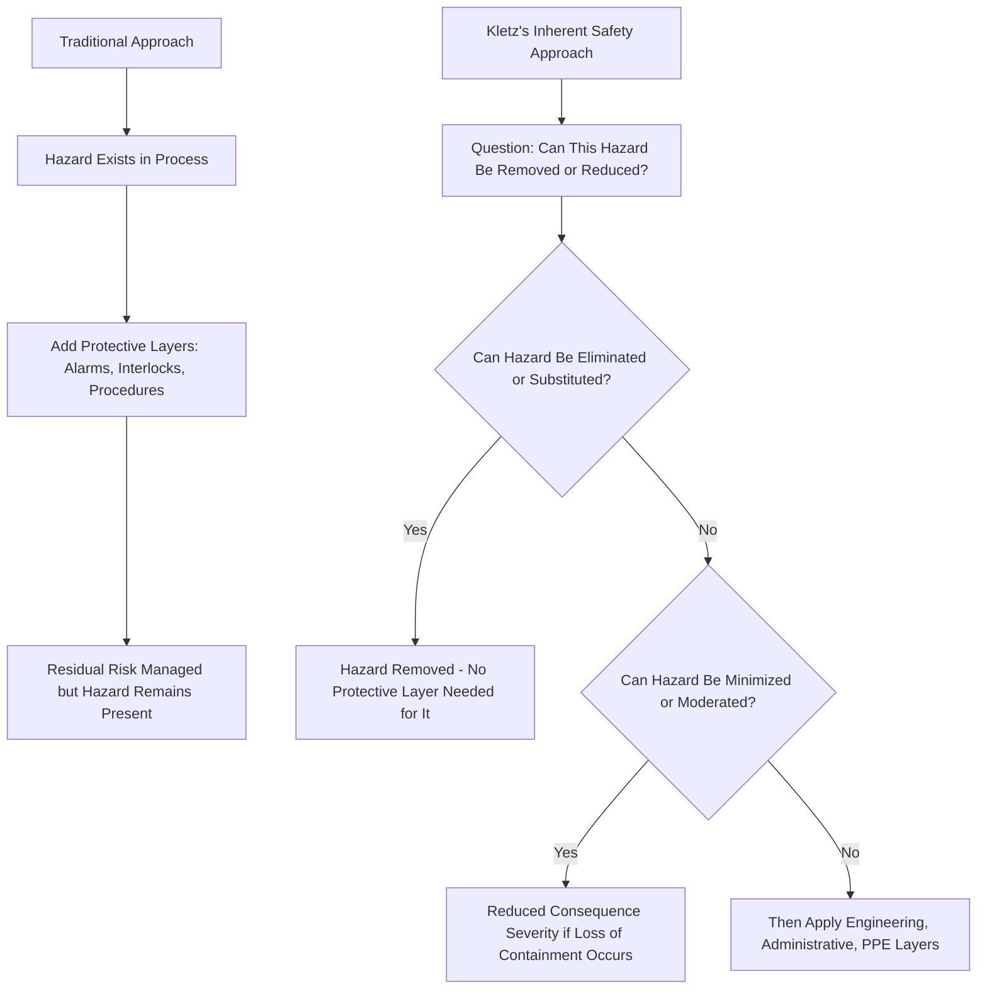

## Trevor Kletz and the Origins of Inherent Safety

### Purpose and Scope

Trevor Kletz (1922–2013) is widely credited as the founder of the inherent safety concept in process safety engineering. A British chemical engineer who spent much of his career at ICI (Imperial Chemical Industries) before becoming a prominent academic and consultant, Kletz reframed process safety thinking away from a near-exclusive reliance on added protective layers and toward the question of whether a hazard could be removed from the process altogether. This topic traces the origins of his ideas, their formalization into the inherent safety principles used throughout ISD today, and his broader influence on process safety culture and practice.

### Background and Career Context

Kletz worked as a chemical engineer and later as a technical safety advisor at ICI, one of the major British chemical manufacturing conglomerates of the 20th century, during a period spanning several decades of significant growth in large-scale chemical and petrochemical processing. His practical, hands-on exposure to plant incidents and near-misses over an extended industrial career gave him a distinctive vantage point: rather than treating safety as a specialist add-on function separate from process design, he argued that safety needed to be embedded in the fundamental engineering decisions made by process designers themselves.

- **Key Points**
  - Kletz is frequently described as having investigated or reviewed a very large number of industrial incidents over his career, which informed his conviction that many incidents shared common root patterns traceable to hazards that need not have been present in the first place.
  - He became particularly associated with the phrase "what you don't have, can't leak" — a plain-language summary of the elimination/minimization principle that remains one of the most quoted lines in process safety literature.
  - **[Unverified]** Specific biographical details such as exact dates of tenure, job titles held at ICI, and the precise number of incidents he is said to have reviewed vary somewhat across secondary sources; readers seeking precise biographical facts should consult primary CCPS or IChemE (Institution of Chemical Engineers) biographical materials rather than relying on a single secondary account.

### The Flixborough Disaster and Its Influence

The 1974 Flixborough disaster — a catastrophic vapor cloud explosion at a UK caprolactam manufacturing plant caused by the failure of a temporary bypass pipe carrying a large inventory of hot cyclohexane, killing 28 people — is widely cited in process safety literature as a pivotal event shaping British (and subsequently international) process safety thinking during the period when Kletz was developing his ideas.

- **Key Points**
  - The incident highlighted how a large standing inventory of a flammable, pressurized material, combined with an inadequately engineered temporary modification, could produce consequences far exceeding what existing protective systems were designed to contain.
  - **[Inference]** Flixborough and similar large-inventory incidents of that era are generally understood to have reinforced and popularized the inherent safety argument that Kletz was articulating — that reducing hazardous inventory reduces worst-case consequence severity independent of how well subsequent protective layers are designed — though Kletz's writing on inherent safety concepts is often described as predating and extending beyond any single incident.

### Formalization of Inherent Safety Principles

Kletz's central contribution was reframing the question process designers should ask from "how do we protect against this hazard?" to "can this hazard be removed or reduced before protection is even needed?" This reframing developed into the structured set of strategies now commonly organized as:

- **Intensification (Minimization)**: Using smaller quantities of hazardous material.
- **Substitution**: Replacing a hazardous material with a less hazardous one.
- **Attenuation (Moderation)**: Using a hazardous material under less hazardous conditions.
- **Limitation of Effects (by design or location)**: Designing the process/plant layout so that if a release occurs, its effects are inherently limited (related to, but distinct from, later separately-categorized simplification concepts).
- **Simplification**: Designing facilities to reduce the possibility of error and to make errors easier to detect and correct.
- **Key Points**
  - This framework was subsequently adopted and elaborated by the Center for Chemical Process Safety (CCPS), most notably in the widely referenced text *Inherently Safer Chemical Processes: A Life Cycle Approach*, which built directly on Kletz's terminology and conceptual structure.
  - Kletz authored numerous influential books that remain widely referenced in process safety education, including *What Went Wrong? Case Histories of Process Plant Disasters* and *Cheaper, Safer Plants, or Wealth and Safety at Work* — the latter title itself reflecting his argument that inherently safer design often reduces both risk and long-term cost simultaneously, rather than requiring a trade-off between safety and economics.
  - **[Unverified]** Exact publication years and edition histories of Kletz's books vary by edition; readers citing specific editions for academic or regulatory purposes should verify against publisher records.

### Core Philosophical Contributions Beyond the Technical Framework

- **Safety as a Design Responsibility, Not Solely an Add-On Function**: Kletz argued that process designers and engineers bear primary responsibility for identifying and removing hazards during design, rather than treating safety exclusively as the domain of a separate safety department applying controls after the design is largely fixed.
- **Skepticism of Over-Reliance on Procedures and Training**: Consistent with the hierarchy of controls, Kletz was a vocal critic of incident investigations and corrective action programs that defaulted to "operator error" findings and procedural/training fixes without asking whether the underlying hazard could have been designed out — a theme running through *What Went Wrong?*, which catalogs numerous incidents through this lens.
- **"Cheaper, Safer" Argument**: Kletz argued, and CCPS materials building on his work have continued to argue, that inherently safer designs frequently reduce both capital and operating costs over the process lifecycle (smaller equipment, less protective infrastructure, reduced insurance and regulatory burden) rather than inherent safety being an additional cost burden — reframing inherent safety as good engineering economics rather than purely a safety-driven constraint.

### Illustrative Diagram: Kletz's Reframing of the Safety Question

### Legacy and Continuing Influence

- **CCPS Adoption**: The Center for Chemical Process Safety formally incorporated and extended Kletz's inherent safety principles into its published guidance, which today underpins most industry and regulatory references to Inherently Safer Design.
- **Educational Influence**: Kletz's case-history-based writing style (particularly in *What Went Wrong?*) established a widely emulated approach to process safety education — teaching principles through detailed analysis of real incidents rather than abstract theory alone — a style still common in PSM training and PHA facilitator development today.
- **IChemE Recognition**: Kletz received significant recognition within the chemical engineering profession, including honors from the Institution of Chemical Engineers, reflecting his standing as a foundational figure in the discipline.
- **[Inference]** Kletz's framing continues to directly shape how modern regulatory guidance (including OSHA PSM interpretive materials and various international process safety regulations) discusses hazard reduction hierarchies, even where his name is not explicitly cited, given how thoroughly the elimination/substitution/moderation/simplification vocabulary has become embedded in standard process safety terminology.

### Common Pitfalls in Applying Kletz's Legacy

- Citing "inherent safety" as a philosophy without applying its actual analytical rigor — the framework requires systematically evaluating elimination and substitution options before defaulting to protective layers, not simply invoking the term as a general safety aspiration.
- Overlooking Kletz's parallel argument about cost: treating inherent safety purely as a safety-driven, potentially cost-increasing constraint, rather than recognizing the "cheaper, safer" argument that motivated much of his advocacy.
- Reducing his contribution to a single slogan ("what you don't have, can't leak") without engaging with the fuller structured framework (intensification, substitution, attenuation, limitation of effects, simplification) and its lifecycle application.

### Related Topics

- Hierarchy of Controls in Process Design
- Minimize, Substitute, Moderate, and Simplify Strategies (Detailed MSMS Framework)
- Flixborough Disaster (1974) — Case Study
- CCPS Inherently Safer Chemical Processes: A Life Cycle Approach
- History of Process Safety Regulation (OSHA PSM, Seveso Directive Origins)
- Incident Investigation and Root Cause Analysis Methodology
- Human Factors in Process Safety