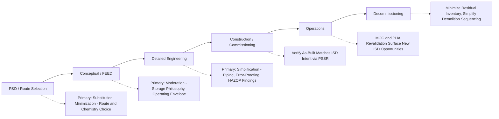

## Applying Inherently Safer Design Across the Project Lifecycle

### Purpose and Scope

Inherently Safer Design (ISD) is not a single design review event but a discipline that must be revisited at every stage of a project's life, from initial research through decommissioning. The opportunity to apply ISD strategies (elimination, substitution, minimization, moderation, simplification) and the cost of doing so change dramatically across this lifecycle: early-stage decisions offer the greatest freedom and lowest cost of change, while later-stage decisions become increasingly constrained by prior commitments in chemistry, equipment, and capital already spent. This topic maps ISD application to each major project phase, following the lifecycle structure formalized by CCPS in its guidance on inherently safer processes.

### The Diminishing-Freedom, Increasing-Cost Principle

A foundational concept underlying lifecycle-based ISD is that the freedom to make fundamental changes decreases, and the cost of making them increases, as a project proceeds. Changing the underlying chemical route during research is comparatively low-cost; changing it after a plant is operating is often prohibitively expensive, potentially requiring a full re-permit, re-engineering, and construction shutdown.

- **Key Points**
  - This principle mirrors similar cost-of-change curves in other engineering disciplines (e.g., software defect cost curves) and is a primary argument for front-loading ISD review rather than treating it as a late-stage compliance checklist item.
  - **[Inference]** Because later-stage ISD opportunities are more constrained, many organizations formalize ISD review as a mandatory gate at each major project stage (rather than a single review), specifically to capture the strategies that remain available at each point before that window closes.

### Illustrative Diagram: Freedom vs. Cost of Change Across Project Phases

<svg xmlns="http://www.w3.org/2000/svg" viewBox="0 0 640 360">
<text x="320" y="24" font-size="16" text-anchor="middle" font-family="sans-serif" font-weight="bold">ISD Freedom and Cost of Change (svg_diagram)</text>
<line x1="70" y1="290" x2="600" y2="290" stroke="black" stroke-width="1.5" />
<line x1="70" y1="290" x2="70" y2="50" stroke="black" stroke-width="1.5" />
<text x="335" y="325" font-size="12" text-anchor="middle" font-family="sans-serif">Project Lifecycle Phase</text>
<path d="M 90 80 Q 250 90 350 160 Q 450 220 580 260" stroke="#2e7d4f" stroke-width="2.5" fill="none" />
<text x="140" y="70" font-size="11" font-family="sans-serif" fill="#2e7d4f">Freedom to Change (ISD leverage)</text>
<path d="M 90 270 Q 250 260 350 190 Q 450 120 580 70" stroke="#c0392b" stroke-width="2.5" fill="none" />
<text x="430" y="65" font-size="11" font-family="sans-serif" fill="#c0392b">Cost of Change</text>
<text x="90" y="305" font-size="10" text-anchor="middle" font-family="sans-serif">R&amp;D</text>
<text x="220" y="305" font-size="10" text-anchor="middle" font-family="sans-serif">Concept</text>
<text x="330" y="305" font-size="10" text-anchor="middle" font-family="sans-serif">Basic Eng.</text>
<text x="440" y="305" font-size="10" text-anchor="middle" font-family="sans-serif">Detailed Eng.</text>
<text x="560" y="305" font-size="10" text-anchor="middle" font-family="sans-serif">Operations</text>
</svg>

### Phase 1: Research and Development / Route Selection

**Objective**: Select the fundamental chemistry and process concept.

- **Key Points**
  - Highest-leverage point for **substitution** (choosing an entire reaction route or catalyst system with lower intrinsic hazard) and **minimization** (choosing continuous versus large-batch chemistry from the outset).
  - Hazard screening at this stage often relies on preliminary data (literature values, small-scale calorimetry, group-contribution hazard estimation) rather than full process-specific testing, since the process itself is not yet defined in detail.
  - Decisions here — e.g., whether a synthesis route requires a highly toxic or unstable intermediate at any point, and whether that intermediate must be isolated/stored or can be generated and consumed in situ — set the ceiling on what later ISD strategies can achieve.
- **Example**

  A route requiring isolation and storage of an unstable peroxide intermediate can, if identified during route screening, potentially be replaced with an alternative synthetic path that avoids peroxide isolation entirely — an option foreclosed once a plant is designed and built around the original route.

### Phase 2: Conceptual / Front-End Engineering Design (FEED)

**Objective**: Establish process flow, major equipment types, storage philosophy, and plant layout concept.

- **Key Points**
  - Primary window for **moderation** decisions: operating pressure/temperature envelope, storage philosophy (refrigerated vs. pressurized, concentrated vs. dilute), and major inventory sizing.
  - Plant layout concepts established here strongly influence later **simplification** opportunities (e.g., whether gravity flow is feasible between units, proximity of occupied buildings to hazardous inventories feeding into facility siting).
  - This phase typically includes the first formal ISD review or checklist exercise in many corporate project stage-gate processes, often conducted alongside or just before the first PHA (a "PHA-lite" or hazard identification study at concept stage).
- **Example**

  During FEED for an ammonia refrigeration system, the design team evaluates refrigerated atmospheric storage versus pressurized ambient-temperature storage for the ammonia inventory — a moderation decision that becomes essentially fixed once foundations and major vessel procurement proceed into detailed engineering.

### Phase 3: Detailed Engineering Design

**Objective**: Finalize piping, instrumentation, equipment specifications, and control system design.

- **Key Points**
  - Major elimination/substitution/moderation decisions are largely locked in by this stage; remaining ISD opportunities concentrate on **simplification** at the equipment and piping level.
  - Techniques include error-proofing connections (incompatible fittings for different chemical services), minimizing unnecessary valve manifolds and complex lineups, standardizing equipment models and control philosophies across similar units, and designing clear, unambiguous instrumentation displays.
  - This phase typically includes formal HAZOP studies, which frequently surface residual ISD opportunities (e.g., "could this bypass line be eliminated rather than protected by an interlock?") — Kletz's own writing emphasized that HAZOP teams should explicitly ask the ISD question rather than moving directly to protective-layer recommendations.
  - **[Inference]** Because detailed engineering HAZOPs are typically the last formal hazard review before construction, ISD-oriented recommendations arising here carry particular weight, since deferring them to the operating phase substantially increases implementation cost.

### Phase 4: Construction and Commissioning

**Objective**: Build and start up the facility as designed.

- **Key Points**
  - ISD opportunities are largely exhausted at the process design level by this stage; the focus shifts to ensuring the as-built facility matches the ISD-informed design intent (i.e., verifying that field changes made during construction have not inadvertently reintroduced complexity or hazard that the design phase eliminated).
  - Pre-startup safety review (PSSR), a required element under OSHA PSM (29 CFR 1910.119), serves as a checkpoint to confirm that field deviations from the design (which sometimes occur due to constructability issues) have not compromised ISD features incorporated earlier.
  - **[Inference]** Field changes made under time or cost pressure during construction are a plausible point where simplification features (e.g., specified error-proof connections) could be value-engineered out without an equivalent hazard review; PSSR is the intended checkpoint against this failure mode, though its effectiveness in practice depends on how rigorously it is executed.

### Phase 5: Operations

**Objective**: Operate the facility safely and reliably over its service life.

- **Key Points**
  - ISD strategies remain applicable through **Management of Change (MOC)** review of any proposed modification, and through **PHA revalidation** (typically every 5 years under OSHA PSM), which should re-examine whether elimination/substitution/moderation options have become newly feasible (e.g., due to new materials, technology, or changed production requirements) since the original design.
  - Incident investigations and near-miss analysis during operations frequently surface latent ISD opportunities — cases where a hazard that could have been designed out instead relies on an operating procedure or engineering control that has since failed or been found less reliable than assumed.
  - Retrofitting inherently safer design into an operating facility (e.g., replacing a pressurized storage system with refrigerated storage) is feasible but typically requires a shutdown, significant capital investment, and its own MOC and PHA process — substantially more constrained than the same decision made during FEED.
- **Example**

  A facility operating a pressurized chlorine storage system for many years identifies, during a PHA revalidation, that newer on-site generation technology (unavailable or immature at original design time) could eliminate the bulk chlorine inventory entirely — triggering a capital project to retrofit an ISD improvement that was not achievable at original construction.

### Phase 6: Decommissioning

**Objective**: Safely remove the facility from service and manage residual hazards.

- **Key Points**
  - ISD principles apply in reverse during decommissioning: minimizing residual inventories requiring disposal, substituting hazardous cleaning/decontamination chemicals with less hazardous alternatives where feasible, and simplifying demolition sequencing to reduce the number of hazardous line-breaking or vessel-entry operations required.
  - **[Inference]** Decommissioning-phase ISD is comparatively less developed in mainstream literature relative to design-phase ISD, since most CCPS and industry guidance historically emphasizes the design and operating phases; specific decommissioning ISD guidance should be sought from asset retirement and demolition safety references rather than assumed to mirror design-phase practice directly.

### Illustrative Diagram: ISD Application Across the Project Lifecycle

### Integration with Other PSM Elements

- **Process Hazard Analysis (PHA)**: Each PHA revalidation cycle is an opportunity to reassess whether higher-tier ISD strategies have become newly available since the previous review (new technology, materials, or regulatory drivers).
- **Management of Change (MOC)**: Every proposed change should be screened not only for whether it introduces new hazards, but for whether it represents a missed opportunity to apply an ISD strategy instead of an added protective layer.
- **Pre-Startup Safety Review (PSSR)**: Verifies that ISD features specified in design are actually present in the as-built and as-commissioned facility.
- **Incident Investigation**: Root cause analyses should explicitly ask whether the hazard involved could have been eliminated, substituted, minimized, or moderated, rather than concluding solely with procedural or training corrective actions.

### Common Pitfalls

- Treating ISD review as a one-time checklist exercise at a single project gate rather than a recurring discipline applied at each lifecycle phase where different strategies remain available.
- Allowing value engineering during detailed design or construction to remove simplification/error-proofing features without an equivalent hazard re-review, on the assumption that such features are merely nice-to-have rather than risk-reducing.
- Assuming that because major ISD decisions (route, chemistry) were addressed at the R&D stage, no further ISD consideration is warranted during later phases, overlooking the substantial simplification and moderation opportunities that remain available well into detailed engineering.
- Failing to revisit ISD options during PHA revalidation cycles, missing opportunities created by new technology or materials that were not available or mature at original design time.

### Related Topics

- Hierarchy of Controls in Process Design
- Minimize, Substitute, Moderate, and Simplify Strategies
- Trevor Kletz and the Origins of Inherent Safety
- Management of Change (MOC)
- Pre-Startup Safety Review (PSSR)
- Process Hazard Analysis (PHA) Revalidation Requirements
- CCPS Inherently Safer Chemical Processes: A Life Cycle Approach
- Capital Project Stage-Gate Processes and Safety Review Integration