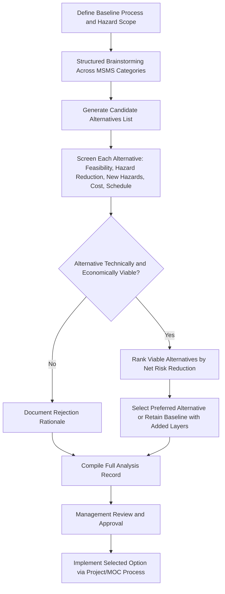

## Safer Technology and Alternatives Analysis in Practice

### Purpose and Scope

Inherently Safer Technology and Alternatives Analysis (commonly abbreviated IST/ISAA, and closely related to what some U.S. state regulations term Inherent Safety Analysis or Safer Alternatives Analysis) is the formal, documented process by which an organization systematically evaluates whether elimination, substitution, minimization, moderation, or simplification options exist for a given hazardous process, and records the basis for whichever option is ultimately selected — including options rejected and why. Where earlier topics in this chapter addressed the conceptual strategies (MSMS) and lifecycle timing of ISD, this topic focuses on how alternatives analysis is actually structured, executed, and documented as a defensible, auditable practice, including its regulatory drivers in specific jurisdictions.

### Regulatory and Policy Drivers

Unlike general ISD principles (which are widely regarded as good practice but not universally mandated), several specific jurisdictions have codified requirements to formally analyze and document inherently safer alternatives for certain high-hazard processes.

- **New Jersey Toxic Catastrophe Prevention Act (TCPA)**: One of the earliest explicit U.S. state-level regulatory requirements for facilities handling extraordinarily hazardous substances above threshold quantities to conduct and document an Inherent Safety Review as part of their risk management program.
- **California Contra Costa County Industrial Safety Ordinance (ISO) and CalARP Program 4**: Requires covered petroleum refineries and chemical facilities in specific California counties to conduct a formal Safer Alternatives Analysis for major changes and as part of periodic hazard review, including consideration of inherently safer systems.
- **U.S. Chemical Safety Board (CSB) Recommendations**: Following several major incidents, the CSB has issued recommendations to OSHA and EPA advocating for broader inclusion of IST analysis requirements in PSM (29 CFR 1910.119) and RMP (40 CFR Part 68) regulations; as of general industry practice, IST analysis remains a recommended/best-practice element in most jurisdictions rather than a uniform federal PSM/RMP mandate.
- **[Unverified]** Regulatory requirements in this area are subject to periodic legislative and rulemaking change; the current applicability of any specific federal, state, or local IST analysis requirement should be verified against the current regulation text and any recent amendments rather than assumed static.

### Structuring an Alternatives Analysis

A defensible IST/alternatives analysis generally follows a structured comparative framework rather than an informal discussion, so that the basis for the final decision can be audited by regulators, corporate risk management, or future project teams.

**1. Define the Baseline Process and Hazard**

Clearly characterize the current (or proposed) process, the specific hazardous material(s) and inventory involved, and the hazard scenarios of concern (fire, explosion, toxic release, reactive hazard) that the analysis is meant to address.

**2. Identify Candidate Alternatives**

Systematically generate alternatives across each MSMS category, rather than only considering options that happen to be already familiar to the design team:

- Elimination/substitution alternatives (different chemistry, different raw material, different intermediate).
- Minimization alternatives (smaller inventory, different process technology such as continuous vs. batch).
- Moderation alternatives (different storage/operating conditions).
- Simplification alternatives (reduced complexity in equipment, control, or operating sequence).
- **Key Points**
  - Structured brainstorming techniques (e.g., a dedicated ISD brainstorming session distinct from a standard HAZOP, sometimes using checklists derived from CCPS guidance) are commonly used to ensure the alternative-generation step is not limited to options already familiar to the team.
  - **[Inference]** Analyses that skip a deliberate, structured alternative-generation step and move directly to evaluating a single pre-selected option are generally considered weaker from an audit/defensibility standpoint, since they cannot demonstrate that a genuine range of options was considered.

**3. Screen and Evaluate Alternatives**

Each candidate alternative is evaluated against multiple criteria, typically including:

| Criterion | Description |
| --- | --- |
| Technical feasibility | Can the alternative actually achieve the required process function/product specification? |
| Hazard reduction magnitude | How much does the alternative reduce consequence severity and/or likelihood, across all relevant hazard categories? |
| New hazards introduced | Does the alternative introduce a different hazard (e.g., a substitute with lower toxicity but higher flammability)? |
| Cost | Capital and operating cost impact, including any offsetting savings from smaller protective systems, reduced insurance, or reduced regulatory burden. |
| Schedule/implementation timeline | How disruptive is implementation, particularly for retrofits to an operating facility? |
| Environmental and other regulatory impacts | Does the alternative shift risk to a different domain (e.g., increased wastewater treatment burden, different air emissions profile)? |

**4. Rank and Select**

Alternatives are typically ranked using a semi-quantitative or qualitative risk-ranking matrix (similar in structure to PHA risk ranking), explicitly comparing the hazard reduction achieved against feasibility and cost, with the selection rationale documented.

**5. Document the Decision Basis**

A defensible IST/alternatives analysis record includes not only the selected option but the alternatives considered and rejected, and the specific technical, economic, or feasibility reasons for rejection — this documentation is often the primary artifact reviewed by regulators or auditors under jurisdictions with a formal IST analysis requirement.

- **[Inference]** Because rejected-alternative documentation is often the most scrutinized part of a regulatory IST analysis record, organizations operating under jurisdictions with formal requirements generally treat thorough rejection-rationale documentation as at least as important as documenting the selected option itself.

### Illustrative Diagram: Alternatives Analysis Process Flow

### Semi-Quantitative Ranking Approaches

Some organizations apply a numerical or matrix-based scoring approach to compare alternatives more systematically, assigning scores across weighted criteria (hazard reduction, cost, feasibility) and calculating a composite ranking score. **[Inference]** While such scoring frameworks add a degree of structure and comparability, they inherently embed subjective weighting choices (how much weight to give cost versus hazard reduction, for example), so the resulting ranking should be understood as a structured aid to expert judgment rather than a fully objective, weighting-independent output.

### Common Frameworks and Tools Referenced in Practice

- **CCPS Inherent Safety Checklist and Index-Based Tools**: CCPS guidance provides checklists and, in some editions, index-based scoring tools (drawing on concepts from academic inherent safety index research, such as the Dow Fire and Explosion Index adapted for inherent safety scoring) to support structured comparison.
- **Prototype Inherent Safety Index Approaches**: Academic literature has proposed various quantitative inherent safety indices (combining sub-indices for reactivity, flammability, toxicity, inventory, and process conditions) intended to allow numerical comparison between process alternatives at an early design stage.
- **[Unverified]** The degree of industry-wide standardization on any single quantitative inherent safety index is limited; different organizations and academic sources have proposed distinct index formulations, and no single index is universally adopted as an industry standard comparable to, for example, the Dow Fire and Explosion Index's role in fire/explosion hazard ranking.

### Integration with Other PSM Elements

- **Process Hazard Analysis (PHA)**: IST/alternatives analysis findings and the rationale for the selected design often feed directly into PHA scope and risk ranking discussions, since the PHA team should understand why the process was designed as it was rather than re-litigating fundamental design choices during a HAZOP session.
- **Management of Change (MOC)**: Significant process changes, particularly those triggered by a formal regulatory IST requirement (e.g., California ISO major change triggers), require a documented alternatives analysis as part of the MOC package.
- **Capital Project Stage-Gate Process**: Formal IST/alternatives analysis is typically embedded as a required deliverable at specific project gates (commonly at the conceptual design and detailed design stages) in organizations with mature ISD programs.
- **Facility Siting**: Alternatives analysis outcomes that change process inventory or hazard footprint directly affect facility siting studies conducted concurrently or subsequently.

### Common Pitfalls

- Conducting an alternatives analysis as a retrospective justification exercise for a decision already made, rather than as a genuine input to the decision — undermining both its safety value and its defensibility under audit or regulatory review.
- Documenting only the selected alternative without adequately recording the alternatives considered and rejected, weakening the analysis's defensibility under regulatory frameworks that specifically require this documentation.
- Applying numerical scoring frameworks without transparently documenting the weighting assumptions used, making the resulting ranking difficult for later reviewers to interpret or challenge.
- Treating IST/alternatives analysis as a one-time regulatory compliance exercise rather than integrating it into recurring PHA revalidation and MOC processes where new alternatives may have become available since the original analysis.

### Related Topics

- Hierarchy of Controls in Process Design
- Minimize, Substitute, Moderate, and Simplify Strategies
- Applying Inherently Safer Design Across the Project Lifecycle
- Management of Change (MOC)
- Process Hazard Analysis (PHA) Methodologies
- Dow Fire and Explosion Index and Chemical Exposure Index
- California CalARP Program 4 and Contra Costa County Industrial Safety Ordinance
- New Jersey Toxic Catastrophe Prevention Act (TCPA)