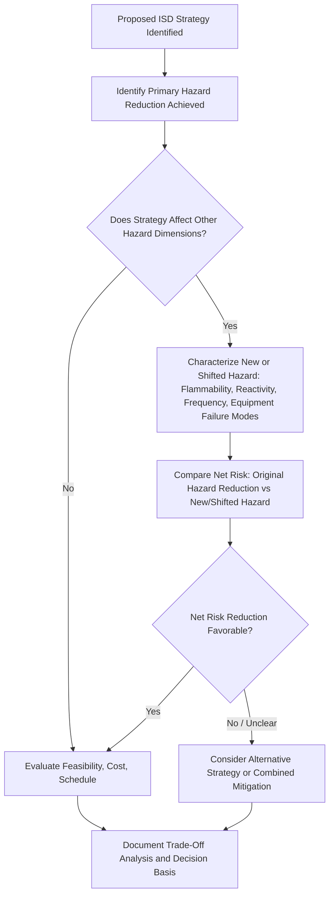

## Trade-Offs and Conflicts Between Inherently Safer Design Strategies

### Purpose and Scope

Inherently Safer Design (ISD) is frequently presented as an unambiguous good — reduce hazard, reduce risk. In practice, individual ISD strategies can conflict with one another, with other PSM objectives, or with non-safety project constraints, such that applying one strategy fully may worsen a different hazard dimension or undermine a different safety-relevant goal. This topic examines these tensions systematically, since a mature ISD program requires evaluating net risk across all affected hazard categories rather than optimizing a single dimension in isolation. Kletz himself acknowledged that inherent safety decisions frequently require balancing competing hazards rather than offering a single dominant solution.

### Conflicts Within the MSMS Framework Itself

**Minimization vs. Transfer/Handling Frequency**

Reducing standing inventory (minimization) often requires more frequent replenishment — more frequent deliveries, more frequent transfer operations, more frequent connection/disconnection of transfer equipment.

- **Key Points**
  - Each transfer operation is itself a discrete hazard event (potential for spill, incorrect connection, hose failure) with its own frequency and consequence profile; increasing transfer frequency to reduce standing inventory can, in some cases, increase the cumulative frequency-weighted risk from transfer operations even as it reduces the worst-case single-event consequence.
  - **[Inference]** Whether a minimization strategy produces a net risk reduction in this scenario depends on the relative consequence severity of the large-inventory worst case versus the frequency-weighted risk of more numerous smaller transfer events; this generally requires explicit quantitative comparison (e.g., via QRA) rather than assuming minimization is automatically superior.
- **Example**

  Reducing on-site chlorine storage from a single large rail car quantity to multiple smaller cylinders reduces worst-case release magnitude, but multiplies the number of cylinder change-out operations per year, each carrying its own (smaller but nonzero) release probability from connection/disconnection activities.

**Substitution vs. Introducing a Different Hazard Category**

A substitute material chosen to reduce one hazard dimension (e.g., toxicity) may score worse on another (e.g., flammability, reactivity, or environmental persistence).

- **Key Points**
  - Classic example: replacing a toxic but non-flammable solvent with a less toxic but highly flammable alternative may reduce acute toxic exposure risk to workers and the public while increasing fire/explosion risk — whether this is a net improvement depends on the relative severity and likelihood of each hazard category at the specific facility.
  - Environmental substitution trade-offs are also common: a substitute chosen for reduced acute process safety hazard may have worse long-term environmental persistence or ecotoxicity, shifting risk from an acute process safety domain to a chronic environmental domain.
- **[Inference]** A rigorous substitution evaluation should screen the candidate replacement across the full hazard spectrum (toxicity, flammability, reactivity, corrosivity, environmental fate) rather than only the single hazard dimension that motivated the substitution search, precisely because single-dimension substitution decisions are a recurring source of unintended consequence.

**Moderation vs. Added Equipment Failure Modes**

Moderating a hazard (e.g., refrigerated storage instead of pressurized storage) often requires additional equipment (refrigeration systems, insulation, monitoring) that introduces its own failure modes and utility dependencies.

- **Key Points**
  - Refrigerated storage of a liquefied gas reduces flash-fraction consequence severity on containment breach, but introduces dependency on continuous refrigeration system operation; loss of refrigeration (e.g., from a power failure) can lead to autorefrigeration loss and gradual pressure buildup, a failure mode that does not exist in an equivalent pressurized ambient-temperature storage system.
  - This does not mean moderation is undesirable — it means the added equipment's reliability and failure modes must be assessed as part of the same evaluation, since the net risk depends on both the achieved consequence reduction and the new failure modes introduced.

**Simplification vs. Operational Flexibility**

Simplifying a process (fewer valves, fewer control points, more standardized configurations) can reduce operational flexibility needed for varying feedstocks, product grades, or maintenance access.

- **Key Points**
  - A highly simplified piping configuration that eliminates redundant bypass routes reduces the failure modes associated with those bypasses but may also eliminate the flexibility needed to isolate equipment for maintenance without a full unit shutdown, potentially creating pressure to defer maintenance or accept elevated risk during forced continuous operation.
  - **[Inference]** This tension is generally resolved by distinguishing between complexity that exists purely as a failure-mode source (e.g., a bypass installed once for a one-time historical reason and never removed) versus complexity that serves a genuine, ongoing operational or maintenance function; simplification is intended to target the former, not eliminate necessary flexibility.

### Conflicts Between ISD and Other Objectives

**ISD vs. Capital and Operating Cost**

While Kletz and CCPS argue that ISD is frequently "cheaper, safer" over the full project lifecycle, individual ISD measures can carry higher upfront capital cost even when they reduce long-term operating cost or risk (e.g., process intensification technology, refrigerated storage systems, continuous processing conversions from batch).

- **[Inference]** Lifecycle cost-benefit analysis, rather than capital cost alone, is generally the appropriate basis for evaluating whether an ISD option is economically favorable, since upfront capital cost comparisons alone can systematically undervalue ISD options whose benefit accrues through reduced protective system requirements, reduced insurance premiums, or reduced regulatory burden over the operating life of the facility.

**ISD vs. Production Rate, Yield, or Product Quality**

Moderation strategies (lower temperature/pressure operating conditions) can reduce reaction rate, yield, or selectivity, creating tension with production and commercial objectives.

- **[Inference]** Resolving this tension typically requires evaluating whether the yield/rate penalty can be offset through other process improvements (catalyst development, longer residence time via larger equipment) or whether the safety benefit justifies accepting some commercial penalty — a judgment that depends on facility-specific economics and risk tolerance rather than following a universal formula.

**ISD vs. Existing Infrastructure and Sunk Investment**

At operating facilities, retrofitting an ISD improvement often means writing off or substantially modifying existing, functional equipment — creating organizational resistance distinct from the technical trade-offs discussed above.

- **[Inference]** This is more an organizational/economic barrier than a technical trade-off between ISD strategies, but it is frequently cited in process safety literature as a major practical obstacle to ISD adoption at existing facilities, since sunk capital cost naturally creates resistance to write-offs even when a lifecycle analysis would favor the change.

### Illustrative Diagram: Trade-Off Evaluation Framework

### Structured Approaches to Resolving Trade-Offs

- **Quantitative Risk Comparison**: Where feasible, using consequence and frequency modeling to compare the aggregate risk (not just worst-case severity) of competing options — particularly relevant for the minimization-vs-transfer-frequency conflict, where frequency-weighted comparison is often the only rigorous way to determine the net effect.
- **Multi-Attribute Decision Analysis**: Structured scoring across multiple hazard and non-hazard criteria (as discussed under alternatives analysis), making the trade-off explicit and documented rather than resolved through unstated judgment.
- **Sensitivity Analysis**: Testing how sensitive the preferred option ranking is to key assumptions (e.g., transfer operation failure frequency, refrigeration system reliability), since trade-off conclusions are often sensitive to specific input assumptions that carry their own uncertainty.
- **[Inference]** No single resolution method is universally applicable across all trade-off types; the appropriate method depends on whether the competing hazards are of comparable type (allowing more direct quantitative comparison) or fundamentally different in kind (e.g., acute process safety risk versus chronic environmental risk), where a multi-attribute or qualitative judgment approach is often more practical than forcing a single quantitative risk metric.

### Integration with Other PSM Elements

- **Process Hazard Analysis (PHA)**: PHA teams evaluating ISD-related recommendations should explicitly discuss potential trade-offs rather than treating any ISD-labeled option as automatically superior to the baseline.
- **Layers of Protection Analysis (LOPA)**: Where an ISD trade-off analysis concludes that some residual hazard remains after the best available balance of strategies, LOPA determines what additional independent protection layers are needed to manage that residual risk.
- **Management of Change (MOC)**: Trade-off analysis should be documented as part of the technical basis for any change justified on ISD grounds, particularly where the change shifts risk between hazard categories rather than uniformly reducing it.
- **Safer Technology and Alternatives Analysis**: The formal alternatives analysis process is the natural home for documenting trade-off evaluations, since it already requires comparing options across multiple criteria including hazard reduction magnitude and new hazards introduced.

### Common Pitfalls

- Evaluating an ISD strategy against only the single hazard dimension it was intended to address, missing a shifted or newly introduced hazard in a different category.
- Assuming any strategy labeled "inherently safer" is automatically net risk-reducing without a documented comparative analysis, particularly for minimization strategies that trade inventory reduction for increased operational frequency.
- Resolving trade-offs based on capital cost alone rather than lifecycle risk and cost, systematically undervaluing ISD options with higher upfront but lower lifecycle cost or risk.
- Failing to reassess added equipment (e.g., refrigeration systems introduced for moderation) with the same rigor applied to the original hazard, treating the mitigating equipment as risk-free by default.

### Related Topics

- Minimize, Substitute, Moderate, and Simplify Strategies
- Safer Technology and Alternatives Analysis in Practice
- Hierarchy of Controls in Process Design
- Layers of Protection Analysis (LOPA)
- Quantitative Risk Assessment (QRA) Methodology
- Management of Change (MOC)
- Trevor Kletz and the Origins of Inherent Safety
- Human Factors in Process Safety and Operational Flexibility