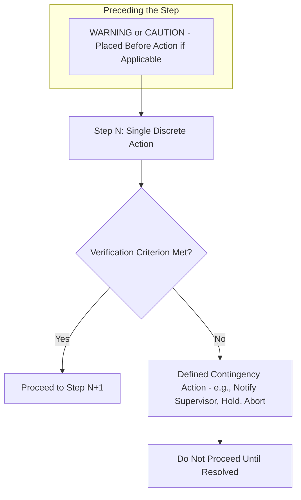

## Writing Clear and Usable Operating Procedures


### Purpose and Scope

Operating procedures are a foundational element under OSHA PSM (29 CFR 1910.119(f)) and equivalent international frameworks, required to cover all operating phases of a covered process: initial startup, normal operations, temporary operations, emergency shutdown, emergency operations, normal shutdown, and startup following a turnaround or emergency shutdown. However, regulatory compliance (a procedure existing and covering the required phases) is distinct from operational effectiveness (a procedure operators actually use correctly under real working conditions). This topic addresses the technical writing discipline needed to produce procedures that are both compliant and genuinely usable — a distinction repeatedly identified as a contributing factor in incident investigations where a written procedure existed but was not followed, misunderstood, or was practically unusable at the point of use.

### Why Procedure Quality Matters in PSM

Poorly written procedures contribute to incidents not only through outright non-compliance but through several more subtle failure modes: ambiguous instructions that operators interpret inconsistently, procedures so long or poorly organized that operators default to memory or informal practice rather than following the document in real time, and procedures that fail to reflect how the process is actually operated (a gap sometimes called the "work-as-imagined vs. work-as-done" divide).

- **Key Points**
  - Incident investigations frequently distinguish between a procedure's *existence* (satisfying a compliance audit) and its *use* (whether operators actually reference and follow it during the task, particularly for infrequent or high-consequence operations like startup after a turnaround).
  - **[Inference]** Procedures for frequently performed, low-complexity tasks are generally at lower risk of being unusable in practice than procedures for infrequent, high-complexity tasks (startup, non-routine operations), since operators develop reliable tacit knowledge for frequent tasks but have less opportunity to build that same familiarity for rare ones — precisely the tasks where a well-written procedure matters most.

### Core Writing Principles

**Clarity and Unambiguous Language**

- Use direct, imperative sentence structure ("Open valve V-101," not "Valve V-101 should be opened" or "It may be necessary to open valve V-101").
- Avoid vague quantifiers ("adjust as needed," "monitor closely") in favor of specific, measurable criteria ("adjust flow to maintain 150 ± 5 GPM," "verify temperature reaches 80°C before proceeding to Step 12").
- Define all abbreviations, equipment tag numbers, and technical terms on first use, or maintain a consistent glossary/tag reference accompanying the procedure set.
- Use consistent terminology throughout — referring to the same valve or vessel by the same name/tag number every time it appears, never switching between a common name and a tag number inconsistently within the same document.

**One Action Per Step**

- Each numbered step should contain a single, discrete action or a tightly coupled set of simultaneous actions, rather than compound steps combining multiple independent actions that could be executed out of order or partially completed without clear indication.
- **Example**

  Poor: "Open V-101, start P-102, and verify flow indicator FI-201 reads above 50 GPM within 2 minutes."

  Improved:



```
  Step 5: Open valve V-101.
  Step 6: Start pump P-102.
  Step 7: Verify flow indicator FI-201 reads above 50 GPM within 2 minutes of starting P-102.
           If flow does not reach 50 GPM within 2 minutes, stop P-102 and notify the Shift Supervisor.
```

**Sequential Numbering and Logical Flow**

- Steps should be numbered sequentially and reflect the actual required task sequence, including explicit branching (if/then logic) where the procedure's path depends on a system condition, rather than relying on prose narrative to convey conditional logic.
- Where a step's outcome determines the next action (a decision point), this should be structured explicitly rather than embedded in a paragraph, since decision points are a common source of misinterpretation under time pressure.

**Explicit Acceptance Criteria and Verification Steps**

- Wherever a step requires confirming a system state before proceeding (a common feature of startup and critical transition steps), the procedure should state the specific, measurable criterion for that confirmation, not a general instruction to "check" or "verify" without specifying what constitutes an acceptable reading.
- Verification steps for safety-critical parameters should specify both the acceptable range and the required action if the criterion is not met (an explicit "if not, then" branch), rather than leaving the operator to determine the appropriate response.

**Warnings, Cautions, and Notes — Placed Before the Action, Not After**

- Safety-critical warnings and cautions should be positioned immediately *before* the step to which they apply, not after, so the operator receives the hazard information before performing the action rather than discovering it retrospectively.
- A consistent visual/textual distinction should be maintained between:
  - **WARNING**: Indicates a hazard that could result in death or serious injury if not avoided.
  - **CAUTION**: Indicates a hazard that could result in minor injury or equipment/process damage.
  - **NOTE**: Provides helpful clarifying information with no direct safety consequence.
- **[Inference]** Overuse of WARNING or CAUTION labels for routine or low-consequence steps tends to dilute their effectiveness for genuinely high-consequence steps, since operators may become desensitized to frequent low-stakes warnings — a phenomenon sometimes described as "warning fatigue."

### Format and Layout Considerations

**Visual Structure**

- Use white space, numbered/lettered steps, and consistent formatting (bold for equipment tags, distinct formatting for warnings) to make the document scannable rather than dense prose blocks that discourage in-the-moment reference use.
- Tables are preferable to prose for presenting multiple related parameters (e.g., a startup sequence with associated temperature, pressure, and flow setpoints at each stage).

**Procedure Length and Chunking**

- Very long procedures for complex tasks (e.g., full unit startup) are often broken into discrete, clearly labeled sections or sub-procedures (e.g., "Section 3: Purge and Inerting," "Section 4: Initial Feed Introduction") allowing operators to track progress and resume after an interruption without losing their place.
- **[Inference]** Breaking a long procedure into clearly delineated sections is generally considered good practice for supporting task resumption after interruption, though the appropriate degree of chunking depends on the specific task's natural break points and the facility's operating philosophy.

**Field-Usability Format**

- Procedures intended for field use (as opposed to control-room reference) should be formatted for the actual conditions of use — legible in low light or bright sunlight, resistant to field damage (lamination, durable field-copy binders), and sized/organized for one-handed reference where the other hand may be occupied with a valve or tool.
- Placekeeping aids (checkboxes, sign-off lines for critical steps, sequential step numbers visible even mid-page) support accurate tracking of progress, particularly for procedures interrupted by shift change or other operational demands.

### Illustrative Diagram: Procedure Step Structure



### Involving Operators in Procedure Development and Validation

- **Field Validation ("Walk-Through" or "Table-Top" Review)**: Draft procedures should be validated by having experienced operators walk through the actual steps at the actual equipment (or a table-top review referencing P&IDs) before finalization, to confirm the sequence matches physical reality, tag numbers are correct, and no steps are missing or impractical as written.
- **Operator Input on Language and Sequence**: Operators who will use the procedure are generally best positioned to identify ambiguous language, missing steps, or sequence assumptions that do not match actual field conditions, since procedure authors (often engineers) may not have hands-on familiarity with every field nuance.
- **[Inference]** Procedures drafted solely by engineering staff without field validation by operating personnel are more prone to containing steps that are technically correct but impractical or ambiguous in actual field execution, since the drafting process alone cannot substitute for direct field verification.

### Periodic Review and Revalidation

- OSHA PSM requires operating procedures to be reviewed as often as necessary to ensure they reflect current operating practice, and requires certification that procedures are current and accurate at least every three years.
- Procedure review should be explicitly triggered by Management of Change (MOC) — any process change affecting the procedure's steps, setpoints, or equipment references must result in a corresponding procedure update before or concurrent with the change taking effect, not as a delayed follow-up action.
- **[Inference]** A recurring gap identified in incident investigations is a procedure that was not updated following an MOC-approved change, leaving operators following an outdated procedure that no longer matches the as-built or as-operated process; tight integration between MOC and procedure revision workflows is generally considered a key control against this gap.

### Common Pitfalls

- Writing procedures primarily to satisfy an auditor's checklist (confirming required operating phases are covered) without dedicated attention to whether the language, structure, and format make the procedure genuinely usable during actual task execution.
- Compound steps combining multiple actions, obscuring the actual sequence and creating ambiguity about what constitutes step completion.
- Vague verification language ("check that everything looks normal") in place of specific, measurable acceptance criteria, leaving the standard for "acceptable" to individual operator judgment.
- Procedures that are not updated following MOC-approved changes, resulting in a document that no longer reflects the actual current process.
- Excessive or inconsistent use of WARNING/CAUTION labels, diluting their salience for the steps where they matter most.

### Related Topics

- OSHA PSM Operating Procedures Requirement (29 CFR 1910.119(f))
- Management of Change (MOC) and Procedure Update Triggers
- Safe Work Practices (Permit-to-Work, Lockout/Tagout, Hot Work)
- Human Factors Engineering in Procedure Design
- Startup and Shutdown Procedure Development for Non-Routine Operations
- Pre-Startup Safety Review (PSSR)
- Training and Competency Verification for Procedure Use
- Work-as-Imagined vs. Work-as-Done in Incident Investigation