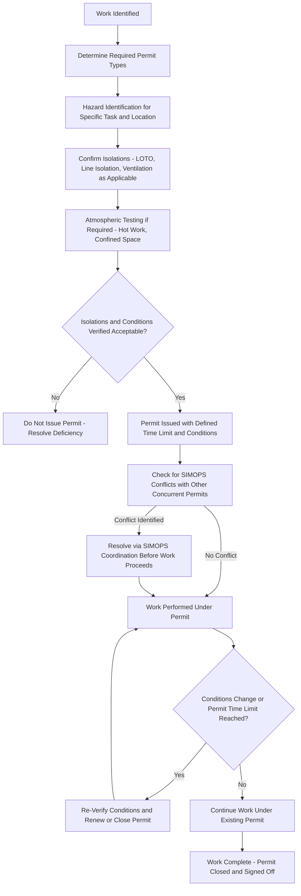

## Permit-to-Work Systems

### Purpose and Scope

A Permit-to-Work (PTW) system is a formal, documented control process that authorizes, controls, and coordinates work activities — particularly non-routine, hazardous, or maintenance-related work — within a facility, ensuring that hazards associated with the work are identified and controlled before work begins, communicated to all relevant parties, and re-verified if conditions change during the work. PTW systems are a core safe work practice under OSHA PSM (29 CFR 1910.119(f)(4), specifically addressing hot work permits, with broader permit systems typically implemented as a matter of good practice covering additional work types beyond the regulatory minimum). PTW systems function as an administrative control layer that coordinates between operations (who understand current process conditions) and the workers performing the task (who may be facility employees or contractors less familiar with process-specific hazards).

### Core Functions of a Permit-to-Work System

- **Hazard Identification**: Systematically identifying hazards associated with the specific work and location before work begins, including hazards from the work itself and from the surrounding process environment.
- **Isolation and Verification**: Confirming that necessary isolations (energy isolation, process isolation, ventilation) are in place and verified before work starts, often through explicit reference to a completed Lockout/Tagout (LOTO) procedure or line-breaking isolation checklist.
- **Communication and Coordination**: Ensuring all parties (permit issuer, permit holder/performer, affected operations personnel, and where relevant, adjacent work crews) are aware of the work being conducted, its location, its duration, and any special precautions.
- **Time-Boundedness and Re-Verification**: Permits are issued for a defined, limited time period (a single shift is common) and require re-verification or renewal if conditions change, work extends beyond the authorized period, or a shift change occurs.
- **Multi-Party Sign-Off**: Requiring explicit authorization signatures from designated roles (typically an area operator or supervisor issuing the permit, and the person performing or supervising the work accepting it), creating an auditable record of who authorized what work, under what conditions, and when.

### Common Permit Types

**Hot Work Permit**

Authorizes work involving open flames, welding, cutting, grinding, or other spark/heat-generating activities in or near areas where flammable materials may be present.

- **Key Points**
  - Explicitly required under OSHA PSM (29 CFR 1910.119(f)(4)) for covered processes.
  - Typically requires atmospheric testing (combustible gas monitoring) before work begins and at defined intervals during work, fire watch personnel with appropriate extinguishing equipment present during and for a defined period after hot work concludes, and removal or protection of nearby combustible materials.
  - **[Inference]** The requirement for continued fire watch after hot work concludes (rather than only during active work) reflects the recognized risk of smoldering ignition sources (e.g., in insulation or hidden combustible material) that may not manifest as an active fire until some time after the heat source is removed.

**Confined Space Entry Permit**

Authorizes entry into a space that is not designed for continuous occupancy, has limited means of entry/exit, and may contain a hazardous atmosphere or engulfment hazard, per OSHA's Permit-Required Confined Space standard (29 CFR 1910.146).

- **Key Points**
  - Requires atmospheric testing (oxygen level, combustible gas, toxic gas) before entry and continuous or periodic monitoring during occupancy, depending on hazard classification.
  - Requires designated roles including an entrant, an attendant (stationed outside, maintaining continuous communication and authorized to order evacuation), and an entry supervisor authorizing the permit.
  - Rescue provisions (non-entry rescue capability or a dedicated rescue team) must be established before entry is authorized, since confined space incidents frequently involve secondary fatalities among untrained rescuers attempting entry without appropriate equipment or procedures.

**Line-Breaking / Line-Opening Permit**

Authorizes opening a piping system that has contained (or may still contain) hazardous material, requiring confirmed isolation, draining/depressurizing, and often specific PPE requirements based on the material's hazard properties.

- **Key Points**
  - Typically requires verification that the line has been isolated (double block and bleed or equivalent), depressurized, and drained/purged as appropriate to the specific material before breaking the line, with the isolation method documented on the permit itself.
  - **[Inference]** Line-breaking incidents involving residual hazardous material are a recurring incident category in process safety history, generally attributed to inadequate isolation verification (isolation believed complete but not independently confirmed) rather than an absence of any isolation procedure at all — reinforcing the PTW system's role in independent verification, not merely documentation.

**Excavation Permit**

Authorizes ground-disturbing work, addressing hazards including underground utility strikes (electrical, piping, communications), trench collapse, and unstable soil conditions.

**Working at Height / Elevated Work Permit**

Authorizes work above a defined height threshold, addressing fall protection requirements, coordination with any work occurring below (falling object hazards), and equipment/anchor point verification.

**Electrical Work Permit / Energized Electrical Work Permit**

Authorizes work on or near electrical equipment, particularly work performed on energized equipment (an exception to standard de-energization practice), requiring documented justification for why de-energization was infeasible and specification of appropriate arc-flash PPE and boundaries.

### Multi-Permit Interaction and Simultaneous Operations (SIMOPS)

A single work task frequently requires multiple concurrent permits (e.g., hot work occurring inside a confined space also requires a line-breaking permit if piping is being modified within that space). Facilities with multiple concurrent work activities — particularly during turnarounds — require additional coordination to manage **Simultaneous Operations (SIMOPS)**, where multiple permitted work activities in proximity to one another, or work occurring concurrently with ongoing process operations, could interact to create a hazard not evident from any single permit in isolation.

- **Key Points**
  - SIMOPS reviews assess whether concurrently permitted activities create combined hazards — for example, hot work permitted in one area combined with a nearby line-breaking activity that could release flammable vapor into the hot work zone, a hazard not apparent from either individual permit.
  - Turnarounds, with a high density of concurrent maintenance activities and often a high proportion of contractor personnel less familiar with facility-specific hazards, are a period of particularly elevated SIMOPS risk, and many facilities implement dedicated SIMOPS coordination processes (a SIMOPS matrix or dedicated turnaround safety coordination role) during these periods.

### Illustrative Diagram: Permit-to-Work Process Flow

### Roles and Responsibilities

| Role | Typical Responsibility |
| --- | --- |
| Permit Issuer (Area Operator/Supervisor) | Verifies process conditions, confirms isolations, authorizes the permit, retains overall responsibility for the affected process area |
| Permit Holder/Performer | Accepts the permit, ensures the work is conducted within its stated conditions and time limits, stops work and notifies the issuer if conditions change |
| Entry Attendant (Confined Space) | Maintains continuous monitoring/communication with entrants, authorized to order evacuation |
| Fire Watch (Hot Work) | Monitors for ignition during and after hot work, equipped to respond to an incipient fire |
| SIMOPS Coordinator (where applicable) | Reviews concurrent permits for interaction hazards, particularly during turnarounds or high-activity periods |

### Contractor Management Considerations

Since a substantial proportion of permitted work — particularly maintenance, turnaround, and specialty work such as hot work or confined space entry — is often performed by contractor personnel, PTW systems typically incorporate specific contractor orientation and verification steps: confirming contractor personnel have received site-specific hazard orientation, verifying qualification/certification for specialized permit types (e.g., confined space rescue training), and ensuring the same isolation-verification rigor applies regardless of whether the permit performer is a facility employee or a contractor.

- **[Inference]** OSHA PSM's contractor provisions (29 CFR 1910.119(h)) require host employers to inform contractors of known process hazards and require contractors to follow applicable safe work practices; PTW systems are a primary operational mechanism through which this regulatory obligation is implemented day-to-day, though the specific integration approach varies by facility.

### Integration with Other PSM Elements

- **Lockout/Tagout (LOTO)**: PTW systems typically require and reference a completed LOTO isolation as a precondition for issuing permits involving energy isolation.
- **Management of Change (MOC)**: Non-routine work authorized under certain permit types (e.g., a temporary bypass or modification) may itself constitute a change requiring MOC review, and the PTW process should be designed to flag this interaction rather than treating permit issuance as a substitute for MOC where MOC is actually triggered.
- **Emergency Response Planning**: Active permits (particularly hot work and confined space entries) must be accounted for in emergency response and evacuation procedures, since personnel engaged in permitted work may require specific evacuation or rescue coordination.
- **Training**: Permit issuers, holders, attendants, and fire watch personnel require role-specific training and, in many cases, documented competency verification before being authorized to perform these roles.

### Common Pitfalls

- Treating isolation verification as complete based on documentation alone rather than independent physical confirmation (e.g., a line believed isolated per drawings but not field-verified), a recurring root cause in line-breaking incidents.
- Failing to identify SIMOPS conflicts between concurrently active permits, particularly during high-activity periods such as turnarounds when many permits may be active simultaneously across a compact area.
- Allowing permits to remain open past their authorized time limit or across a shift change without formal re-verification of conditions, since conditions assumed valid at permit issuance may no longer hold.
- Inconsistent rigor between facility employee and contractor permit issuance, undermining the intent of PSM contractor management provisions.

### Related Topics

- Lockout/Tagout (LOTO) Procedures
- OSHA PSM Contractor Management Requirements (29 CFR 1910.119(h))
- Confined Space Entry (29 CFR 1910.146)
- Hot Work Safety and Fire Watch Procedures
- Simultaneous Operations (SIMOPS) Management
- Turnaround and Shutdown Planning
- Management of Change (MOC)
- Writing Clear and Usable Operating Procedures