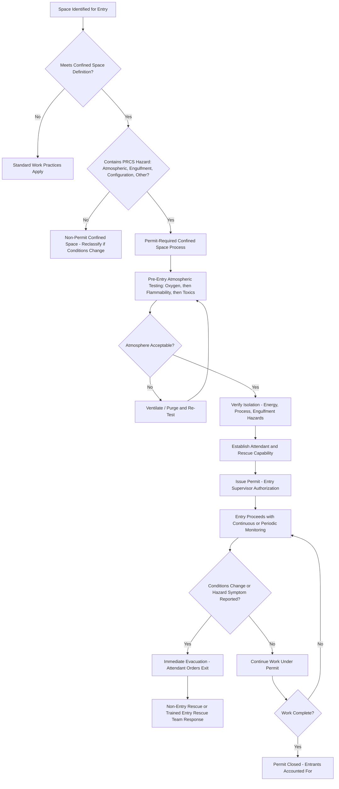

## Confined Space Entry

### Purpose and Scope

Confined space entry is one of the highest-risk categories of safe work practice in process facilities, governed in the U.S. primarily by OSHA's Permit-Required Confined Spaces standard (29 CFR 1910.146) and integrated into PSM programs as a critical safe work practice under 29 CFR 1910.119(f). The hazard profile is distinctive: confined spaces can develop life-threatening atmospheres (oxygen deficiency, toxic gas accumulation, flammable atmosphere) that may not be apparent from outside the space, combined with physically restricted entry/exit that impedes both self-rescue and external rescue. This topic covers the classification, hazard assessment, permit requirements, and rescue provisions specific to confined space work.

### Definition and Classification

**Confined Space (General Definition)**

A space that: (1) is large enough for an employee to bodily enter, (2) has limited or restricted means of entry or exit, and (3) is not designed for continuous human occupancy. Common examples include storage tanks, process vessels, pits, sewers, boilers, and silos.

**Permit-Required Confined Space (PRCS)**

A confined space that additionally has one or more of the following characteristics:

- Contains or has the potential to contain a hazardous atmosphere (flammable, toxic, or oxygen-deficient/enriched).
- Contains a material with the potential to engulf an entrant (e.g., granular solids, liquids).
- Has an internal configuration such that an entrant could be trapped or asphyxiated by inwardly converging walls or a floor that slopes downward and tapers to a smaller cross-section (e.g., a hopper).
- Contains any other recognized serious safety or health hazard.
- **Key Points**
  - The distinction between a general confined space and a permit-required confined space is significant: only PRCS entries require the full permit system (atmospheric testing, attendant, rescue provisions); non-permit confined spaces may still require some precautions but not the full PRCS process.
  - **[Inference]** Facilities are generally expected to conduct and document a hazard evaluation of each confined space in their inventory to classify it correctly, since misclassifying a permit-required space as a non-permit space (e.g., because a hazard is intermittent rather than continuously present) removes critical safeguards for a space that can still pose the same fatal hazard.

### Atmospheric Hazards

**Oxygen Deficiency and Enrichment**

- Normal atmospheric oxygen concentration is approximately 20.9%. OSHA generally defines an oxygen-deficient atmosphere as below 19.5% and oxygen-enriched as above 23.5%.
- Oxygen deficiency can result from displacement (inert gas purging, rusting/corrosion consuming oxygen, biological oxygen demand in organic residues) even without any toxic gas being present — a hazard that is completely undetectable without instrumentation, since a person cannot sense oxygen deficiency by breathing sensation alone until impairment has already begun.
- Oxygen enrichment significantly increases fire/flammability risk, lowering the energy required for ignition and increasing combustion intensity.

**Toxic Atmospheres**

- Common confined space toxic hazards include hydrogen sulfide (H₂S, from sewage, sour crude, or biological decomposition), carbon monoxide (CO, from combustion sources or as a residual process gas), and residual process chemicals from prior vessel contents (even after apparent cleaning, residues in scale, sludge, or vessel internals can off-gas once disturbed).
- **[Inference]** Residual off-gassing from vessel internals not fully removed by initial cleaning is a recurring cause of atmospheric hazard reappearing after initial testing showed acceptable conditions, which is why continuous or periodic re-testing during occupancy — not just pre-entry testing — is a standard requirement for spaces where this risk exists.

**Flammable Atmospheres**

- Assessed as a percentage of the Lower Flammable Limit (LFL, also called Lower Explosive Limit, LEL); OSHA and most facility standards require atmospheric testing to confirm flammable gas/vapor concentration is below a specified threshold (commonly 10% of LFL) before entry, with continued monitoring during occupancy.

### Atmospheric Testing Sequence and Requirements

Testing must be performed in a specific sequence reflecting the relative danger of each parameter and the physics of gas stratification within a space:

1. **Oxygen** — tested first, since combustible gas meters typically require adequate oxygen to function correctly, and oxygen deficiency is an immediate life-threatening hazard independent of any other parameter.
2. **Flammability (LFL/LEL)** — tested second.
3. **Toxic gases** (H₂S, CO, and any other substance-specific concern based on the space's contents/history) — tested third.

- **Key Points**
  - Testing should be conducted at multiple levels within the space (top, middle, bottom) where stratification is possible, since gases with different densities relative to air (e.g., H₂S is heavier than air and tends to accumulate at low points; some flammable vapors may stratify differently) can produce a hazardous concentration at one level while a single-point reading elsewhere in the space appears acceptable.
  - Testing should be performed from outside the space before initial entry (using extension probes or remote sampling) rather than requiring an entrant to enter an unverified atmosphere to obtain the first reading.
  - Continuous or periodic re-testing during occupancy is required, particularly for spaces with a history of atmospheric changes (from work activities disturbing residues, or from external sources such as adjacent process operations).

### Entry Roles and Responsibilities

| Role | Responsibility |
| --- | --- |
| Entry Supervisor | Authorizes the permit, verifies all pre-entry conditions are met, has authority to cancel the permit if conditions change |
| Authorized Entrant | Enters and works within the space, maintains communication with the attendant, recognizes and reports hazard symptoms, evacuates immediately if ordered or if hazard indicators are perceived |
| Attendant | Remains stationed outside the space for the entire duration of entry, maintains continuous communication with entrant(s), monitors conditions outside the space, has authority to order evacuation, and — critically — must NOT enter the space to attempt rescue |
| Rescue Team (Entry or Non-Entry) | Provides rescue capability, either through non-entry retrieval systems (harness and retrieval line) or a dedicated, trained entry rescue team |

- **Key Points**
  - The attendant's prohibition against entering the space to perform rescue is a critical safeguard rooted in incident history: a substantial proportion of confined space fatalities involve secondary victims — untrained would-be rescuers (often coworkers or attendants) who enter without appropriate equipment or training and succumb to the same hazard that incapacitated the original entrant.
  - **[Unverified]** Specific statistics on the proportion of confined space fatalities involving secondary rescuer deaths vary by source and time period studied; the general pattern is well-documented in OSHA guidance and industry literature, but a specific current percentage should be verified against current OSHA or NIOSH data rather than an unsourced figure.

### Rescue Provisions

- **Non-Entry Rescue**: Preferred where feasible — using a harness, wristlets, or other retrieval system connected to a mechanical retrieval device (tripod and winch) that allows an entrant to be extracted from outside the space without requiring a rescuer to enter.
- **Entry Rescue**: Required where the space configuration or hazard type makes non-entry retrieval infeasible (e.g., a space with internal obstructions preventing straight-line extraction); requires a dedicated, appropriately trained and equipped rescue team with practiced response capability, not an ad hoc response using untrained personnel.
- Facilities must arrange for rescue services (in-house team or contracted emergency responders) that can respond in a time frame appropriate to the specific hazard — atmospheric hazards in particular allow very little time margin, since unconsciousness from oxygen deficiency or toxic exposure can occur within seconds to minutes.
- **[Inference]** Reliance on public emergency services (municipal fire department) as the sole rescue provision for a permit-required confined space is generally considered inadequate unless response time and equipment capability have been specifically verified as sufficient for the space's specific hazard profile, since typical municipal response times may exceed the survivable window for an atmospheric hazard incident.

### Illustrative Diagram: Confined Space Entry Decision and Process Flow

### Isolation and Engulfment Hazard Control

- **Energy Isolation**: Mechanical, electrical, and process energy sources (agitators, mixers, heating elements, pumps feeding the space) must be isolated per LOTO procedures before entry, distinct from atmospheric hazard control.
- **Engulfment Hazard Control**: For spaces containing or previously containing bulk solids or liquids (silos, hoppers, tanks), isolation must address the potential for material to shift, flow, or be introduced during entry (e.g., isolating feed lines, blinding or physically blocking discharge points) — engulfment hazards can be fatal within seconds and are not addressed by atmospheric testing alone.

### Integration with Other PSM Elements

- **Permit-to-Work Systems**: Confined space entry permits are typically one component of a facility's broader PTW system, often interacting with hot work permits (if welding/cutting occurs inside the space) and line-breaking permits (if piping into the space is being opened).
- **Lockout/Tagout (LOTO)**: Energy isolation verification is a prerequisite input to confined space permit issuance, not a separate parallel process.
- **Emergency Response Planning**: Confined space rescue capability must be integrated into the facility's overall emergency response plan, including mutual aid arrangements where in-house rescue capability is insufficient.
- **Training**: Entrants, attendants, and entry supervisors require role-specific training with documented competency verification; rescue team members require specialized, practiced rescue training distinct from general entrant/attendant training.

### Common Pitfalls

- Relying on a single pre-entry atmospheric test without continued monitoring, missing atmospheric changes caused by disturbed residues or external influences during occupancy.
- Testing atmosphere at only one point/level in the space, missing stratified hazardous concentrations at a different level.
- Attendants entering the space to attempt rescue without appropriate equipment or training, converting a single-casualty incident into a multiple-fatality incident.
- Assuming a space is non-permit-required based on its historical contents or apparent cleanliness without verifying current conditions through actual testing.
- Inadequate or unverified rescue response time relative to the specific atmospheric hazard's survivable window.

### Related Topics

- Permit-to-Work Systems
- Lockout/Tagout (LOTO) Procedures
- OSHA Permit-Required Confined Spaces Standard (29 CFR 1910.146)
- Hot Work Safety and Fire Watch Procedures
- Emergency Response Planning and Rescue Capability
- Atmospheric Monitoring Instrumentation and Calibration
- Training and Competency Verification for Safe Work Practices
- Writing Clear and Usable Operating Procedures