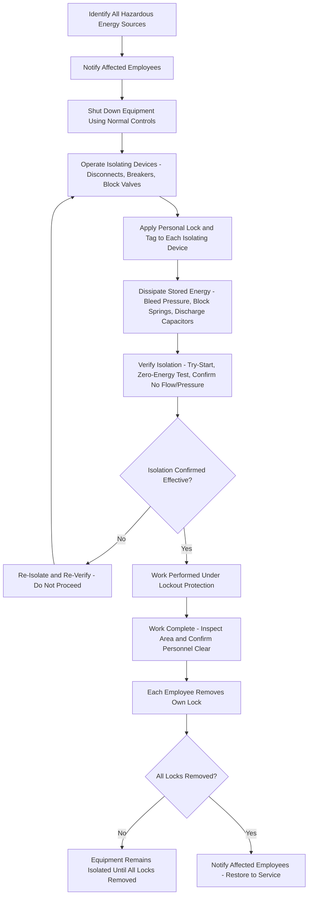

## Lockout Tagout and Isolation Procedures

### Purpose and Scope

Lockout/Tagout (LOTO) is the safe work practice governing the control of hazardous energy during service, maintenance, or repair activities on machinery, equipment, or piping systems. In the U.S., LOTO for general industry is governed by OSHA's Control of Hazardous Energy standard (29 CFR 1910.147), and functions within PSM as a foundational safe work practice under 29 CFR 1910.119(f) that underlies nearly every other permit type — hot work, confined space entry, and line-breaking permits all typically require confirmed LOTO isolation as a precondition. The core principle is straightforward but operationally demanding: hazardous energy sources capable of unexpected energization, startup, or release of stored energy must be positively isolated and verified before any person is exposed to the associated hazard.

### Types of Hazardous Energy

A rigorous LOTO program must address all forms of hazardous energy potentially present in the equipment or system being serviced, not electrical energy alone:

- **Electrical**: Energized circuits, capacitors, and other stored electrical energy.
- **Mechanical**: Stored energy in springs, counterweights, flywheels, or equipment that could move under gravity or residual momentum.
- **Hydraulic and Pneumatic**: Pressurized fluid or gas systems that can retain stored energy even after a source valve is closed, requiring bleed-down/venting to fully de-energize.
- **Thermal**: Residual heat capable of causing burns or triggering unwanted reactions.
- **Chemical**: Process fluids that remain hazardous (toxic, corrosive, reactive) even when not under pressure — relevant particularly for line-breaking isolation, which overlaps significantly with LOTO principles applied to process piping rather than rotating machinery.
- **Gravity**: Elevated components, loads, or process material (e.g., material in a hopper above the work location) that could fall or flow if not independently restrained.
- **Key Points**
  - **[Inference]** A recurring failure mode in LOTO-related incidents is addressing the most obvious energy source (typically electrical) while overlooking a secondary form of stored energy in the same equipment (e.g., a hydraulic accumulator, a spring-loaded mechanism, or residual pressure in a line downstream of an isolated pump) — comprehensive hazardous energy identification across all applicable types, not just the primary drive energy, is a central discipline of effective LOTO practice.

### Core LOTO Sequence

**1. Preparation**

Review equipment-specific isolation procedures (ideally a pre-documented, equipment-specific LOTO procedure identifying every energy source and isolation point for that specific piece of equipment, rather than relying on a generic facility-wide procedure for complex equipment).

**2. Notification**

Notify affected employees that equipment will be shut down and locked/tagged out, and the reason.

**3. Shutdown**

Shut down the equipment using its normal operating controls.

**4. Isolation**

Operate the designated isolating devices (disconnect switches, breakers, block valves) so that the equipment is isolated from all identified energy sources.

**5. Application of Lockout/Tagout Devices**

Apply a lock (and/or tag, depending on the governing standard and whether lockout alone is used or lockout combined with tagout) to each isolating device, with each authorized employee performing work applying their own personal lock — a principle central to the multi-employee lockout requirements discussed below.

**6. Stored Energy Dissipation**

Relieve, disconnect, restrain, or otherwise render safe all residual or stored energy (bleed down pressure, block or release springs, discharge capacitors) — this step is frequently the most technically involved and the most commonly incomplete step in practice, since stored energy is less visually apparent than a live energy source.

**7. Isolation Verification**

Verify isolation is effective before beginning work — this must be a positive, independent verification (attempting to start the equipment using normal controls after locking out, confirming zero energy state with appropriate test instruments for electrical work, or confirming zero pressure/flow for process isolation), not an assumption based on the isolating device's position alone.

- **Key Points**
  - Isolation verification is the step most directly analogous to, and often integrated with, line-breaking permit isolation verification discussed under Permit-to-Work Systems — both require independent physical confirmation rather than reliance on documentation or device position alone.
  - **[Inference]** "Try-before-you-verify" (attempting normal startup controls after applying lockout, to confirm the equipment does not respond) is a widely recommended verification technique because it directly tests the isolation's actual effectiveness, rather than only confirming that an isolating device has been moved to its intended position, which could still fail to achieve isolation due to a faulty valve, a fault downstream of the isolation point, or an unidentified secondary energy path.

### Restoring Equipment to Service

Removing lockout/tagout devices and returning equipment to service requires its own defined sequence, generally the reverse of the isolation sequence with additional verification steps:

1. Inspect the work area to ensure tools have been removed, equipment components are operationally intact, and all personnel are safely positioned.
2. Verify that all employees are safely clear of the equipment.
3. Remove lockout/tagout devices, with each device removed only by the employee who applied it (or, under specifically documented and controlled exception procedures, by an authorized process when the applying employee is unavailable — this exception is treated as a significant deviation requiring its own strict controls, not routine practice).
4. Notify affected employees that lockout/tagout devices have been removed and the equipment is being restored to service before re-energizing.

### Group and Multi-Employee Lockout

When multiple crafts or individuals are working on the same equipment simultaneously (common during turnarounds), individual personal locks alone can become impractical if isolation points are limited. Group lockout procedures address this through mechanisms such as:

- **Lockbox / Group Lockout Device**: A single group lock secures the isolating device(s), with the key placed in a lockbox; each individual worker then applies their own personal lock to the lockbox itself, ensuring the equipment cannot be re-energized until every individual lock has been removed by its owner.
- **Designated Group Lockout Coordinator**: In some group lockout implementations, a designated individual (often a supervisor) is responsible for overall isolation coordination, though this does not eliminate the requirement that each exposed employee's personal protection be assured through their own lock application, whether directly on the isolation point or on a group lockbox.
- **[Inference]** Group lockout procedures are specifically designed to preserve the core LOTO principle — that no single individual's protection depends on someone else's action or memory — even when the number of isolation points is smaller than the number of workers requiring protection; a group lockout implementation that allows equipment re-energization while any individual's personal lock remains in place would defeat this core principle.

### Illustrative Diagram: LOTO Sequence

### Line-Breaking as an Extension of Isolation Principles

While classic LOTO addresses mechanical/electrical equipment, opening process piping containing (or potentially containing) hazardous material applies the same fundamental isolation-and-verification logic, typically formalized through a separate line-breaking permit (addressed under Permit-to-Work Systems) rather than the mechanical LOTO procedure itself:

- **Double Block and Bleed**: A common line isolation method using two block valves in series with a bleed/vent valve between them, allowing confirmation (via the bleed point) that the upstream block valve is holding and not passing material, rather than relying on valve position alone.
- **Blinding/Blanking**: Physically inserting a solid blind flange or spectacle blind into the piping, providing a positive physical barrier rather than relying on a valve's internal seating, generally considered a more robust isolation method for line-breaking work than valve isolation alone, particularly for higher-hazard materials.
- **[Inference]** Valve-only isolation (without blinding) carries residual risk from valve seat leakage or degradation that may not be apparent from the valve's closed position; the choice between valve isolation, double block and bleed, and blinding is typically risk-based, escalating to blinding for higher-hazard materials or longer-duration work.

### Contractor and Multi-Employer LOTO Considerations

Where contractors perform work requiring LOTO on host facility equipment, coordination between host and contractor LOTO programs is required — including informing contractors of the facility's specific LOTO procedures, ensuring contractor personnel apply their own locks per the same group/individual lockout principles, and clarifying which organization's procedure governs in the event of any conflict between host and contractor practices.

### Integration with Other PSM Elements

- **Permit-to-Work Systems**: Confined space entry, hot work, and line-breaking permits typically require documented, verified LOTO isolation as a precondition for permit issuance.
- **Management of Change (MOC)**: Equipment modifications can change the applicable energy sources or isolation points for existing equipment, requiring the equipment-specific LOTO procedure to be reviewed and updated as part of the MOC process — an outdated LOTO procedure that does not reflect a modified piping configuration or added equipment is a latent hazard.
- **Training**: Authorized employees (those who perform lockout), affected employees (those who operate or work near locked-out equipment but do not apply locks themselves), and any group lockout coordinators require role-specific training with periodic retraining, particularly following any incident, procedure change, or job/equipment change affecting isolation requirements.
- **Mechanical Integrity**: Isolating devices themselves (block valves, disconnect switches) must be maintained in reliable working condition, since a LOTO program's effectiveness depends entirely on the isolating devices actually being capable of achieving positive isolation when operated.

### Common Pitfalls

- Addressing only the primary/obvious energy source (e.g., electrical power) while overlooking secondary stored energy (hydraulic accumulators, springs, residual pressure) in the same equipment.
- Treating isolating device position (valve closed, breaker open) as sufficient verification without an independent zero-energy or try-start confirmation.
- Using an outdated, generic, or equipment-nonspecific LOTO procedure for complex equipment where a documented equipment-specific procedure identifying all isolation points is warranted.
- Allowing a supervisor or coordinator to remove another employee's personal lock without following a strict, specifically authorized exception procedure, undermining the core individual-protection principle of LOTO.
- Failing to update equipment-specific LOTO procedures following an MOC-approved modification that changes isolation points or adds new energy sources.

### Related Topics

- Permit-to-Work Systems
- Confined Space Entry
- OSHA Control of Hazardous Energy Standard (29 CFR 1910.147)
- Management of Change (MOC)
- Mechanical Integrity of Isolating Devices
- Contractor Management and Multi-Employer Worksite Coordination
- Turnaround and Shutdown Planning
- Writing Clear and Usable Operating Procedures