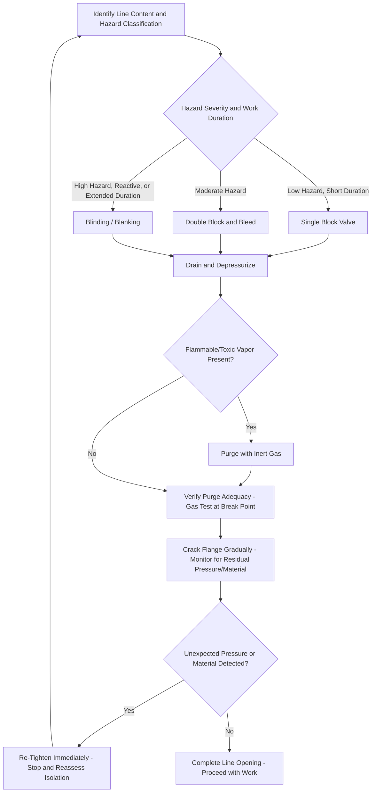

## Line-Breaking and Line-Opening Procedures

### Purpose and Scope

Line-breaking (also called line-opening) refers to the deliberate opening, disconnection, or removal of a section of piping, a flange, or a fitting on a system that contains, or has the potential to contain, a hazardous material — flammable, toxic, corrosive, reactive, or simply at elevated temperature or pressure. It is one of the most common activities in industrial maintenance and one of the most frequent sources of process safety incidents, precisely because it directly and deliberately breaches primary containment as a planned activity, rather than containment failing unexpectedly. This topic addresses the specific technical and procedural discipline required to plan, verify, and execute line-breaking safely, extending the general isolation principles introduced under Lockout/Tagout to the specific context of process piping.

### Why Line-Breaking Warrants Dedicated Procedural Treatment

Unlike rotating equipment LOTO, where the primary hazard is typically stored mechanical or electrical energy, line-breaking introduces a distinct hazard profile: the piping may contain residual hazardous material even after upstream and downstream isolation is achieved, and that material's specific hazards (toxicity, flammability, reactivity, temperature) directly determine the required precautions at the point of opening — precautions that must be tailored to the specific service rather than following a single generic procedure.

- **Key Points**
  - **[Inference]** Line-breaking incidents involving residual hazardous material release are a recurring incident category in process safety history, generally attributed less to the complete absence of an isolation procedure and more to inadequate verification that isolation was actually effective, or to incomplete draining/purging leaving residual material that was not anticipated — reinforcing why independent verification (not documentation alone) is central to safe line-breaking practice.

### Pre-Break Planning and Hazard Assessment

**Line Content Identification**

Before any line-breaking activity, the specific material historically or currently in the line must be identified — including not only the primary process fluid but any residual material from prior service if the line has had a different historical use (e.g., a line previously in different chemical service that was later repurposed).

**Isolation Method Selection**

Based on the material's hazard classification, an appropriate isolation method is selected, escalating in robustness with hazard severity:

- **Single Block Valve**: Lowest level of isolation robustness; generally reserved for lower-hazard services or very short-duration work, since a single valve provides no means of verifying its seal integrity from the work location.
- **Double Block and Bleed (DBB)**: Two block valves in series with a bleed/vent valve between them; opening the bleed valve allows confirmation that the upstream block valve is holding (no continued flow or pressure buildup at the bleed point), providing a verifiable isolation rather than relying on valve position alone.
- **Blinding/Blanking**: Insertion of a solid blind flange, spectacle blind, or blind spacer into the piping at a flanged connection, providing a positive physical barrier independent of any valve's internal condition. Generally considered the most robust isolation method and is frequently mandated for higher-hazard services (highly toxic, highly flammable, or reactive materials) or for longer-duration work such as extended turnaround maintenance.
- **[Inference]** The specific isolation method required for a given line-breaking activity is typically governed by a facility's isolation standard, which classifies materials by hazard category and specifies the minimum acceptable isolation method for each category and work duration — rather than leaving the choice to individual judgment at the time of the job.

**Draining, Depressurizing, and Purging**

- The line section to be opened must be depressurized and drained of liquid contents to the extent practical before breaking the connection, using designed drain points rather than the connection itself.
- For lines containing flammable or toxic vapors, purging with an inert gas (commonly nitrogen) to reduce residual vapor concentration below a safe threshold is frequently required before opening, particularly for hot work-adjacent line-breaking or high-hazard toxic services.
- **[Inference]** Purge adequacy verification (confirming the purge has actually achieved the required residual concentration, via gas testing at the point of intended opening) is generally considered a necessary complement to the purging step itself, since purge duration or volume estimates alone do not guarantee actual achieved concentration in a real piping configuration with potential dead legs or incomplete mixing.

### Cracking the Flange — The Point of Maximum Exposure Risk

The initial "cracking" of a flange or fitting — loosening bolts to break the seal while still able to re-tighten if unexpected pressure or material is encountered — is the point of highest exposure risk in the line-breaking sequence, since it is the first physical test of whether isolation, draining, and purging were actually effective.

- **Key Points**
  - Standard practice involves loosening bolts gradually and incrementally (rather than fully removing all bolts before any separation), positioned so the worker's body is not directly in line with the potential release path, allowing early detection of unexpected residual pressure or material (via weeping, hissing, or visible leakage) while retaining the ability to re-tighten immediately.
  - Appropriate PPE for the specific line content (chemical-resistant clothing, face shield, respiratory protection where indicated by the material's hazard) should be worn during flange-cracking regardless of how confident the isolation is believed to be, since flange-cracking is specifically the step designed to catch isolation failures that field verification could not detect in advance.
  - **[Inference]** The gradual bolt-loosening technique functions as a real-time isolation verification step in its own right — a final physical check that isolation was effective — complementing rather than replacing the upstream isolation verification (bleed valve check, blind installation confirmation) performed earlier in the sequence.

### Illustrative Diagram: Line-Breaking Isolation Escalation

### The Line-Breaking Permit

Line-breaking activities are typically authorized through a dedicated line-breaking permit (introduced under Permit-to-Work Systems), which documents:

- The specific line, flange, or fitting to be opened, with unambiguous identification (line number, P&ID reference, physical location).
- The isolation method used and confirmation of its completion (e.g., blind installed and confirmed, or DBB bleed valve confirmed clear).
- Draining/purging steps completed and verification results (gas test readings where applicable).
- Required PPE for the specific service.
- Authorization signatures from the permit issuer and the person(s) performing the work.
- **[Inference]** The line-breaking permit's isolation documentation is often cross-referenced with or built upon a LOTO-style isolation verification process even though line-breaking is not always formally classified under a facility's LOTO program in the same category as rotating equipment; the underlying verification discipline (positive, independent confirmation of isolation effectiveness) is the same regardless of which specific procedural framework governs the paperwork.

### Special Considerations for Specific Hazard Categories

**Highly Toxic Materials**

Line-breaking on highly toxic service (e.g., hydrogen sulfide, chlorine, hydrofluoric acid) typically requires enhanced precautions beyond standard practice: specialized respiratory protection, standby personnel with rescue capability, restricted access to the work area during the operation, and often a requirement for blinding rather than valve isolation alone given the severity of consequence from even a brief exposure.

**Reactive or Pyrophoric Residues**

Some process services can leave residues (certain metal sulfides, catalyst fines, polymer residues) that are pyrophoric (capable of spontaneous ignition on air exposure) or otherwise reactive once the line is opened and residues are exposed to atmospheric oxygen or moisture. Line-breaking procedures for such services typically require specific residue-wetting, inerting, or removal steps before or immediately upon opening, distinct from standard drain-and-purge practice for non-reactive materials.

**High-Temperature or Cryogenic Service**

Lines in high-temperature service require cooling considerations (thermal burn hazard, and material property changes affecting bolt torque/gasket behavior at temperature), while cryogenic service introduces cold-burn and material embrittlement hazards not present in ambient-temperature line-breaking.

### Integration with Other PSM Elements

- **Permit-to-Work Systems**: Line-breaking permits are typically issued as part of the broader PTW system, often in conjunction with hot work or confined space permits when line-breaking occurs within or adjacent to those activities.
- **Lockout/Tagout (LOTO)**: While line-breaking isolation (block valves, DBB, blinding) is procedurally distinct from mechanical LOTO, both share the core discipline of positive isolation with independent verification rather than reliance on documentation alone.
- **Management of Change (MOC)**: Any change to a piping system's service, contents, or configuration should trigger review of the applicable line-breaking isolation classification and procedure for that line, since a line's historical hazard classification may no longer apply after a service change.
- **Process Hazard Analysis (PHA)**: Line-breaking on specific high-hazard lines is frequently a scenario explicitly considered in HAZOP studies, particularly for lines carrying highly toxic or reactive materials, informing the isolation standard applied to that line.

### Common Pitfalls

- Relying on valve position or documentation alone to confirm isolation, without independent verification (bleed point check, blind confirmation, or the flange-cracking step itself serving as final verification).
- Underestimating residual material in "dead leg" sections of piping not fully drained by the primary drain points, leading to unexpected material release during flange-cracking.
- Applying a generic line-breaking procedure to a line with an unusual or historically different service without confirming current and prior content, missing a hazard not associated with the line's nominal current service.
- Fully removing all flange bolts before any separation, rather than the gradual, incremental loosening technique that allows early detection of unexpected residual pressure or material.
- Insufficient purge verification, where purging is performed but not confirmed to have achieved the required residual concentration via actual gas testing at the point of opening.

### Related Topics

- Permit-to-Work Systems
- Lockout/Tagout and Isolation Procedures
- Confined Space Entry
- Process Hazard Analysis (PHA) Methodologies
- Management of Change (MOC)
- Hot Work Safety and Fire Watch Procedures
- Pyrophoric Material Handling and Reactive Residue Management
- Writing Clear and Usable Operating Procedures