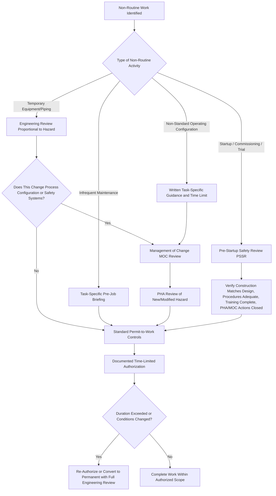

## Controls for Non-Routine Work

### Purpose and Scope

Non-routine work encompasses any task that falls outside standard, frequently repeated operating activities — maintenance, construction, commissioning of new or modified equipment, one-time process trials, and other activities not covered by day-to-day operating procedures. OSHA PSM explicitly requires developing and implementing safe work practices to control hazards during non-routine work (29 CFR 1910.119(f)(4)), recognizing that this category of work carries a disproportionate share of process safety incidents relative to its frequency, since the hazard controls, tacit operator knowledge, and procedural familiarity that develop around routine tasks are largely absent for work performed rarely or for the first time.

### Why Non-Routine Work Presents Elevated Risk

- **Key Points**
  - Operators and maintenance personnel typically build reliable situational awareness and tacit knowledge through repetition; non-routine tasks by definition offer little or no opportunity for this experiential learning to develop before the task is performed.
  - Non-routine work frequently involves temporary configurations (temporary piping, temporary power, non-standard equipment lineups) that fall outside the facility's normal, permanently-installed and previously-reviewed configuration, meaning the hazard analysis performed for the normal operating configuration may not adequately cover the temporary arrangement.
  - Non-routine activities are disproportionately associated with major incident case histories: the 1974 Flixborough disaster involved a temporary bypass pipe installed to work around a cracked reactor, and the 2005 Texas City refinery explosion occurred during a startup — itself a non-routine, higher-risk operating phase — compounded by known deficiencies in procedures and staffing for that specific activity.
  - **[Inference]** The common thread across major incidents involving non-routine work is generally understood to be a combination of reduced procedural and hazard-analysis rigor applied to infrequent activities, combined with genuinely elevated technical complexity (temporary configurations, transient process conditions) relative to steady-state routine operation — meaning both organizational attention and technical hazard analysis need to scale up, not down, for non-routine work.

### Categories of Non-Routine Work Requiring Specific Controls

**Temporary Equipment and Piping**

Installation of temporary piping (hoses, temporary bypass lines), temporary power connections, or temporary process equipment to support maintenance, testing, or short-term operational needs.

- **Key Points**
  - Temporary installations should be subject to the same fundamental engineering rigor as permanent installations proportional to their hazard potential — appropriate material specification, pressure rating, and support — rather than being treated as inherently lower-scrutiny because of their temporary status.
  - A defined maximum duration for temporary installations, with a tracking/expiration mechanism, is a widely recommended control, since temporary installations that remain in place well beyond their originally intended duration (sometimes becoming de facto permanent without ever receiving the engineering review a permanent installation would require) are a recurring theme in incident case histories, including Flixborough.
  - Temporary bypasses or modifications that change the process configuration typically require Management of Change (MOC) review, since a temporary change to process flow path, equipment function, or safety system configuration meets most MOC applicability criteria regardless of its intended duration.

**Non-Standard Operating Configurations**

Operating a process outside its normal parameters or lineup for testing, troubleshooting, or specific maintenance support purposes (e.g., running a unit at reduced rate with certain safety systems in a non-standard configuration to support a specific maintenance activity).

- **Key Points**
  - Requires specific, written guidance for the non-standard configuration — not an assumption that operators can safely improvise based on general process knowledge — since operating parameters and interlocks are typically designed and validated for the normal operating envelope, not for arbitrary non-standard configurations.
  - Time-limited authorization (similar to permit time limits) is a common control, ensuring non-standard configurations do not persist indefinitely without re-evaluation.

**First-of-a-Kind or Infrequent Operations**

Startup following an extended shutdown or turnaround, commissioning of new or modified equipment, or process trials of new operating conditions or feedstocks.

- **Key Points**
  - Startup following a turnaround is widely recognized in process safety literature as one of the highest-risk operating phases, combining multiple risk-elevating factors: personnel may include those less familiar with the specific unit (contractors, personnel rotated from other assignments), equipment has just undergone maintenance with associated risk of incomplete reassembly or missed steps, and the process itself is transitioning through startup conditions that may not be as thoroughly proceduralized as steady-state operation.
  - Pre-Startup Safety Review (PSSR), required under OSHA PSM (29 CFR 1910.119(i)) for new facilities and modified facilities where the modification is significant enough to require an MOC, serves as a formal checkpoint specifically addressing this elevated-risk transition — confirming construction/modification matches design, procedures are in place and adequate, training is complete, and the PHA/MOC recommendations have been addressed before introducing hazardous materials.

**One-Time or Infrequent Maintenance Activities**

Maintenance tasks performed rarely enough (multi-year intervals, or genuinely one-time activities) that no institutional operational familiarity has developed, even if the task itself is procedurally documented.

- **[Inference]** Task-specific pre-job briefings (distinct from and in addition to the general procedure itself) are commonly used to bridge the experience gap for infrequent tasks, allowing an experienced supervisor or engineer to walk the crew through task-specific hazards, sequence, and contingencies immediately before the work begins, compensating for the reduced tacit familiarity infrequent tasks provide relative to routine work.

### Illustrative Diagram: Non-Routine Work Control Framework

### Structural Controls Common to Non-Routine Work Categories

- **Explicit Time Limits and Tracking**: Whether for a temporary installation, a non-standard configuration, or a permit, defining and tracking an expiration point prevents non-routine arrangements from silently becoming permanent without corresponding engineering review.
- **Elevated Authorization Level**: Many organizations require non-routine work of significant hazard potential to be authorized at a higher organizational level (e.g., unit manager or process safety engineer sign-off) than routine permitted work, reflecting the reduced institutional familiarity and correspondingly increased need for deliberate risk evaluation.
- **Task-Specific Hazard Review**: Beyond the general PTW hazard identification, non-routine work of sufficient complexity often warrants a dedicated hazard review specific to the task (sometimes a mini-HAZOP or a structured pre-job hazard analysis) rather than relying solely on the standard permit's hazard checklist.
- **Enhanced Supervision and Communication**: Non-routine work frequently receives closer, more continuous supervisory oversight than equivalent routine work, along with more explicit communication to affected operations personnel given the reduced predictability of non-routine activity.

### Integration with Other PSM Elements

- **Management of Change (MOC)**: Many forms of non-routine work — particularly temporary bypasses, non-standard configurations, and equipment modifications — meet MOC applicability criteria and should be screened accordingly rather than proceeding solely under a permit without MOC review.
- **Pre-Startup Safety Review (PSSR)**: The primary formal control specifically addressing startup as a non-routine, elevated-risk activity.
- **Permit-to-Work Systems**: Non-routine work is typically still executed under the facility's standard permit framework (hot work, confined space, line-breaking as applicable), with the additional non-routine-specific controls layered on top rather than replacing standard PTW discipline.
- **Process Hazard Analysis (PHA)**: Non-routine and non-standard operating scenarios (startup, shutdown, specific maintenance configurations) are required elements of PSM-compliant PHA scope, not merely an afterthought to steady-state operation analysis.
- **Training**: Personnel involved in infrequent or first-of-a-kind activities may require specific task-based training or refresher training closer to the time of the activity, given the reduced opportunity for skill retention through repetition.

### Common Pitfalls

- Allowing temporary installations (bypasses, temporary piping) to remain in service well past their intended duration without formal re-evaluation or conversion to a properly engineered permanent installation — the direct causal pattern in the Flixborough disaster.
- Treating startup as simply "running the normal procedure after a pause" without recognizing its distinct risk profile (personnel unfamiliarity, post-maintenance verification needs, transient process conditions) requiring dedicated attention such as PSSR.
- Failing to screen non-routine activities for MOC applicability, treating a temporary or non-standard change as covered by permit controls alone when the change itself alters process configuration and warrants MOC review.
- Relying on the general written procedure alone for infrequent tasks without a task-specific pre-job briefing to bridge the experience gap that repetition would otherwise provide.
- Insufficient supervisory or engineering authorization escalation for non-routine work, applying the same authorization level as routine, well-understood tasks.

### Related Topics

- Permit-to-Work Systems
- Management of Change (MOC)
- Pre-Startup Safety Review (PSSR)
- Process Hazard Analysis (PHA) Methodologies
- Line-Breaking and Line-Opening Procedures
- Turnaround and Shutdown Planning
- Case Study: Flixborough Disaster (1974)
- Case Study: Texas City Refinery Explosion (2005)