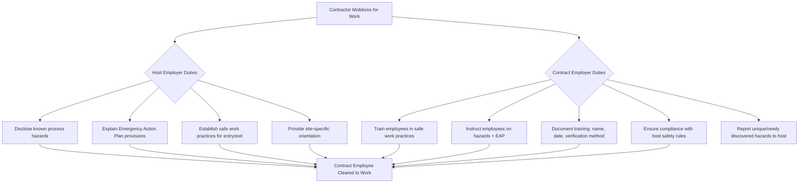

## Contractor Orientation and Training Requirements

### Overview

Contractor orientation and training is the process by which host employers ensure that contract employees performing work in or near a PSM-covered process possess the knowledge required to work safely, recognize process hazards, and respond appropriately to emergencies. This obligation is distinct from, and supplementary to, general contractor prequalification: prequalification screens which contractor is selected, while orientation and training ensures that the individual workers on-site are competent and hazard-aware before they begin work.

Under OSHA 29 CFR 1910.119(h), both host and contract employers carry shared, complementary training obligations. Deficiencies in contractor orientation are among the most frequently cited PSM violations during OSHA inspections and incident investigations, particularly following turnarounds and major renovation projects where large numbers of temporary contract workers are mobilized in a short period.

### Regulatory Requirements

**Key Points**

- **1910.119(h)(2)(ii)**: The host employer must explain to the contract employer the applicable provisions of the emergency action plan.
- **1910.119(h)(3)(i)**: The contract employer must ensure that each contract employee is trained in the work practices necessary to perform the job safely.
- **1910.119(h)(3)(ii)**: The contract employer must ensure that each contract employee is instructed in the known potential fire, explosion, or toxic release hazards related to their job and the process, and the applicable provisions of the emergency action plan.
- **1910.119(h)(3)(iii)**: The contract employer must document that each contract employee has received and understood the training required by this paragraph, including the identity of the employee, the date of training, and the means used to verify that the employee understood the training.
- **1910.119(h)(3)(iv)**: The contract employer must ensure that each contract employee follows the safety rules of the facility, including applicable provisions of 1910.119(f) (operating procedures).
- **1910.119(h)(3)(v)**: The contract employer must advise the host employer of any unique hazards presented by the contract employer's work, or of hazards found during the work that the host employer did not previously identify.

### Two-Tiered Training Obligation



### Core Components of Contractor Orientation

1. **Site-Specific Hazard Communication**
   - Overview of the covered process(es) in or near the work area (chemicals, pressures, temperatures)
   - Location and interpretation of Safety Data Sheets (SDS)
   - Site-specific alarm signals (evacuation, shelter-in-place, toxic release, fire)
   - Wind direction indicators and muster point locations
2. **Emergency Action Plan (EAP) Familiarization**
   - Evacuation routes and assembly areas
   - Roles during an emergency (e.g., account for personnel, do not attempt rescue unless trained)
   - Communication protocols (radio channels, emergency phone numbers, PA system tones)
3. **Site Safe Work Practices**
   - Permit-to-work system overview (hot work, confined space, LOTO, excavation, working at height)
   - PPE requirements by area/zone
   - Vehicle and pedestrian traffic rules
   - Housekeeping and material staging requirements
   - Stop-work authority policy
4. **Access Control and Accountability**
   - Badge issuance and area access restrictions
   - Sign-in/sign-out or electronic time-and-attendance tracking for headcount during emergencies
   - Escort requirements for unaccompanied contractors in restricted zones
5. **Reporting Obligations**
   - Near-miss and incident reporting procedures
   - Process for reporting hazards discovered during the contractor's own work scope

### Training Delivery Methods

| Method | Typical Use Case | Advantages | Limitations |
| --- | --- | --- | --- |
| Classroom/instructor-led | New contractor mobilization, turnarounds | Allows Q&A, verification of understanding | Resource-intensive for large crews |
| Computer-based training (CBT) | General site orientation, recurring refreshers | Scalable, consistent content, trackable completion | Limited interactivity; requires comprehension check |
| Field/on-the-job orientation | Job-specific hazard walk-downs | Directly tied to actual work location | Time-consuming; needs qualified guide |
| Toolbox talks | Daily/pre-shift reinforcement | Reinforces recent hazards or lessons learned | Not a substitute for formal initial training |
| Badge-linked electronic tracking | Large sites with high contractor turnover | Automates verification of training currency before badge activation | Requires IT integration with access control |

### Verification of Training Understanding

**Key Points**

Simply attending a training session does not satisfy 1910.119(h)(3)(iii); the standard requires verification that the employee *understood* the training. Acceptable verification methods include:

- Written or computer-based quizzes with a minimum passing score (e.g., $\geq 80\%$)
- Verbal questioning by a qualified trainer with documented responses
- Practical demonstration (e.g., correct donning of PPE, correct LOTO application)
- Signed acknowledgment forms confirming comprehension (weakest form of verification; often supplemented with a quiz)

Documentation must capture, at minimum: employee identity, training date, training content/topics covered, and the specific method used to verify understanding.

### Training Content Matrix by Work Type

| Work Type | Additional Training Required |
| --- | --- |
| Hot work near covered process | Hot work permit procedures, fire watch duties, flammable gas monitoring basics |
| Confined space entry | Atmospheric testing awareness, entry/attendant/entrant roles, rescue plan awareness |
| Lockout/Tagout (LOTO) | Host-specific LOTO procedures, group lockout protocols, verification steps |
| Excavation | Underground utility awareness, competent person identification, soil classification basics |
| Working at height | Fall protection anchor points, rescue plan for suspended workers |
| Turnaround/shutdown work | Process-specific hazards for the unit being turned around, temporary piping/blinding awareness |

### Example: Contractor Orientation Sign-In and Verification Record

**Example**



```
Contractor Orientation Verification Record
--------------------------------------------
Employee Name:        _____________________
Employer (Contractor): _____________________
Date of Orientation:  _____________________
Trainer Name:          _____________________

Topics Covered:
[ ] Process hazard overview (unit: __________)
[ ] Emergency Action Plan / evacuation routes
[ ] Permit-to-work system overview
[ ] PPE requirements
[ ] Stop-work authority policy
[ ] Incident/near-miss reporting procedure

Verification Method:
[ ] Written quiz (score: ____ / 100, passing = 80)
[ ] Verbal Q&A (documented below)
[ ] Practical demonstration (describe): _______________

Employee Signature: _____________  Date: _______
Trainer Signature:  _____________  Date: _______
```

### Retraining and Refresher Requirements

- Refresher orientation is typically required when: the contractor has been off-site for an extended period (e.g., >6–12 months), the process undergoes a Management of Change (MOC) affecting hazards in the contractor's work area, or an incident/near-miss reveals a gap in contractor hazard awareness.
- Many facilities implement an annual re-orientation cycle for contractors with recurring/standing contracts, independent of specific job mobilization.
- Job-specific toolbox talks should precede each new task, even for previously oriented contractors, to cover task-specific hazards not addressed in general orientation.

### Common Pitfalls

- Treating orientation as a generic "site safety video" without covering process-specific hazards unique to the covered process, which fails the intent of 1910.119(h)(3)(ii).
- Accepting a contractor's self-certification of training without host employer verification or spot-checks, which does not relieve the host of its own EAP-disclosure obligations under 1910.119(h)(2)(ii).
- Inadequate documentation that omits the verification-of-understanding method, which is explicitly required by the standard and frequently cited.
- Failing to communicate hazards discovered *during* the contractor's work back through the two-way reporting loop required by 1910.119(h)(3)(v).
- Large-crew turnaround mobilizations that compress orientation into an insufficient timeframe, reducing training quality and comprehension verification rigor. [Inference: widely reported as a contributing factor in turnaround-related incidents, though root causes vary by event.]

### Related Topics

- Contractor Prequalification and Selection
- Emergency Action Plan (EAP) Development and Communication
- Permit-to-Work Systems for Contractors
- Contractor Performance Evaluation and Scorecard Systems
- Management of Change (MOC) Involving Contracted Modifications
- Pre-Startup Safety Review (PSSR) for Contractor-Executed Work
- Turnaround/Shutdown Planning and Contractor Mobilization